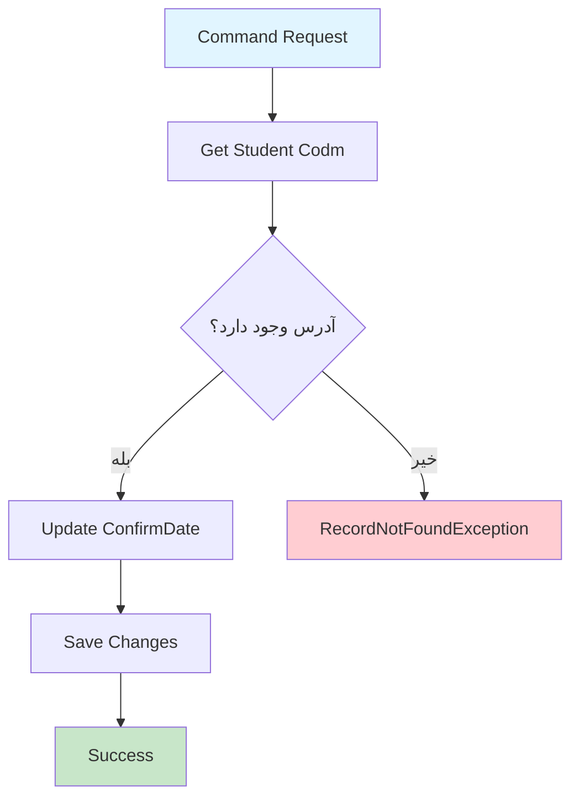

# ConfirmStudentAddressCommand.cs

**مسیر**: `Csis.Admission.Application/Features/Addresses/Commands/ConfirmStudentAddressCommand.cs`

## 1. هدف (Purpose)

این Command برای **تأیید آدرس دانشجو** استفاده می‌شود. زمانی که دانشجو آدرس خود را ثبت می‌کند، این Command آدرس را با ثبت `ConfirmDate` تأیید می‌کند.

### کاربرد اصلی:
- تأیید آدرس توسط دانشجو
- ثبت تاریخ تأیید آدرس
- بخشی از فرآیند Two-Step Confirmation

---

## 2. ورودی (Input)

```csharp
public sealed record ConfirmStudentAddressCommand : IRequest{}
```

### پارامترها:
**هیچ پارامتر ورودی ندارد** - Codm دانشجو از `_authenticatedUser` دریافت می‌شود.

---

## 3. خروجی (Output)

```csharp
Task (void)
```

این Command هیچ خروجی ندارد و فقط عملیات تأیید را انجام می‌دهد.

---

## 4. وابستگی‌ها (Dependencies)

```csharp
private readonly IRepository<Address> _repo;
private readonly ICsisAuthenticatedUserService _authenticatedUser;
```

**Dependencies:**
1. **IRepository<Address>**: برای خواندن و Update کردن آدرس
2. **ICsisAuthenticatedUserService**: برای دریافت Codm دانشجو لاگین شده

---

## 5. جریان اجرا (Execution Flow)



### مراحل:
1. **دریافت Codm** دانشجو لاگین شده از `_authenticatedUser`
2. **پارس کردن Codm** به int
3. **جستجوی آدرس** با Codm (با Tracking)
4. **بررسی وجود**: اگر وجود نداشت → `RecordNotFoundException`
5. **ثبت ConfirmDate**: تاریخ فعلی شمسی به فرمت Int
6. **ذخیره تغییرات** در دیتابیس

---

## 6. قوانین کسب‌وکار (Business Rules)

### BR-1: تأیید توسط خود دانشجو
```csharp
var codm = int.Parse(await _authenticatedUser.GetStudentCodmAsync());
```
- **قانون**: فقط دانشجو می‌تواند آدرس خود را تأیید کند
- **پیاده‌سازی**: از Authenticated User استفاده می‌شود

### BR-2: وجود آدرس الزامی است
```csharp
var address = await _repo.GetOneAsTrackingAsync(x=>x.Codm==codm, ...)
    ?? throw new RecordNotFoundException<Address>(codm);
```
- **قانون**: دانشجو باید قبلاً آدرس را ثبت کرده باشد
- **خطا**: اگر آدرس وجود نداشت → `RecordNotFoundException`

### BR-3: ثبت تاریخ تأیید
```csharp
address.ConfirmDate= PersianDateTime.Now.ToString().StringDateToInt();
```
- **قانون**: تاریخ تأیید به صورت Int ذخیره می‌شود (مثل 14031215)
- **نکته**: تاریخ شمسی استفاده می‌شود

---

## 7. نکات امنیتی (Security Considerations)

### ✅ **Security خوب: استفاده از Authenticated User**
```csharp
var codm = int.Parse(await _authenticatedUser.GetStudentCodmAsync());
```
- دانشجو فقط می‌تواند آدرس **خودش** را تأیید کند
- از Codm user لاگین شده استفاده می‌شود نه از Input

### ⚠️ **مشکل: فقدان Validation**
```csharp
// ❌ بررسی نمی‌شود که آیا قبلاً تأیید شده یا نه
address.ConfirmDate = PersianDateTime.Now.ToString().StringDateToInt();
```

**پیشنهاد**:
```csharp
if (address.ConfirmDate.HasValue)
{
    throw new BusinessException("آدرس قبلاً تأیید شده است");
}
```

---

## 8. عملکرد و بهینه‌سازی (Performance)

### ✅ **مزایا:**
1. **GetOneAsTrackingAsync**: فقط یک رکورد خوانده می‌شود
2. **Tracking enabled**: برای Update مناسب است

### ⚠️ **مشکلات احتمالی:**
```csharp
var codm = int.Parse(await _authenticatedUser.GetStudentCodmAsync());
// string parsing هر بار انجام می‌شود
```

**بهتر بود**:
```csharp
// اگر _authenticatedUser می‌تواند مستقیماً int برگرداند
var codm = await _authenticatedUser.GetStudentCodmAsIntAsync();
```

---

## 9. خطاها و استثناها (Error Handling)

### خطاهای احتمالی:

#### 1. RecordNotFoundException
```csharp
?? throw new RecordNotFoundException<Address>(codm);
```
- **زمان**: آدرسی با این Codm وجود ندارد
- **HTTP Status**: 404 Not Found

#### 2. FormatException
```csharp
var codm = int.Parse(...); // اگر Codm معتبر نباشد
```
- **زمان**: Codm قابل تبدیل به int نیست
- **HTTP Status**: 500 Internal Server Error (باید 400 باشد)

#### 3. Database Errors
- Connection timeout
- Constraint violations

### ⚠️ **فقدان Try-Catch**:
```csharp
// ❌ هیچ error handling صریح وجود ندارد
public async Task Handle(...)
```

---

## 10. الگوهای طراحی (Design Patterns)

### الگوهای استفاده شده:
1. **CQRS Pattern**: Command جدا از Query
2. **Repository Pattern**: دسترسی به داده
3. **Authenticated User Pattern**: دسترسی امن به اطلاعات کاربر
4. **Record Type** (C# 9+): Immutable command
5. **Null-coalescing throw** (C# 9+): `?? throw`

---

## 11. تست‌پذیری (Testability)

### نمونه Unit Test:
```csharp
[Fact]
public async Task Handle_WhenAddressExists_ShouldSetConfirmDate()
{
    // Arrange
    var codm = 12345;
    var address = new Address { Codm = codm, ConfirmDate = null };
    
    _authenticatedUserMock.Setup(x => x.GetStudentCodmAsync())
        .ReturnsAsync(codm.ToString());
    
    _repoMock.Setup(x => x.GetOneAsTrackingAsync(
            It.IsAny<Expression<Func<Address, bool>>>(), 
            It.IsAny<CancellationToken>()))
        .ReturnsAsync(address);
    
    var command = new ConfirmStudentAddressCommand();
    
    // Act
    await _handler.Handle(command, CancellationToken.None);
    
    // Assert
    Assert.NotNull(address.ConfirmDate);
    _repoMock.Verify(x => x.UpdateAsync(address, It.IsAny<CancellationToken>()), Times.Once);
}

[Fact]
public async Task Handle_WhenAddressNotExists_ShouldThrowException()
{
    // Arrange
    var codm = 99999;
    
    _authenticatedUserMock.Setup(x => x.GetStudentCodmAsync())
        .ReturnsAsync(codm.ToString());
    
    _repoMock.Setup(x => x.GetOneAsTrackingAsync(
            It.IsAny<Expression<Func<Address, bool>>>(), 
            It.IsAny<CancellationToken>()))
        .ReturnsAsync((Address?)null);
    
    var command = new ConfirmStudentAddressCommand();
    
    // Act & Assert
    await Assert.ThrowsAsync<RecordNotFoundException<Address>>(
        () => _handler.Handle(command, CancellationToken.None)
    );
}
```

---

## 12. ملاحظات Logging و Monitoring

### ⚠️ **فقدان Logging**:
```csharp
// ❌ هیچ logging وجود ندارد
public async Task Handle(...)
```

### پیشنهاد:
```csharp
private readonly ILogger<ConfirmStudentAddressCommandHandler> _logger;

public async Task Handle(...)
{
    var codm = int.Parse(await _authenticatedUser.GetStudentCodmAsync());
    
    _logger.LogInformation("Student {Codm} confirming address", codm);
    
    var address = await _repo.GetOneAsTrackingAsync(...);
    
    if (address == null)
    {
        _logger.LogWarning("Address not found for student {Codm}", codm);
        throw new RecordNotFoundException<Address>(codm);
    }
    
    address.ConfirmDate = PersianDateTime.Now.ToString().StringDateToInt();
    await _repo.UpdateAsync(address, cancellationToken);
    
    _logger.LogInformation("Address confirmed successfully for student {Codm} at {Date}", 
        codm, address.ConfirmDate);
}
```

---

## 13. مثال استفاده (Usage Example)

### از Controller:
```csharp
[HttpPost("confirm")]
[Authorize(Roles = "Student")]
public async Task<IActionResult> ConfirmAddress()
{
    var command = new ConfirmStudentAddressCommand();
    await _mediator.Send(command);
    return Ok(new { message = "آدرس با موفقیت تأیید شد" });
}
```

### از Frontend:
```javascript
async function confirmAddress() {
    try {
        const response = await fetch('/api/addresses/confirm', {
            method: 'POST',
            headers: {
                'Authorization': `Bearer ${token}`,
                'Content-Type': 'application/json'
            }
        });
        
        if (response.ok) {
            alert('آدرس شما با موفقیت تأیید شد');
            window.location.href = '/dashboard';
        }
    } catch (error) {
        alert('خطا در تأیید آدرس');
    }
}
```

---

## 14. Command/Query های مرتبط

### Commands مرتبط:
- `CreateOrUpdateStudentAddressCommand`: ایجاد/ویرایش آدرس
- `DeleteStudentAddressCommand`: حذف آدرس (احتمالاً)

### Queries مرتبط:
- `GetAddressesByCodmQuery`: دریافت لیست آدرس‌های دانشجو
- `GetAddressByIdQuery`: دریافت یک آدرس خاص

---

## 15. تاریخچه تغییرات (Change History)

| تاریخ | تغییرات | توسعه‌دهنده |
|-------|---------|-------------|
| - | ایجاد اولیه Command | - |

---

## 16. تغییرات پیشنهادی (Proposed Changes)

### Priority 1: افزودن Validation برای تأیید مجدد
```diff
public async Task Handle(ConfirmStudentAddressCommand request, CancellationToken cancellationToken) {
    var codm = int.Parse(await _authenticatedUser.GetStudentCodmAsync());
    var address = await _repo.GetOneAsTrackingAsync(x=>x.Codm==codm, cancellationToken:cancellationToken)
        ?? throw new RecordNotFoundException<Address>(codm);

+   if (address.ConfirmDate.HasValue)
+   {
+       throw new BusinessException("آدرس قبلاً تأیید شده است");
+   }

    address.ConfirmDate= PersianDateTime.Now.ToString().StringDateToInt();
    await _repo.UpdateAsync(address, cancellationToken:cancellationToken);
}
```

### Priority 2: افزودن Logging
```diff
internal sealed class ConfirmStudentAddressCommandHandler : IRequestHandler<ConfirmStudentAddressCommand>
{
    private readonly IRepository<Address> _repo;
    private readonly ICsisAuthenticatedUserService _authenticatedUser;
+   private readonly ILogger<ConfirmStudentAddressCommandHandler> _logger;
    
    public ConfirmStudentAddressCommandHandler(IRepository<Address> repo, 
-       ICsisAuthenticatedUserService authenticatedUser) {
+       ICsisAuthenticatedUserService authenticatedUser,
+       ILogger<ConfirmStudentAddressCommandHandler> logger) {
        _repo = repo;
        _authenticatedUser = authenticatedUser;
+       _logger = logger;
    }

    public async Task Handle(ConfirmStudentAddressCommand request, CancellationToken cancellationToken) {
        var codm = int.Parse(await _authenticatedUser.GetStudentCodmAsync());
+       _logger.LogInformation("Confirming address for student {Codm}", codm);
        
        var address = await _repo.GetOneAsTrackingAsync(x=>x.Codm==codm, cancellationToken:cancellationToken)
            ?? throw new RecordNotFoundException<Address>(codm);

        address.ConfirmDate= PersianDateTime.Now.ToString().StringDateToInt();
        await _repo.UpdateAsync(address, cancellationToken:cancellationToken);
        
+       _logger.LogInformation("Address confirmed for student {Codm} at {Date}", codm, address.ConfirmDate);
    }
}
```

### Priority 3: بهبود Codm Parsing
```diff
- var codm = int.Parse(await _authenticatedUser.GetStudentCodmAsync());
+ var codmString = await _authenticatedUser.GetStudentCodmAsync();
+ if (!int.TryParse(codmString, out var codm))
+ {
+     throw new InvalidOperationException($"Invalid Codm format: {codmString}");
+ }
```

---

## نتیجه‌گیری

این Command **ساده و کارآمد** است اما نیاز به **Validation** و **Logging** دارد.

### نقاط قوت:
✅ استفاده امن از Authenticated User  
✅ استفاده از Null-coalescing throw  
✅ GetOneAsTracking برای Update  

### نقاط ضعف:
⚠️ فقدان Validation برای تأیید مجدد  
⚠️ فقدان Logging  
⚠️ Error handling ضعیف برای int.Parse
