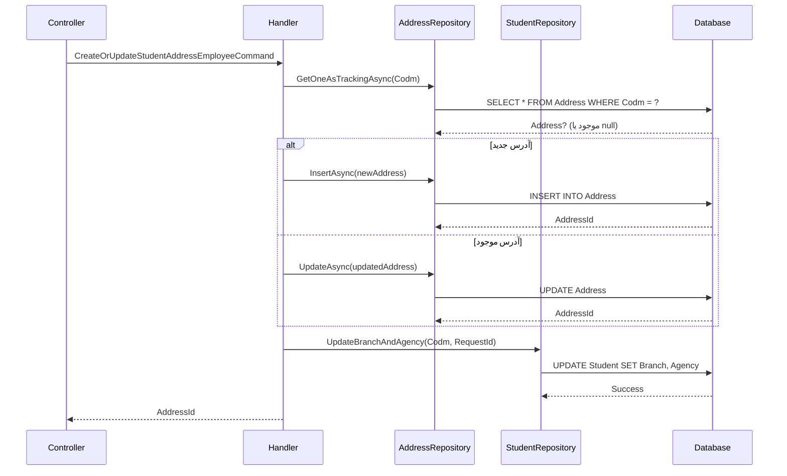

<div dir="rtl">

# CreateOrUpdateStudentAddressEmployeeCommand

## 📄 اطلاعات کلی

**مسیر فایل:**
```
Csis.Admission.Application/Features/Addresses/Commands/CreateOrUpdateStudentAddressEmployeeCommand.cs
```

**Feature:** Addresses  
**نوع:** Command  
**هدف:** ثبت یا ویرایش آدرس محل سکونت دانشجو توسط کارمندان

---

## 🎯 هدف (Purpose)

این Command برای **ثبت یا بروزرسانی اطلاعات آدرس** دانشجو استفاده می‌شود که توسط کارمندان اجرا می‌شود. این Command شامل:
- اطلاعات جغرافیایی کامل (استان، شهر، بخش، روستا و ...)
- جزئیات دقیق آدرس (خیابان، کوچه، پلاک، واحد و ...)
- قابلیت تایید دو مرحله‌ای توسط دو طلبه دیگر
- بروزرسانی خودکار شعبه و نمایندگی دانشجو

---

## 📝 ساختار Command

### ورودی (Request)

```csharp
public sealed record CreateOrUpdateStudentAddressEmployeeCommand : 
    BaseCommandDto<CreateOrUpdateStudentAddressEmployeeCommand, Address>, 
    IRequest<int>
{
    // شناسه دانشجو
    int Codm

    // اطلاعات جغرافیایی
    short? ProvinceId        // استان
    short? CityId            // شهرستان
    short? PortionId         // بخش
    short? TownId            // شهر
    short? RuralId           // دهستان
    string Township          // شهرک
    string Village           // روستا
    string District          // محله

    // جزئیات آدرس
    string Avenue            // خیابان اصلی
    string Street            // خیابان فرعی
    string Alley             // کوچه اصلی
    string Lane              // کوچه فرعی
    string Number            // پلاک
    string Complex           // مجتمع
    string Block             // بلوک
    string Unit              // واحد
    short? Floor             // طبقه
    long? ZipCode            // کد پستی

    // تایید و اعتبارسنجی
    string ConfirmDate                      // تاریخ تایید
    bool? RequiresDualStudentApproval       // نیازمند تایید دو طلبه
    int[] ConfirmedStudentCodms             // کدهای طلاب تایید کننده

    // سایر
    short ProjectCode        // همیشه 1
    bool? Flag               // همیشه true
    long RequestId           // شناسه درخواست
}
```

**نکات مهم:**
- `ProjectCode` و `Flag` همیشه مقدار ثابت دارند
- `ConfirmDate` به صورت خودکار از String به Int تبدیل می‌شود
- `RequestId` در TODO ذکر شده که نباید وجود داشته باشد (طراحی قدیمی)

### خروجی (Response)

```csharp
int  // شناسه آدرس (AddressId)
```

---

## 🔄 جریان اجرا (Execution Flow)

### مراحل:

```
1. جستجوی آدرس موجود
   └─> repo.GetOneAsTrackingAsync(Codm)

2. Upsert Pattern
   ├─> اگر آدرس وجود ندارد:
   │   ├─> ToEntity()
   │   ├─> InsertAsync()
   │   └─> دریافت AddressId جدید
   │
   └─> اگر آدرس موجود است:
       ├─> ToEntity(existingAddress)
       ├─> UpdateAsync()
       └─> دریافت AddressId موجود

3. بروزرسانی شعبه و نمایندگی
   ├─> ایجاد UpdateBranchAndAgencyRepoCommand
   ├─> تنظیم پارامترهای لاگ
   └─> studentRepository.UpdateBranchAndAgency()

4. برگرداندن AddressId
```

### نمودار توالی (Sequence Diagram)



---

## 🔧 وابستگی‌ها (Dependencies)

### تزریق شده:
```csharp
IRepository<Address> repo
IHttpContextAccessor context
IStudentRepository studentRepository
ICsisAuthenticatedUserService authenticatedUser
```

**توضیحات:**
1. `IRepository<Address>`: دسترسی به جدول آدرس‌ها
2. `IHttpContextAccessor`: دسترسی به اطلاعات HTTP Context
3. `IStudentRepository`: repository اختصاصی دانشجو برای عملیات پیچیده
4. `ICsisAuthenticatedUserService`: اطلاعات کاربر احراز هویت شده

---

## 📋 قوانین کسب‌وکار (Business Rules)

### BR-1: Upsert Pattern
- **قانون**: هر دانشجو فقط **یک** آدرس اصلی دارد
- **پیاده‌سازی**: بر اساس `Codm` آدرس Insert یا Update می‌شود
- **هدف**: جلوگیری از آدرس‌های تکراری

### BR-2: Hierarchical Geographic Data
- **قانون**: ساختار جغرافیایی سلسله مراتبی است
- **سلسله مراتب**: استان > شهرستان > بخش > شهر/روستا > دهستان
- **الزام**: حداقل `ProvinceId` و `CityId` باید وارد شوند

### BR-3: Dual Student Approval
- **قانون**: برخی تغییرات آدرس نیاز به تایید دو طلبه دارند
- **شرط**: `RequiresDualStudentApproval == true`
- **داده مورد نیاز**: `ConfirmedStudentCodms` باید شامل 2 کد مرکز باشد

### BR-4: Auto Branch & Agency Update
- **قانون**: با تغییر آدرس، شعبه و نمایندگی دانشجو به‌روز می‌شود
- **اجرا**: خودکار در پایان عملیات
- **هدف**: همخوانی اطلاعات جغرافیایی با ساختار اداری

### BR-5: Date Format Conversion
- **قانون**: `ConfirmDate` به صورت String دریافت و به Int تبدیل می‌شود
- **پیاده‌سازی**: `ReverseCustomMappings` با `StringDateToInt()`
- **فرمت**: احتمالاً تاریخ شمسی (مثلاً "1403/10/13" → 14031013)

---

## ⚠️ نکات امنیتی (Security Considerations)

### 1. Authorization Check
- ❓ **تایید نشده**: آیا چک می‌شود کاربر اجرا کننده کارمند است؟
- **پیشنهاد**: اضافه کردن `[Authorize(Roles = "Employee")]`

### 2. Student Codm Validation
- ❓ **تایید نشده**: آیا `Codm` معتبر است؟
- **خطر**: امکان دستکاری آدرس دانشجوی دیگر
- **پیشنهاد**: Validator برای بررسی وجود دانشجو

### 3. Confirmed Students Validation
- ❓ **تایید نشده**: آیا `ConfirmedStudentCodms` واقعی و معتبر هستند؟
- **خطر**: ثبت کدهای جعلی برای تایید
- **پیشنهاد**: بررسی وجود و فعال بودن طلاب تایید کننده

---

## 🐛 مشکلات و بدهی فنی (Technical Debt)

### Issue #1: RequestId Design Problem
```csharp
/// <summary>شناسه درخواست</summary>
public long RequestId { get; set; }
//TODO نباید باشد چون با یک درخواست دو کامند باید اجرا شود اینگونه شده است
```
- **مشکل**: طراحی نادرست - یک درخواست نیاز به اجرای دو Command دارد
- **تأثیر**: افزایش پیچیدگی و احتمال خطا
- **راه حل پیشنهادی**: طراحی مجدد با Composite Command یا Saga Pattern

### Issue #2: Fixed Values (Code Smell)
```csharp
/// <summary>همیشه یک</summary>
public short ProjectCode { get; set; }

/// <summary>همیشه یک</summary>
public bool? Flag { get; set; }
```
- **مشکل**: فیلدهایی که همیشه مقدار ثابت دارند
- **بهبود**: حذف از DTO و set کردن در Handler

### Issue #3: Unused ConfirmDate?
```csharp
public string ConfirmDate { get; set; }
```
- **سوال**: آیا این فیلد واقعاً استفاده می‌شود؟
- **بررسی**: نیاز به تست و مستندسازی Use Case

---

## 🧪 تست‌های پیشنهادی (Suggested Tests)

### Unit Tests:
```csharp
// 1. Upsert - Insert New Address
[Fact]
async Task Should_Insert_New_Address_When_Not_Exists()

// 2. Upsert - Update Existing Address
[Fact]
async Task Should_Update_Existing_Address_When_Exists()

// 3. Branch & Agency Update
[Fact]
async Task Should_Update_Branch_And_Agency_After_Address_Change()

// 4. Date Conversion
[Fact]
void Should_Convert_ConfirmDate_From_String_To_Int()
```

### Integration Tests:
```csharp
// 1. Full Flow
[Fact]
async Task Should_Complete_Full_Address_Update_Flow()

// 2. Dual Approval Required
[Fact]
async Task Should_Handle_Dual_Student_Approval_Correctly()
```

---

## 🔗 ارتباطات (Related Components)

### Commands مرتبط:
- `CreateOrUpdateStudentAddressEmployeeRequestCommand` - نسخه درخواستی این Command
- `CreateOrUpdateStudentAddressRequestCommand` - نسخه عمومی

### Queries مرتبط:
- `GetAddressesByCodmQuery` - دریافت آدرس دانشجو
- `GetAddressByIdQuery` - دریافت آدرس با شناسه

### Entities:
- `Address` - Entity اصلی
- `Student` - برای بروزرسانی شعبه/نمایندگی

---

## 📊 خلاصه نکات کلیدی

| نکته | توضیح |
|------|-------|
| **نقش** | ثبت/ویرایش آدرس توسط کارمند |
| **ورودی** | Codm + 22 فیلد آدرس |
| **خروجی** | AddressId (int) |
| **Upsert** | ✅ بر اساس Codm |
| **Side Effects** | ✅ بروزرسانی Branch & Agency |
| **Dual Approval** | ✅ پشتیبانی می‌شود |
| **Technical Debt** | ⚠️ RequestId design problem |
| **Security** | ⚠️ نیاز به بررسی Authorization |

---

## 💡 نکات پیاده‌سازی

### Mapping Customization:
```csharp
public override void ReverseCustomMappings(...)
{
    // تبدیل تاریخ String به Int
    mapping.ForMember(
        model => model.ConfirmDate, 
        config => config.MapFrom(dto => dto.ConfirmDate.StringDateToInt())
    );
}
```

### Auto Branch/Agency Update:
```csharp
var repoCommand = new UpdateBranchAndAgencyRepoCommand 
{ 
    Codm = command.Codm,
    RequestId = command.RequestId 
};
await Common.Utilities.SetLogParam(repoCommand, authenticatedUser, context);
await studentRepository.UpdateBranchAndAgency(repoCommand);
```

---

**یادداشت نهایی**: این Command یکی از جامع‌ترین Commands آدرس است با 22 فیلد ورودی و قابلیت Dual Approval.

</div>
