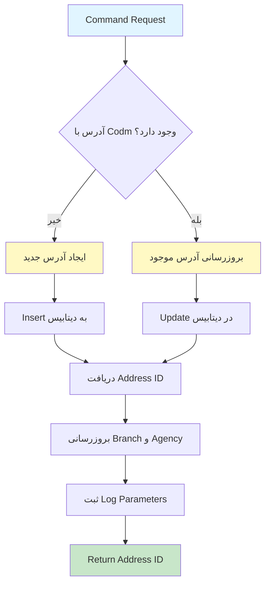

# CreateOrUpdateStudentAddressEmployeeCommand.cs

**مسیر**: `Csis.Admission.Application/Features/Addresses/Commands/CreateOrUpdateStudentAddressEmployeeCommand.cs`

## 1. هدف (Purpose)

این Command برای **ثبت یا بروزرسانی آدرس توسط کارمند (Employee)** استفاده می‌شود. این Command در سناریویی که کارمندان سیستم نیاز به ثبت یا ویرایش آدرس دانشجو دارند، استفاده می‌شود.

### کاربرد اصلی:
- ثبت آدرس جدید برای دانشجو توسط کارمند
- ویرایش آدرس موجود دانشجو توسط کارمند
- بروزرسانی شعبه و نمایندگی دانشجو پس از تغییر آدرس
- پشتیبانی از فرآیند تایید دو مرحله‌ای (Dual Student Approval)

---

## 2. ورودی (Input)

```csharp
public sealed record CreateOrUpdateStudentAddressEmployeeCommand : 
    BaseCommandDto<CreateOrUpdateStudentAddressEmployeeCommand, Address>, 
    IRequest<int>
```

### پارامترها:

| پارامتر | نوع | توضیحات |
|---------|-----|----------|
| `Codm` | `int` | کد مرکز خدمات دانشجو (الزامی) |
| `ProvinceId` | `short?` | شناسه استان |
| `CityId` | `short?` | شناسه شهرستان |
| `PortionId` | `short?` | شناسه بخش |
| `TownId` | `short?` | شناسه شهر |
| `RuralId` | `short?` | شناسه دهستان |
| `Township` | `string` | شهرک |
| `Village` | `string` | روستا |
| `District` | `string` | محله |
| `Avenue` | `string` | خیابان اصلی |
| `Street` | `string` | خیابان فرعی |
| `Alley` | `string` | کوچه اصلی |
| `Lane` | `string` | کوچه فرعی |
| `Number` | `string` | پلاک |
| `Complex` | `string` | مجتمع |
| `Block` | `string` | بلوک |
| `Unit` | `string` | واحد |
| `Floor` | `short?` | طبقه |
| `ZipCode` | `long?` | کد پستی |
| `ConfirmDate` | `string` | تاریخ تایید (فرمت رشته‌ای) |
| `ProjectCode` | `short` | کد پروژه (همیشه 1) |
| `Flag` | `bool?` | پرچم (همیشه true) |
| `RequiresDualStudentApproval` | `bool?` | نیاز به تایید دو طلبه |
| `ConfirmedStudentCodms` | `int[]` | کدهای مرکز خدمات طلاب تاییدکننده |
| `RequestId` | `long` | شناسه درخواست |

---

## 3. خروجی (Output)

```csharp
Task<int>
```

**خروجی**: شناسه آدرس ایجاد یا بروزرسانی شده (`AddressId`)

---

## 4. وابستگی‌ها (Dependencies)

```csharp
private readonly IRepository<Address> repo;
private readonly IHttpContextAccessor context;
private readonly IStudentRepository studentRepository;
private readonly ICsisAuthenticatedUserService authenticatedUser;
```

**Dependencies:**
1. **IRepository<Address>**: برای عملیات CRUD روی جدول آدرس‌ها
2. **IHttpContextAccessor**: برای دسترسی به HttpContext جهت logging
3. **IStudentRepository**: برای بروزرسانی شعبه و نمایندگی دانشجو
4. **ICsisAuthenticatedUserService**: برای دریافت اطلاعات کاربر احراز هویت شده

---

## 5. جریان اجرا (Execution Flow)



### مراحل:
1. **بررسی وجود آدرس**: جستجوی آدرس با `Codm` مشخص شده
2. **ایجاد یا بروزرسانی**:
   - اگر آدرس وجود **نداشت**: Command را به Entity تبدیل و Insert کن
   - اگر آدرس **موجود بود**: آدرس موجود را با داده‌های جدید Update کن
3. **دریافت AddressId**: شناسه آدرس ایجاد/بروزرسانی شده را دریافت کن
4. **بروزرسانی شعبه و نمایندگی**: با استفاده از `UpdateBranchAndAgency`
5. **ثبت لاگ**: تنظیم پارامترهای Audit Log
6. **برگرداندن AddressId**: شناسه آدرس را به عنوان خروجی برگردان

---

## 6. قوانین کسب‌وکار (Business Rules)

### BR-1: Upsert Pattern (Insert or Update)
```csharp
var address = await repo.GetOneAsTrackingAsync(x => x.Codm == command.Codm, false, cancellationToken);

if (address == null) {
    // Insert
    var entity = command.ToEntity();
    await repo.InsertAsync(entity, true, cancellationToken);
} else {
    // Update
    var entity = command.ToEntity(address);
    await repo.UpdateAsync(entity, true, cancellationToken);
}
```
- **قانون**: اگر آدرسی با Codm مشخص شده وجود دارد، Update شود؛ در غیر این صورت Insert شود
- **نکته**: از pattern Tracking استفاده می‌شود برای Update

### BR-2: تبدیل تاریخ تایید
```csharp
public override void ReverseCustomMappings(...) {
    mapping.ForMember(model => model.ConfirmDate, 
        config => config.MapFrom(dto => dto.ConfirmDate.StringDateToInt()));
}
```
- **قانون**: تاریخ تایید از فرمت رشته‌ای (مثل "1403/12/15") به Int (مثل 14031215) تبدیل می‌شود
- **نکته**: استفاده از Extension Method `StringDateToInt()`

### BR-3: بروزرسانی خودکار شعبه و نمایندگی
```csharp
var repoCommand = new UpdateBranchAndAgencyRepoCommand { Codm = command.Codm };
await Common.Utilities.SetLogParam(repoCommand, authenticatedUser, context);
repoCommand.RequestId = command.RequestId;
await studentRepository.UpdateBranchAndAgency(repoCommand);
```
- **قانون**: پس از تغییر آدرس، شعبه و نمایندگی دانشجو باید بروزرسانی شود
- **پیاده‌سازی**: استفاده از `UpdateBranchAndAgency` در Student Repository
- **Audit**: ثبت RequestId و پارامترهای لاگ

### BR-4: پشتیبانی از تایید دو طلبه
```csharp
public int[] ConfirmedStudentCodms { get; set; } = null;
public bool? RequiresDualStudentApproval { get; set; }
```
- **قانون**: برخی آدرس‌ها نیاز به تایید دو طلبه دیگر دارند
- **نکته**: این فیلدها در Command ذخیره می‌شوند اما در Handler استفاده نمی‌شوند

---

## 7. نکات امنیتی (Security Considerations)

### ⚠️ **مشکل 1: فقدان Authorization**
```csharp
// ❌ بررسی نمی‌شود که آیا کارمند مجاز به تغییر این آدرس است
public async Task<int> Handle(CreateOrUpdateStudentAddressEmployeeCommand command, ...)
```

**پیشنهاد**:
```csharp
// بررسی دسترسی کارمند به Codm مورد نظر
var hasAccess = await CheckEmployeeAccess(command.Codm);
if (!hasAccess) {
    throw new UnauthorizedException("شما مجاز به تغییر این آدرس نیستید");
}
```

### ⚠️ **مشکل 2: عدم Validation ورودی
```csharp
// ❌ هیچ validation برای فیلدهای ورودی وجود ندارد
var entity = command.ToEntity();
```

**پیشنهاد**:
```csharp
// استفاده از FluentValidation
public class CreateOrUpdateStudentAddressEmployeeCommandValidator : AbstractValidator<...> 
{
    public CreateOrUpdateStudentAddressEmployeeCommandValidator() 
    {
        RuleFor(x => x.Codm).GreaterThan(0);
        RuleFor(x => x.ZipCode).Must(BeValidPostalCode);
    }
}
```

### ✅ **امنیت خوب: Audit Logging**
```csharp
await Common.Utilities.SetLogParam(repoCommand, authenticatedUser, context);
```
- تمام تغییرات با اطلاعات کاربر و درخواست لاگ می‌شوند

---

## 8. عملکرد و بهینه‌سازی (Performance)

### ✅ **مزایا:**
1. **GetOneAsTrackingAsync**: استفاده از Tracking برای Update (مناسب)
2. **SaveChanges یکپارچه**: با پارامتر `true` در Insert/Update
3. **ID دریافت می‌شود**: بعد از Insert، Id از entity دریافت می‌شود

### ⚠️ **مشکلات احتمالی:**
```csharp
// دو بار Query می‌زند:
// 1. GetOneAsTrackingAsync برای بررسی
// 2. UpdateBranchAndAgency برای بروزرسانی
```

**بهینه‌سازی پیشنهادی**:
```csharp
// استفاده از Transaction برای consistency
using var transaction = await _context.BeginTransactionAsync(cancellationToken);
try {
    // Insert/Update address
    // Update branch and agency
    await transaction.CommitAsync(cancellationToken);
} catch {
    await transaction.RollbackAsync(cancellationToken);
    throw;
}
```

---

## 9. خطاها و استثناها (Error Handling)

### خطاهای احتمالی:

#### 1. Database Errors
- **Connection timeout**: در صورت قطعی ارتباط با دیتابیس
- **Constraint violations**: نقض محدودیت‌های دیتابیس (مثل FK)

#### 2. Mapping Errors
```csharp
dto.ConfirmDate.StringDateToInt() // اگر فرمت تاریخ اشتباه باشد
```
- **زمان**: فرمت تاریخ نامعتبر
- **نکته**: نیاز به Try-Catch یا Validation

#### 3. UpdateBranchAndAgency Errors
- ممکن است در بروزرسانی شعبه خطا رخ دهد

### ⚠️ **فقدان Error Handling**:
```csharp
// ❌ هیچ try-catch صریح وجود ندارد
public async Task<int> Handle(...)
```

---

## 10. الگوهای طراحی (Design Patterns)

### الگوهای استفاده شده:
1. **CQRS Pattern**: Command جدا از Query
2. **Repository Pattern**: دسترسی به داده از طریق Repository
3. **Upsert Pattern**: Insert or Update
4. **Primary Constructor** (C# 12): ساختار کوتاه‌تر
5. **DTO Pattern**: استفاده از BaseCommandDto
6. **AutoMapper**: برای تبدیل Command به Entity
7. **Unit of Work**: استفاده از SaveChanges یکپارچه

---

## 11. تست‌پذیری (Testability)

### نمونه Unit Test:

```csharp
[Fact]
public async Task Handle_WhenAddressNotExists_ShouldInsertNewAddress()
{
    // Arrange
    var command = new CreateOrUpdateStudentAddressEmployeeCommand 
    { 
        Codm = 12345,
        Avenue = "خیابان آزادی",
        ZipCode = 1234567890
    };
    
    _repoMock.Setup(x => x.GetOneAsTrackingAsync(
            It.IsAny<Expression<Func<Address, bool>>>(),
            false,
            It.IsAny<CancellationToken>()))
        .ReturnsAsync((Address?)null);
    
    // Act
    var result = await _handler.Handle(command, CancellationToken.None);
    
    // Assert
    Assert.True(result > 0);
    _repoMock.Verify(x => x.InsertAsync(
        It.IsAny<Address>(), 
        true, 
        It.IsAny<CancellationToken>()), Times.Once);
}

[Fact]
public async Task Handle_WhenAddressExists_ShouldUpdateAddress()
{
    // Arrange
    var existingAddress = new Address { Id = 1, Codm = 12345 };
    var command = new CreateOrUpdateStudentAddressEmployeeCommand 
    { 
        Codm = 12345,
        Avenue = "خیابان جدید"
    };
    
    _repoMock.Setup(x => x.GetOneAsTrackingAsync(
            It.IsAny<Expression<Func<Address, bool>>>(),
            false,
            It.IsAny<CancellationToken>()))
        .ReturnsAsync(existingAddress);
    
    // Act
    var result = await _handler.Handle(command, CancellationToken.None);
    
    // Assert
    Assert.Equal(1, result);
    _repoMock.Verify(x => x.UpdateAsync(
        It.IsAny<Address>(), 
        true, 
        It.IsAny<CancellationToken>()), Times.Once);
}

[Fact]
public async Task Handle_ShouldUpdateBranchAndAgency()
{
    // Arrange
    var command = new CreateOrUpdateStudentAddressEmployeeCommand { Codm = 12345 };
    _repoMock.Setup(x => x.GetOneAsTrackingAsync(...))
        .ReturnsAsync((Address?)null);
    
    // Act
    await _handler.Handle(command, CancellationToken.None);
    
    // Assert
    _studentRepoMock.Verify(x => x.UpdateBranchAndAgency(
        It.Is<UpdateBranchAndAgencyRepoCommand>(c => c.Codm == 12345)), 
        Times.Once);
}
```

---

## 12. ملاحظات Logging و Monitoring

### ⚠️ **فقدان Logging**:
```csharp
// ❌ هیچ logging صریح وجود ندارد
public async Task<int> Handle(...)
```

### پیشنهاد:
```csharp
private readonly ILogger<UpdateStudentAddressEmployeeCommandHandler> _logger;

public async Task<int> Handle(...)
{
    _logger.LogInformation("Creating/Updating address for student {Codm}", command.Codm);
    
    var address = await repo.GetOneAsTrackingAsync(...);
    
    if (address == null) {
        _logger.LogInformation("Inserting new address for student {Codm}", command.Codm);
        // Insert logic
    } else {
        _logger.LogInformation("Updating existing address {AddressId} for student {Codm}", 
            address.Id, command.Codm);
        // Update logic
    }
    
    _logger.LogInformation("Address {AddressId} saved successfully for student {Codm}", 
        addressId, command.Codm);
    
    return addressId;
}
```

---

## 13. مثال استفاده (Usage Example)

### از Controller:
```csharp
[HttpPost("employee")]
[Authorize(Roles = "Employee,Admin")]
public async Task<ActionResult<int>> CreateOrUpdateAddressEmployee(
    CreateOrUpdateStudentAddressEmployeeCommand command)
{
    var addressId = await _mediator.Send(command);
    return Ok(new { addressId, message = "آدرس با موفقیت ثبت شد" });
}
```

### از Frontend:
```javascript
async function saveAddressEmployee(codm, addressData) {
    const command = {
        codm: codm,
        provinceId: addressData.provinceId,
        cityId: addressData.cityId,
        avenue: addressData.avenue,
        street: addressData.street,
        zipCode: addressData.zipCode,
        requestId: requestId
        // ... سایر فیلدها
    };
    
    try {
        const response = await fetch('/api/addresses/employee', {
            method: 'POST',
            headers: {
                'Authorization': `Bearer ${token}`,
                'Content-Type': 'application/json'
            },
            body: JSON.stringify(command)
        });
        
        const result = await response.json();
        alert(`آدرس با شناسه ${result.addressId} ثبت شد`);
    } catch (error) {
        alert('خطا در ثبت آدرس');
    }
}
```

---

## 14. Command/Query های مرتبط

### Commands مرتبط:
- `CreateOrUpdateStudentAddressCommand`: ثبت/ویرایش آدرس توسط دانشجو
- `CreateOrUpdateStudentAddressRequestCommand`: ثبت درخواست آدرس
- `CreateOrUpdateStudentAddressEmployeeRequestCommand`: ثبت درخواست آدرس توسط کارمند
- `ConfirmStudentAddressCommand`: تایید آدرس دانشجو

### Queries مرتبط:
- `GetAddressesByCodmQuery`: دریافت آدرس دانشجو با Codm
- `GetAddressByIdQuery`: دریافت آدرس با Id

---

## 15. تاریخچه تغییرات (Change History)

| تاریخ | تغییرات | توسعه‌دهنده |
|-------|---------|-------------|
| - | ایجاد اولیه Command | - |
| - | افزودن RequestId (TODO) | - |

---

## 16. تغییرات پیشنهادی (Proposed Changes)

### Priority 1: افزودن Validation
```diff
+ public class CreateOrUpdateStudentAddressEmployeeCommandValidator 
+     : AbstractValidator<CreateOrUpdateStudentAddressEmployeeCommand>
+ {
+     public CreateOrUpdateStudentAddressEmployeeCommandValidator()
+     {
+         RuleFor(x => x.Codm).GreaterThan(0).WithMessage("کد مرکز خدمات الزامی است");
+         RuleFor(x => x.ZipCode).Must(BeValidPostalCode).When(x => x.ZipCode.HasValue);
+         RuleFor(x => x.ProvinceId).NotEmpty().WithMessage("استان الزامی است");
+     }
+ }
```

### Priority 2: افزودن Transaction
```diff
public async Task<int> Handle(...) 
{
+   using var transaction = await _context.BeginTransactionAsync(cancellationToken);
+   try {
        var address = await repo.GetOneAsTrackingAsync(...);
        
        // Insert or Update logic
        
        await studentRepository.UpdateBranchAndAgency(repoCommand);
        
+       await transaction.CommitAsync(cancellationToken);
        return addressId;
+   } catch {
+       await transaction.RollbackAsync(cancellationToken);
+       throw;
+   }
}
```

### Priority 3: افزودن Logging
```diff
internal sealed class UpdateStudentAddressEmployeeCommandHandler(
    IRepository<Address> repo,
    IHttpContextAccessor context,
    IStudentRepository studentRepository,
-   ICsisAuthenticatedUserService authenticatedUser)
+   ICsisAuthenticatedUserService authenticatedUser,
+   ILogger<UpdateStudentAddressEmployeeCommandHandler> logger)
{
    public async Task<int> Handle(...) 
    {
+       logger.LogInformation("Processing address for student {Codm}", command.Codm);
        
        var address = await repo.GetOneAsTrackingAsync(...);
        
        if (address == null) {
+           logger.LogInformation("Creating new address for student {Codm}", command.Codm);
            // Insert
        } else {
+           logger.LogInformation("Updating address {Id} for student {Codm}", address.Id, command.Codm);
            // Update
        }
        
+       logger.LogInformation("Address {Id} saved successfully", addressId);
        return addressId;
    }
}
```

### Priority 4: رفع TODO در RequestId
```csharp
// TODO نباید باشد چون با یک درخواست دو کامند باید اجرا شود
// پیشنهاد: جدا کردن RequestId از Command و مدیریت آن در لایه بالاتر
```

---

## نتیجه‌گیری

این Command **پیچیده و کاربردی** است و بخش مهمی از سیستم مدیریت آدرس‌ها را پوشش می‌دهد.

### نقاط قوت:
✅ پشتیبانی از Upsert Pattern  
✅ بروزرسانی خودکار شعبه و نمایندگی  
✅ Audit Logging کامل  
✅ پشتیبانی از تایید دو طلبه  

### نقاط ضعف:
⚠️ فقدان Validation برای ورودی‌ها  
⚠️ فقدان Authorization check  
⚠️ فقدان Transaction برای consistency  
⚠️ فقدان Logging  
⚠️ TODO نامشخص برای RequestId
