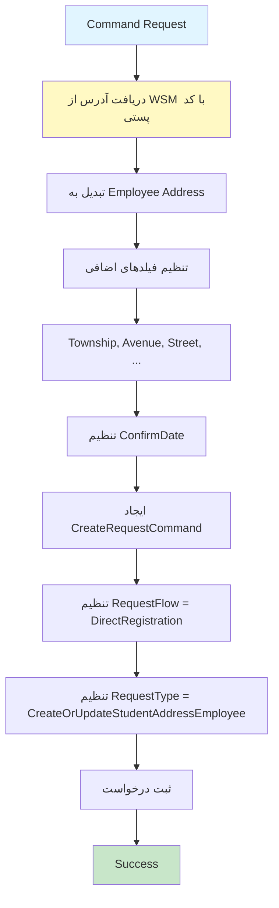

# CreateOrUpdateStudentAddressEmployeeRequestCommand.cs

**مسیر**: `Csis.Admission.Application/Features/Addresses/Commands/CreateOrUpdateStudentAddressEmployeeRequestCommand.cs`

## 1. هدف (Purpose)

این Command برای **ثبت درخواست بروزرسانی آدرس توسط کارمند (Employee)** استفاده می‌شود. این Command آدرس را از سرویس کد پستی (WSM) دریافت کرده و یک **درخواست (Request)** برای ثبت یا بروزرسانی آدرس ایجاد می‌کند.

### کاربرد اصلی:
- ثبت درخواست بروزرسانی آدرس توسط کارمند
- دریافت اطلاعات آدرس از سرویس کد پستی
- ایجاد درخواست با جریان Direct Registration
- تایید خودکار آدرس با تاریخ فعلی

---

## 2. ورودی (Input)

```csharp
public sealed record CreateOrUpdateStudentAddressEmployeeRequestCommand : IRequest
```

### پارامترها:

| پارامتر | نوع | توضیحات |
|---------|-----|----------|
| `Codm` | `int` | کد مرکز خدمات دانشجو (الزامی) |
| `PostalCode` | `long` | کد پستی دانشجو (الزامی) |
| `Township` | `string` | شهرک |
| `Avenue` | `string` | خیابان اصلی |
| `Street` | `string` | خیابان فرعی |
| `Alley` | `string` | کوچه اصلی |
| `Lane` | `string` | کوچه فرعی |
| `Block` | `string` | بلوک |

**نکته**: فیلدهای جغرافیایی (Province, City, ...) از سرویس WSM دریافت می‌شوند.

---

## 3. خروجی (Output)

```csharp
Task (void)
```

این Command هیچ خروجی ندارد و فقط درخواست را ثبت می‌کند.

---

## 4. وابستگی‌ها (Dependencies)

```csharp
private readonly ICsisWsmService wsmService;
private readonly IRequestService requestService;
```

**Dependencies:**
1. **ICsisWsmService**: سرویس یکپارچه کد پستی (Web Service Manager)
2. **IRequestService**: سرویس مدیریت درخواست‌ها

---

## 5. جریان اجرا (Execution Flow)



### مراحل:
1. **دریافت آدرس از WSM**: فراخوانی `GetAddressByPostalCode` با Codm و PostalCode
2. **تبدیل به Employee Address**: استفاده از `GetAddressEmployee` method
3. **تنظیم فیلدهای دستی**: مقداردهی Township, Avenue, Street, Alley, Lane, Block
4. **تنظیم ConfirmDate**: ثبت تاریخ فعلی شمسی
5. **ایجاد CreateRequestCommand**: با Flow = DirectRegistration و Type = CreateOrUpdateStudentAddressEmployee
6. **ثبت درخواست**: فراخوانی `requestService.Create`

---

## 6. قوانین کسب‌وکار (Business Rules)

### BR-1: استفاده از سرویس کد پستی
```csharp
var wsmAddress = await wsmService.GetAddressByPostalCode(
    command.Codm, 
    command.PostalCode, 
    cancellationToken);
```
- **قانون**: اطلاعات جغرافیایی (استان، شهر، ...) از سرویس WSM دریافت می‌شود
- **نکته**: سرویس WSM احتمالاً به دیتابیس پست یا API خارجی متصل است

### BR-2: الگوی Employee Address
```csharp
var request = wsmAddress.GetAddressEmployee(command.Codm, command.PostalCode);
```
- **قانون**: از method خاص `GetAddressEmployee` برای تبدیل استفاده می‌شود
- **تفاوت**: با `GetAddress` عادی متفاوت است (احتمالاً برای کارمندان)

### BR-3: Override فیلدهای دستی
```csharp
request.Township = command.Township;
request.Avenue = command.Avenue;
request.Street = command.Street;
request.Alley = command.Alley;
request.Lane = command.Lane;
request.Block = command.Block;
```
- **قانون**: فیلدهای دستی Command جایگزین فیلدهای WSM می‌شوند
- **نکته**: اولویت با ورودی کاربر است

### BR-4: تایید خودکار آدرس
```csharp
request.ConfirmDate = PersianDateTime.Now.ToString();
```
- **قانون**: آدرس به صورت خودکار با تاریخ فعلی تایید می‌شود
- **نکته**: در حالت Employee، نیاز به تایید دستی نیست

### BR-5: جریان Direct Registration
```csharp
var requestCommand = new CreateRequestCommand(
    request, 
    RequestFlow.DirectRegistration, 
    RequestType.CreateOrUpdateStudentAddressEmployee);
```
- **قانون**: درخواست با جریان DirectRegistration ثبت می‌شود (بدون تایید مدیر)
- **Type**: نوع درخواست CreateOrUpdateStudentAddressEmployee است

---

## 7. نکات امنیتی (Security Considerations)

### ⚠️ **مشکل 1: فقدان Authorization**
```csharp
// ❌ بررسی نمی‌شود که آیا کارمند مجاز است
public async Task Handle(CreateOrUpdateStudentAddressEmployeeRequestCommand command, ...)
```

**پیشنهاد**:
```csharp
// بررسی نقش Employee
[Authorize(Roles = "Employee,Admin")]
// یا در Handler
if (!await _authService.IsEmployeeAsync()) {
    throw new UnauthorizedException("فقط کارمندان مجاز به این عملیات هستند");
}
```

### ⚠️ **مشکل 2: فقدان Validation**
```csharp
// ❌ PostalCode و Codm Validate نمی‌شوند
var wsmAddress = await wsmService.GetAddressByPostalCode(command.Codm, command.PostalCode, ...);
```

**پیشنهاد**:
```csharp
public class CreateOrUpdateStudentAddressEmployeeRequestCommandValidator 
    : AbstractValidator<CreateOrUpdateStudentAddressEmployeeRequestCommand>
{
    public CreateOrUpdateStudentAddressEmployeeRequestCommandValidator()
    {
        RuleFor(x => x.Codm).GreaterThan(0);
        RuleFor(x => x.PostalCode)
            .GreaterThan(0)
            .Must(BeValidIranianPostalCode).WithMessage("کد پستی نامعتبر است");
    }
    
    private bool BeValidIranianPostalCode(long postalCode)
    {
        return postalCode.ToString().Length == 10;
    }
}
```

### ⚠️ **مشکل 3: خطای WSM مدیریت نمی‌شود**
```csharp
// اگر WSM در دسترس نباشد یا کد پستی اشتباه باشد
var wsmAddress = await wsmService.GetAddressByPostalCode(...);
```

**پیشنهاد**:
```csharp
try {
    var wsmAddress = await wsmService.GetAddressByPostalCode(...);
    if (wsmAddress == null) {
        throw new BusinessException("آدرسی با این کد پستی یافت نشد");
    }
} catch (WsmServiceException ex) {
    _logger.LogError(ex, "Error calling WSM service");
    throw new BusinessException("خطا در دریافت اطلاعات آدرس. لطفاً کد پستی را بررسی کنید");
}
```

---

## 8. عملکرد و بهینه‌سازی (Performance)

### ✅ **مزایا:**
1. **Direct Registration**: بدون نیاز به تایید، سرعت بالا
2. **استفاده از WSM**: جلوگیری از ورود دستی اطلاعات جغرافیایی

### ⚠️ **مشکلات احتمالی:**
```csharp
// تماس با سرویس خارجی (WSM)
var wsmAddress = await wsmService.GetAddressByPostalCode(...);
```

**بهینه‌سازی پیشنهادی**:
```csharp
// اضافه کردن Cache برای کدهای پستی
private readonly IMemoryCache _cache;

var cacheKey = $"postal_{command.PostalCode}";
var wsmAddress = await _cache.GetOrCreateAsync(cacheKey, async entry => 
{
    entry.AbsoluteExpirationRelativeToNow = TimeSpan.FromHours(24);
    return await wsmService.GetAddressByPostalCode(
        command.Codm, command.PostalCode, cancellationToken);
});
```

---

## 9. خطاها و استثناها (Error Handling)

### خطاهای احتمالی:

#### 1. WSM Service Unavailable
- **زمان**: سرویس WSM در دسترس نباشد
- **HTTP Status**: 503 Service Unavailable

#### 2. Invalid Postal Code
- **زمان**: کد پستی نامعتبر یا یافت نشود
- **HTTP Status**: 404 Not Found

#### 3. Request Service Error
- **زمان**: خطا در ثبت درخواست
- **HTTP Status**: 500 Internal Server Error

### ⚠️ **فقدان Error Handling**:
```csharp
// ❌ هیچ try-catch وجود ندارد
public async Task Handle(...)
```

---

## 10. الگوهای طراحی (Design Patterns)

### الگوهای استفاده شده:
1. **CQRS Pattern**: Command جدا از Query
2. **Service Layer Pattern**: استفاده از WsmService و RequestService
3. **Request/Response Pattern**: ایجاد و ثبت درخواست
4. **Primary Constructor** (C# 12): ساختار کوتاه‌تر
5. **Builder Pattern**: ساخت Request با method های fluent

---

## 11. تست‌پذیری (Testability)

### نمونه Unit Test:

```csharp
[Fact]
public async Task Handle_WhenValidPostalCode_ShouldCreateRequest()
{
    // Arrange
    var command = new CreateOrUpdateStudentAddressEmployeeRequestCommand
    {
        Codm = 12345,
        PostalCode = 1234567890,
        Avenue = "خیابان آزادی",
        Street = "خیابان انقلاب"
    };
    
    var wsmAddress = new WsmAddressDto 
    { 
        ProvinceId = 1, 
        CityId = 2 
    };
    
    _wsmServiceMock.Setup(x => x.GetAddressByPostalCode(
            command.Codm, command.PostalCode, It.IsAny<CancellationToken>()))
        .ReturnsAsync(wsmAddress);
    
    _requestServiceMock.Setup(x => x.Create(
            It.IsAny<CreateRequestCommand>(), 
            It.IsAny<CancellationToken>()))
        .ReturnsAsync(new RequestResult { Id = 1 });
    
    // Act
    await _handler.Handle(command, CancellationToken.None);
    
    // Assert
    _requestServiceMock.Verify(x => x.Create(
        It.Is<CreateRequestCommand>(c => 
            c.Flow == RequestFlow.DirectRegistration &&
            c.Type == RequestType.CreateOrUpdateStudentAddressEmployee),
        It.IsAny<CancellationToken>()), Times.Once);
}

[Fact]
public async Task Handle_ShouldSetConfirmDateToNow()
{
    // Arrange
    var command = new CreateOrUpdateStudentAddressEmployeeRequestCommand
    {
        Codm = 12345,
        PostalCode = 1234567890
    };
    
    var wsmAddress = new WsmAddressDto();
    _wsmServiceMock.Setup(x => x.GetAddressByPostalCode(...))
        .ReturnsAsync(wsmAddress);
    
    CreateRequestCommand capturedCommand = null;
    _requestServiceMock.Setup(x => x.Create(
            It.IsAny<CreateRequestCommand>(), 
            It.IsAny<CancellationToken>()))
        .Callback<CreateRequestCommand, CancellationToken>((c, ct) => capturedCommand = c)
        .ReturnsAsync(new RequestResult { Id = 1 });
    
    // Act
    await _handler.Handle(command, CancellationToken.None);
    
    // Assert
    Assert.NotNull(capturedCommand);
    Assert.NotNull(capturedCommand.Data.ConfirmDate);
}
```

---

## 12. ملاحظات Logging و Monitoring

### ⚠️ **فقدان Logging**:
```csharp
// ❌ هیچ logging وجود ندارد
public async Task Handle(...)
```

### پیشنهاد:
```csharp
private readonly ILogger<CreateOrUpdateStudentAddressEmployeeRequestCommandHandler> _logger;

public async Task Handle(...)
{
    _logger.LogInformation(
        "Creating employee address request for student {Codm} with postal code {PostalCode}",
        command.Codm, command.PostalCode);
    
    try {
        var wsmAddress = await wsmService.GetAddressByPostalCode(...);
        _logger.LogInformation("Successfully retrieved address from WSM");
        
        var requestCommand = new CreateRequestCommand(...);
        var result = await requestService.Create(requestCommand, cancellationToken);
        
        _logger.LogInformation(
            "Address request {RequestId} created successfully for student {Codm}",
            result.Id, command.Codm);
    } catch (Exception ex) {
        _logger.LogError(ex, 
            "Error creating address request for student {Codm}", command.Codm);
        throw;
    }
}
```

---

## 13. مثال استفاده (Usage Example)

### از Controller:
```csharp
[HttpPost("employee-request")]
[Authorize(Roles = "Employee,Admin")]
public async Task<IActionResult> CreateAddressEmployeeRequest(
    CreateOrUpdateStudentAddressEmployeeRequestCommand command)
{
    await _mediator.Send(command);
    return Ok(new { message = "درخواست آدرس با موفقیت ثبت شد" });
}
```

### از Frontend:
```javascript
async function createEmployeeAddressRequest(codm, postalCode, details) {
    const command = {
        codm: codm,
        postalCode: postalCode,
        township: details.township,
        avenue: details.avenue,
        street: details.street,
        alley: details.alley,
        lane: details.lane,
        block: details.block
    };
    
    try {
        const response = await fetch('/api/addresses/employee-request', {
            method: 'POST',
            headers: {
                'Authorization': `Bearer ${employeeToken}`,
                'Content-Type': 'application/json'
            },
            body: JSON.stringify(command)
        });
        
        if (response.ok) {
            alert('درخواست آدرس با موفقیت ثبت شد');
        }
    } catch (error) {
        alert('خطا در ثبت درخواست');
    }
}
```

---

## 14. Command/Query های مرتبط

### Commands مرتبط:
- `CreateOrUpdateStudentAddressEmployeeCommand`: اجرای واقعی درخواست
- `CreateOrUpdateStudentAddressRequestCommand`: ثبت درخواست توسط دانشجو
- `ConfirmStudentAddressCommand`: تایید آدرس

### Queries مرتبط:
- `GetAddressesByCodmQuery`: دریافت آدرس فعلی دانشجو
- `GetAddressByIdQuery`: دریافت آدرس با Id

---

## 15. تاریخچه تغییرات (Change History)

| تاریخ | تغییرات | توسعه‌دهنده |
|-------|---------|-------------|
| - | ایجاد اولیه Command | - |
| - | TODO یادداشت شده | - |

---

## 16. تغییرات پیشنهادی (Proposed Changes)

### Priority 1: افزودن Error Handling
```diff
public async Task Handle(...) 
{
+   try {
        var wsmAddress = await wsmService.GetAddressByPostalCode(
            command.Codm, command.PostalCode, cancellationToken);
        
+       if (wsmAddress == null) {
+           throw new BusinessException("آدرسی با این کد پستی یافت نشد");
+       }
        
        var request = wsmAddress.GetAddressEmployee(command.Codm, command.PostalCode);
        // ...
        
        _ = await requestService.Create(requestCommand, cancellationToken);
+   } catch (WsmServiceException ex) {
+       _logger.LogError(ex, "WSM service error");
+       throw new BusinessException("خطا در دریافت اطلاعات کد پستی");
+   }
}
```

### Priority 2: افزودن Validation
```diff
+ public class CreateOrUpdateStudentAddressEmployeeRequestCommandValidator 
+     : AbstractValidator<CreateOrUpdateStudentAddressEmployeeRequestCommand>
+ {
+     public CreateOrUpdateStudentAddressEmployeeRequestCommandValidator()
+     {
+         RuleFor(x => x.Codm).GreaterThan(0).WithMessage("کد مرکز خدمات الزامی است");
+         RuleFor(x => x.PostalCode)
+             .GreaterThan(0)
+             .Must(x => x.ToString().Length == 10)
+             .WithMessage("کد پستی باید 10 رقم باشد");
+     }
+ }
```

### Priority 3: افزودن Cache برای WSM
```diff
internal sealed class CreateOrUpdateStudentAddressEmployeeRequestCommandHandler(
    ICsisWsmService wsmService,
-   IRequestService requestService)
+   IRequestService requestService,
+   IMemoryCache cache)
{
    public async Task Handle(...) 
    {
+       var cacheKey = $"postal_{command.PostalCode}";
+       var wsmAddress = await cache.GetOrCreateAsync(cacheKey, async entry => 
+       {
+           entry.AbsoluteExpirationRelativeToNow = TimeSpan.FromHours(24);
            return await wsmService.GetAddressByPostalCode(
                command.Codm, command.PostalCode, cancellationToken);
+       });
        
-       var wsmAddress = await wsmService.GetAddressByPostalCode(...);
        // ...
    }
}
```

### Priority 4: رفع TODO
```csharp
//TODO - این TODO باید توضیح داده شود یا برطرف شود
// پیشنهاد: مشخص شود که TODO چه موضوعی را مد نظر دارد
```

---

## نتیجه‌گیری

این Command **واسط ایجاد درخواست آدرس توسط کارمند** است و با سرویس کد پستی (WSM) ارتباط دارد.

### نقاط قوت:
✅ استفاده از سرویس یکپارچه کد پستی  
✅ تایید خودکار برای کارمندان  
✅ جریان DirectRegistration  
✅ Override فیلدهای دستی  

### نقاط ضعف:
⚠️ فقدان Error Handling برای WSM  
⚠️ فقدان Validation  
⚠️ فقدان Logging  
⚠️ فقدان Cache برای WSM calls  
⚠️ TODO نامشخص
