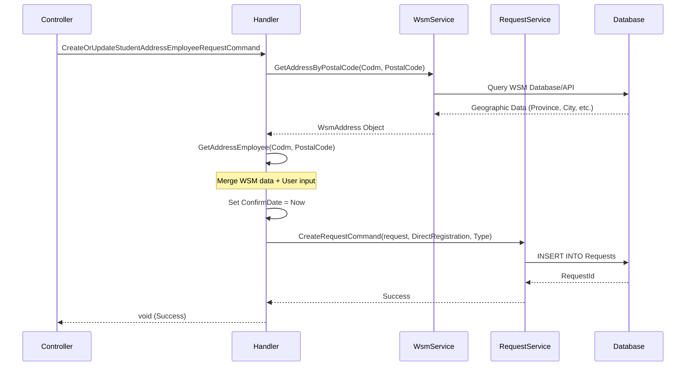

<div dir="rtl">

# CreateOrUpdateStudentAddressEmployeeRequestCommand

## 📄 اطلاعات کلی

**مسیر فایل:**
```
Csis.Admission.Application/Features/Addresses/Commands/CreateOrUpdateStudentAddressEmployeeRequestCommand.cs
```

**Feature:** Addresses  
**نوع:** Command  
**هدف:** ثبت درخواست بروزرسانی آدرس دانشجو توسط کارمندان

---

## 🎯 هدف (Purpose)

این Command برای **ایجاد درخواست بروزرسانی آدرس** دانشجو استفاده می‌شود. برخلاف Command قبلی که مستقیماً آدرس را تغییر می‌دهد، این Command یک **درخواست (Request)** در سیستم ایجاد می‌کند که:
- از وب سرویس کد پستی اطلاعات جغرافیایی را دریافت می‌کند
- فیلدهای اضافی را از کاربر می‌گیرد
- یک Request با نوع `CreateOrUpdateStudentAddressEmployee` ایجاد می‌کند
- از جریان `DirectRegistration` استفاده می‌کند

---

## 📝 ساختار Command

### ورودی (Request)

```csharp
public sealed record CreateOrUpdateStudentAddressEmployeeRequestCommand : IRequest
{
    /// کد مرکز خدمات
    int Codm

    /// کد پستی (10 رقمی)
    long PostalCode

    /// جزئیات اضافی آدرس
    string Township        // شهرک
    string Avenue          // خیابان اصلی
    string Street          // خیابان فرعی
    string Alley           // کوچه اصلی
    string Lane            // کوچه فرعی
    string Block           // بلوک
}
```

**نکات:**
- تنها 6 فیلد جزئیات دارد (نسبت به Command قبلی بسیار ساده‌تر)
- اطلاعات اصلی از **وب سرویس کد پستی** (WSM) دریافت می‌شود
- `ConfirmDate` به صورت خودکار با زمان فعلی set می‌شود

### خروجی (Response)

```csharp
void  // هیچ خروجی ندارد
```

---

## 🔄 جریان اجرا (Execution Flow)

### مراحل:

```
1. دریافت اطلاعات آدرس از WSM
   └─> wsmService.GetAddressByPostalCode(Codm, PostalCode)

2. ایجاد Request Object
   ├─> wsmAddress.GetAddressEmployee()
   └─> پر کردن فیلدهای اضافی:
       ├─> Township, Avenue, Street
       ├─> Alley, Lane, Block
       └─> ConfirmDate = زمان فعلی

3. ایجاد Request در سیستم
   └─> CreateRequestCommand(
         request, 
         RequestFlow.DirectRegistration,
         RequestType.CreateOrUpdateStudentAddressEmployee
       )

4. ذخیره Request
   └─> requestService.Create()
```

### نمودار توالی (Sequence Diagram)



---

## 🔧 وابستگی‌ها (Dependencies)

### تزریق شده:
```csharp
ICsisWsmService wsmService
IRequestService requestService
```

**توضیحات:**
1. `ICsisWsmService`: سرویس وب سرویس کد پستی (WSM - Web Service Manager)
   - دریافت اطلاعات جغرافیایی از کد پستی
2. `IRequestService`: سرویس مدیریت درخواست‌ها
   - ایجاد و پیگیری Requests در سیستم

---

## 📋 قوانین کسب‌وکار (Business Rules)

### BR-1: Postal Code Validation via WSM
- **قانون**: کد پستی باید در سیستم WSM معتبر باشد
- **پیاده‌سازی**: `wsmService.GetAddressByPostalCode()`
- **خطا**: اگر کد پستی نامعتبر باشد، Exception پرتاب می‌شود

### BR-2: Auto Geographic Data Completion
- **قانون**: اطلاعات جغرافیایی (استان، شهر، ...) از WSM دریافت می‌شود
- **هدف**: جلوگیری از خطای کاربر در وارد کردن دستی
- **مزیت**: یکپارچگی داده‌ها با استانداردهای ملی

### BR-3: Direct Registration Flow
- **قانون**: این درخواست از جریان `DirectRegistration` استفاده می‌کند
- **معنی**: بلافاصله بدون نیاز به تایید اجرا می‌شود
- **تفاوت**: با جریان‌های Approval-based فرق دارد

### BR-4: Auto Confirm Date
- **قانون**: `ConfirmDate` به صورت خودکار با زمان فعلی (شمسی) set می‌شود
- **پیاده‌سازی**: `PersianDateTime.Now.ToString()`
- **هدف**: ثبت زمان دقیق ایجاد درخواست

---

## 🔄 Request Flow System

### انواع RequestFlow:
```csharp
RequestFlow.DirectRegistration  // ثبت مستقیم بدون تایید
```

### نوع Request:
```csharp
RequestType.CreateOrUpdateStudentAddressEmployee
```

این Request در صف درخواست‌ها قرار می‌گیرد و توسط سیستم پردازش می‌شود.

---

## ⚠️ نکات امنیتی (Security Considerations)

### 1. Postal Code Validation
- ✅ **امنیت**: کد پستی از منبع معتبر (WSM) اعتبارسنجی می‌شود
- **مزیت**: جلوگیری از ورود کدهای جعلی

### 2. No Direct Database Modification
- ✅ **امنیت**: تغییرات مستقیم روی Database اعمال نمی‌شود
- **مزیت**: امکان Audit Trail و بازگشت تغییرات
- **الگو**: Request-based modification

### 3. Authorization Check
- ❓ **تایید نشده**: آیا بررسی می‌شود کاربر کارمند است؟
- **پیشنهاد**: `[Authorize(Roles = "Employee")]`

---

## 🐛 مشکلات و بدهی فنی (Technical Debt)

### Issue #1: TODO Comment
```csharp
//TODO
internal sealed class CreateOrUpdateStudentAddressEmployeeRequestCommandHandler
```
- **مشکل**: TODO بدون توضیح
- **سوال**: چه کاری باید انجام شود؟
- **اقدام**: نیاز به توضیح یا حذف TODO

### Issue #2: Discarded Return Value
```csharp
_ = await requestService.Create(requestCommand, cancellationToken);
```
- **مشکل**: `RequestId` برگشتی استفاده نمی‌شود
- **سوال**: آیا باید `RequestId` به کاربر برگردانده شود؟
- **بهبود**: برگرداندن `RequestId` برای پیگیری

### Issue #3: Limited Input Fields
- **مشکل**: فقط 6 فیلد جزئیات قابل ویرایش است
- **سوال**: چرا فیلدهایی مثل Unit, Floor, Complex نیست؟
- **احتمال**: این Command فقط برای بروزرسانی‌های سریع است

---

## 🧪 تست‌های پیشنهادی (Suggested Tests)

### Unit Tests:
```csharp
// 1. Valid Postal Code
[Fact]
async Task Should_Create_Request_With_Valid_PostalCode()

// 2. Invalid Postal Code
[Fact]
async Task Should_Throw_Exception_For_Invalid_PostalCode()

// 3. WSM Integration
[Fact]
async Task Should_Fetch_Geographic_Data_From_WSM()

// 4. ConfirmDate Auto-Set
[Fact]
async Task Should_Set_ConfirmDate_To_Current_Time()
```

### Integration Tests:
```csharp
// 1. Full Request Flow
[Fact]
async Task Should_Create_Request_Successfully()

// 2. Request Type Verification
[Fact]
async Task Should_Create_Request_With_Correct_Type()
```

---

## 🔗 ارتباطات (Related Components)

### Commands مرتبط:
- `CreateOrUpdateStudentAddressEmployeeCommand` - اجرای واقعی تغییر آدرس
- `CreateOrUpdateStudentAddressRequestCommand` - نسخه غیر کارمندی

### Services مرتبط:
- `ICsisWsmService` - وب سرویس کد پستی
- `IRequestService` - مدیریت Request Flow

### Models:
- `WsmAddress` - مدل داده از WSM
- `CreateRequestCommand` - Command ایجاد Request

---

## 📊 مقایسه با Command مرتبط

| ویژگی | EmployeeRequestCommand | EmployeeCommand |
|-------|----------------------|-----------------|
| **نقش** | ایجاد Request | اجرای مستقیم |
| **ورودی** | 8 فیلد | 24 فیلد |
| **WSM** | ✅ استفاده می‌شود | ❌ ندارد |
| **خروجی** | void | AddressId |
| **Flow** | DirectRegistration | مستقیم به DB |
| **Side Effect** | Request ایجاد | DB + Branch/Agency |
| **پیچیدگی** | ساده | پیچیده |

---

## 📊 خلاصه نکات کلیدی

| نکته | توضیح |
|------|-------|
| **نقش** | ایجاد Request بروزرسانی آدرس |
| **ورودی** | Codm + PostalCode + 6 فیلد |
| **خروجی** | void |
| **WSM Integration** | ✅ دریافت از کد پستی |
| **Request Flow** | DirectRegistration |
| **Auto Fields** | ConfirmDate = Now |
| **Technical Debt** | ⚠️ TODO + Discarded Return |
| **Security** | ✅ WSM Validation |

---

## 💡 نکات پیاده‌سازی

### WSM Integration:
```csharp
// دریافت اطلاعات جغرافیایی از کد پستی
var wsmAddress = await wsmService.GetAddressByPostalCode(
    command.Codm, 
    command.PostalCode, 
    cancellationToken
);

// تبدیل به Employee Request
var request = wsmAddress.GetAddressEmployee(
    command.Codm, 
    command.PostalCode
);
```

### Auto ConfirmDate:
```csharp
request.ConfirmDate = PersianDateTime.Now.ToString();
// مثال: "1403/10/13 14:30:25"
```

### Request Creation:
```csharp
var requestCommand = new CreateRequestCommand(
    request,                                          // داده
    RequestFlow.DirectRegistration,                   // جریان
    RequestType.CreateOrUpdateStudentAddressEmployee  // نوع
);
```

---

**یادداشت نهایی**: این Command نسخه ساده‌شده‌ای است که از WSM برای تکمیل خودکار اطلاعات جغرافیایی استفاده می‌کند و یک Request ایجاد می‌کند به جای تغییر مستقیم.

</div>
