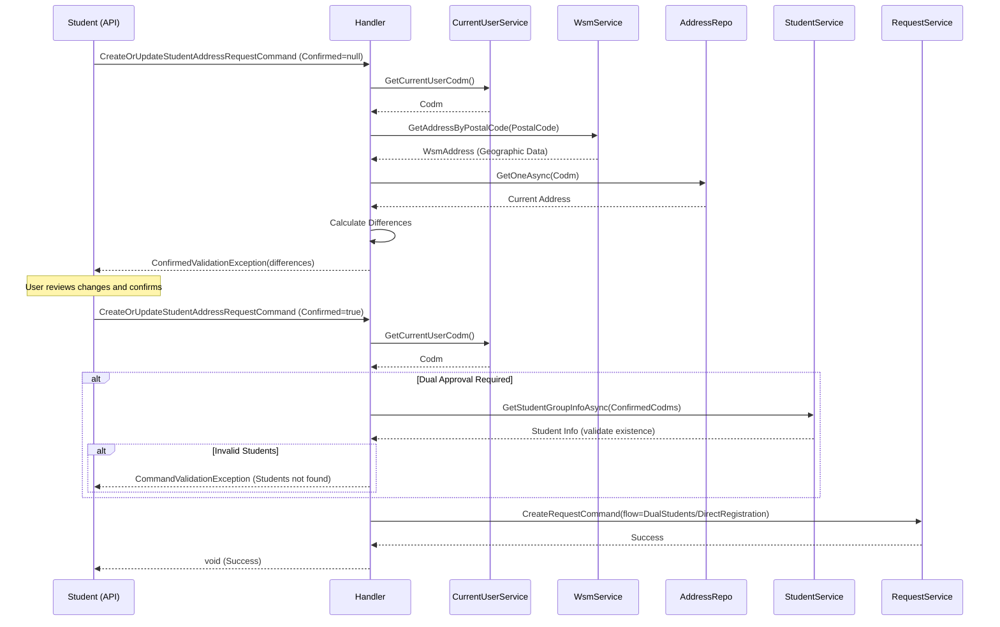

<div dir="rtl">

# CreateOrUpdateStudentAddressRequestCommand

## 📄 اطلاعات کلی

**مسیر فایل:**
```
Csis.Admission.Application/Features/Addresses/Commands/CreateOrUpdateStudentAddressRequestCommand.cs
```

**Feature:** Addresses  
**نوع:** Command  
**هدف:** ثبت درخواست بروزرسانی آدرس توسط خود دانشجو (با تایید دو مرحله‌ای و Dual Approval)

---

## 🎯 هدف (Purpose)

این Command نسخه **دانشجویی** Command بروزرسانی آدرس است که توسط **خود دانشجو** اجرا می‌شود و دارای ویژگی‌های زیر است:
- **تایید دو مرحله‌ای (Two-Step Confirmation)**: دانشجو ابتدا تغییرات را می‌بیند، سپس تایید می‌کند
- **Dual Student Approval**: در صورت نیاز، باید دو طلبه دیگر آدرس را تایید کنند
- **WSM Integration**: اطلاعات جغرافیایی از کد پستی دریافت می‌شود
- **Smart Flow Selection**: بسته به نیاز به Dual Approval، جریان مناسب انتخاب می‌شود

---

## 📝 ساختار Command

### ورودی (Request)

```csharp
public sealed record CreateOrUpdateStudentAddressRequestCommand : IRequest
{
    /// کد مرکز خدمات (auto-filled از CurrentUser)
    int Codm

    /// کد پستی (10 رقمی)
    long PostalCode

    /// جزئیات اضافی آدرس
    string Township        // شهرک
    string Avenue          // خیابان اصلی
    string Street          // خیابان فرعی
    string Alley           // کوچه اصلی
    string Lane            // کوچه فرعی
    string Block           // بلوک

    /// تایید دو طلبه (در صورت نیاز)
    int[] ConfirmedStudentCodms  // کدهای طلاب تایید کننده

    /// تایید تغییرات (Two-Step)
    bool? Confirmed        // null در فراخوانی اول، true در فراخوانی دوم
}
```

**نکات:**
- `Codm` از `CurrentUser` دریافت می‌شود (دانشجو نمی‌تواند Codm دیگری وارد کند)
- `Confirmed` برای الگوی Two-Step است
- `ConfirmedStudentCodms` فقط در صورت نیاز به Dual Approval پر می‌شود

### خروجی (Response)

```csharp
void  // هیچ خروجی ندارد
```

---

## 🔄 جریان اجرا (Execution Flow)

### مراحل:

```
1. تنظیم Codm از کاربر جاری
   └─> SetCodm(command, currentUser)

2. دریافت اطلاعات آدرس از WSM
   └─> wsmService.GetAddressByPostalCode(Codm, PostalCode)

3. ایجاد Request Object
   ├─> wsmAddress.GetAddress()
   └─> پر کردن فیلدهای اضافی + ConfirmDate

4. تعیین جریان (Flow Selection)
   ├─> اگر RequiresDualStudentApproval == true
   │   └─> RequestFlow.DualStudents
   └─> در غیر این صورت
       └─> RequestFlow.DirectRegistration

5. Two-Step Confirmation Check
   ├─> دریافت آدرس فعلی از DB
   ├─> اگر Confirmed != true:
   │   ├─> محاسبه تفاوت‌ها
   │   └─> پرتاب ConfirmedValidationException
   └─> (کاربر تغییرات را می‌بیند و مجدداً با Confirmed=true می‌فرستد)

6. Dual Students Validation
   └─> اگر Flow == DualStudents:
       ├─> بررسی تعداد (حداقل 2 نفر)
       ├─> بررسی Distinct بودن
       └─> بررسی وجود طلاب در سیستم

7. ایجاد Request
   ├─> CreateRequestCommand(request, flow)
   ├─> AddDualStudentsCodm()
   └─> requestService.Create()
```

### نمودار توالی (Sequence Diagram)



---

## 🔧 وابستگی‌ها (Dependencies)

### تزریق شده:
```csharp
ICsisWsmService wsmService
IRequestService requestService
IRepository<Address> addressRepo
IStudentDataService studentService
ICurrentUserService currentUser
```

**توضیحات:**
1. `ICsisWsmService`: وب سرویس کد پستی
2. `IRequestService`: مدیریت Requests
3. `IRepository<Address>`: دریافت آدرس فعلی برای مقایسه
4. `IStudentDataService`: اعتبارسنجی طلاب تایید کننده
5. `ICurrentUserService`: دریافت Codm کاربر جاری

---

## 📋 قوانین کسب‌وکار (Business Rules)

### BR-1: Auto Codm from Current User
- **قانون**: `Codm` از کاربر لاگین شده دریافت می‌شود
- **امنیت**: دانشجو نمی‌تواند آدرس دیگری را تغییر دهد
- **پیاده‌سازی**: `Common.Utilities.SetCodm()`

### BR-2: Two-Step Confirmation Pattern
- **قانون**: قبل از ثبت نهایی، دانشجو باید تغییرات را ببیند و تایید کند
- **جریان**:
  1. فراخوانی اول با `Confirmed = null`
  2. سیستم تفاوت‌ها را محاسبه و نمایش می‌دهد
  3. دانشجو تایید می‌کند
  4. فراخوانی دوم با `Confirmed = true`
- **استثنا**: `ConfirmedValidationException` حاوی لیست تغییرات

### BR-3: Smart Flow Selection
- **قانون**: جریان Request بر اساس نیاز به Dual Approval تعیین می‌شود
- **شرط**: `RequiresDualStudentApproval` از WSM Address
- **جریان‌ها**:
  - `RequestFlow.DualStudents`: نیاز به تایید 2 طلبه
  - `RequestFlow.DirectRegistration`: ثبت مستقیم

### BR-4: Dual Student Validation
- **قانون**: اگر نیاز به Dual Approval باشد:
  1. باید **حداقل 2** طلبه معرفی شوند
  2. کدها باید **Distinct** باشند (نمی‌توان یک نفر را 2 بار معرفی کرد)
  3. طلاب باید در سیستم **موجود** باشند
- **خطا**: `CommandValidationException` با پیام فارسی مناسب

### BR-5: Postal Code Validation
- **قانون**: کد پستی باید در WSM معتبر باشد
- **مزیت**: اطلاعات جغرافیایی صحیح و استاندارد

---

## ⚠️ نکات امنیتی (Security Considerations)

### 1. Auto Codm (High Security) ✅
```csharp
_ = await Common.Utilities.SetCodm(command, currentUser);
```
- **امنیت**: دانشجو نمی‌تواند Codm دیگری جعل کند
- **الگو**: Secure by Design

### 2. Two-Step Confirmation ✅
- **امنیت**: جلوگیری از تغییرات تصادفی یا اشتباهی
- **UX**: شفافیت کامل نسبت به تغییرات

### 3. Dual Student Verification ✅
```csharp
var students = await studentService.GetStudentGroupInfoAsync(codms);
if (students.Count != 2) { throw ... }
```
- **امنیت**: اعتبارسنجی وجود واقعی طلاب

### 4. WSM Validation ✅
- **امنیت**: جلوگیری از آدرس‌های جعلی یا نامعتبر

---

## 🐛 مشکلات و بدهی فنی (Technical Debt)

### Issue #1: TODO Comment
```csharp
//TODO
internal sealed class CreateOrUpdateStudentAddressRequestCommandHandler
```
- **مشکل**: TODO بدون توضیح
- **نیاز**: مستندسازی یا حذف

### Issue #2: Discarded Return Values
```csharp
_ = await Common.Utilities.SetCodm(command, currentUser);
_ = await requestService.Create(requestCommand, cancellationToken);
```
- **مشکل**: مقادیر برگشتی استفاده نمی‌شوند
- **سوال**: آیا باید RequestId به کاربر برگردد؟

### Issue #3: Duplicate Code
- **مشکل**: شباهت زیاد به `CreateOrUpdateStudentAddressEmployeeRequestCommand`
- **بهبود**: Refactor با Base Class یا Shared Logic

---

## 🧪 تست‌های پیشنهادی (Suggested Tests)

### Unit Tests:
```csharp
// 1. Auto Codm Setting
[Fact]
async Task Should_Set_Codm_From_Current_User()

// 2. Two-Step Confirmation - First Call
[Fact]
async Task Should_Throw_ConfirmedException_When_Not_Confirmed()

// 3. Two-Step Confirmation - Second Call
[Fact]
async Task Should_Proceed_When_Confirmed_Is_True()

// 4. Dual Students - Missing Students
[Fact]
async Task Should_Throw_When_Dual_Students_Count_Less_Than_2()

// 5. Dual Students - Non-Distinct
[Fact]
async Task Should_Throw_When_Dual_Students_Not_Distinct()

// 6. Dual Students - Not Found
[Fact]
async Task Should_Throw_When_Dual_Students_Not_Found()

// 7. Flow Selection
[Fact]
async Task Should_Select_DualStudents_Flow_When_Required()

[Fact]
async Task Should_Select_DirectRegistration_Flow_When_Not_Required()
```

### Integration Tests:
```csharp
// 1. Full Two-Step Flow
[Fact]
async Task Should_Complete_Two_Step_Confirmation_Flow()

// 2. Full Dual Approval Flow
[Fact]
async Task Should_Complete_Dual_Student_Approval_Flow()
```

---

## 🔗 ارتباطات (Related Components)

### Commands مرتبط:
- `CreateOrUpdateStudentAddressEmployeeCommand` - نسخه مستقیم کارمندی
- `CreateOrUpdateStudentAddressEmployeeRequestCommand` - نسخه Request کارمندی

### Services:
- `Common.Utilities.SetCodm()` - تنظیم Codm از کاربر جاری
- `Common.Utilities.GetDifferences()` - محاسبه تفاوت‌ها

### Exceptions:
- `ConfirmedValidationException` - نمایش تغییرات به کاربر
- `CommandValidationException` - خطاهای اعتبارسنجی

---

## 📊 مقایسه با Commands مشابه

| ویژگی | StudentRequestCommand | EmployeeRequestCommand | EmployeeCommand |
|-------|---------------------|---------------------|-----------------|
| **کاربر** | دانشجو | کارمند | کارمند |
| **Codm** | از CurrentUser | دستی | دستی |
| **Two-Step** | ✅ دارد | ❌ ندارد | ❌ ندارد |
| **Dual Approval** | ✅ شرطی | ❌ ندارد | ✅ شرطی |
| **Flow** | Smart Selection | DirectRegistration | مستقیم DB |
| **Validation** | کامل | ساده | متوسط |
| **Security** | بالا | متوسط | متوسط |

---

## 📊 خلاصه نکات کلیدی

| نکته | توضیح |
|------|-------|
| **نقش** | ثبت Request آدرس توسط دانشجو |
| **ورودی** | PostalCode + 6 فیلد + Dual Codms |
| **خروجی** | void |
| **Codm** | ✅ Auto از CurrentUser |
| **Two-Step** | ✅ Confirmation Pattern |
| **Dual Approval** | ✅ با Validation کامل |
| **Flow Selection** | ✅ Smart (Dual/Direct) |
| **WSM** | ✅ Integration |
| **Security** | ✅ بالا |

---

## 💡 نکات پیاده‌سازی

### Auto Codm Setting:
```csharp
// امنیت: جلوگیری از دستکاری Codm
_ = await Common.Utilities.SetCodm(command, currentUser);
```

### Two-Step Confirmation:
```csharp
if (command.Confirmed != true)
{
    var differences = Common.Utilities.GetDifferences(
        currentAddress, 
        newAddress
    );
    // نمایش تفاوت‌ها به کاربر
    throw new ConfirmedValidationException(differences);
}
```

### Smart Flow Selection:
```csharp
var flow = request.RequiresDualStudentApproval == true
    ? RequestFlow.DualStudents
    : RequestFlow.DirectRegistration;
```

### Dual Students Validation:
```csharp
if (flow == RequestFlow.DualStudents && 
    command.ConfirmedStudentCodms.Distinct().Count() < 2)
{
    throw new CommandValidationException(
        "برای ثبت این آدرس، تأیید دو طلبه الزامی است..."
    );
}

// بررسی وجود طلاب
var students = await studentService.GetStudentGroupInfoAsync(codms);
if (students.Count != 2)
{
    // پیام خطای کاربرپسند فارسی
    throw new CommandValidationException(...);
}
```

---

**یادداشت نهایی**: این Command یکی از امن‌ترین و کامل‌ترین Commands در سیستم است با الگوهای Two-Step Confirmation، Dual Approval، و Auto Codm Security.

</div>
