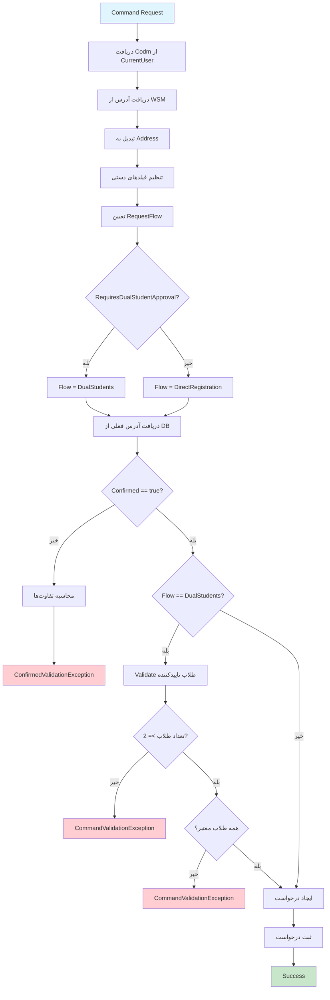

# CreateOrUpdateStudentAddressRequestCommand.cs

**مسیر**: `Csis.Admission.Application/Features/Addresses/Commands/CreateOrUpdateStudentAddressRequestCommand.cs`

## 1. هدف (Purpose)

این Command برای **ثبت درخواست بروزرسانی آدرس توسط دانشجو** استفاده می‌شود. این Command آدرس را از سرویس کد پستی (WSM) دریافت کرده و یک **درخواست (Request)** ایجاد می‌کند که ممکن است نیاز به تایید دو طلبه دیگر داشته باشد.

### کاربرد اصلی:
- ثبت درخواست بروزرسانی آدرس توسط دانشجو
- دریافت اطلاعات آدرس از سرویس کد پستی
- پشتیبانی از تایید دو طلبه (Dual Student Approval)
- نمایش تغییرات برای تایید کاربر (Confirmed Validation)
- ایجاد درخواست با جریان مناسب (Direct یا DualStudents)

---

## 2. ورودی (Input)

```csharp
public sealed record CreateOrUpdateStudentAddressRequestCommand : IRequest
```

### پارامترها:

| پارامتر | نوع | توضیحات |
|---------|-----|----------|
| `Codm` | `int` | کد مرکز خدمات دانشجو (از کاربر لاگین شده دریافت می‌شود) |
| `PostalCode` | `long` | کد پستی دانشجو (الزامی) |
| `Township` | `string` | شهرک |
| `Avenue` | `string` | خیابان اصلی |
| `Street` | `string` | خیابان فرعی |
| `Alley` | `string` | کوچه اصلی |
| `Lane` | `string` | کوچه فرعی |
| `Block` | `string` | بلوک |
| `ConfirmedStudentCodms` | `int[]` | کدهای مرکز خدمات طلاب تاییدکننده (برای Dual Approval) |
| `Confirmed` | `bool?` | آیا کاربر تغییرات را تایید کرده است؟ |

**نکته مهم**: `Codm` از `ICurrentUserService` دریافت می‌شود نه از ورودی کاربر.

---

## 3. خروجی (Output)

```csharp
Task (void)
```

این Command هیچ خروجی ندارد و فقط درخواست را ثبت می‌کند.

---

## 4. وابستگی‌ها (Dependencies)

```csharp
private readonly ICsisWsmService wsmService;
private readonly IRequestService requestService;
private readonly IRepository<Address> addressRepo;
private readonly IStudentDataService studentService;
private readonly ICurrentUserService currentUser;
```

**Dependencies:**
1. **ICsisWsmService**: سرویس یکپارچه کد پستی
2. **IRequestService**: سرویس مدیریت درخواست‌ها
3. **IRepository<Address>**: برای خواندن آدرس فعلی دانشجو
4. **IStudentDataService**: برای بررسی اعتبار طلاب تاییدکننده
5. **ICurrentUserService**: برای دریافت Codm دانشجو لاگین شده

---

## 5. جریان اجرا (Execution Flow)



### مراحل:
1. **تنظیم Codm**: دریافت Codm از `ICurrentUserService`
2. **دریافت آدرس از WSM**: فراخوانی `GetAddressByPostalCode`
3. **تبدیل به Address**: استفاده از `GetAddress` method
4. **Override فیلدهای دستی**: Township, Avenue, Street, ...
5. **تعیین Flow**: بررسی `RequiresDualStudentApproval` برای تعیین جریان
6. **دریافت آدرس فعلی**: خواندن آدرس موجود از دیتابیس
7. **بررسی تایید کاربر**: 
   - اگر `Confirmed != true`: محاسبه و نمایش تفاوت‌ها → Exception
8. **Validation طلاب**: در صورت DualStudents، بررسی معتبر بودن طلاب
9. **ایجاد درخواست**: ثبت درخواست با Flow و Type مناسب

---

## 6. قوانین کسب‌وکار (Business Rules)

### BR-1: دریافت Codm از کاربر لاگین شده
```csharp
_ = await Common.Utilities.SetCodm(command, currentUser);
```
- **قانون**: Codm از کاربر لاگین شده دریافت می‌شود نه از ورودی
- **امنیت**: جلوگیری از دستکاری Codm توسط کاربر

### BR-2: تایید تغییرات توسط کاربر
```csharp
if (command.Confirmed != true) {
    var differences = Common.Utilities.GetDifferences(address, request.ToEntity());
    throw new ConfirmedValidationException(differences);
}
```
- **قانون**: کاربر باید تغییرات را مشاهده و تایید کند
- **هدف**: جلوگیری از تغییرات ناخواسته
- **Exception**: `ConfirmedValidationException` که شامل لیست تفاوت‌هاست

### BR-3: تعیین جریان درخواست
```csharp
var flow = request.RequiresDualStudentApproval == true
    ? RequestFlow.DualStudents
    : RequestFlow.DirectRegistration;
```
- **قانون**: اگر نیاز به تایید دو طلبه باشد، جریان DualStudents است
- **Direct**: ثبت مستقیم بدون نیاز به تایید
- **DualStudents**: نیاز به تایید دو طلبه دیگر

### BR-4: Validation طلاب تاییدکننده
```csharp
if (flow == RequestFlow.DualStudents && command.ConfirmedStudentCodms.Distinct().Count() < 2) {
    throw new CommandValidationException(
        "برای ثبت این آدرس، تأیید دو طلبه الزامی است. لطفاً طلاب تأییدکننده را معرفی فرمایید.");
}
```
- **قانون**: حداقل 2 طلبه متمایز باید معرفی شوند
- **بررسی وجود**: تمام طلاب باید در سیستم موجود باشند

### BR-5: بررسی اعتبار طلاب
```csharp
var students = await studentService.GetStudentGroupInfoAsync(codms);
if (students.Count != 2) {
    // طلاب یافت نشدند
    throw new CommandValidationException(message);
}
```
- **قانون**: تمام طلاب معرفی شده باید در سیستم موجود باشند
- **پیام خطا**: نمایش کدهای یافت نشده

---

## 7. نکات امنیتی (Security Considerations)

### ✅ **امنیت خوب: استفاده از CurrentUser**
```csharp
_ = await Common.Utilities.SetCodm(command, currentUser);
```
- دانشجو فقط می‌تواند آدرس **خودش** را تغییر دهد
- از Codm user لاگین شده استفاده می‌شود نه از Input

### ✅ **امنیت خوب: Confirmed Validation**
```csharp
if (command.Confirmed != true) {
    var differences = Common.Utilities.GetDifferences(address, request.ToEntity());
    throw new ConfirmedValidationException(differences);
}
```
- کاربر مجبور است تغییرات را ببیند و تایید کند
- جلوگیری از تغییرات ناخواسته یا اشتباه

### ⚠️ **مشکل 1: فقدان Validation برای PostalCode**
```csharp
// ❌ کد پستی Validate نمی‌شود
var wsmAddress = await wsmService.GetAddressByPostalCode(command.Codm, command.PostalCode, ...);
```

**پیشنهاد**:
```csharp
public class CreateOrUpdateStudentAddressRequestCommandValidator 
    : AbstractValidator<CreateOrUpdateStudentAddressRequestCommand>
{
    public CreateOrUpdateStudentAddressRequestCommandValidator()
    {
        RuleFor(x => x.PostalCode)
            .GreaterThan(0)
            .Must(x => x.ToString().Length == 10)
            .WithMessage("کد پستی باید 10 رقم باشد");
    }
}
```

### ⚠️ **مشکل 2: عدم محدودیت تعداد درخواست**
```csharp
// ❌ بررسی نمی‌شود که آیا درخواست Pending دارد
_ = await requestService.Create(requestCommand, cancellationToken);
```

**پیشنهاد**:
```csharp
var pendingRequests = await requestService.GetPendingRequests(
    command.Codm, 
    RequestType.CreateOrUpdateStudentAddress);
    
if (pendingRequests.Any()) {
    throw new BusinessException("شما یک درخواست در حال بررسی دارید");
}
```

---

## 8. عملکرد و بهینه‌سازی (Performance)

### ✅ **مزایا:**
1. **Distinct() برای طلاب**: جلوگیری از تکرار
2. **GetOneAsync**: فقط یک رکورد خوانده می‌شود

### ⚠️ **مشکلات احتمالی:**
```csharp
// 1. تماس با WSM (سرویس خارجی)
var wsmAddress = await wsmService.GetAddressByPostalCode(...);

// 2. دو بار Query به دیتابیس
var address = await addressRepo.GetOneAsync(...);
var students = await studentService.GetStudentGroupInfoAsync(...);
```

**بهینه‌سازی پیشنهادی**:
```csharp
// Cache برای WSM
private readonly IMemoryCache _cache;

var cacheKey = $"postal_{command.PostalCode}";
var wsmAddress = await _cache.GetOrCreateAsync(cacheKey, async entry => 
{
    entry.AbsoluteExpirationRelativeToNow = TimeSpan.FromHours(24);
    return await wsmService.GetAddressByPostalCode(...);
});
```

---

## 9. خطاها و استثناها (Error Handling)

### خطاهای احتمالی:

#### 1. ConfirmedValidationException
```csharp
throw new ConfirmedValidationException(differences);
```
- **زمان**: کاربر تغییرات را تایید نکرده است
- **محتوا**: لیست تفاوت‌های بین آدرس قدیم و جدید
- **HTTP Status**: 400 Bad Request

#### 2. CommandValidationException (تعداد طلاب)
```csharp
throw new CommandValidationException(
    "برای ثبت این آدرس، تأیید دو طلبه الزامی است.");
```
- **زمان**: کمتر از 2 طلبه معرفی شده باشد
- **HTTP Status**: 400 Bad Request

#### 3. CommandValidationException (طلاب یافت نشدند)
```csharp
throw new CommandValidationException(message.ToString());
```
- **زمان**: یک یا چند طلبه در سیستم یافت نشوند
- **پیام**: نمایش کدهای یافت نشده
- **HTTP Status**: 400 Bad Request

#### 4. WSM Service Error
- **زمان**: سرویس WSM در دسترس نباشد یا کد پستی نامعتبر باشد
- **HTTP Status**: 503 Service Unavailable

---

## 10. الگوهای طراحی (Design Patterns)

### الگوهای استفاده شده:
1. **CQRS Pattern**: Command جدا از Query
2. **Service Layer Pattern**: استفاده از چندین سرویس
3. **Validation Pattern**: بررسی Confirmed و طلاب
4. **Strategy Pattern**: انتخاب Flow بر اساس شرایط
5. **Primary Constructor** (C# 12): ساختار کوتاه‌تر

---

## 11. تست‌پذیری (Testability)

### نمونه Unit Test:

```csharp
[Fact]
public async Task Handle_WhenNotConfirmed_ShouldThrowConfirmedValidationException()
{
    // Arrange
    var command = new CreateOrUpdateStudentAddressRequestCommand
    {
        PostalCode = 1234567890,
        Confirmed = false
    };
    
    var existingAddress = new Address { Avenue = "خیابان قدیم" };
    var newAddress = new WsmAddressDto { Avenue = "خیابان جدید" };
    
    _currentUserMock.Setup(x => x.GetStudentCodmAsync())
        .ReturnsAsync("12345");
    
    _wsmServiceMock.Setup(x => x.GetAddressByPostalCode(...))
        .ReturnsAsync(newAddress);
    
    _addressRepoMock.Setup(x => x.GetOneAsync(...))
        .ReturnsAsync(existingAddress);
    
    // Act & Assert
    await Assert.ThrowsAsync<ConfirmedValidationException>(
        () => _handler.Handle(command, CancellationToken.None));
}

[Fact]
public async Task Handle_WhenDualStudentsRequired_ShouldValidateStudents()
{
    // Arrange
    var command = new CreateOrUpdateStudentAddressRequestCommand
    {
        PostalCode = 1234567890,
        Confirmed = true,
        ConfirmedStudentCodms = new[] { 1001, 1002 }
    };
    
    var wsmAddress = new WsmAddressDto { RequiresDualStudentApproval = true };
    
    _wsmServiceMock.Setup(x => x.GetAddressByPostalCode(...))
        .ReturnsAsync(wsmAddress);
    
    _addressRepoMock.Setup(x => x.GetOneAsync(...))
        .ReturnsAsync(new Address());
    
    _studentServiceMock.Setup(x => x.GetStudentGroupInfoAsync(
            It.IsAny<string[]>()))
        .ReturnsAsync(new List<StudentInfo> 
        { 
            new() { Codm = 1001 }, 
            new() { Codm = 1002 } 
        });
    
    // Act
    await _handler.Handle(command, CancellationToken.None);
    
    // Assert
    _requestServiceMock.Verify(x => x.Create(
        It.Is<CreateRequestCommand>(c => 
            c.Flow == RequestFlow.DualStudents),
        It.IsAny<CancellationToken>()), Times.Once);
}

[Fact]
public async Task Handle_WhenLessThanTwoStudents_ShouldThrowException()
{
    // Arrange
    var command = new CreateOrUpdateStudentAddressRequestCommand
    {
        PostalCode = 1234567890,
        Confirmed = true,
        ConfirmedStudentCodms = new[] { 1001 } // فقط یک طلبه
    };
    
    var wsmAddress = new WsmAddressDto { RequiresDualStudentApproval = true };
    
    _wsmServiceMock.Setup(x => x.GetAddressByPostalCode(...))
        .ReturnsAsync(wsmAddress);
    
    _addressRepoMock.Setup(x => x.GetOneAsync(...))
        .ReturnsAsync(new Address());
    
    // Act & Assert
    var exception = await Assert.ThrowsAsync<CommandValidationException>(
        () => _handler.Handle(command, CancellationToken.None));
    
    Assert.Contains("تأیید دو طلبه الزامی است", exception.Message);
}
```

---

## 12. ملاحظات Logging و Monitoring

### ⚠️ **فقدان Logging**:
```csharp
// ❌ هیچ logging وجود ندارد
public async Task Handle(...)
```

### پیشنهاد:
```csharp
private readonly ILogger<CreateOrUpdateStudentAddressRequestCommandHandler> _logger;

public async Task Handle(...)
{
    _logger.LogInformation(
        "Creating address request for student {Codm} with postal code {PostalCode}",
        command.Codm, command.PostalCode);
    
    try {
        var wsmAddress = await wsmService.GetAddressByPostalCode(...);
        
        var flow = request.RequiresDualStudentApproval == true
            ? RequestFlow.DualStudents
            : RequestFlow.DirectRegistration;
        
        _logger.LogInformation(
            "Address request flow determined as {Flow} for student {Codm}",
            flow, command.Codm);
        
        if (command.Confirmed != true) {
            _logger.LogWarning(
                "User {Codm} did not confirm address changes", command.Codm);
            // throw ConfirmedValidationException
        }
        
        await requestService.Create(requestCommand, cancellationToken);
        
        _logger.LogInformation(
            "Address request created successfully for student {Codm}", command.Codm);
    } catch (Exception ex) {
        _logger.LogError(ex, 
            "Error creating address request for student {Codm}", command.Codm);
        throw;
    }
}
```

---

## 13. مثال استفاده (Usage Example)

### از Controller:
```csharp
[HttpPost("request")]
[Authorize(Roles = "Student")]
public async Task<IActionResult> CreateAddressRequest(
    CreateOrUpdateStudentAddressRequestCommand command)
{
    try {
        await _mediator.Send(command);
        return Ok(new { message = "درخواست آدرس با موفقیت ثبت شد" });
    } catch (ConfirmedValidationException ex) {
        return BadRequest(new { 
            message = "لطفاً تغییرات را بررسی و تایید کنید",
            differences = ex.Differences
        });
    } catch (CommandValidationException ex) {
        return BadRequest(new { message = ex.Message });
    }
}
```

### از Frontend:
```javascript
async function submitAddressRequest(postalCode, details, confirmedStudents = []) {
    const command = {
        postalCode: postalCode,
        township: details.township,
        avenue: details.avenue,
        street: details.street,
        alley: details.alley,
        lane: details.lane,
        block: details.block,
        confirmedStudentCodms: confirmedStudents,
        confirmed: false // اولین بار false
    };
    
    try {
        const response = await fetch('/api/addresses/request', {
            method: 'POST',
            headers: {
                'Authorization': `Bearer ${token}`,
                'Content-Type': 'application/json'
            },
            body: JSON.stringify(command)
        });
        
        const result = await response.json();
        
        if (response.status === 400 && result.differences) {
            // نمایش تفاوت‌ها به کاربر
            if (confirm('تغییرات زیر اعمال خواهد شد. آیا موافقید؟\n' + 
                        JSON.stringify(result.differences, null, 2))) {
                // تایید و ارسال مجدد
                command.confirmed = true;
                return submitAddressRequest(postalCode, details, confirmedStudents);
            }
        } else if (response.ok) {
            alert('درخواست با موفقیت ثبت شد');
        }
    } catch (error) {
        alert('خطا در ثبت درخواست');
    }
}
```

---

## 14. Command/Query های مرتبط

### Commands مرتبط:
- `CreateOrUpdateStudentAddressCommand`: اجرای واقعی درخواست پس از تایید
- `CreateOrUpdateStudentAddressEmployeeRequestCommand`: ثبت درخواست توسط کارمند
- `ConfirmStudentAddressCommand`: تایید آدرس

### Queries مرتبط:
- `GetAddressesByCodmQuery`: دریافت آدرس فعلی دانشجو
- `GetAddressByIdQuery`: دریافت آدرس با Id

---

## 15. تاریخچه تغییرات (Change History)

| تاریخ | تغییرات | توسعه‌دهنده |
|-------|---------|-------------|
| - | ایجاد اولیه Command | - |
| - | افزودن Confirmed Validation | - |
| - | افزودن DualStudentsValidator | - |

---

## 16. تغییرات پیشنهادی (Proposed Changes)

### Priority 1: افزودن Error Handling
```diff
public async Task Handle(...) 
{
+   try {
        _ = await Common.Utilities.SetCodm(command, currentUser);
        
        var wsmAddress = await wsmService.GetAddressByPostalCode(...);
+       
+       if (wsmAddress == null) {
+           throw new BusinessException("آدرسی با این کد پستی یافت نشد");
+       }
        
        // ...
        
        _ = await requestService.Create(requestCommand, cancellationToken);
+   } catch (WsmServiceException ex) {
+       _logger.LogError(ex, "WSM service error");
+       throw new BusinessException("خطا در دریافت اطلاعات کد پستی");
+   }
}
```

### Priority 2: افزودن بررسی درخواست Pending
```diff
public async Task Handle(...) 
{
    _ = await Common.Utilities.SetCodm(command, currentUser);
    
+   // بررسی وجود درخواست در حال بررسی
+   var pendingRequests = await requestService.GetPendingRequests(
+       command.Codm, RequestType.CreateOrUpdateStudentAddress);
+   
+   if (pendingRequests.Any()) {
+       throw new BusinessException(
+           "شما یک درخواست در حال بررسی دارید. لطفاً منتظر پاسخ بمانید");
+   }
    
    var wsmAddress = await wsmService.GetAddressByPostalCode(...);
    // ...
}
```

### Priority 3: بهبود پیام خطای طلاب یافت نشده
```diff
if (students.Count != 2) {
    var notFoundCodms = codms.Except(students.Select(x => x.Codm.ToString())).ToArray();
    var message = new StringBuilder();
    
    if (notFoundCodms.Length == 1) {
-       message.Append("طلاب با کد");
+       message.Append("طلبه با کد مرکز خدمات");
        message.Append($" {notFoundCodms.First()} ");
-       message.Append("یافت نشد.");
+       message.Append("در سیستم یافت نشد. لطفاً کد را بررسی کنید.");
    } else {
-       message.Append("طلاب با کدهای");
+       message.Append("طلابی با کدهای مرکز خدمات");
        message.Append($" {string.Join(" و ", notFoundCodms)} ");
-       message.Append("یافت نشدند.");
+       message.Append("در سیستم یافت نشدند. لطفاً کدها را بررسی کنید.");
    }
    
    throw new CommandValidationException(message.ToString());
}
```

### Priority 4: رفع TODO
```csharp
//TODO - این TODO باید توضیح داده شود یا برطرف شود
```

---

## نتیجه‌گیری

این Command **پیچیده و امن** است و ویژگی‌های منحصر به فردی مانند **Confirmed Validation** و **Dual Student Approval** دارد.

### نقاط قوت:
✅ استفاده از CurrentUser (امنیت بالا)  
✅ Confirmed Validation (نمایش تغییرات به کاربر)  
✅ پشتیبانی از Dual Student Approval  
✅ Validation کامل طلاب تاییدکننده  
✅ جریان‌های متنوع (Direct و DualStudents)  

### نقاط ضعف:
⚠️ فقدان Error Handling برای WSM  
⚠️ فقدان بررسی درخواست Pending  
⚠️ فقدان Logging  
⚠️ فقدان Cache برای WSM calls  
⚠️ TODO نامشخص
