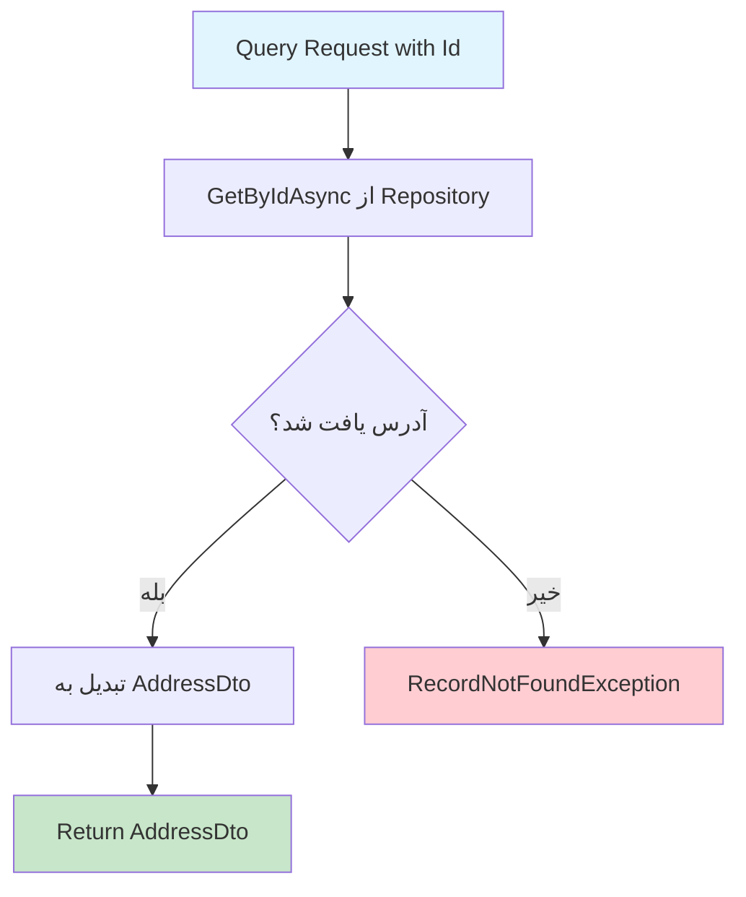

# GetAddressByIdQuery.cs

**مسیر**: `Csis.Admission.Application/Features/Addresses/Queries/GetAddressByIdQuery.cs`

## 1. هدف (Purpose)

این Query برای **دریافت آدرس با شناسه (Id)** استفاده می‌شود. این Query یک آدرس خاص را با استفاده از Id منحصر به فرد آن از دیتابیس بازیابی کرده و به صورت DTO برمی‌گرداند.

### کاربرد اصلی:
- دریافت جزئیات یک آدرس خاص
- نمایش اطلاعات آدرس در صفحات جزئیات
- ویرایش آدرس (دریافت داده‌های فعلی)
- بررسی وجود آدرس با Id مشخص

---

## 2. ورودی (Input)

```csharp
public sealed record GetAddressByIdQuery(int Id) : IRequest<AddressDto>;
```

### پارامترها:

| پارامتر | نوع | توضیحات |
|---------|-----|----------|
| `Id` | `int` | شناسه منحصر به فرد آدرس (الزامی) |

**نکته**: از Primary Constructor (C# 9+) استفاده شده است.

---

## 3. خروجی (Output)

```csharp
Task<AddressDto>
```

### ساختار DTO:
```csharp
public sealed record AddressDto
{
    public int Codm { get; set; }
    public short Province { get; set; }
    public short City { get; set; }
    public short Portion { get; set; }
    public short Town { get; set; }
    public short Rural { get; set; }
    public string Township { get; set; }
    public string Village { get; set; }
    public string District { get; set; }
    public string Avenue { get; set; }
    public string Street { get; set; }
    public string Alley { get; set; }
    public string Lane { get; set; }
    public string Number { get; set; }
    public string Complex { get; set; }
    public string Block { get; set; }
    public string Unit { get; set; }
    public short? Floor { get; set; }
    public long? ZipCode { get; set; }
    public string ConfirmDate { get; set; } // تبدیل شده به string
    public short ProjectCode { get; set; }
    public bool? Flag { get; set; }
}
```

### نمونه خروجی:
```json
{
  "id": 123,
  "codm": 12345,
  "province": 1,
  "city": 2,
  "township": "شهرک غرب",
  "avenue": "خیابان آزادی",
  "street": "خیابان انقلاب",
  "alley": "کوچه اول",
  "zipCode": 1234567890,
  "confirmDate": "1403/12/15",
  "projectCode": 1
}
```

---

## 4. وابستگی‌ها (Dependencies)

```csharp
private readonly IRepository<Address> _repo;
```

**Dependencies:**
1. **IRepository<Address>**: برای خواندن از جدول آدرس‌ها

---

## 5. جریان اجرا (Execution Flow)



### مراحل:
1. **دریافت Id**: از Query Parameter
2. **جستجو در دیتابیس**: فراخوانی `GetByIdAsync<AddressDto>`
3. **بررسی null**: استفاده از Null-coalescing throw (`??`)
4. **Exception در صورت عدم وجود**: `RecordNotFoundException`
5. **برگرداندن DTO**: در صورت موفقیت

---

## 6. قوانین کسب‌وکار (Business Rules)

### BR-1: بررسی وجود آدرس
```csharp
return await _repo.GetByIdAsync<AddressDto>(request.Id, cancellationToken: cancellationToken)
    ?? throw new RecordNotFoundException<Address>(request.Id);
```
- **قانون**: اگر آدرس با Id مشخص شده وجود نداشته باشد، Exception پرتاب می‌شود
- **Exception**: `RecordNotFoundException<Address>` با Id

### BR-2: Projection به DTO
```csharp
GetByIdAsync<AddressDto>(...)
```
- **قانون**: Entity مستقیماً به DTO تبدیل می‌شود (AutoMapper Projection)
- **مزیت**: فقط فیلدهای مورد نیاز از دیتابیس خوانده می‌شوند
- **تبدیل خاص**: `ConfirmDate` از Int به String تبدیل می‌شود

---

## 7. نکات امنیتی (Security Considerations)

### ⚠️ **مشکل 1: فقدان Authorization**
```csharp
// ❌ بررسی نمی‌شود که آیا کاربر مجاز به دیدن این آدرس است
public async Task<AddressDto> Handle(GetAddressByIdQuery request, ...)
```

**ریسک**: هر کاربری می‌تواند با Id هر آدرسی را درخواست کند.

**راه‌حل پیشنهادی**:
```csharp
// بررسی Ownership
var address = await _repo.GetByIdAsync<AddressDto>(request.Id, ...);
if (address == null) {
    throw new RecordNotFoundException<Address>(request.Id);
}

var currentUserCodm = await _authenticatedUser.GetStudentCodmAsync();
if (address.Codm.ToString() != currentUserCodm && !_currentUser.IsInRole("Admin")) {
    throw new UnauthorizedException("شما مجاز به دیدن این آدرس نیستید");
}

return address;
```

### ⚠️ **مشکل 2: Information Disclosure**
```csharp
// ❌ اطلاعات حساس در Exception
throw new RecordNotFoundException<Address>(request.Id);
```

**پیشنهاد**: پیام عمومی‌تر برای کاربران غیرمجاز:
```csharp
throw new RecordNotFoundException("آدرس یافت نشد");
```

---

## 8. عملکرد و بهینه‌سازی (Performance)

### ✅ **مزایا:**
1. **GetByIdAsync**: استفاده از Index (کلید اصلی)
2. **Projection**: فقط فیلدهای DTO خوانده می‌شوند
3. **No Tracking**: داده فقط برای خواندن است

### ⚠️ **نکته عملکردی:**
```csharp
// اگر این Query خیلی فراخوانی می‌شود، می‌توان Cache اضافه کرد
return await _repo.GetByIdAsync<AddressDto>(...);
```

**بهینه‌سازی پیشنهادی**:
```csharp
private readonly IMemoryCache _cache;

public async Task<AddressDto> Handle(GetAddressByIdQuery request, ...)
{
    var cacheKey = $"address_{request.Id}";
    
    return await _cache.GetOrCreateAsync(cacheKey, async entry =>
    {
        entry.AbsoluteExpirationRelativeToNow = TimeSpan.FromMinutes(5);
        
        return await _repo.GetByIdAsync<AddressDto>(request.Id, cancellationToken: cancellationToken)
            ?? throw new RecordNotFoundException<Address>(request.Id);
    });
}
```

---

## 9. خطاها و استثناها (Error Handling)

### خطاهای احتمالی:

#### 1. RecordNotFoundException
```csharp
throw new RecordNotFoundException<Address>(request.Id);
```
- **زمان**: آدرس با Id مشخص شده وجود نداشته باشد
- **HTTP Status**: 404 Not Found
- **پیام**: "آدرس با شناسه {Id} یافت نشد"

#### 2. Database Connection Error
- **زمان**: قطعی ارتباط با دیتابیس
- **HTTP Status**: 500 Internal Server Error

#### 3. Mapping Error
- **زمان**: خطا در AutoMapper configuration
- **HTTP Status**: 500 Internal Server Error

### ⚠️ **فقدان Try-Catch**:
```csharp
// ❌ هیچ error handling صریح وجود ندارد
public async Task<AddressDto> Handle(...)
```

---

## 10. الگوهای طراحی (Design Patterns)

### الگوهای استفاده شده:
1. **CQRS Pattern**: Query جدا از Command
2. **Repository Pattern**: دسترسی به داده از طریق Repository
3. **DTO Pattern**: استفاده از Data Transfer Object
4. **Primary Constructor** (C# 9+): ساختار کوتاه‌تر
5. **Null-coalescing throw** (C# 9+): `?? throw`
6. **Record Type** (C# 9+): Immutable query

---

## 11. تست‌پذیری (Testability)

### نمونه Unit Test:

```csharp
[Fact]
public async Task Handle_WhenAddressExists_ShouldReturnAddressDto()
{
    // Arrange
    var addressId = 123;
    var expectedDto = new AddressDto 
    { 
        Id = addressId,
        Codm = 12345,
        Avenue = "خیابان آزادی"
    };
    
    _repoMock.Setup(x => x.GetByIdAsync<AddressDto>(
            addressId, 
            It.IsAny<CancellationToken>()))
        .ReturnsAsync(expectedDto);
    
    var query = new GetAddressByIdQuery(addressId);
    
    // Act
    var result = await _handler.Handle(query, CancellationToken.None);
    
    // Assert
    Assert.NotNull(result);
    Assert.Equal(addressId, result.Id);
    Assert.Equal("خیابان آزادی", result.Avenue);
}

[Fact]
public async Task Handle_WhenAddressNotExists_ShouldThrowRecordNotFoundException()
{
    // Arrange
    var addressId = 999;
    
    _repoMock.Setup(x => x.GetByIdAsync<AddressDto>(
            addressId, 
            It.IsAny<CancellationToken>()))
        .ReturnsAsync((AddressDto?)null);
    
    var query = new GetAddressByIdQuery(addressId);
    
    // Act & Assert
    await Assert.ThrowsAsync<RecordNotFoundException<Address>>(
        () => _handler.Handle(query, CancellationToken.None));
}

[Fact]
public async Task Handle_ShouldCallRepositoryWithCorrectId()
{
    // Arrange
    var addressId = 456;
    var expectedDto = new AddressDto { Id = addressId };
    
    _repoMock.Setup(x => x.GetByIdAsync<AddressDto>(
            addressId, 
            It.IsAny<CancellationToken>()))
        .ReturnsAsync(expectedDto);
    
    var query = new GetAddressByIdQuery(addressId);
    
    // Act
    await _handler.Handle(query, CancellationToken.None);
    
    // Assert
    _repoMock.Verify(x => x.GetByIdAsync<AddressDto>(
        addressId, 
        It.IsAny<CancellationToken>()), Times.Once);
}
```

---

## 12. ملاحظات Logging و Monitoring

### ⚠️ **فقدان Logging**:
```csharp
// ❌ هیچ logging وجود ندارد
public async Task<AddressDto> Handle(...)
```

### پیشنهاد:
```csharp
private readonly ILogger<GetAddressByIdQueryHandler> _logger;

public async Task<AddressDto> Handle(GetAddressByIdQuery request, ...)
{
    _logger.LogInformation("Fetching address with Id {AddressId}", request.Id);
    
    var result = await _repo.GetByIdAsync<AddressDto>(request.Id, cancellationToken: cancellationToken);
    
    if (result == null) {
        _logger.LogWarning("Address with Id {AddressId} not found", request.Id);
        throw new RecordNotFoundException<Address>(request.Id);
    }
    
    _logger.LogInformation("Successfully retrieved address {AddressId} for student {Codm}", 
        result.Id, result.Codm);
    
    return result;
}
```

---

## 13. مثال استفاده (Usage Example)

### از Controller:
```csharp
[HttpGet("{id}")]
[Authorize]
public async Task<ActionResult<AddressDto>> GetAddress(int id)
{
    var query = new GetAddressByIdQuery(id);
    var address = await _mediator.Send(query);
    return Ok(address);
}
```

### از Frontend:
```javascript
async function getAddressById(addressId) {
    try {
        const response = await fetch(`/api/addresses/${addressId}`, {
            method: 'GET',
            headers: {
                'Authorization': `Bearer ${token}`,
                'Content-Type': 'application/json'
            }
        });
        
        if (response.ok) {
            const address = await response.json();
            displayAddress(address);
        } else if (response.status === 404) {
            alert('آدرس یافت نشد');
        }
    } catch (error) {
        alert('خطا در دریافت آدرس');
    }
}

function displayAddress(address) {
    document.getElementById('avenue').textContent = address.avenue;
    document.getElementById('street').textContent = address.street;
    document.getElementById('zipCode').textContent = address.zipCode;
    // ...
}
```

---

## 14. Command/Query های مرتبط

### Queries مرتبط:
- `GetAddressesByCodmQuery`: دریافت آدرس با Codm دانشجو
- `GetStudentAddressesQuery`: دریافت تمام آدرس‌های دانشجو (احتمالاً)

### Commands مرتبط:
- `CreateOrUpdateStudentAddressCommand`: ایجاد/ویرایش آدرس
- `CreateOrUpdateStudentAddressEmployeeCommand`: ایجاد/ویرایش آدرس توسط کارمند
- `DeleteAddressCommand`: حذف آدرس (احتمالاً)

---

## 15. تاریخچه تغییرات (Change History)

| تاریخ | تغییرات | توسعه‌دهنده |
|-------|---------|-------------|
| - | ایجاد اولیه Query | - |

---

## 16. تغییرات پیشنهادی (Proposed Changes)

### Priority 1: افزودن Authorization
```diff
internal sealed class GetAddressByIdQueryHandler : IRequestHandler<GetAddressByIdQuery, AddressDto>
{
    private readonly IRepository<Address> _repo;
+   private readonly ICsisAuthenticatedUserService _authenticatedUser;
+   private readonly ICurrentUserService _currentUser;
    
-   public GetAddressByIdQueryHandler(IRepository<Address> repo) {
+   public GetAddressByIdQueryHandler(IRepository<Address> repo, 
+       ICsisAuthenticatedUserService authenticatedUser,
+       ICurrentUserService currentUser) {
        _repo = repo;
+       _authenticatedUser = authenticatedUser;
+       _currentUser = currentUser;
    }

    public async Task<AddressDto> Handle(GetAddressByIdQuery request, CancellationToken cancellationToken) {
        var address = await _repo.GetByIdAsync<AddressDto>(request.Id, cancellationToken: cancellationToken)
            ?? throw new RecordNotFoundException<Address>(request.Id);
        
+       // بررسی دسترسی
+       var currentUserCodm = await _authenticatedUser.GetStudentCodmAsync();
+       if (address.Codm.ToString() != currentUserCodm && !_currentUser.IsInRole("Admin")) {
+           throw new UnauthorizedException("شما مجاز به دیدن این آدرس نیستید");
+       }
        
        return address;
    }
}
```

### Priority 2: افزودن Caching
```diff
internal sealed class GetAddressByIdQueryHandler : IRequestHandler<GetAddressByIdQuery, AddressDto>
{
    private readonly IRepository<Address> _repo;
+   private readonly IMemoryCache _cache;
    
-   public GetAddressByIdQueryHandler(IRepository<Address> repo) {
+   public GetAddressByIdQueryHandler(IRepository<Address> repo, IMemoryCache cache) {
        _repo = repo;
+       _cache = cache;
    }

    public async Task<AddressDto> Handle(GetAddressByIdQuery request, CancellationToken cancellationToken) {
+       var cacheKey = $"address_{request.Id}";
+       
+       return await _cache.GetOrCreateAsync(cacheKey, async entry =>
+       {
+           entry.AbsoluteExpirationRelativeToNow = TimeSpan.FromMinutes(5);
+           
            return await _repo.GetByIdAsync<AddressDto>(request.Id, cancellationToken: cancellationToken)
                ?? throw new RecordNotFoundException<Address>(request.Id);
+       }) ?? throw new RecordNotFoundException<Address>(request.Id);
-       return await _repo.GetByIdAsync<AddressDto>(request.Id, cancellationToken: cancellationToken)
-           ?? throw new RecordNotFoundException<Address>(request.Id);
    }
}
```

### Priority 3: افزودن Logging
```diff
internal sealed class GetAddressByIdQueryHandler : IRequestHandler<GetAddressByIdQuery, AddressDto>
{
    private readonly IRepository<Address> _repo;
+   private readonly ILogger<GetAddressByIdQueryHandler> _logger;
    
-   public GetAddressByIdQueryHandler(IRepository<Address> repo) {
+   public GetAddressByIdQueryHandler(IRepository<Address> repo, 
+       ILogger<GetAddressByIdQueryHandler> logger) {
        _repo = repo;
+       _logger = logger;
    }

    public async Task<AddressDto> Handle(GetAddressByIdQuery request, CancellationToken cancellationToken) {
+       _logger.LogInformation("Fetching address with Id {AddressId}", request.Id);
+       
        var result = await _repo.GetByIdAsync<AddressDto>(request.Id, cancellationToken: cancellationToken);
        
+       if (result == null) {
+           _logger.LogWarning("Address with Id {AddressId} not found", request.Id);
+       }
+       
-       return result ?? throw new RecordNotFoundException<Address>(request.Id);
+       return result ?? throw new RecordNotFoundException<Address>(request.Id);
    }
}
```

---

## نتیجه‌گیری

این Query بسیار **ساده و مستقیم** است اما نیاز به **Authorization** و **Logging** دارد.

### نقاط قوت:
✅ کد تمیز و خوانا  
✅ استفاده از Null-coalescing throw  
✅ Projection به DTO  
✅ استفاده از Primary Constructor  

### نقاط ضعف:
⚠️ فقدان Authorization  
⚠️ فقدان Logging  
⚠️ فقدان Caching  
⚠️ ریسک Information Disclosure
