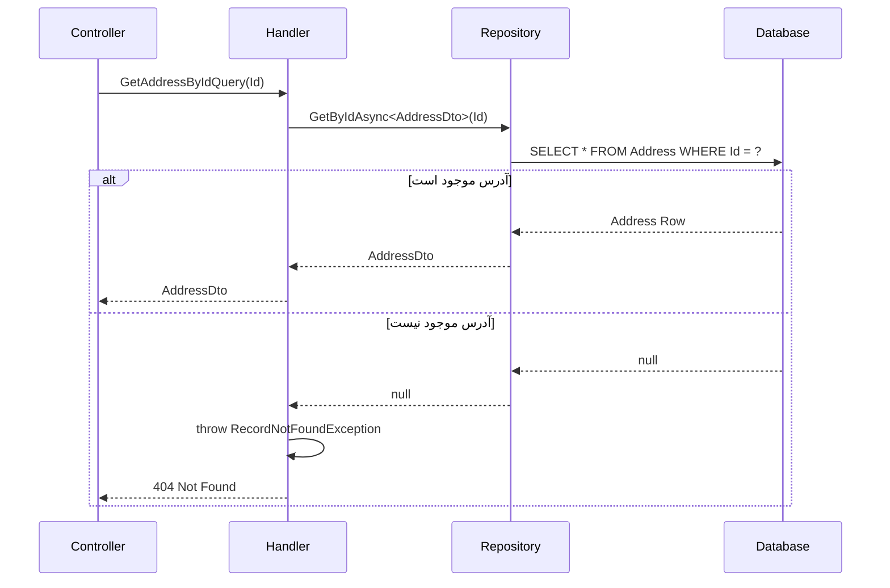

<div dir="rtl">

# GetAddressByIdQuery

## 📄 اطلاعات کلی

**مسیر فایل:**
```
Csis.Admission.Application/Features/Addresses/Queries/GetAddressByIdQuery.cs
```

**Feature:** Addresses  
**نوع:** Query  
**هدف:** دریافت اطلاعات آدرس با استفاده از شناسه یکتا (AddressId)

---

## 🎯 هدف (Purpose)

این Query برای **دریافت یک آدرس خاص** با استفاده از شناسه یکتای آن (`Id`) استفاده می‌شود.

### کاربردهای اصلی:
- نمایش جزئیات آدرس در صفحات ویرایش
- دریافت اطلاعات آدرس برای مقایسه یا بررسی
- استفاده در API های عمومی که AddressId را دارند

---

## 📝 ساختار Query

### ورودی (Request)

```csharp
public sealed record GetAddressByIdQuery(int Id) : IRequest<AddressDto>
```

**پارامتر:**
- `Id`: شناسه یکتای آدرس (Primary Key)

**نکته:** استفاده از `record` با Primary Constructor برای سادگی

### خروجی (Response)

```csharp
AddressDto  // یا RecordNotFoundException
```

**ساختار DTO:**
```csharp
public class AddressDto
{
    int Id                  // شناسه آدرس
    int Codm                // کد مرکز دانشجو
    short? ProvinceId       // استان
    short? CityId           // شهرستان
    short? TownId           // شهر
    string Avenue           // خیابان اصلی
    string Street           // خیابان فرعی
    // ... سایر فیلدها
}
```

---

## 🔄 جریان اجرا (Execution Flow)

### مراحل:

```
1. دریافت Query با Id
   └─> GetAddressByIdQuery(Id)

2. جستجوی آدرس با Id
   └─> repo.GetByIdAsync<AddressDto>(Id)

3. بررسی نتیجه
   ├─> اگر یافت شد: برگرداندن AddressDto
   └─> اگر یافت نشد: RecordNotFoundException
```

### نمودار توالی (Sequence Diagram)



---

## 🔧 وابستگی‌ها (Dependencies)

### تزریق شده:
```csharp
IRepository<Address> _repo
```

**توضیح:**
- دسترسی به جدول آدرس‌ها
- استفاده از متد generic `GetByIdAsync<TDto>`

---

## 📋 قوانین کسب‌وکار (Business Rules)

### BR-1: Not Found Handling
- **قانون**: اگر آدرس با Id مشخص یافت نشد، Exception پرتاب می‌شود
- **پیاده‌سازی**: `RecordNotFoundException<Address>(Id)`
- **HTTP Status**: 404 Not Found
- **هدف**: وضوح در مورد عدم وجود رکورد

### BR-2: Direct Id Lookup
- **قانون**: جستجو فقط بر اساس Primary Key انجام می‌شود
- **مزیت**: عملکرد بالا (Index Seek)
- **محدودیت**: نیاز به دانستن AddressId

---

## ⚠️ نکات امنیتی (Security Considerations)

### 1. No Authorization Check ⚠️
```csharp
// ❌ هیچ بررسی Authorization وجود ندارد
public async Task<AddressDto> Handle(...)
```
- **خطر**: هر کاربری می‌تواند آدرس هر دانشجویی را ببیند
- **پیشنهاد**: بررسی دسترسی کاربر به این آدرس
- **راه حل**:
  ```csharp
  // بررسی کنید کاربر مجاز به دیدن این آدرس است
  var address = await _repo.GetByIdAsync(...);
  if (address.Codm != currentUser.Codm && !currentUser.IsAdmin)
      throw new ForbiddenException();
  ```

### 2. Information Disclosure
- **خطر**: افشای اطلاعات محرمانه آدرس
- **توصیه**: محدود کردن فیلدهای DTO بر اساس نقش کاربر

---

## 🧪 تست‌های پیشنهادی (Suggested Tests)

### Unit Tests:
```csharp
// 1. موجود بودن آدرس
[Fact]
async Task Should_Return_Address_When_Exists()
{
    // Arrange
    var addressId = 123;
    var expectedDto = new AddressDto { Id = addressId, ... };
    
    // Act
    var result = await handler.Handle(new GetAddressByIdQuery(addressId));
    
    // Assert
    result.Should().BeEquivalentTo(expectedDto);
}

// 2. آدرس موجود نیست
[Fact]
async Task Should_Throw_NotFoundException_When_Not_Exists()
{
    // Arrange
    var nonExistentId = 999;
    
    // Act & Assert
    await Assert.ThrowsAsync<RecordNotFoundException<Address>>(
        () => handler.Handle(new GetAddressByIdQuery(nonExistentId))
    );
}

// 3. بررسی Mapping
[Fact]
async Task Should_Map_To_AddressDto_Correctly()
```

---

## 🔗 ارتباطات (Related Components)

### Queries مرتبط:
- `GetAddressesByCodmQuery` - دریافت آدرس با Codm دانشجو
- سایر Queries که ممکن است AddressId را برگردانند

### Commands مرتبط:
- `CreateOrUpdateStudentAddressEmployeeCommand` - ایجاد/ویرایش آدرس
- سایر Commands که AddressId برمی‌گردانند

### DTOs:
- `AddressDto` - DTO خروجی

---

## 📊 خلاصه نکات کلیدی

| نکته | توضیح |
|------|-------|
| **نقش** | دریافت آدرس با Id |
| **ورودی** | AddressId (int) |
| **خروجی** | AddressDto |
| **Performance** | ✅ بالا (Primary Key) |
| **Authorization** | ❌ فاقد بررسی |
| **Error Handling** | ✅ RecordNotFoundException |
| **Complexity** | ✅ بسیار ساده |
| **Security Risk** | ⚠️ متوسط (Information Disclosure) |

---

## 💡 نکات پیاده‌سازی

### استفاده از Null-Coalescing:
```csharp
return await _repo.GetByIdAsync<AddressDto>(request.Id, cancellationToken: cancellationToken)
    ?? throw new RecordNotFoundException<Address>(request.Id);
```
- **الگو**: Null-Coalescing Operator (`??`)
- **مزیت**: کد خوانا و فشرده
- **نتیجه**: اگر `null` باشد، Exception پرتاب می‌شود

### Generic Repository Pattern:
```csharp
GetByIdAsync<AddressDto>(...)
```
- **الگو**: Generic Method
- **مزیت**: Projection به DTO در سطح Database (کارآمد)
- **ORM**: احتمالاً Entity Framework با AutoMapper

---

## 📈 پیشنهادات بهبود

### 1. اضافه کردن Authorization
```csharp
public async Task<AddressDto> Handle(GetAddressByIdQuery request, ...)
{
    var address = await _repo.GetByIdAsync<AddressDto>(request.Id, ...)
        ?? throw new RecordNotFoundException<Address>(request.Id);
    
    // بررسی دسترسی
    if (address.Codm != _currentUser.Codm && !_currentUser.IsAdmin)
    {
        throw new ForbiddenAccessException();
    }
    
    return address;
}
```

### 2. Caching Strategy
```csharp
// استفاده از Cache برای آدرس‌های پرتکرار
var cacheKey = $"Address:{request.Id}";
var cachedAddress = await _cache.GetAsync<AddressDto>(cacheKey);

if (cachedAddress != null)
    return cachedAddress;

var address = await _repo.GetByIdAsync<AddressDto>(request.Id, ...);
await _cache.SetAsync(cacheKey, address, TimeSpan.FromMinutes(10));

return address;
```

### 3. Logging
```csharp
_logger.LogInformation(
    "Fetching address with Id: {AddressId} by User: {UserId}", 
    request.Id, 
    _currentUser.Id
);
```

---

**یادداشت نهایی**: این Query بسیار ساده و مستقیم است، اما نیاز به بررسی Authorization دارد تا از افشای اطلاعات محرمانه جلوگیری شود.

</div>
