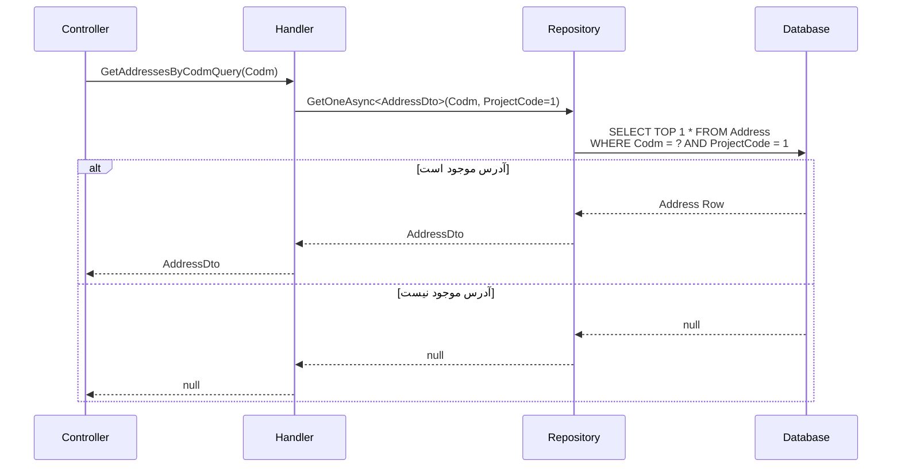

<div dir="rtl">

# GetAddressesByCodmQuery

## 📄 اطلاعات کلی

**مسیر فایل:**
```
Csis.Admission.Application/Features/Addresses/Queries/GetAddressesByCodmQuery.cs
```

**Feature:** Addresses  
**نوع:** Query  
**هدف:** دریافت آدرس دانشجو با استفاده از کد مرکز (Codm)

---

## 🎯 هدف (Purpose)

این Query برای **دریافت آدرس اصلی دانشجو** با استفاده از کد مرکز (`Codm`) استفاده می‌شود.

### کاربردهای اصلی:
- نمایش آدرس فعلی دانشجو در پروفایل
- دریافت اطلاعات آدرس برای ویرایش
- استفاده در فرم‌های مختلف که نیاز به آدرس دانشجو دارند

---

## 📝 ساختار Query

### ورودی (Request)

```csharp
public sealed record GetAddressesByCodmQuery(int Codm) : IRequest<AddressDto>
```

**پارامتر:**
- `Codm`: کد مرکز خدمات دانشجو

**نکته:** نام Query جمع است (`Addresses`) اما خروجی تکی است (`AddressDto`)

### خروجی (Response)

```csharp
AddressDto  // یا null اگر آدرسی وجود نداشته باشد
```

**ساختار DTO:**
```csharp
public class AddressDto
{
    int Id                  // شناسه آدرس
    int Codm                // کد مرکز دانشجو
    short ProjectCode       // کد پروژه (همیشه 1)
    short? ProvinceId       // استان
    short? CityId           // شهرستان
    short? PortionId        // بخش
    short? TownId           // شهر
    short? RuralId          // دهستان
    string Township         // شهرک
    string Village          // روستا
    string District         // محله
    string Avenue           // خیابان اصلی
    string Street           // خیابان فرعی
    string Alley            // کوچه اصلی
    string Lane             // کوچه فرعی
    string Number           // پلاک
    string Complex          // مجتمع
    string Block            // بلوک
    string Unit             // واحد
    short? Floor            // طبقه
    long? ZipCode           // کد پستی
    // ... سایر فیلدها
}
```

---

## 🔄 جریان اجرا (Execution Flow)

### مراحل:

```
1. دریافت Query با Codm
   └─> GetAddressesByCodmQuery(Codm)

2. جستجوی آدرس با شرایط:
   ├─> Codm == request.Codm
   └─> ProjectCode == 1 (Self Project)

3. برگرداندن نتیجه
   ├─> اگر یافت شد: AddressDto
   └─> اگر یافت نشد: null
```

### نمودار توالی (Sequence Diagram)



---

## 🔧 وابستگی‌ها (Dependencies)

### تزریق شده:
```csharp
IRepository<Address> repo
```

**توضیح:**
- دسترسی به جدول آدرس‌ها
- استفاده از متد `GetOneAsync<TDto>` با predicate

---

## 📋 قوانین کسب‌وکار (Business Rules)

### BR-1: Self Project Code Filter
- **قانون**: فقط آدرس‌های با `ProjectCode = 1` برگردانده می‌شوند
- **توضیح**: `ProjectCode = 1` به معنی "خود دانشجو" است (Self)
- **هدف**: فیلتر کردن آدرس‌های مربوط به پروژه‌های دیگر

```csharp
var selfProjectCode = 1;
var result = await repo.GetOneAsync<AddressDto>(
    x => x.Codm == request.Codm && x.ProjectCode == (short)selfProjectCode,
    cancellationToken: cancellationToken
);
```

### BR-2: One Address Per Student (Assumption)
- **قانون**: هر دانشجو فقط **یک** آدرس اصلی دارد
- **پیاده‌سازی**: استفاده از `GetOneAsync` به جای `GetManyAsync`
- **نتیجه**: اگر چند آدرس وجود داشته باشد، اولین آدرس برگردانده می‌شود

### BR-3: Nullable Result
- **قانون**: اگر آدرسی یافت نشد، `null` برگردانده می‌شود
- **تفاوت**: برخلاف `GetAddressByIdQuery` که Exception پرتاب می‌کند
- **دلیل**: طبیعی است که یک دانشجو جدید هنوز آدرس ثبت نکرده باشد

---

## 📊 مقایسه با Query مشابه

| ویژگی | GetAddressesByCodmQuery | GetAddressByIdQuery |
|-------|----------------------|-------------------|
| **جستجو بر اساس** | Codm (Student) | Id (Address) |
| **فیلتر اضافی** | ProjectCode = 1 | ندارد |
| **Not Found** | `null` | `RecordNotFoundException` |
| **Performance** | Index on Codm | Primary Key (بهتر) |
| **Use Case** | دریافت آدرس دانشجو | دریافت آدرس خاص |

---

## ⚠️ نکات امنیتی (Security Considerations)

### 1. No Authorization Check ⚠️
```csharp
// ❌ هیچ بررسی Authorization وجود ندارد
public async Task<AddressDto> Handle(...)
```
- **خطر**: هر کاربری می‌تواند آدرس هر دانشجویی را ببیند
- **پیشنهاد**: بررسی دسترسی کاربر
- **راه حل**:
  ```csharp
  if (request.Codm != _currentUser.Codm && !_currentUser.IsAdmin)
  {
      throw new ForbiddenAccessException();
  }
  ```

### 2. Information Disclosure
- **خطر**: افشای اطلاعات محرمانه آدرس (کد پستی، آدرس دقیق)
- **سطح خطر**: متوسط
- **توصیه**: محدود کردن دسترسی یا Masking اطلاعات حساس

---

## 🐛 مشکلات و بدهی فنی (Technical Debt)

### Issue #1: نامگذاری نادرست Query
```csharp
// نام جمع است اما خروجی تکی
public sealed record GetAddressesByCodmQuery(int Codm) : IRequest<AddressDto>
```
- **مشکل**: نام `GetAddresses` (جمع) اما نوع `AddressDto` (تکی)
- **انتظار**: `GetAddressByCodmQuery` (مفرد)
- **تأثیر**: گیج کننده برای توسعه‌دهندگان

### Issue #2: Hard-Coded ProjectCode
```csharp
var selfProjectCode = 1;
```
- **مشکل**: Magic Number
- **بهبود**: استفاده از Enum یا Constant
  ```csharp
  const short SELF_PROJECT_CODE = 1;
  // یا
  ProjectCode.Self
  ```

### Issue #3: فقدان مستندسازی
```csharp
/// <inheritdoc/>
public sealed record GetAddressesByCodmQuery...
```
- **مشکل**: استفاده از `<inheritdoc/>` بدون توضیح واضح
- **بهبود**: افزودن XML Comment مناسب

---

## 🧪 تست‌های پیشنهادی (Suggested Tests)

### Unit Tests:
```csharp
// 1. دانشجو با آدرس
[Fact]
async Task Should_Return_Address_When_Student_Has_Address()
{
    // Arrange
    var codm = 12345;
    var expectedAddress = new AddressDto { Codm = codm, ... };
    
    // Act
    var result = await handler.Handle(new GetAddressesByCodmQuery(codm));
    
    // Assert
    result.Should().BeEquivalentTo(expectedAddress);
}

// 2. دانشجو بدون آدرس
[Fact]
async Task Should_Return_Null_When_Student_Has_No_Address()
{
    // Arrange
    var codm = 99999;
    
    // Act
    var result = await handler.Handle(new GetAddressesByCodmQuery(codm));
    
    // Assert
    result.Should().BeNull();
}

// 3. فیلتر ProjectCode
[Fact]
async Task Should_Filter_By_ProjectCode_1()
{
    // تست که فقط آدرس‌های با ProjectCode = 1 برگردانده می‌شوند
}

// 4. بررسی Mapping
[Fact]
async Task Should_Map_To_AddressDto_Correctly()
```

### Integration Tests:
```csharp
// 1. Full Query Test
[Fact]
async Task Should_Get_Address_From_Database()
```

---

## 🔗 ارتباطات (Related Components)

### Queries مرتبط:
- `GetAddressByIdQuery` - دریافت آدرس با Id

### Commands مرتبط:
- `CreateOrUpdateStudentAddressEmployeeCommand` - ایجاد/ویرایش آدرس
- `CreateOrUpdateStudentAddressRequestCommand` - درخواست تغییر آدرس

### DTOs:
- `AddressDto` - DTO خروجی

---

## 📊 خلاصه نکات کلیدی

| نکته | توضیح |
|------|-------|
| **نقش** | دریافت آدرس دانشجو با Codm |
| **ورودی** | Codm (int) |
| **خروجی** | AddressDto یا null |
| **فیلتر** | ProjectCode = 1 |
| **Performance** | ✅ خوب (Index on Codm) |
| **Authorization** | ❌ فاقد بررسی |
| **Error Handling** | ✅ null-safe |
| **Naming** | ⚠️ نادرست (جمع/مفرد) |
| **Magic Number** | ⚠️ Hard-coded ProjectCode |

---

## 💡 نکات پیاده‌سازی

### ProjectCode Filter:
```csharp
var selfProjectCode = 1;  // Self Project
var result = await repo.GetOneAsync<AddressDto>(
    x => x.Codm == request.Codm && 
         x.ProjectCode == (short)selfProjectCode,
    cancellationToken: cancellationToken
);
```

**معنی ProjectCode:**
- `1` = Self (خود دانشجو)
- احتمالاً مقادیر دیگر برای پروژه‌های مختلف وجود دارد

### Null Handling:
```csharp
return result;  // می‌تواند null باشد
```
- Controller باید null check کند
- یا از Nullable Reference Types استفاده کند

---

## 📈 پیشنهادات بهبود

### 1. اصلاح نامگذاری
```csharp
// ❌ نادرست
GetAddressesByCodmQuery  // جمع

// ✅ صحیح
GetAddressByCodmQuery  // مفرد
```

### 2. استفاده از Enum برای ProjectCode
```csharp
public enum ProjectCode : short
{
    Self = 1,
    // Other = 2,
    // ...
}

// در Query:
x => x.Codm == request.Codm && 
     x.ProjectCode == (short)ProjectCode.Self
```

### 3. اضافه کردن Authorization
```csharp
// بررسی دسترسی
if (request.Codm != _currentUser.Codm && !_currentUser.IsAdmin)
{
    throw new ForbiddenAccessException();
}
```

### 4. افزودن XML Documentation
```csharp
/// <summary>
/// دریافت آدرس اصلی دانشجو با استفاده از کد مرکز
/// </summary>
/// <param name="Codm">کد مرکز خدمات دانشجو</param>
/// <returns>اطلاعات آدرس یا null اگر آدرسی ثبت نشده باشد</returns>
public sealed record GetAddressByCodmQuery(int Codm) : IRequest<AddressDto>
```

### 5. Caching
```csharp
// Cache آدرس‌های پرتکرار
var cacheKey = $"Address:Codm:{request.Codm}";
var cachedAddress = await _cache.GetAsync<AddressDto>(cacheKey);

if (cachedAddress != null)
    return cachedAddress;

var address = await repo.GetOneAsync<AddressDto>(...);

if (address != null)
{
    await _cache.SetAsync(cacheKey, address, TimeSpan.FromMinutes(5));
}

return address;
```

---

**یادداشت نهایی**: این Query ساده اما پرکاربرد است. نامگذاری نادرست و فقدان Authorization چالش‌های اصلی آن هستند که نیاز به بهبود دارند.

</div>
