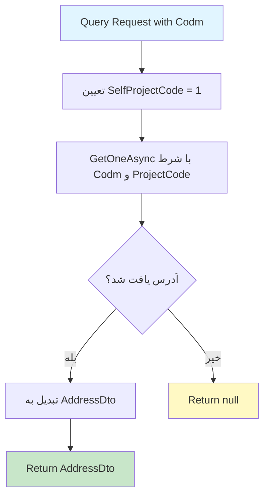

# GetAddressesByCodmQuery.cs

**مسیر**: `Csis.Admission.Application/Features/Addresses/Queries/GetAddressesByCodmQuery.cs`

## 1. هدف (Purpose)

این Query برای **دریافت آدرس دانشجو با استفاده از کد مرکز خدمات (Codm)** استفاده می‌شود. این Query آدرس دانشجو را بر اساس Codm و ProjectCode (همیشه 1) از دیتابیس بازیابی می‌کند.

### کاربرد اصلی:
- دریافت آدرس فعلی دانشجو
- نمایش آدرس در پروفایل دانشجو
- دریافت آدرس برای ویرایش
- بررسی وجود آدرس برای دانشجو

---

## 2. ورودی (Input)

```csharp
public sealed record GetAddressesByCodmQuery(int Codm) : IRequest<AddressDto>;
```

### پارامترها:

| پارامتر | نوع | توضیحات |
|---------|-----|----------|
| `Codm` | `int` | کد مرکز خدمات دانشجو (الزامی) |

**نکته**: از Primary Constructor (C# 9+) استفاده شده است.

---

## 3. خروجی (Output)

```csharp
Task<AddressDto>
```

**نکته مهم**: خروجی می‌تواند `null` باشد (اگر آدرسی یافت نشود).

### ساختار DTO:
```csharp
public sealed record AddressDto
{
    public int Codm { get; set; }
    public short Province { get; set; }
    public short City { get; set; }
    public short Portion { get; set; }
    public short Town { get; set; }
    public short Rural { get; set; }
    public string Township { get; set; }
    public string Village { get; set; }
    public string District { get; set; }
    public string Avenue { get; set; }
    public string Street { get; set; }
    public string Alley { get; set; }
    public string Lane { get; set; }
    public string Number { get; set; }
    public string Complex { get; set; }
    public string Block { get; set; }
    public string Unit { get; set; }
    public short? Floor { get; set; }
    public long? ZipCode { get; set; }
    public string ConfirmDate { get; set; }
    public short ProjectCode { get; set; }
    public bool? Flag { get; set; }
}
```

### نمونه خروجی:
```json
{
  "codm": 12345,
  "province": 8,
  "city": 1,
  "township": "شهرک غرب",
  "avenue": "خیابان آزادی",
  "street": "خیابان انقلاب",
  "alley": "کوچه اول",
  "zipCode": 1234567890,
  "confirmDate": "1403/12/15",
  "projectCode": 1
}
```

---

## 4. وابستگی‌ها (Dependencies)

```csharp
private readonly IRepository<Address> repo;
```

**Dependencies:**
1. **IRepository<Address>**: برای خواندن از جدول آدرس‌ها

---

## 5. جریان اجرا (Execution Flow)



### مراحل:
1. **تعیین ProjectCode**: مقدار ثابت 1 (Self Project)
2. **جستجو در دیتابیس**: فراخوانی `GetOneAsync` با شرط `Codm == request.Codm && ProjectCode == 1`
3. **برگرداندن نتیجه**: DTO یا null

---

## 6. قوانین کسب‌وکار (Business Rules)

### BR-1: فیلتر ProjectCode
```csharp
var selfProjectCode = 1;
var result = await repo.GetOneAsync<AddressDto>(
    x => x.Codm == request.Codm && x.ProjectCode == (short)selfProjectCode, 
    cancellationToken: cancellationToken);
```
- **قانون**: فقط آدرس‌هایی که ProjectCode = 1 دارند برگردانده می‌شوند
- **دلیل**: احتمالاً ProjectCode = 1 به معنای "خود دانشجو" است
- **نکته**: آدرس‌های سایر پروژه‌ها (اگر وجود داشته باشد) نادیده گرفته می‌شوند

### BR-2: Return null در صورت عدم وجود
```csharp
return result; // می‌تواند null باشد
```
- **قانون**: اگر آدرسی یافت نشود، null برگردانده می‌شود (نه Exception)
- **تفاوت با GetAddressByIdQuery**: آن Query در صورت عدم وجود Exception پرتاب می‌کند

### BR-3: یک آدرس برای هر Codm
```csharp
GetOneAsync(...) // نه GetAllAsync
```
- **قانون**: فرض بر این است که هر دانشجو فقط یک آدرس دارد (با ProjectCode = 1)
- **نکته**: اگر چند آدرس وجود داشته باشد، فقط اولین مورد برگردانده می‌شود

---

## 7. نکات امنیتی (Security Considerations)

### ⚠️ **مشکل 1: فقدان Authorization**
```csharp
// ❌ بررسی نمی‌شود که آیا کاربر مجاز به دیدن این آدرس است
public async Task<AddressDto> Handle(GetAddressesByCodmQuery request, ...)
```

**ریسک**: هر کاربری می‌تواند با Codm هر دانشجویی آدرس او را درخواست کند.

**راه‌حل پیشنهادی**:
```csharp
// بررسی Ownership
var currentUserCodm = await _authenticatedUser.GetStudentCodmAsync();
if (request.Codm.ToString() != currentUserCodm && !_currentUser.IsInRole("Admin")) {
    throw new UnauthorizedException("شما مجاز به دیدن این آدرس نیستید");
}

var result = await repo.GetOneAsync<AddressDto>(...);
return result;
```

### ✅ **نکته خوب: عدم افشای اطلاعات در Exception**
- این Query در صورت عدم وجود آدرس، Exception پرتاب نمی‌کند
- فقط null برمی‌گرداند که امن‌تر است

---

## 8. عملکرد و بهینه‌سازی (Performance)

### ✅ **مزایا:**
1. **GetOneAsync**: فقط یک رکورد خوانده می‌شود
2. **Projection**: فقط فیلدهای DTO خوانده می‌شوند
3. **No Tracking**: داده فقط برای خواندن است
4. **شرط مرکب**: استفاده از Index روی Codm

### ⚠️ **نکته عملکردی:**
```csharp
// اگر این Query خیلی فراخوانی می‌شود، می‌توان Cache اضافه کرد
var result = await repo.GetOneAsync<AddressDto>(...);
```

**بهینه‌سازی پیشنهادی**:
```csharp
private readonly IMemoryCache _cache;

public async Task<AddressDto> Handle(GetAddressesByCodmQuery request, ...)
{
    var cacheKey = $"address_codm_{request.Codm}";
    
    return await _cache.GetOrCreateAsync(cacheKey, async entry =>
    {
        entry.AbsoluteExpirationRelativeToNow = TimeSpan.FromMinutes(10);
        
        var selfProjectCode = 1;
        return await repo.GetOneAsync<AddressDto>(
            x => x.Codm == request.Codm && x.ProjectCode == (short)selfProjectCode, 
            cancellationToken: cancellationToken);
    });
}
```

---

## 9. خطاها و استثناها (Error Handling)

### خطاهای احتمالی:

#### 1. Database Connection Error
- **زمان**: قطعی ارتباط با دیتابیس
- **HTTP Status**: 500 Internal Server Error

#### 2. Mapping Error
- **زمان**: خطا در AutoMapper configuration
- **HTTP Status**: 500 Internal Server Error

### ✅ **نکته خوب: عدم Exception برای عدم وجود**
```csharp
// ✅ null برمی‌گرداند نه Exception
return result; // می‌تواند null باشد
```
- این رفتار برای بسیاری از سناریوها مناسب است
- Controller یا Client می‌تواند null را handle کند

---

## 10. الگوهای طراحی (Design Patterns)

### الگوهای استفاده شده:
1. **CQRS Pattern**: Query جدا از Command
2. **Repository Pattern**: دسترسی به داده از طریق Repository
3. **DTO Pattern**: استفاده از Data Transfer Object
4. **Primary Constructor** (C# 12): ساختار کوتاه‌تر
5. **Record Type** (C# 9+): Immutable query

---

## 11. تست‌پذیری (Testability)

### نمونه Unit Test:

```csharp
[Fact]
public async Task Handle_WhenAddressExists_ShouldReturnAddressDto()
{
    // Arrange
    var codm = 12345;
    var expectedDto = new AddressDto 
    { 
        Codm = codm,
        Avenue = "خیابان آزادی",
        ProjectCode = 1
    };
    
    _repoMock.Setup(x => x.GetOneAsync<AddressDto>(
            It.IsAny<Expression<Func<Address, bool>>>(),
            It.IsAny<CancellationToken>()))
        .ReturnsAsync(expectedDto);
    
    var query = new GetAddressesByCodmQuery(codm);
    
    // Act
    var result = await _handler.Handle(query, CancellationToken.None);
    
    // Assert
    Assert.NotNull(result);
    Assert.Equal(codm, result.Codm);
    Assert.Equal("خیابان آزادی", result.Avenue);
}

[Fact]
public async Task Handle_WhenAddressNotExists_ShouldReturnNull()
{
    // Arrange
    var codm = 99999;
    
    _repoMock.Setup(x => x.GetOneAsync<AddressDto>(
            It.IsAny<Expression<Func<Address, bool>>>(),
            It.IsAny<CancellationToken>()))
        .ReturnsAsync((AddressDto?)null);
    
    var query = new GetAddressesByCodmQuery(codm);
    
    // Act
    var result = await _handler.Handle(query, CancellationToken.None);
    
    // Assert
    Assert.Null(result);
}

[Fact]
public async Task Handle_ShouldFilterByProjectCode()
{
    // Arrange
    var codm = 12345;
    
    _repoMock.Setup(x => x.GetOneAsync<AddressDto>(
            It.Is<Expression<Func<Address, bool>>>(expr => 
                // بررسی شرط ProjectCode
                expr.ToString().Contains("ProjectCode")),
            It.IsAny<CancellationToken>()))
        .ReturnsAsync(new AddressDto());
    
    var query = new GetAddressesByCodmQuery(codm);
    
    // Act
    await _handler.Handle(query, CancellationToken.None);
    
    // Assert
    _repoMock.Verify(x => x.GetOneAsync<AddressDto>(
        It.IsAny<Expression<Func<Address, bool>>>(),
        It.IsAny<CancellationToken>()), Times.Once);
}
```

---

## 12. ملاحظات Logging و Monitoring

### ⚠️ **فقدان Logging**:
```csharp
// ❌ هیچ logging وجود ندارد
public async Task<AddressDto> Handle(...)
```

### پیشنهاد:
```csharp
private readonly ILogger<GetAddressesByCodmQueryHandler> _logger;

public async Task<AddressDto> Handle(GetAddressesByCodmQuery request, ...)
{
    _logger.LogInformation("Fetching address for student {Codm}", request.Codm);
    
    var selfProjectCode = 1;
    var result = await repo.GetOneAsync<AddressDto>(
        x => x.Codm == request.Codm && x.ProjectCode == (short)selfProjectCode, 
        cancellationToken: cancellationToken);
    
    if (result == null) {
        _logger.LogInformation("No address found for student {Codm}", request.Codm);
    } else {
        _logger.LogInformation("Successfully retrieved address for student {Codm}", request.Codm);
    }
    
    return result;
}
```

---

## 13. مثال استفاده (Usage Example)

### از Controller:
```csharp
[HttpGet("by-codm/{codm}")]
[Authorize]
public async Task<ActionResult<AddressDto>> GetAddressByCodm(int codm)
{
    var query = new GetAddressesByCodmQuery(codm);
    var address = await _mediator.Send(query);
    
    if (address == null)
    {
        return NotFound(new { message = "آدرسی برای این دانشجو یافت نشد" });
    }
    
    return Ok(address);
}
```

### از Frontend:
```javascript
async function getStudentAddress(codm) {
    try {
        const response = await fetch(`/api/addresses/by-codm/${codm}`, {
            method: 'GET',
            headers: {
                'Authorization': `Bearer ${token}`,
                'Content-Type': 'application/json'
            }
        });
        
        if (response.ok) {
            const address = await response.json();
            if (address) {
                displayAddress(address);
            } else {
                showMessage('هنوز آدرسی ثبت نشده است');
            }
        } else if (response.status === 404) {
            showMessage('آدرس یافت نشد');
        }
    } catch (error) {
        alert('خطا در دریافت آدرس');
    }
}

function displayAddress(address) {
    document.getElementById('codm').textContent = address.codm;
    document.getElementById('avenue').textContent = address.avenue || '-';
    document.getElementById('street').textContent = address.street || '-';
    document.getElementById('zipCode').textContent = address.zipCode || '-';
    document.getElementById('confirmDate').textContent = address.confirmDate || 'تایید نشده';
}
```

---

## 14. Command/Query های مرتبط

### Queries مرتبط:
- `GetAddressByIdQuery`: دریافت آدرس با Id
- `GetStudentProfileQuery`: احتمالاً شامل آدرس

### Commands مرتبط:
- `CreateOrUpdateStudentAddressCommand`: ایجاد/ویرایش آدرس دانشجو
- `CreateOrUpdateStudentAddressRequestCommand`: ثبت درخواست آدرس
- `ConfirmStudentAddressCommand`: تایید آدرس

---

## 15. تاریخچه تغییرات (Change History)

| تاریخ | تغییرات | توسعه‌دهنده |
|-------|---------|-------------|
| - | ایجاد اولیه Query | - |

---

## 16. تغییرات پیشنهادی (Proposed Changes)

### Priority 1: افزودن Authorization
```diff
internal sealed class GetAddressesByCodmQueryHandler(IRepository<Address> repo)
    : IRequestHandler<GetAddressesByCodmQuery, AddressDto>
{
+   private readonly IRepository<Address> _repo = repo;
+   private readonly ICsisAuthenticatedUserService _authenticatedUser;
+   private readonly ICurrentUserService _currentUser;
+   
+   public GetAddressesByCodmQueryHandler(
+       IRepository<Address> repo,
+       ICsisAuthenticatedUserService authenticatedUser,
+       ICurrentUserService currentUser)
+   {
+       _repo = repo;
+       _authenticatedUser = authenticatedUser;
+       _currentUser = currentUser;
+   }

    public async Task<AddressDto> Handle(GetAddressesByCodmQuery request, CancellationToken cancellationToken) {
+       // بررسی دسترسی
+       var currentUserCodm = await _authenticatedUser.GetStudentCodmAsync();
+       if (request.Codm.ToString() != currentUserCodm && !_currentUser.IsInRole("Admin")) {
+           throw new UnauthorizedException("شما مجاز به دیدن این آدرس نیستید");
+       }
+       
        var selfProjectCode = 1;
-       var result = await repo.GetOneAsync<AddressDto>(
+       var result = await _repo.GetOneAsync<AddressDto>(
            x => x.Codm == request.Codm && x.ProjectCode == (short) selfProjectCode, 
            cancellationToken: cancellationToken);
        return result;
    }
}
```

### Priority 2: افزودن Caching
```diff
internal sealed class GetAddressesByCodmQueryHandler(
-   IRepository<Address> repo)
+   IRepository<Address> repo,
+   IMemoryCache cache)
    : IRequestHandler<GetAddressesByCodmQuery, AddressDto>
{
+   private readonly IMemoryCache _cache = cache;

    public async Task<AddressDto> Handle(GetAddressesByCodmQuery request, CancellationToken cancellationToken) {
+       var cacheKey = $"address_codm_{request.Codm}";
+       
+       return await _cache.GetOrCreateAsync(cacheKey, async entry =>
+       {
+           entry.AbsoluteExpirationRelativeToNow = TimeSpan.FromMinutes(10);
+           
            var selfProjectCode = 1;
-           var result = await repo.GetOneAsync<AddressDto>(
+           return await repo.GetOneAsync<AddressDto>(
                x => x.Codm == request.Codm && x.ProjectCode == (short) selfProjectCode, 
                cancellationToken: cancellationToken);
-           return result;
+       });
    }
}
```

### Priority 3: افزودن Logging
```diff
internal sealed class GetAddressesByCodmQueryHandler(
-   IRepository<Address> repo)
+   IRepository<Address> repo,
+   ILogger<GetAddressesByCodmQueryHandler> logger)
    : IRequestHandler<GetAddressesByCodmQuery, AddressDto>
{
+   private readonly ILogger<GetAddressesByCodmQueryHandler> _logger = logger;

    public async Task<AddressDto> Handle(GetAddressesByCodmQuery request, CancellationToken cancellationToken) {
+       _logger.LogInformation("Fetching address for student {Codm}", request.Codm);
+       
        var selfProjectCode = 1;
        var result = await repo.GetOneAsync<AddressDto>(
            x => x.Codm == request.Codm && x.ProjectCode == (short) selfProjectCode, 
            cancellationToken: cancellationToken);
        
+       if (result == null) {
+           _logger.LogInformation("No address found for student {Codm}", request.Codm);
+       } else {
+           _logger.LogInformation("Address retrieved for student {Codm}", request.Codm);
+       }
+       
        return result;
    }
}
```

### Priority 4: تبدیل به Const
```diff
public async Task<AddressDto> Handle(GetAddressesByCodmQuery request, CancellationToken cancellationToken) {
-   var selfProjectCode = 1;
+   const short SelfProjectCode = 1;
    var result = await repo.GetOneAsync<AddressDto>(
-       x => x.Codm == request.Codm && x.ProjectCode == (short) selfProjectCode, 
+       x => x.Codm == request.Codm && x.ProjectCode == SelfProjectCode, 
        cancellationToken: cancellationToken);
    return result;
}
```

---

## نتیجه‌گیری

این Query **ساده و کاربردی** است اما نیاز به **Authorization** و **Logging** دارد.

### نقاط قوت:
✅ کد تمیز و خوانا  
✅ Return null بجای Exception (رفتار منطقی)  
✅ فیلتر ProjectCode برای جداسازی داده‌ها  
✅ Projection به DTO  

### نقاط ضعف:
⚠️ فقدان Authorization (ریسک امنیتی)  
⚠️ فقدان Logging  
⚠️ فقدان Caching  
⚠️ SelfProjectCode می‌تواند Const باشد
