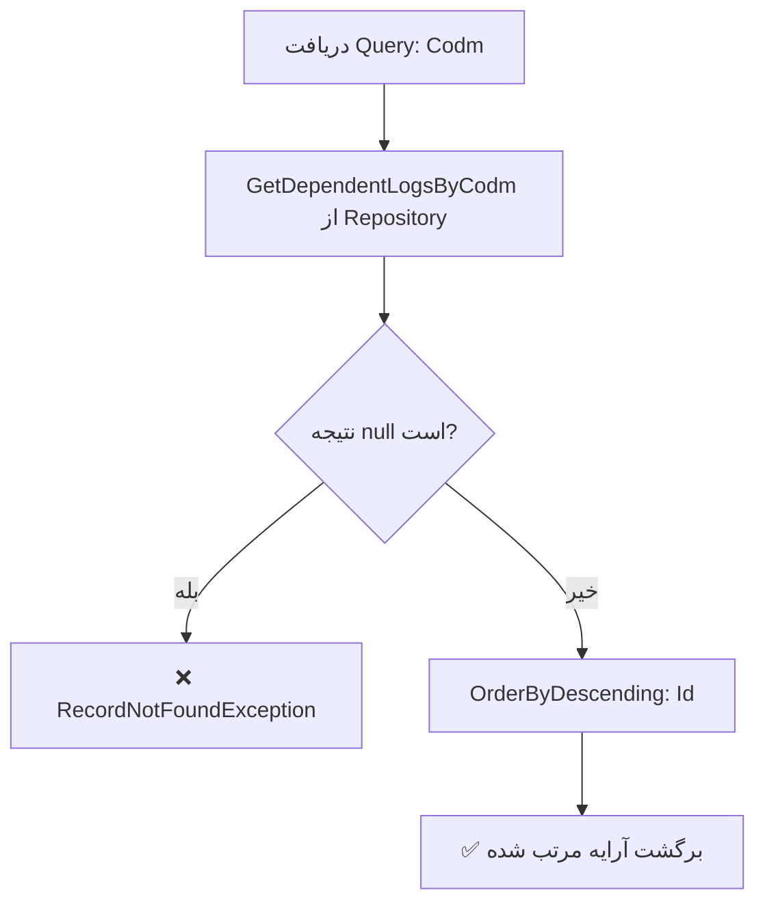

<div dir="rtl">

# GetDependentAdmissionAuditLogsByCodmQuery.cs

**مسیر**: `Csis.Admission.Application/Features/AdmissionAuditLogs/Queries/GetDependentAdmissionAuditLogsByCodmQuery.cs`

---

## 1. Purpose (هدف)

Query دریافت **سوابق پذیرشی تکفل** (Dependent) بر اساس کد مرکز خدمات (Codm). این Query تاریخچه کامل تغییرات و رویدادهای پذیرشی مربوط به یک تکفل را به ترتیب نزولی برمی‌گرداند.

---

## 2. مستندات XML موجود

```csharp
/// <summary>سوابق پذیرشی تکفل</summary>
```

**کامل**: Query دریافت سوابق پذیرشی (Audit Logs) تکفل با مرتب‌سازی نزولی.

---

## 3. خلاصه اتفاقات

**جریان اصلی**:
```
1. دریافت لیست سوابق پذیرشی از Repository
2. بررسی وجود رکورد (اگر null باشد Exception)
3. مرتب‌سازی نزولی بر اساس Id
4. برگشت آرایه DependentAdmissionAuditLogDto
```

---

## 4. اجزای اصلی

### Query:
```csharp
sealed record GetDependentAdmissionAuditLogsByCodmQuery(int Codm) : IRequest<DependentAdmissionAuditLogDto[]>
{
    int Codm   // کد مرکز خدمات تکفل
}
```

### Handler Dependencies:
- **IAdmissionAuditLogRepository**: دریافت سوابق پذیرشی از دیتابیس

---

## 5. Flow



---

## 6. Business Rules

### BR-1: Audit Log برای Dependent
- سوابق مربوط به **تکفل** (Dependent) است نه دانشجو (Student)
- هر تکفل می‌تواند چندین رکورد Audit Log داشته باشد

### BR-2: مرتب‌سازی
- نزولی بر اساس `Id` (جدیدترین رکورد اول)
- Id معمولاً به ترتیب زمانی افزایش می‌یابد

### BR-3: Exception Handling
- اگر هیچ سابقه‌ای یافت نشود → `RecordNotFoundException`
- تضمین می‌کند داده معتبر برگردد

---

## 7. Dependencies

### Internal:
- **IAdmissionAuditLogRepository**: دریافت سوابق پذیرشی
  - متد: `GetDependentLogsByCodm(int codm)`

---

## 8. Input/Output

### Input:
```csharp
int Codm   // کد مرکز خدمات تکفل (اجباری)
```

### Output:
```csharp
DependentAdmissionAuditLogDto[] {
    // آرایه مرتب شده از سوابق پذیرشی
    // شامل: Id, Codm, تاریخ, نوع عملیات, توضیحات، و ...
}
```

### Exceptions:
- **RecordNotFoundException<DependentAdmissionAuditLogDto>**: اگر سابقه‌ای برای Codm یافت نشود

---

## 9. Side Effects

- **هیچ**: این Query فقط خواندن است (Read-Only)
- بدون تغییر در دیتابیس یا سرویس‌های خارجی

---

## 10. الگوهای استفاده شده

### ✅ Null Guard Pattern
```csharp
var result = await _repo.GetDependentLogsByCodm(request.Codm)
    ?? throw new RecordNotFoundException<DependentAdmissionAuditLogDto>(request.Codm);
```
- بررسی null و پرتاب Exception در یک خط

### ✅ Collection Expression (C# 12)
```csharp
return [.. result.OrderByDescending(x => x.Id)];
```
- استفاده از Spread Operator برای تبدیل IEnumerable به Array

---

## 11. Performance

- **Database Queries**: 1 SELECT (تمام سوابق یک تکفل)
- **In-Memory Sorting**: OrderByDescending روی نتایج
- ⚠️ **Potential Issue**: اگر تعداد سوابق بسیار زیاد باشد، Sorting و Transfer ممکن است کند باشد

**پیشنهاد بهینه‌سازی**:
```csharp
// مرتب‌سازی در سطح دیتابیس
var result = await _repo.GetDependentLogsByCodm(request.Codm, orderByIdDescending: true);
```

---

## 12. Security

- ✅ **Authorization**: احتمالاً در سطح Controller یا Middleware
- ⚠️ **Data Access**: بررسی کنید کاربر فقط سوابق مجاز خود را ببیند
- 💡 **پیشنهاد**: افزودن CurrentUser به Query برای Authorization

---

## 13. نکات مهم

### 💡 Dependent vs Student
- این Query برای **Dependent** (تکفل) است
- برای دانشجو احتمالاً Query مشابه `GetStudentAdmissionAuditLogsByCodmQuery` وجود دارد

### 🎯 Audit Log Usage
```
سوابق پذیرشی شامل:
- تغییرات وضعیت پذیرش
- تاییدیه‌ها و تغییرات اطلاعات
- تاریخچه درخواست‌ها
- عملیات‌های کارمندان
```

### ⚠️ Exception Details
```csharp
throw new RecordNotFoundException<DependentAdmissionAuditLogDto>(request.Codm);
```
- شامل نوع Entity و مقدار Codm برای Debug راحت‌تر

---

## 14. مثال استفاده

### سناریو 1: مشاهده سوابق تکفل
```csharp
// تکفل با Codm=54321
var query = new GetDependentAdmissionAuditLogsByCodmQuery(Codm: 54321);
var auditLogs = await mediator.Send(query);

// نتیجه:
// auditLogs[0] → جدیدترین سابقه
// auditLogs[n] → قدیمی‌ترین سابقه
```

### سناریو 2: نمایش تاریخچه در UI
```csharp
var logs = await mediator.Send(new GetDependentAdmissionAuditLogsByCodmQuery(codm));
foreach (var log in logs) {
    Console.WriteLine($"{log.Date}: {log.Action} - {log.Description}");
}
```

---

## 15. Related Queries

- **GetStudentAdmissionAuditLogsByCodmQuery**: سوابق پذیرشی دانشجو
  - مسیر: [GetStudentAdmissionAuditLogsByCodmQuery.md](./GetStudentAdmissionAuditLogsByCodmQuery.md)

---

## 16. تغییرات پیشنهادی

### 1. افزودن Authorization
```csharp
public async Task<DependentAdmissionAuditLogDto[]> Handle(...) {
    // بررسی دسترسی کاربر
    await _authService.ValidateAccessToDependentData(request.Codm);
    
    var result = await _repo.GetDependentLogsByCodm(request.Codm)
        ?? throw new RecordNotFoundException<DependentAdmissionAuditLogDto>(request.Codm);
    
    return [.. result.OrderByDescending(x => x.Id)];
}
```

### 2. افزودن Pagination
```csharp
public sealed record GetDependentAdmissionAuditLogsByCodmQuery(
    int Codm, 
    int PageNumber = 1, 
    int PageSize = 20
) : IRequest<PagedResult<DependentAdmissionAuditLogDto>>;
```

### 3. بهینه‌سازی Sorting در Database
```csharp
// در Repository
var result = await _context.AdmissionAuditLogs
    .Where(x => x.Codm == codm && x.EntityType == "Dependent")
    .OrderByDescending(x => x.Id)
    .ToArrayAsync();
```

### 4. افزودن Filtering
```csharp
public sealed record GetDependentAdmissionAuditLogsByCodmQuery(
    int Codm,
    DateTime? FromDate = null,
    DateTime? ToDate = null,
    string ActionType = null
) : IRequest<DependentAdmissionAuditLogDto[]>;
```

---

## 17. خلاصه نکات کلیدی

| نکته | توضیح |
|------|-------|
| **نقش** | دریافت سوابق پذیرشی تکفل |
| **ورودی** | Codm (کد مرکز خدمات) |
| **خروجی** | آرایه DependentAdmissionAuditLogDto[] |
| **مرتب‌سازی** | ✅ نزولی بر اساس Id |
| **Exception** | ✅ RecordNotFoundException |
| **Authorization** | ⚠️ احتمالاً در Controller |
| **Performance** | ⚠️ بدون Pagination |

---

**یادداشت**: این Query یک الگوی ساده و تمیز برای دریافت Audit Logs است که می‌تواند با Pagination و Filtering بهبود یابد.

</div>
