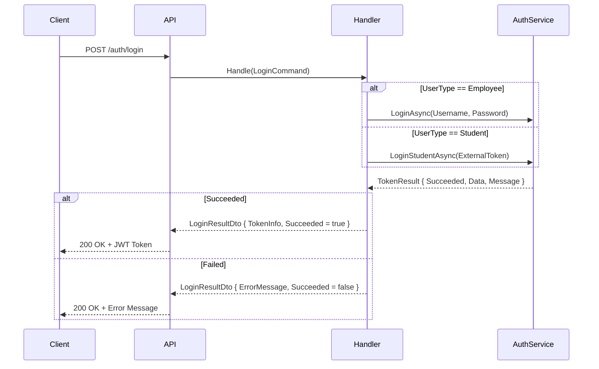

<div dir="rtl">

# LoginCommand.cs

**مسیر**: `Csis.Admission.Application/Features/Auth/Commands/LoginCommand.cs`

---

## 1. Purpose (هدف)

Command احراز هویت اصلی سیستم که **ورود کاربران** (کارمندان + دانشجویان) را مدیریت می‌کند. این Command دو مسیر ورود را پشتیبانی می‌کند:
- **کارمندان**: Username + Password
- **دانشجویان**: ExternalToken (از سامانه خارجی مثل سخا)

---

## 2. مستندات XML موجود

```csharp
/// <summary>
/// ورود به سامانه
/// </summary>
```

**کامل**: Command احراز هویت یکپارچه برای کارمندان و دانشجویان با پشتیبانی از توکن خارجی.

---

## 3. خلاصه اتفاقات

**جریان اصلی**:
```
if (UserType == Employee)
    └─> LoginAsync(Username, Password)
else (UserType == Student)
    └─> LoginStudentAsync(ExternalToken)

اگر موفق:
    └─> return LoginResultDto { TokenInfo, Succeeded = true }
اگر ناموفق:
    └─> return LoginResultDto { ErrorMessage, Succeeded = false }
```

---

## 4. اجزای اصلی

### Command:
```csharp
sealed record LoginCommand : IRequest<LoginResultDto>
{
    string Username        // نام کاربری
    string Password        // رمز عبور
    string ExternalToken   // توکن از اپ‌های خارجی (مثل سخا)
    UserType UserType      // Employee | Student
}
```

### Handler:
- **Dependency**: `ICsisAuthorizationService` (سرویس احراز هویت)

---

## 5. Flow

```
1. بررسی نوع کاربر
   switch (UserType)
   
   case Employee:
       └─> csisAuthorizationService.LoginAsync(Username, Password)
   
   case Student:
       └─> csisAuthorizationService.LoginStudentAsync(ExternalToken)

2. بررسی نتیجه
   if (tokenResult.Succeeded)
       └─> return LoginResultDto { TokenInfo, Succeeded = true }
   else
       └─> return LoginResultDto { ErrorMessage, Succeeded = false }
```

---

## 6. Business Rules

### BR-1: دو مسیر ورود
- **کارمندان**: احراز هویت داخلی (Username/Password)
- **دانشجویان**: احراز هویت خارجی (ExternalToken از سامانه‌هایی مثل سخا)

### BR-2: یکپارچگی
- یک Command برای همه انواع کاربران
- تشخیص خودکار بر اساس `UserType`

### BR-3: عدم پرتاب Exception
- حتی در صورت خطا، Command موفق است و `LoginResultDto.Succeeded = false` برمی‌گرداند

---

## 7. Dependencies

| Dependency | Purpose |
|-----------|---------|
| `ICsisAuthorizationService` | سرویس احراز هویت و صدور توکن |

**یادداشت**: این سرویس احتمالاً با Identity Server ارتباط دارد.

---

## 8. Error Handling

- **هیچ Exception پرتاب نمی‌شود**
- خطاها در `LoginResultDto.ErrorMessage` برگردانده می‌شوند

---

## 9. Observability

- **Logging**: ندارد
- **پیشنهاد**: لاگ کردن تلاش‌های ورود ناموفق (برای امنیت)

---

## 10. Use Case های مرتبط

- **UC-001**: ورود کارمند
- **UC-002**: ورود دانشجو (با توکن خارجی)
- **UC-003**: تمدید توکن (RefreshToken)

---

## 11. Risks & Notes

### امنیت:
- ⚠️ **بدون لاگ**: تلاش‌های ورود ناموفق لاگ نمی‌شوند
- ⚠️ **بدون Rate Limiting**: امکان Brute Force وجود دارد
- **پیشنهاد**: 
  - لاگ کردن IP + Username برای ورودهای ناموفق
  - Rate Limiting بر اساس IP

### کارایی:
- ✅ سبک و سریع

### Code Quality:
- ✅ ساده و واضح
- ❌ عدم استفاده از `??` در خط 48 ممکن است مشکل‌ساز باشد

---

## 12. نمودار جریان



---

## 13. خلاصه نکات کلیدی

| نکته | توضیح |
|------|-------|
| **نقش** | ورود یکپارچه کارمندان و دانشجویان |
| **ورودی** | Username/Password یا ExternalToken |
| **خروجی** | LoginResultDto (JWT Token) |
| **دو مسیر** | Employee (داخلی) + Student (خارجی) |
| **امنیت** | ⚠️ بدون Logging + Rate Limiting |
| **Error Handling** | بدون Exception (همه در DTO) |

---

**یادداشت**: این Command نقطه ورود اصلی به سیستم است. بهبود امنیت آن بحرانی است.

</div>
