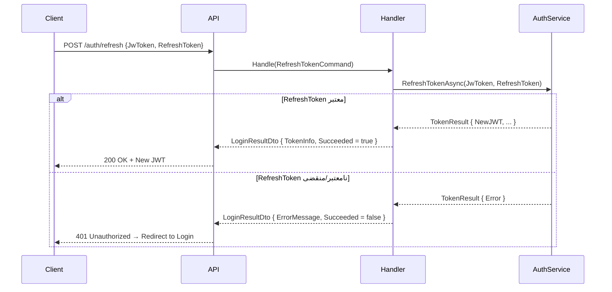

<div dir="rtl">

# RefreshTokenCommand.cs

**مسیر**: `Csis.Admission.Application/Features/Auth/Commands/RefreshTokenCommand.cs`

---

## 1. Purpose (هدف)

Command **تمدید توکن** بدون نیاز به ورود مجدد. زمانی که JWT Token منقضی شده اما RefreshToken هنوز معتبر است، این Command یک JWT جدید صادر می‌کند.

---

## 2. خلاصه اتفاقات

```
1. دریافت JwToken (منقضی شده) + RefreshToken (معتبر)
2. فراخوانی سرویس RefreshToken
3. صدور JWT جدید
4. بازگشت TokenInfo جدید
```

---

## 3. اجزای اصلی

### Command:
```csharp
sealed record RefreshTokenCommand(
    string JwToken,       // JWT منقضی شده
    string RefreshToken   // Refresh Token معتبر
) : IRequest<LoginResultDto>
```

### Handler:
- **Dependency**: `ICsisAuthorizationService`

---

## 4. Flow

```
1. RefreshTokenAsync(JwToken, RefreshToken)
   
2. if (Succeeded)
       └─> return LoginResultDto { TokenInfo (new JWT), Succeeded = true }
   else
       └─> return LoginResultDto { ErrorMessage, Succeeded = false }
```

---

## 5. Business Rules

### BR-1: Refresh Token Flow
- **JWT**: کوتاه‌مدت (معمولاً 15-60 دقیقه)
- **RefreshToken**: بلندمدت (معمولاً 7-30 روز)

### BR-2: بدون نیاز به ورود مجدد
- کاربر نیازی به وارد کردن Username/Password ندارد
- تجربه کاربری بهتر

### BR-3: امنیت
- RefreshToken باید در جای امن ذخیره شود (HttpOnly Cookie یا Secure Storage)

---

## 6. Error Handling

- **بدون Exception**: خطاها در `LoginResultDto.ErrorMessage`

---

## 7. Risks & Notes

### امنیت:
- ✅ جداسازی JWT (کوتاه‌مدت) و RefreshToken (بلندمدت)
- ⚠️ **بدون لاگ**: تلاش‌های تمدید ناموفق لاگ نمی‌شوند
- ⚠️ **RefreshToken Rotation**: بهتر است بعد از هر تمدید، RefreshToken جدید صادر شود

### کارایی:
- ✅ سبک و سریع

---

## 8. Use Case های مرتبط

- **UC-003**: تمدید توکن
- مرتبط با: [LoginCommand.md](./LoginCommand.md), [LoginStudentCommand.md](./LoginStudentCommand.md)

---

## 9. نمودار جریان



---

## 10. خلاصه نکات کلیدی

| نکته | توضیح |
|------|-------|
| **نقش** | تمدید JWT بدون ورود مجدد |
| **ورودی** | JwToken (منقضی) + RefreshToken |
| **خروجی** | LoginResultDto (JWT جدید) |
| **TTL** | JWT کوتاه، RefreshToken بلند |
| **UX** | ✅ بدون نیاز به ورود مجدد |
| **امنیت** | ⚠️ نیاز به Token Rotation |

---

**بهترین روش‌ها**:
1. **RefreshToken Rotation**: هر بار RefreshToken جدید صادر شود
2. **Secure Storage**: RefreshToken در HttpOnly Cookie یا Secure Storage
3. **Logging**: لاگ کردن تلاش‌های تمدید
4. **Revocation**: امکان لغو RefreshToken (مثلاً در خروج)

</div>
