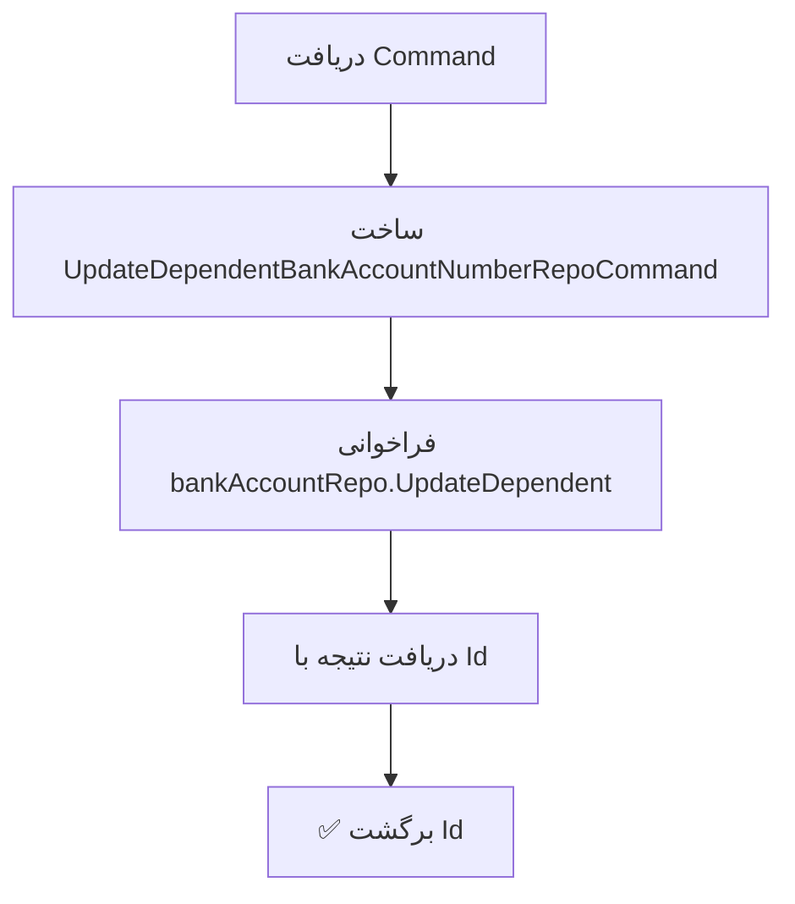

<div dir="rtl">

# UpdateDependentBankAccountCommand.cs

**مسیر**: `Csis.Admission.Application/Features/BankAccounts/Commands/UpdateDependentBankAccountCommand.cs`

---

## 1. Purpose (هدف)

Command **بروزرسانی شماره حساب بانکی تکفل** (Dependent). این Command به صورت مستقیم بدون Workflow و اعتبارسنجی پیچیده، شماره حساب بانکی یک تکفل را بروز می‌کند.

---

## 2. مستندات XML موجود

```csharp
/// <summary>بروز رسانی حساب بانکی</summary>
```

**کامل**: بروزرسانی مستقیم شماره حساب بانکی تکفل در دیتابیس.

---

## 3. خلاصه اتفاقات

**جریان اصلی**:
```
1. ساخت RepoCommand با اطلاعات ورودی
2. فراخوانی UpdateDependent در Repository
3. برگشت Id رکورد بروزرسانی شده
```

---

## 4. اجزای اصلی

### Command:
```csharp
sealed record UpdateDependentBankAccountCommand : IRequest<long>
{
    long DependentId          // شناسه تکفل
    int Codm                  // کد مرکز خدمات
    string BankAccountNumber  // شماره حساب بانکی جدید
}
```

### Handler Dependencies:
- **IStudentBankAccountRepository**: بروزرسانی شماره حساب در دیتابیس

---

## 5. Flow



---

## 6. Business Rules

### BR-1: Direct Update
- **بدون Workflow**: به صورت مستقیم در دیتابیس بروزرسانی می‌شود
- **بدون Validation**: اعتبارسنجی‌ها احتمالاً در Repository یا Validator

### BR-2: Entity Identity
- شناسایی بر اساس `DependentId` و `Codm`
- احتمالاً هر دو باید Match باشند

### BR-3: Return Value
- برگشت `Id` رکورد بروزرسانی شده
- این Id می‌تواند همان `DependentId` باشد یا Id رکورد BankAccount

---

## 7. Dependencies

### Internal:
- **IStudentBankAccountRepository**: Repository مدیریت حساب‌های بانکی
  - متد: `UpdateDependent(UpdateDependentBankAccountNumberRepoCommand)`

### Models:
- **UpdateDependentBankAccountNumberRepoCommand**: DTO انتقال داده به Repository

---

## 8. Input/Output

### Input:
```csharp
{
    DependentId: 123456,           // شناسه تکفل
    Codm: 54321,                   // کد مرکز خدمات
    BankAccountNumber: "1234567890" // شماره حساب جدید
}
```

### Output:
```csharp
long   // Id رکورد بروزرسانی شده
```

### Exceptions:
- احتمالاً در سطح Repository:
  - `RecordNotFoundException`: اگر تکفل یافت نشود
  - `ValidationException`: اگر شماره حساب نامعتبر باشد

---

## 9. Side Effects

- ✅ **Database Update**: بروزرسانی شماره حساب در جدول BankAccounts
- ⚠️ **No Audit**: احتمالاً Audit Log در سطح Repository ثبت می‌شود
- ⚠️ **No Notification**: بدون اطلاع‌رسانی به کاربر

---

## 10. الگوهای استفاده شده

### ✅ DTO Mapping Pattern
```csharp
var repoCommand = new UpdateDependentBankAccountNumberRepoCommand(
    command.DependentId, 
    command.Codm, 
    command.BankAccountNumber
);
```
- تبدیل Application Command به Repository Command

### ✅ Repository Pattern
```csharp
var result = await bankAccountRepo.UpdateDependent(repoCommand);
return result.Id;
```
- انتزاع کامل از دیتابیس

### ✅ Primary Constructor (C# 12)
```csharp
internal sealed class UpdateDependentBankAccountCommandHandler(
    IStudentBankAccountRepository bankAccountRepo
)
```
- استفاده از Primary Constructor برای DI

---

## 11. Performance

- **Database Queries**: 1 UPDATE (با احتمال SELECT برای Validation)
- **سرعت**: عملیات ساده و سریع
- ✅ **بهینه**: بدون Query اضافی

---

## 12. Security

- ⚠️ **No Authorization**: بررسی دسترسی کاربر احتمالاً در Controller
- ⚠️ **No Validation**: 
  - آیا شماره حساب با کد ملی تکفل مطابقت دارد؟
  - آیا شماره حساب قبلاً ثبت نشده است؟
  - آیا شماره حساب معتبر است (فرمت SIBA)?

**تفاوت مهم**: این Command برخلاف `UpdateDependentBankAccountRequestCommand` بدون Validation است!

---

## 13. نکات مهم

### 💡 تفاوت با UpdateDependentBankAccountRequestCommand

| ویژگی | UpdateDependentBankAccountCommand | UpdateDependentBankAccountRequestCommand |
|-------|-----------------------------------|------------------------------------------|
| **Workflow** | ❌ Direct Update | ✅ با Request Flow |
| **Validation** | ❌ احتمالاً کمتر | ✅ کامل (SIBA, تکراری، مدرک) |
| **Authorization** | ⚠️ در Controller | ✅ در Handler |
| **Document** | ❌ بدون مدرک | ✅ اختیاری |
| **Use Case** | عملیات داخلی/Admin | درخواست دانشجو/کاربر |

### 🎯 Use Case
این Command احتمالاً برای:
- **عملیات داخلی**: توسط سیستم یا Admin
- **Migration**: انتقال داده
- **Direct Registration Flow**: بدون نیاز به تایید

استفاده می‌شود، در حالی که `UpdateDependentBankAccountRequestCommand` برای درخواست کاربران است.

---

## 14. مثال استفاده

### سناریو 1: بروزرسانی توسط Admin
```csharp
var command = new UpdateDependentBankAccountCommand {
    DependentId = 123456,
    Codm = 54321,
    BankAccountNumber = "1234567890"
};
var id = await mediator.Send(command);
// id → 123456 (DependentId برگشته)
```

### سناریو 2: Migration داده
```csharp
foreach (var dependent in dependents) {
    var command = new UpdateDependentBankAccountCommand {
        DependentId = dependent.Id,
        Codm = dependent.Codm,
        BankAccountNumber = dependent.OldBankAccount
    };
    await mediator.Send(command);
}
```

---

## 15. Related Commands

- **UpdateDependentBankAccountRequestCommand**: درخواست بروزرسانی با Workflow کامل
  - مسیر: [UpdateDependentBankAccountRequestCommand.md](./UpdateDependentBankAccountRequestCommand.md)
- **UpdateStudentBankAccountCommand**: بروزرسانی حساب بانکی دانشجو
  - مسیر: [UpdateStudentBankAccountCommand.md](./UpdateStudentBankAccountCommand.md)
- **UpdateStudentBankAccountRequestCommand**: درخواست بروزرسانی حساب دانشجو
  - مسیر: [UpdateStudentBankAccountRequestCommand.md](./UpdateStudentBankAccountRequestCommand.md)

---

## 16. تغییرات پیشنهادی

### 1. افزودن Basic Validation
```csharp
public async Task<long> Handle(UpdateDependentBankAccountCommand command, CancellationToken cancellationToken) {
    // بررسی فرمت شماره حساب
    if (string.IsNullOrWhiteSpace(command.BankAccountNumber)) {
        throw new CommandValidationException("شماره حساب الزامی است.");
    }
    
    // بررسی طول (فرض: شماره حساب SIBA 13 رقمی)
    if (command.BankAccountNumber.Length != 13) {
        throw new CommandValidationException("شماره حساب باید 13 رقمی باشد.");
    }
    
    var repoCommand = new UpdateDependentBankAccountNumberRepoCommand(
        command.DependentId, command.Codm, command.BankAccountNumber);
    var result = await bankAccountRepo.UpdateDependent(repoCommand);
    return result.Id;
}
```

### 2. افزودن Audit Log
```csharp
public async Task<long> Handle(...) {
    var repoCommand = new UpdateDependentBankAccountNumberRepoCommand(...);
    var result = await bankAccountRepo.UpdateDependent(repoCommand);
    
    // ثبت Audit Log
    await _auditLogService.LogBankAccountUpdate(
        command.DependentId, 
        command.BankAccountNumber, 
        "System/Admin"
    );
    
    return result.Id;
}
```

### 3. افزودن Authorization Check
```csharp
public async Task<long> Handle(...) {
    // بررسی دسترسی کاربر
    await _authService.RequirePermission("BankAccount.Update.Direct");
    
    var repoCommand = new UpdateDependentBankAccountNumberRepoCommand(...);
    var result = await bankAccountRepo.UpdateDependent(repoCommand);
    return result.Id;
}
```

### 4. افزودن Response DTO
```csharp
public sealed record UpdateDependentBankAccountCommand : IRequest<BankAccountUpdateResult>;

public record BankAccountUpdateResult(long Id, bool IsUpdated, string Message);
```

---

## 17. Integration Points

### Caller Commands:
احتمالاً این Command توسط Commands دیگر فراخوانی می‌شود:
- `ApproveUpdateDependentBankAccountRequestCommand` (پس از تایید)
- `MigrateBankAccountsCommand` (برای Migration)

### Repository Method:
```csharp
// IStudentBankAccountRepository
Task<BankAccountResult> UpdateDependent(UpdateDependentBankAccountNumberRepoCommand command);
```

---

## 18. خلاصه نکات کلیدی

| نکته | توضیح |
|------|-------|
| **نقش** | بروزرسانی مستقیم حساب بانکی تکفل |
| **ورودی** | DependentId + Codm + BankAccountNumber |
| **خروجی** | Id رکورد بروزرسانی شده |
| **Workflow** | ❌ بدون Workflow |
| **Validation** | ⚠️ کمتر (احتمالاً در Repository) |
| **Authorization** | ⚠️ احتمالاً در Controller |
| **Use Case** | عملیات داخلی/Admin |
| **Pattern** | ✅ Repository + DTO Mapping |

---

**یادداشت**: این Command برای عملیات‌های داخلی طراحی شده و بدون Validation و Workflow پیچیده است. برای درخواست‌های کاربران از `UpdateDependentBankAccountRequestCommand` استفاده شود.

</div>
