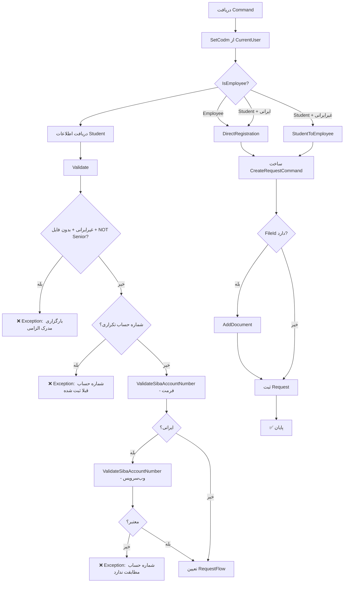

<div dir="rtl">

# UpdateStudentBankAccountRequestCommand.cs

**مسیر**: `Csis.Admission.Application/Features/BankAccounts/Commands/UpdateStudentBankAccountRequestCommand.cs`

---

## 1. Purpose (هدف)

Command **ثبت درخواست بروزرسانی حساب بانکی دانشجو** (Student) با **Workflow کامل** شامل اعتبارسنجی SIBA، بررسی تکراری بودن، و الزام بارگزاری مدرک برای شهروندان غیرایرانی.

---

## 2. مستندات XML موجود

```csharp
/// <summary>درخواست بروز رسانی حساب بانکی</summary>
```

**کامل**: ثبت درخواست با Validation کامل و Request Flow مناسب بر اساس نوع کاربر و تابعیت دانشجو.

---

## 3. خلاصه اتفاقات

**جریان اصلی**:
```
1. Set Codm از CurrentUser (اگر خالی باشد)
2. بررسی نوع کاربر (Employee یا Student)
3. دریافت اطلاعات دانشجو
4. Validate:
   - الزام بارگزاری مدرک برای غیرایرانی‌ها
   - بررسی تکراری نبودن شماره حساب
   - اعتبارسنجی فرمت SIBA
   - اعتبارسنجی تطبیق با کد ملی (برای ایرانی‌ها)
5. تعیین RequestFlow (DirectRegistration یا StudentToEmployee)
6. ساخت و ثبت Request با مدرک (در صورت وجود)
```

---

## 4. اجزای اصلی

### Command:
```csharp
sealed record UpdateStudentBankAccountRequestCommand : IRequest
{
    int Codm                   // کد مرکز خدمات
    string BankAccountNumber   // شماره حساب بانکی جدید
    Guid? FileId               // شناسه فایل مدرک (اختیاری)
}
```

**تفاوت با Dependent**: بدون `DependentId` - دانشجو از `Codm` شناسایی می‌شود

### Handler Dependencies:
- **ICsisWsmService**: اعتبارسنجی شماره حساب با سرویس SIBA
- **IRequestService**: ثبت و مدیریت Request
- **IStudentRepository**: دریافت اطلاعات دانشجو
- **IRepository<StudentSummary>**: بررسی تکراری بودن شماره حساب
- **ICurrentUserService**: دریافت اطلاعات کاربر جاری

---

## 5. Flow



---

## 6. Business Rules

### BR-1: Request Flow Strategy
```csharp
var flow = isEmployee switch {
    true => RequestFlow.DirectRegistration,           // کارمند → مستقیم
    false => student.Citizenship == Citizenship.Iranian 
        ? RequestFlow.DirectRegistration              // دانشجو ایرانی → مستقیم
        : RequestFlow.StudentToEmployee               // دانشجو غیرایرانی → نیاز تایید
};
```

**مشابه Dependent Command** - استراتژی یکسان برای Student و Dependent

### BR-2: Document Requirement
```csharp
if ((student.Citizenship == Citizenship.NonIranian && command.FileId == null) 
    && !isPersonnelSenior) {
    throw new CommandValidationException("بارگزاری مدرک برای شهروندان غیر ایرانی الزامی می باشد.");
}
```

**استثنا**: کارمندان Senior می‌توانند بدون مدرک ثبت کنند

### BR-3: Duplicate Check
```csharp
if (await studentSummaryRepository.ExistsAsync(
    x => x.Codm != command.Codm && x.BankAccountNumber == command.BankAccountNumber)) {
    throw new CommandValidationException("شماره حساب قبلا ثبت شده است.");
}
```

**دقت**: جستجو در `StudentSummary` - شماره حساب نباید برای Codm دیگری ثبت شده باشد

### BR-4: SIBA Validation
```csharp
// 1. فرمت (متد Utility)
Common.Utilities.ValidateSibaAccountNumber(command.BankAccountNumber);

// 2. تطبیق با کد ملی (فقط ایرانی‌ها)
if (student.Citizenship == Citizenship.Iranian) {
    var sibaAccountNumber = new ValidateSibaAccountNumberRequest(
        student.Codm, student.NationalCode, command.BankAccountNumber);
    if (!await wsmService.ValidateSibaAccountNumber(sibaAccountNumber)) {
        throw new CommandValidationException("شماره حساب با کد ملی مطابقت ندارد.");
    }
}
```

**تفاوت**: این Command typo را ندارد ("مطابقت" صحیح است)

---

## 7. Dependencies

### Internal:
- **IRequestService**: مدیریت Request Workflow
- **IStudentRepository**: دسترسی به اطلاعات کامل دانشجو (StudentDto)
- **IRepository<StudentSummary>**: بررسی تکراری بودن
- **ICurrentUserService**: احراز هویت و Authorization

### External:
- **ICsisWsmService**: اعتبارسنجی SIBA با سامانه بانکی

### Utilities:
- **Common.Utilities.SetCodm**: تنظیم Codm از Token
- **Common.Utilities.ValidateSibaAccountNumber**: اعتبارسنجی فرمت شماره حساب

---

## 8. Input/Output

### Input:
```csharp
{
    Codm: 54321,                      // کد مرکز خدمات (اختیاری - از Token)
    BankAccountNumber: "1234567890123", // شماره حساب SIBA 13 رقمی
    FileId: Guid.Parse("...")         // اختیاری (اجباری برای غیرایرانی‌ها)
}
```

### Output:
```csharp
void (IRequest - بدون خروجی)
```

### Exceptions:
- **CommandValidationException**: 
  - بارگزاری مدرک الزامی (غیرایرانی بدون فایل)
  - شماره حساب تکراری
  - شماره حساب نامعتبر (فرمت)
  - شماره حساب مطابقت ندارد (کد ملی)
- **UnauthorizedException**: دسترسی غیرمجاز
- **RecordNotFoundException**: دانشجو یافت نشد

---

## 9. Side Effects

- ✅ **Request Creation**: ثبت یک Request جدید در سیستم
- ✅ **Document Attachment**: پیوست مدرک به Request (در صورت وجود)
- ✅ **Workflow Initiation**: شروع فرآیند تایید (برای StudentToEmployee)
- ⚠️ **External API Call**: فراخوانی SIBA WebService
- ✅ **Audit Log**: احتمالاً در RequestService ثبت می‌شود

---

## 10. الگوهای استفاده شده

### ✅ Strategy Pattern (Request Flow)
```csharp
var flow = isEmployee switch {
    true => RequestFlow.DirectRegistration,
    false => student.Citizenship == Citizenship.Iranian 
        ? RequestFlow.DirectRegistration 
        : RequestFlow.StudentToEmployee
};
```

### ✅ Validation Pipeline
```csharp
private async Task Validate(...) {
    // Step 1: Document Validation
    // Step 2: Duplicate Check
    // Step 3: Format Validation
    // Step 4: SIBA WebService Validation
}
```

### ✅ Fluent Builder Pattern
```csharp
var requestCommand = new CreateRequestCommand(command, flow);
if (command.FileId.HasValue) {
    requestCommand.AddDocument(command.FileId.Value);
}
await requestService.Create(requestCommand, cancellationToken);
```

### ✅ Primary Constructor (C# 12)
```csharp
internal sealed class UpdateRequestStudentBankAccountCommandHandler(
    ICsisWsmService wsmService, 
    ICurrentUserService currentUser,
    IRequestService requestService, 
    IStudentRepository studentRepository, 
    IRepository<StudentSummary> studentSummaryRepository
)
```

---

## 11. Performance

- **Database Queries**: 2-3 SELECT (Student + StudentSummary Duplicate Check)
- **External API Calls**: 1 (SIBA Validation - فقط برای ایرانی‌ها)
- **Request Creation**: 1 INSERT
- ⚠️ **Network Latency**: SIBA WebService ممکن است کند باشد

**بهینه‌سازی**:
- Caching برای نتایج SIBA Validation (موقت)
- Combine Queries (Student + Duplicate Check در یک Query)

---

## 12. Security

### ✅ Authorization
```csharp
_ = await Common.Utilities.SetCodm(command, currentUser);
var isEmployee = await currentUser.IsEmployee();
var isPersonnelSenior = await currentUser.IsSenior();
```
- بررسی نوع کاربر و سطح دسترسی

### ✅ Data Validation
- بررسی تکراری نبودن شماره حساب
- اعتبارسنجی فرمت SIBA
- اعتبارسنجی تطبیق با کد ملی (فقط ایرانی‌ها)

### ✅ Document Security
- الزام بارگزاری مدرک برای غیرایرانی‌ها
- استثنا برای Senior Personnel (override)

### ⚠️ Sensitive Data
- شماره حساب بانکی (باید رمزنگاری شود؟)
- کد ملی در فراخوانی SIBA

---

## 13. نکات مهم

### 💡 تفاوت با UpdateDependentBankAccountRequestCommand

| ویژگی | UpdateStudentBankAccountRequestCommand | UpdateDependentBankAccountRequestCommand |
|-------|----------------------------------------|------------------------------------------|
| **Entity** | Student (دانشجو) | Dependent (تکفل) |
| **شناسایی** | Codm فقط | DependentId + Codm |
| **Repository** | IStudentRepository | IRepository<DependentSummary> |
| **Duplicate Check** | StudentSummary | DependentSummary |
| **Typo** | ✅ ندارد ("مطابقت") | ❌ دارد ("مطابقبت") |
| **Logic** | مشابه | مشابه |

### 🎯 Handler Name
```csharp
internal sealed class UpdateRequestStudentBankAccountCommandHandler(...)
//                     ^^^^^^^ "Request" در نام Handler
```
**نکته نام‌گذاری**: "UpdateRequest" بجای "UpdateStudentBankAccountRequest" - کمی گمراه‌کننده

### ⚠️ استفاده از دو Repository
```csharp
IStudentRepository studentRepository              // دریافت StudentDto
IRepository<StudentSummary> studentSummaryRepository  // بررسی تکراری
```
**دلیل**: 
- `StudentDto` برای Validation کامل (Citizenship, NationalCode)
- `StudentSummary` برای Query سریع (Duplicate Check)

---

## 14. مثال استفاده

### سناریو 1: دانشجو ایرانی (بدون مدرک)
```csharp
var command = new UpdateStudentBankAccountRequestCommand {
    Codm = 54321,  // یا null (از Token)
    BankAccountNumber = "1234567890123",
    FileId = null  // ایرانی → مدرک اختیاری
};
await mediator.Send(command);
// → DirectRegistration (اعمال مستقیم)
```

### سناریو 2: دانشجو غیرایرانی (با مدرک)
```csharp
var fileId = await UploadDocument("bank-account-proof.pdf");
var command = new UpdateStudentBankAccountRequestCommand {
    Codm = 54321,
    BankAccountNumber = "1234567890123",
    FileId = fileId  // غیرایرانی → مدرک اجباری
};
await mediator.Send(command);
// → StudentToEmployee (نیاز تایید کارمند)
```

### سناریو 3: کارمند (همیشه مستقیم)
```csharp
var command = new UpdateStudentBankAccountRequestCommand {
    Codm = 54321,
    BankAccountNumber = "1234567890123",
    FileId = null  // کارمند → بدون محدودیت
};
await mediator.Send(command);
// → DirectRegistration (اعمال مستقیم)
```

---

## 15. Related Commands

- **UpdateDependentBankAccountRequestCommand**: درخواست بروزرسانی حساب تکفل
  - مسیر: [UpdateDependentBankAccountRequestCommand.md](./UpdateDependentBankAccountRequestCommand.md)
- **UpdateStudentBankAccountCommand**: بروزرسانی مستقیم حساب دانشجو
  - مسیر: [UpdateStudentBankAccountCommand.md](./UpdateStudentBankAccountCommand.md)

---

## 16. تغییرات پیشنهادی

### 1. تصحیح نام Handler
```csharp
// فعلی
internal sealed class UpdateRequestStudentBankAccountCommandHandler(...)

// پیشنهاد
internal sealed class UpdateStudentBankAccountRequestCommandHandler(...)
```

### 2. افزودن Logging
```csharp
public async Task Handle(...) {
    _logger.LogInformation(
        "Updating student bank account request. Codm={Codm}",
        command.Codm);
    
    try {
        await Validate(...);
        // ...
        _logger.LogInformation("Request created successfully");
    } catch (Exception ex) {
        _logger.LogError(ex, "Failed to create bank account update request");
        throw;
    }
}
```

### 3. Combine Repositories
```csharp
// بجای استفاده از دو Repository
var student = await studentRepository.GetByCodm(command.Codm);
var isDuplicate = await studentSummaryRepository.ExistsAsync(...);

// پیشنهاد: یک متد در StudentRepository
var validationResult = await studentRepository.ValidateForBankAccountUpdate(
    command.Codm, command.BankAccountNumber);
```

### 4. Extract Validation Rules
```csharp
private class StudentBankAccountValidator {
    public async Task ValidateDocumentRequirement(...) { }
    public async Task ValidateDuplicate(...) { }
    public void ValidateFormat(...) { }
    public async Task ValidateSibaMatch(...) { }
}
```

### 5. افزودن Response DTO
```csharp
public sealed record UpdateStudentBankAccountRequestCommand : IRequest<RequestCreatedResult>;

public record RequestCreatedResult(
    long RequestId, 
    RequestFlow Flow, 
    string Status,
    string Message
);
```

### 6. Caching SIBA Validation
```csharp
private async Task<bool> ValidateSibaAccountNumberWithCache(...) {
    var cacheKey = $"siba:{nationalCode}:{bankAccountNumber}";
    var cached = await _cache.GetAsync<bool?>(cacheKey);
    if (cached.HasValue) return cached.Value;
    
    var isValid = await wsmService.ValidateSibaAccountNumber(...);
    await _cache.SetAsync(cacheKey, isValid, TimeSpan.FromMinutes(30));
    return isValid;
}
```

---

## 17. Code Quality Issues

### ⚠️ Inconsistent Naming
```csharp
// Command Name
UpdateStudentBankAccountRequestCommand

// Handler Name (نامناسب)
UpdateRequestStudentBankAccountCommandHandler

// باید باشد:
UpdateStudentBankAccountRequestCommandHandler
```

### ⚠️ Duplicate Repository Logic
این Command و `UpdateDependentBankAccountRequestCommand` تقریباً یکسان هستند. می‌توان یک Base Class یا Shared Service ایجاد کرد:

```csharp
public abstract class UpdateBankAccountRequestCommandBase<TEntity, TCommand> {
    protected abstract Task<TEntity> GetEntity(TCommand command);
    protected abstract Task ValidateDuplicate(TCommand command);
    // ... shared logic
}
```

---

## 18. خلاصه نکات کلیدی

| نکته | توضیح |
|------|-------|
| **نقش** | ثبت درخواست بروزرسانی حساب بانکی دانشجو |
| **ورودی** | Codm + BankAccountNumber + FileId |
| **خروجی** | void |
| **Workflow** | ✅ DirectRegistration یا StudentToEmployee |
| **Validation** | ✅ کامل (SIBA + تکراری + مدرک) |
| **Authorization** | ✅ بر اساس نوع کاربر |
| **Document** | ⚠️ اجباری برای غیرایرانی (مگر Senior) |
| **External API** | ✅ SIBA WebService |
| **Handler Name** | ⚠️ نامناسب (UpdateRequest...) |

---

**یادداشت**: این Command مشابه `UpdateDependentBankAccountRequestCommand` است با تفاوت در Entity (Student vs Dependent) و شناسایی (Codm vs DependentId). Logic و Validation هر دو کاملاً یکسان است و می‌توان آن‌ها را Refactor کرد.

</div>
