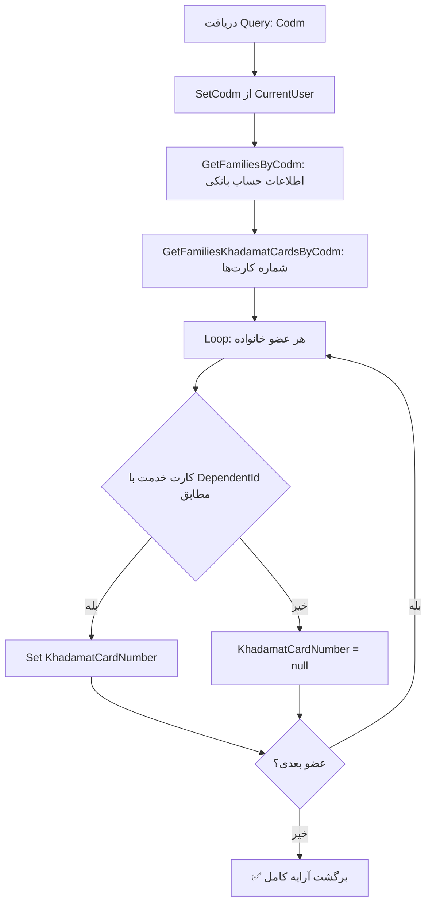

<div dir="rtl">

# GetFamilyBankAccountsByCodmQuery.cs

**مسیر**: `Csis.Admission.Application/Features/BankAccounts/Queries/GetFamilyBankAccountsByCodmQuery.cs`

---

## 1. Purpose (هدف)

Query دریافت **اطلاعات حساب‌های بانکی خانواده** (دانشجو + تکافل) بر اساس کد مرکز خدمات (Codm). این Query علاوه بر شماره حساب، **شماره کارت خدمت** (Khadamat Card) هر عضو خانواده را نیز برمی‌گرداند.

---

## 2. مستندات XML موجود

```csharp
/// <inheritdoc/>
```

**ناکامل**: فقط inheritdoc - نیاز به توضیح بیشتر دارد.

---

## 3. خلاصه اتفاقات

**جریان اصلی**:
```
1. Set Codm از CurrentUser (اگر خالی باشد)
2. دریافت لیست حساب‌های بانکی خانواده
3. دریافت شماره کارت‌های خدمت خانواده
4. Enrich کردن DTO با شماره کارت خدمت
5. برگشت آرایه FamilyBankAccountDto
```

---

## 4. اجزای اصلی

### Query:
```csharp
sealed record GetFamilyBankAccountsByCodmQuery(int Codm) : IRequest<FamilyBankAccountDto[]>
{
    int Codm   // کد مرکز خدمات دانشجو
}
```

### Handler Dependencies:
- **IStudentBankAccountRepository**: دریافت اطلاعات حساب‌های بانکی و کارت‌های خدمت
- **ICurrentUserService**: دریافت Codm از Token

---

## 5. Flow



---

## 6. Business Rules

### BR-1: Family Definition
- **خانواده** شامل دانشجو (Student) و تکافل (Dependents) است
- هر عضو خانواده ممکن است:
  - حساب بانکی داشته باشد
  - کارت خدمت (Khadamat Card) داشته باشد

### BR-2: Khadamat Card Matching
```csharp
item.KhadamatCardNumber = khadamatCards
    .SingleOrDefault(x => x.DependentId.GetValueOrDefault() == item.DependentId.GetValueOrDefault())
    ?.CardNumber;
```

**نکات**:
- Match بر اساس `DependentId`
- استفاده از `GetValueOrDefault()` → هر دو nullable هستند
- `SingleOrDefault` → انتظار حداکثر یک کارت برای هر تکفل

### BR-3: Authorization
```csharp
_ = await Common.Utilities.SetCodm(query, currentUser);
```
- اگر Codm خالی باشد، از Token کاربر دریافت می‌شود
- کاربر فقط خانواده خود را می‌بیند

---

## 7. Dependencies

### Internal:
- **IStudentBankAccountRepository**: Repository اصلی
  - متد: `GetFamiliesByCodm(int codm)` → حساب‌های بانکی
  - متد: `GetFamiliesKhadamatCardsByCodm(int codm)` → کارت‌های خدمت
- **ICurrentUserService**: احراز هویت

---

## 8. Input/Output

### Input:
```csharp
int Codm   // کد مرکز خدمات (اختیاری - از Token)
```

### Output:
```csharp
FamilyBankAccountDto[] {
    // آرایه اطلاعات حساب بانکی و کارت خدمت
    long? DependentId               // null = دانشجو، مقدار = تکفل
    string FullName                 // نام کامل
    string NationalCode             // کد ملی
    string BankAccountNumber        // شماره حساب
    string KhadamatCardNumber       // شماره کارت خدمت (enriched)
    // ... سایر فیلدها
}
```

### Exceptions:
- **UnauthorizedException**: اگر Codm معتبر نباشد
- احتمالاً **RecordNotFoundException**: اگر خانواده‌ای یافت نشود (بستگی به Repository)

---

## 9. Side Effects

- **هیچ**: این Query فقط خواندن است (Read-Only)
- بدون تغییر در دیتابیس

---

## 10. الگوهای استفاده شده

### ✅ Enrichment Pattern
```csharp
// Step 1: دریافت داده اصلی
var result = await repo.GetFamiliesByCodm(query.Codm);

// Step 2: دریافت داده مکمل
var khadamatCards = await repo.GetFamiliesKhadamatCardsByCodm(query.Codm);

// Step 3: Enrich کردن
foreach (var item in result) {
    item.KhadamatCardNumber = khadamatCards
        .SingleOrDefault(x => x.DependentId.GetValueOrDefault() == item.DependentId.GetValueOrDefault())
        ?.CardNumber;
}
```

### ✅ Null-Safe Navigation
```csharp
x.DependentId.GetValueOrDefault() == item.DependentId.GetValueOrDefault()
```
- استفاده از `GetValueOrDefault()` برای nullable types

### ✅ Primary Constructor (C# 12)
```csharp
internal sealed class GetFamilyBankAccountsByCodmHandler(
    IStudentBankAccountRepository repo, 
    ICurrentUserService currentUser
)
```

---

## 11. Performance

- **Database Queries**: 2 SELECT
  1. `GetFamiliesByCodm` → حساب‌های بانکی
  2. `GetFamiliesKhadamatCardsByCodm` → کارت‌های خدمت
- **In-Memory Join**: Loop برای Match کردن کارت‌ها
- ⚠️ **N Lookups**: برای هر عضو خانواده یک `SingleOrDefault`

**بهینه‌سازی پیشنهادی**:
```csharp
// بجای SingleOrDefault در loop
var cardDictionary = khadamatCards.ToDictionary(
    x => x.DependentId.GetValueOrDefault(), 
    x => x.CardNumber
);

foreach (var item in result) {
    item.KhadamatCardNumber = cardDictionary.TryGetValue(
        item.DependentId.GetValueOrDefault(), out var cardNumber) 
            ? cardNumber 
            : null;
}
```

---

## 12. Security

- ✅ **Authorization**: Codm از Token کاربر
- ✅ **Data Isolation**: هر کاربر فقط خانواده خود را می‌بیند
- ⚠️ **Sensitive Data**: شماره حساب بانکی و کارت خدمت حساس هستند

---

## 13. نکات مهم

### 💡 Family vs Dependent
- **Family** = Student + Dependents
- `DependentId == null` → دانشجو (Student)
- `DependentId != null` → تکفل (Dependent)

### 🎯 Khadamat Card
**کارت خدمت** (Khadamat Card) احتمالاً:
- کارت شناسایی خدمات رفاهی
- مرتبط با بیمه یا خدمات دانشجویی
- برای دانشجو و تکافل صادر می‌شود

### ⚠️ SingleOrDefault Risk
```csharp
.SingleOrDefault(x => x.DependentId.GetValueOrDefault() == ...)
```
- اگر دو کارت با همان DependentId باشد → **Exception**!
- باید `FirstOrDefault` باشد یا Business Rule تضمین کند

### 📊 Use Case Scenario
این Query احتمالاً برای:
- نمایش اطلاعات مالی خانواده در پنل کاربری
- صفحه مدیریت حساب‌های بانکی
- گزارش‌های مالی خانواده

استفاده می‌شود.

---

## 14. مثال استفاده

### سناریو 1: دانشجو مشاهده خانواده خود
```csharp
// دانشجو با Codm=54321 لاگین کرده
var query = new GetFamilyBankAccountsByCodmQuery(Codm: 54321);
var familyAccounts = await mediator.Send(query);

// نتیجه:
// familyAccounts[0]: دانشجو (DependentId = null)
//   - FullName: "علی احمدی"
//   - BankAccountNumber: "1234567890123"
//   - KhadamatCardNumber: "9876543210"
//
// familyAccounts[1]: همسر (DependentId = 123)
//   - FullName: "زهرا محمدی"
//   - BankAccountNumber: "9876543210987"
//   - KhadamatCardNumber: "1234567890"
//
// familyAccounts[2]: فرزند (DependentId = 456)
//   - FullName: "محمد احمدی"
//   - BankAccountNumber: null (هنوز ثبت نشده)
//   - KhadamatCardNumber: "5555555555"
```

### سناریو 2: نمایش در UI
```csharp
var accounts = await mediator.Send(new GetFamilyBankAccountsByCodmQuery(codm));

foreach (var account in accounts) {
    var role = account.DependentId.HasValue ? "تکفل" : "دانشجو";
    Console.WriteLine($"{role}: {account.FullName}");
    Console.WriteLine($"  حساب بانکی: {account.BankAccountNumber ?? "ثبت نشده"}");
    Console.WriteLine($"  کارت خدمت: {account.KhadamatCardNumber ?? "ندارد"}");
}
```

---

## 15. Related Queries

- **GetStudentBankAccountByCodmQuery**: اطلاعات حساب بانکی فقط دانشجو
- **GetDependentBankAccountsByStudentCodmQuery**: اطلاعات حساب بانکی فقط تکافل

---

## 16. تغییرات پیشنهادی

### 1. بهبود XML Documentation
```csharp
/// <summary>دریافت اطلاعات حساب‌های بانکی و کارت خدمت خانواده (دانشجو + تکافل)</summary>
/// <param name="Codm">کد مرکز خدمات دانشجو</param>
public sealed record GetFamilyBankAccountsByCodmQuery(int Codm) 
    : IRequest<FamilyBankAccountDto[]>;
```

### 2. بهینه‌سازی Matching
```csharp
public async Task<FamilyBankAccountDto[]> Handle(...) {
    _ = await Common.Utilities.SetCodm(query, currentUser);
    
    var result = await repo.GetFamiliesByCodm(query.Codm);
    var khadamatCards = await repo.GetFamiliesKhadamatCardsByCodm(query.Codm);
    
    // بهینه‌سازی: استفاده از Dictionary
    var cardDictionary = khadamatCards
        .Where(x => x.DependentId.HasValue)
        .ToDictionary(x => x.DependentId.Value, x => x.CardNumber);
    
    foreach (var item in result) {
        if (item.DependentId.HasValue) {
            item.KhadamatCardNumber = cardDictionary.GetValueOrDefault(item.DependentId.Value);
        }
    }
    
    return result;
}
```

### 3. تغییر SingleOrDefault به FirstOrDefault
```csharp
// برای جلوگیری از Exception در صورت داده نامعتبر
item.KhadamatCardNumber = khadamatCards
    .FirstOrDefault(x => x.DependentId.GetValueOrDefault() == item.DependentId.GetValueOrDefault())
    ?.CardNumber;
```

### 4. افزودن Logging
```csharp
public async Task<FamilyBankAccountDto[]> Handle(...) {
    _logger.LogInformation("Getting family bank accounts for Codm={Codm}", query.Codm);
    
    var result = await repo.GetFamiliesByCodm(query.Codm);
    
    _logger.LogInformation(
        "Found {Count} family members for Codm={Codm}", 
        result.Length, query.Codm);
    
    // ... rest of code
}
```

### 5. Combine Queries در Repository
```csharp
// بجای دو فراخوانی جداگانه
var (bankAccounts, khadamatCards) = await repo.GetFamilyDataByCodm(query.Codm);

// یا
public record FamilyDataResult(
    FamilyBankAccountDto[] BankAccounts, 
    KhadamatCardDto[] KhadamatCards
);
```

### 6. افزودن Caching
```csharp
public async Task<FamilyBankAccountDto[]> Handle(...) {
    var cacheKey = $"family-bank-accounts:{query.Codm}";
    var cached = await _cache.GetAsync<FamilyBankAccountDto[]>(cacheKey);
    if (cached != null) return cached;
    
    // ... fetch data
    
    await _cache.SetAsync(cacheKey, result, TimeSpan.FromMinutes(5));
    return result;
}
```

---

## 17. Data Model

### FamilyBankAccountDto (پیش‌بینی)
```csharp
public class FamilyBankAccountDto {
    public long? DependentId { get; set; }           // null = Student
    public string FullName { get; set; }
    public string NationalCode { get; set; }
    public string BankAccountNumber { get; set; }
    public string KhadamatCardNumber { get; set; }   // Enriched
    public RelationType? RelationType { get; set; }  // همسر، فرزند، ...
    public bool IsActive { get; set; }
    // ... سایر فیلدها
}
```

### KhadamatCardDto (پیش‌بینی)
```csharp
public class KhadamatCardDto {
    public long? DependentId { get; set; }
    public string CardNumber { get; set; }
    public DateTime? IssueDate { get; set; }
    public DateTime? ExpiryDate { get; set; }
}
```

---

## 18. Integration Points

### Repository Methods:
```csharp
// IStudentBankAccountRepository

Task<FamilyBankAccountDto[]> GetFamiliesByCodm(int codm);
// → دریافت اطلاعات حساب بانکی دانشجو + تکافل

Task<KhadamatCardDto[]> GetFamiliesKhadamatCardsByCodm(int codm);
// → دریافت شماره کارت‌های خدمت
```

### Callers:
احتمالاً این Query در:
- **FamilyBankAccountsController**: API endpoint
- **StudentProfileController**: نمایش اطلاعات خانواده
- **ReportGenerationService**: گزارش‌گیری

استفاده می‌شود.

---

## 19. Testing Scenarios

### Test 1: دانشجو بدون تکفل
```csharp
// Arrange
var codm = 54321;
var student = new FamilyBankAccountDto { 
    DependentId = null, 
    BankAccountNumber = "123..." 
};

// Act
var result = await handler.Handle(new GetFamilyBankAccountsByCodmQuery(codm));

// Assert
Assert.Single(result);
Assert.Null(result[0].DependentId);
```

### Test 2: دانشجو + 2 تکفل
```csharp
// Arrange
var codm = 54321;
// ... setup 3 family members

// Act
var result = await handler.Handle(new GetFamilyBankAccountsByCodmQuery(codm));

// Assert
Assert.Equal(3, result.Length);
Assert.Single(result.Where(x => x.DependentId == null)); // Student
Assert.Equal(2, result.Count(x => x.DependentId.HasValue)); // Dependents
```

### Test 3: Enrichment با Khadamat Cards
```csharp
// Arrange
var codm = 54321;
var bankAccount = new FamilyBankAccountDto { DependentId = 123 };
var khadamatCard = new KhadamatCardDto { DependentId = 123, CardNumber = "999..." };

// Act
var result = await handler.Handle(new GetFamilyBankAccountsByCodmQuery(codm));

// Assert
var dependent = result.Single(x => x.DependentId == 123);
Assert.Equal("999...", dependent.KhadamatCardNumber);
```

---

## 20. خلاصه نکات کلیدی

| نکته | توضیح |
|------|-------|
| **نقش** | دریافت حساب‌های بانکی خانواده با کارت خدمت |
| **ورودی** | Codm (اختیاری - از Token) |
| **خروجی** | FamilyBankAccountDto[] |
| **Database Queries** | 2 (BankAccounts + KhadamatCards) |
| **Enrichment** | ✅ با شماره کارت خدمت |
| **Authorization** | ✅ Codm از Token |
| **Performance** | ⚠️ Loop Matching (قابل بهینه‌سازی) |
| **Documentation** | ❌ فقط inheritdoc |

---

**یادداشت**: این Query یک الگوی Enrichment ساده است که دو منبع داده را ترکیب می‌کند. با Dictionary بجای SingleOrDefault در loop می‌توان Performance را بهبود داد.

</div>
