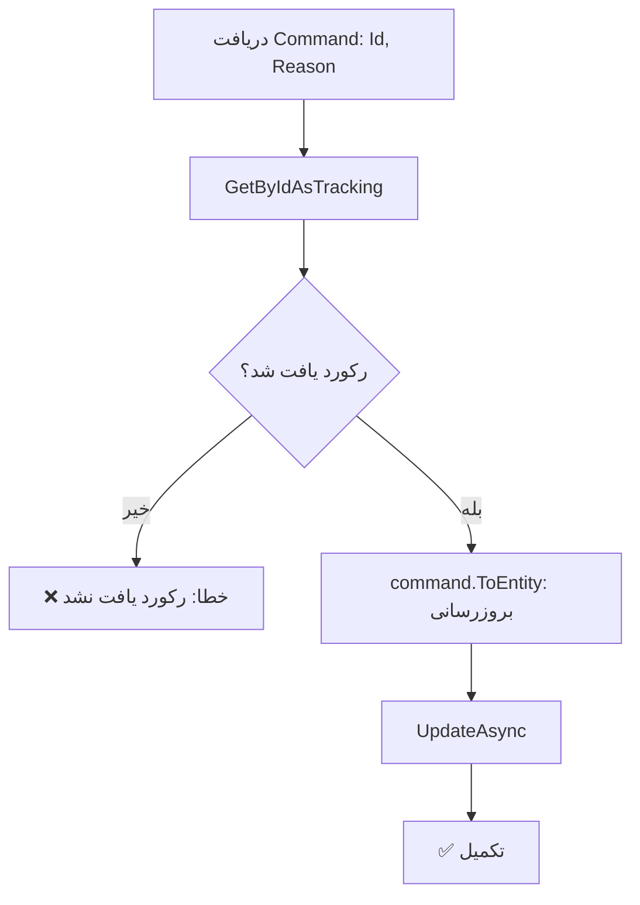

<div dir="rtl">

# UpdateStudentBlockServiceCommand.cs

**مسیر**: `Csis.Admission.Application/Features/BlockServices/Commands/UpdateStudentBlockServiceCommand.cs`

---

## 1. Purpose (هدف)

Command **ویرایش** اطلاعات انسداد سرویس دانشجو. این Command برای بروزرسانی علت انسداد یک سرویس استفاده می‌شود.

---

## 2. مستندات XML موجود

```csharp
/// <summary>ویرایش</summary>
```

**ناقص**: فاقد جزئیات

**پیشنهاد**:
```csharp
/// <summary>ویرایش علت انسداد سرویس دانشجو</summary>
```

---

## 3. خلاصه اتفاقات

**جریان اصلی**:
```
1. دریافت رکورد StudentBlockService بر اساس Id
2. اگر وجود نداشت → خطا
3. بروزرسانی با اطلاعات جدید (فقط Reason)
4. ذخیره تغییرات
```

---

## 4. اجزای اصلی

### Command:
```csharp
sealed record UpdateStudentBlockServiceCommand : IRequest
{
    int Id              // شناسه رکورد انسداد
    string Reason       // علت جدید
}
```

### Handler Dependencies:
- **IRepository<StudentBlockService>**: دسترسی به انسدادها

---

## 5. Flow



---

## 6. Business Rules

### BR-1: فقط Reason قابل ویرایش
- تنها فیلد `Reason` قابل بروزرسانی است
- `Codm`, `ServiceId`, `BlockDate` **غیرقابل تغییر** هستند

### BR-2: بررسی وجود رکورد
- اگر رکورد با `Id` وجود نداشته باشد → Exception

---

## 7. Dependencies

### Internal:
- `IRepository<StudentBlockService>`: CRUD

---

## 8. Input/Output

### Input:
```csharp
int Id              // شناسه رکورد انسداد
string Reason       // علت جدید
```

### Output:
```csharp
void (Task)
```

### Exceptions:
- **CommandValidationException**: "رکورد یافت نشد."

---

## 9. Side Effects

1. **بروزرسانی Reason**: فیلد Reason تغییر می‌کند
2. **Audit Fields**: UpdatedOn, UpdatedBy بروزرسانی می‌شوند

---

## 10. الگوهای استفاده شده

### ✅ Get-Update Pattern
```csharp
var entity = await repo.GetByIdAsTrackingAsync(id) 
    ?? throw new Exception("یافت نشد");
entity = command.ToEntity(entity);
await repo.UpdateAsync(entity);
```

---

## 11. Performance

- **Database Queries**: 1 SELECT + 1 UPDATE
- عملیات ساده

---

## 12. Security

- ⚠️ **Authorization**: نیاز به بررسی مجوز ویرایش
- ⚠️ **Validation**: بررسی نشده که آیا کاربر مجاز به ویرایش این رکورد است

---

## 13. نکات مهم

### 💡 Immutable Fields
- فقط `Reason` قابل تغییر است
- اگر نیاز به تغییر `ServiceId` یا `BlockDate` باشد، باید رکورد حذف و مجدداً ایجاد شود

### ⚠️ استفاده از SaveChanges Flag
```csharp
await repo.UpdateAsync(entity, saveChanges: true, cancellation);
```
- `saveChanges: true` یعنی بلافاصله در دیتابیس ذخیره شود

---

## 14. مثال استفاده

```csharp
// تغییر علت انسداد
var cmd = new UpdateStudentBlockServiceCommand {
    Id = 123,
    Reason = "علت جدیدتر: عدم تطابق با قوانین جدید"
};
await mediator.Send(cmd);
```

---

## 15. Related Commands

- **CreateStudentBlockServiceCommand**: ایجاد انسداد جدید
- **DeleteStudentBlockServiceCommand**: حذف انسداد

---

## 16. تغییرات پیشنهادی

### 1. بهبود Exception Message
```csharp
var block = await repo.GetByIdAsTrackingAsync(command.Id, false, cancellation)
    ?? throw new RecordNotFoundException($"انسداد با شناسه {command.Id} یافت نشد");
```

### 2. افزودن Authorization
```csharp
// بررسی مالکیت یا دسترسی
var block = await repo.GetByIdAsTrackingAsync(command.Id);
if (block == null)
    throw new RecordNotFoundException();

if (!await currentUser.CanEditBlockService(block.Codm))
    throw new UnauthorizedException();
```

### 3. Validation
```csharp
if (string.IsNullOrWhiteSpace(command.Reason))
    throw new CommandValidationException("علت انسداد الزامی است");
```

---

</div>
