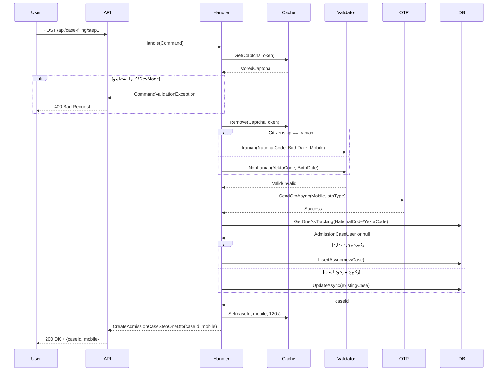

<div dir="rtl">

# CreateAdmissionCaseStep01InitiateCommand.cs

**مسیر**: `Csis.Admission.Application/Features/CaseFilings/Commands/Student/CreateAdmissionCaseStep01InitiateCommand.cs`

---

## 1. Purpose (هدف)

این فایل **گام اول از فرآیند 10 مرحله‌ای تشکیل پرونده پذیرش** را پیاده‌سازی می‌کند. این مرحله وظیفه **اعتبارسنجی هویت اولیه** و **ارسال OTP** به موبایل متقاضی را بر عهده دارد.

---

## 2. مستندات XML موجود

```csharp
/// <summary>ساخت توکن گام اول</summary>
```

**تکمیل شده توسط تحلیل کد**: این Command مسئول شروع فرآیند تشکیل پرونده با دریافت اطلاعات شناسایی اولیه (کد ملی/یکتا، تاریخ تولد، موبایل) و اعتبارسنجی کپچا است.

---

## 3. خلاصه اتفاقات (What Happens)

**جریان اصلی**:
1. دریافت اطلاعات اولیه شناسایی از کاربر (کد ملی/یکتا + تاریخ تولد + موبایل + کپچا)
2. اعتبارسنجی کد کپچا از `MemoryCache`
3. اعتبارسنجی هویت بر اساس تابعیت:
   - **ایرانی**: کد ملی + تاریخ تولد + موبایل
   - **غیرایرانی**: کد یکتا + تاریخ تولد
4. ارسال OTP به شماره موبایل
5. ایجاد یا به‌روزرسانی رکورد `AdmissionCaseUser` در دیتابیس
6. ذخیره موبایل در Cache با `caseId` به عنوان کلید (120 ثانیه)
7. بازگشت `caseId` و شماره موبایل

---

## 4. اجزای اصلی

### 4.1. Command (درخواست)

**کلاس**: `CreateAdmissionCaseFirstStepCommand`
- **نوع**: `sealed record`
- **Base Class**: `BaseCommandDto<CreateAdmissionCaseFirstStepCommand, AdmissionCaseUser, Guid>`
- **Interface**: `IRequest<CreateAdmissionCaseStepOneDto>` (MediatR)

**Properties**:
```csharp
string NationalCode       // کد ملی (برای ایرانی‌ها)
string YektaCode          // کد یکتا (برای غیرایرانی‌ها)
Citizenship Citizenship   // تابعیت (Iranian/NonIranian)
string BirthDate          // تاریخ تولد (فرمت رشته)
string Mobile             // شماره موبایل
string CaptchaToken       // توکن کپچا
string CaptchaCode        // کد کپچا
```

**Custom Mapping**:
```csharp
void ReverseCustomMappings(...)
// تبدیل BirthDate از string به int با استفاده از StringDateToInt()
```

---

### 4.2. Handler (پردازش‌گر)

**کلاس**: `CreateAdmissionCaseCommandHandler`
- **نوع**: `internal sealed class`
- **Interface**: `IRequestHandler<CreateAdmissionCaseFirstStepCommand, CreateAdmissionCaseStepOneDto>`

**متدهای کلیدی**:

#### `Handle(command, cancellationToken)`
```csharp
async Task<CreateAdmissionCaseStepOneDto> Handle(...)
```
متد اصلی پردازش Command

#### `CheckCaptcha(command)`
```csharp
void CheckCaptcha(CreateAdmissionCaseFirstStepCommand command)
```
اعتبارسنجی کد کپچا

#### `CreateOrUpdateCase(command, cancellationToken)`
```csharp
async Task<Guid> CreateOrUpdateCase(...)
```
ایجاد یا به‌روزرسانی رکورد پرونده

---

## 5. Flow داخل فایل (Step-by-Step)

### Step 1: اعتبارسنجی کپچا
```
CheckCaptcha(command)
├─> دریافت کپچای ذخیره شده از MemoryCache با کلید CaptchaToken
├─> مقایسه با CaptchaCode ارسالی
├─> اگر مطابقت ندارد و محیط Dev نیست → پرتاب CommandValidationException
└─> حذف کپچا از Cache
```

### Step 2: اعتبارسنجی هویت
```
if (Citizenship == Iranian)
    ├─> identityValidator.Iranian(NationalCode, BirthDate, Mobile)
    └─> اعتبارسنجی با سرویس ثبت احوال یا دیتابیس داخلی
else
    ├─> identityValidator.NonIranian(YektaCode, BirthDate)
    └─> اعتبارسنجی غیرایرانی‌ها
```

### Step 3: ارسال OTP
```
otpSenderService.SendOtpAsync(Mobile, otpType, cancellationToken)
├─> otpType = نام کلاس + GUID (در محیط Dev)
└─> ارسال کد یکبار مصرف به موبایل
```

### Step 4: ایجاد/به‌روزرسانی پرونده
```
CreateOrUpdateCase(command, cancellationToken)
├─> جستجوی رکورد موجود بر اساس NationalCode یا YektaCode
├─> اگر وجود ندارد:
│   └─> ایجاد رکورد جدید AdmissionCaseUser
└─> اگر وجود دارد:
    └─> به‌روزرسانی رکورد موجود
```

### Step 5: ذخیره در Cache
```
memoryCacheService.Set(caseId, mobile, 120 seconds)
```

### Step 6: بازگشت نتیجه
```
return new CreateAdmissionCaseStepOneDto(caseId, mobile)
```

---

## 6. Dependencies (وابستگی‌ها)

### 6.1. Injected Dependencies (Constructor Injection)

| Dependency | Type | Purpose |
|-----------|------|---------|
| `identityValidator` | `IdentityValidator` | اعتبارسنجی هویت ایرانی و غیرایرانی |
| `otpSenderService` | `IOtpSenderService` | ارسال کد OTP به موبایل |
| `contextAccessor` | `IHttpContextAccessor` | دسترسی به HttpContext (برای تشخیص Dev Mode) |
| `memoryCacheService` | `IMemoryCacheService` | مدیریت کش حافظه (کپچا + موبایل) |
| `httpContextAccessor` | `IHttpContextAccessor` | دسترسی دوم به HttpContext |
| `requestRepo` | `IRepository<AdmissionCaseUser, Guid>` | Repository برای ذخیره/بازیابی پرونده |
| `logger` | `ILogger<CreateAdmissionCaseCommandHandler>` | ثبت لاگ |

**یادداشت**: `IHttpContextAccessor` دو بار تزریق شده (تکراری) - احتمالاً یکی اضافی است.

### 6.2. لینک به مستندات وابستگی‌ها

- [IdentityValidator](#) - TODO
- [IOtpSenderService](#) - TODO
- [IMemoryCacheService](#) - TODO
- [IRepository](#) - TODO
- [AdmissionCaseUser Entity](#) - TODO

---

## 7. Business Rules (قوانین کسب‌وکار)

### BR-1: اعتبارسنجی کپچا
- کد کپچا باید با کد ذخیره شده در Cache مطابقت داشته باشد
- **استثنا**: در محیط Dev این چک نادیده گرفته می‌شود
- کپچا بعد از استفاده حذف می‌شود (یکبار مصرف)

### BR-2: اعتبارسنجی هویت بر اساس تابعیت
- **ایرانی‌ها**: نیاز به کد ملی + تاریخ تولد + موبایل
- **غیرایرانی‌ها**: نیاز به کد یکتا + تاریخ تولد

### BR-3: ارسال OTP
- OTP به موبایل ارسالی ارسال می‌شود
- در محیط Dev، یک GUID به نوع OTP اضافه می‌شود (احتمالاً برای جلوگیری از کش شدن)

### BR-4: Idempotency (تکرارپذیری)
- اگر کاربر قبلاً با همین کد ملی/یکتا ثبت‌نام کرده، رکورد موجود به‌روزرسانی می‌شود
- پرونده جدید ایجاد نمی‌شود

### BR-5: Session Management
- موبایل کاربر با `caseId` به عنوان کلید در Cache ذخیره می‌شود (120 ثانیه)
- این برای لینک کردن مراحل بعدی استفاده می‌شود

---

## 8. Data Access

### 8.1. Entity Framework Core

**Entity**: `AdmissionCaseUser`

**عملیات**:

#### Query (خواندن):
```csharp
var admissionCaseUser = await requestRepo.GetOneAsTrackingAsync(
    x => (command.NationalCode != null && x.NationalCode == command.NationalCode) ||
         (command.YektaCode != null && x.YektaCode == command.YektaCode),
    false,
    cancellationToken
);
```
- **Tracking**: فعال (`AsTracking`) چون بعداً Update می‌شود
- **Single Record**: فقط یک رکورد
- **Filter**: بر اساس `NationalCode` یا `YektaCode`

#### Insert (درج):
```csharp
await requestRepo.InsertAsync(admissionCaseUser, true, cancellationToken);
```
- **SaveChanges**: فوری (`true`)

#### Update (به‌روزرسانی):
```csharp
await requestRepo.UpdateAsync(admissionCaseUser, true, cancellationToken);
```
- **SaveChanges**: فوری (`true`)

---

## 9. Error Handling (مدیریت خطا)

### 9.1. Exception Types

| Exception | شرط | پیام |
|-----------|------|------|
| `CommandValidationException` | کپچا اشتباه | "کد کپچا اشتباه است" |
| `ValidationException` | اعتبارسنجی هویت ناموفق | از `IdentityValidator` |
| `NotFoundException` | سرویس OTP در دسترس نباشد | از `IOtpSenderService` |

### 9.2. Validation (اعتبارسنجی ورودی)

اعتبارسنجی در `CreateAdmissionCaseFirstStepCommandValidator` انجام می‌شود:
- لینک: [Validator/CreateAdmissionCaseFirstStepCommandValidator.cs](#)

---

## 10. Observability (قابلیت مشاهده)

### 10.1. Logging

```csharp
logger.LogInformation("storedCaptcha : {StoredCaptcha}", storedCaptcha);
```
- سطح `Information`
- لاگ کد کپچای ذخیره شده (برای دیباگ)

**⚠️ نکته امنیتی**: لاگ کردن کد کپچا در Production خطرناک است.

### 10.2. Audit (ممیزی)

- این Command رکورد پرونده را ایجاد/به‌روزرسانی می‌کند
- احتمالاً `AuditInterceptor` در EF Core تغییرات را ثبت می‌کند
- لینک: [EF Core Interceptors در DataAccess.md](/docs/index/DataAccess.md)

---

## 11. Use Case های مرتبط

- **UC-030**: تشکیل پرونده دانشجوی جدید (Wizard 10 مرحله‌ای)
  - این Command **مرحله 1** از Wizard است
  - لینک: [UseCases.md - UC-030](/docs/index/UseCases.md)

**مراحل Wizard**:
1. ✅ **Step01**: هویت اولیه + OTP (این فایل)
2. Step02: تأیید OTP + موبایل
3. Step03: اعتبارسنجی حوزه
4. Step04: تأیید اطلاعات شناسنامه‌ای
5. Step05: آدرس
6. Step06: تصویر
7. Step07: حساب بانکی
8. Step08: اطلاعات شغلی
9. Step09: تکمیل اطلاعات
10. Step10: ایجاد کاربر

---

## 12. Risks & Notes (ریسک‌ها و نکات)

### 12.1. Security (امنیت)

⚠️ **CRITICAL**:
1. **کپچا غیرفعال در Dev Mode**: در محیط توسعه، کپچا چک نمی‌شود
   - ریسک: اگر شرط Dev Mode اشتباه تشخیص داده شود، آسیب‌پذیر است
2. **لاگ کردن کد کپچا**: در Production باید غیرفعال شود
3. **Double IHttpContextAccessor Injection**: یکی اضافی است
4. **Session در MemoryCache**: اگر سرور Restart شود، Session ها از بین می‌روند
   - بهتر است از Redis استفاده شود

### 12.2. Performance (کارایی)

- **Cache TTL**: 120 ثانیه برای Session مناسب است
- **Tracking Query**: نیاز به Tracking دارد چون Update می‌شود، اما اگر رکورد وجود نداشت، Tracking غیرضروری است
- **GUID در Dev Mode**: تأثیر جزئی

### 12.3. Concurrency (همزمانی)

⚠️ **Race Condition Potential**:
- اگر دو درخواست همزمان با یک کد ملی ارسال شوند:
  - ممکن است هر دو Insert کنند و Duplicate Key Error بگیرند
  - یا یکی Insert و دیگری Update کند
- **راه حل پیشنهادی**: استفاده از `Upsert` یا قفل در دیتابیس

### 12.4. Code Quality (کیفیت کد)

- ✅ استفاده از `sealed record` برای immutability
- ✅ استفاده از Primary Constructor (C# 12)
- ❌ تکراری بودن `IHttpContextAccessor`
- ❌ نام متد `CreateOrUpdateCase` نیاز به Refactoring دارد → `UpsertCase`

---

## 13. Test Ideas (ایده‌های تست)

### 13.1. Happy Path (مسیر موفق)
- کپچا صحیح + هویت معتبر → OTP ارسال شود + `caseId` برگردد
- کاربر جدید → Insert
- کاربر موجود → Update

### 13.2. Edge Cases (موارد لبه‌ای)
- کد کپچای منقضی شده (Cache خالی)
- کد ملی معتبر اما موبایل اشتباه
- درخواست همزمان با یک کد ملی
- محیط Dev → کپچا چک نشود

### 13.3. Security Tests (تست‌های امنیتی)
- Brute Force روی کپچا
- کد ملی نامعتبر
- SQL Injection در NationalCode (باید Parameterized باشد)

### 13.4. Integration Tests (تست‌های یکپارچه)
- اتصال به سرویس ثبت احوال (Mock)
- ارسال OTP واقعی (Mock)
- ذخیره در دیتابیس

---

## 14. نمودار جریان (Sequence Diagram)



---

## 15. خلاصه نکات کلیدی

| نکته | توضیح |
|------|-------|
| **نقش** | گام اول Wizard تشکیل پرونده |
| **ورودی** | کد ملی/یکتا + تاریخ تولد + موبایل + کپچا |
| **خروجی** | `caseId` + شماره موبایل |
| **اعتبارسنجی** | کپچا + هویت (ثبت احوال یا داخلی) |
| **Side Effect** | ارسال OTP + ذخیره Session در Cache |
| **Entity** | `AdmissionCaseUser` |
| **Pattern** | CQRS (Command) + Repository + Validator |
| **امنیت** | ⚠️ لاگ کپچا + Dev Mode Bypass |
| **کارایی** | ✅ Cache 120s + Tracking Query |
| **ریسک** | ⚠️ Race Condition در Insert/Update |

---

**مرتبط با**:
- [CreateAdmissionCaseStep02MobileCommand.cs](#) (مرحله بعد)
- [GenerateCaptchaCommand.cs](#) (تولید کپچا)
- [IdentityValidator](#)
- [IOtpSenderService](#)

</div>
