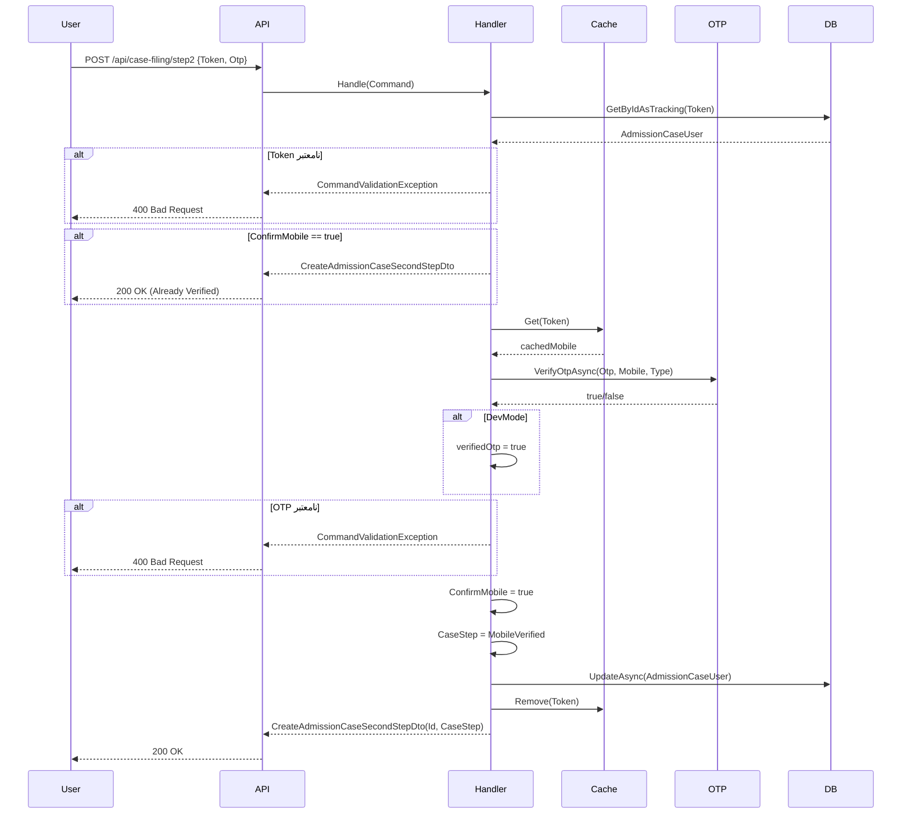

<div dir="rtl">

# CreateAdmissionCaseStep02MobileCommand.cs

**مسیر**: `Csis.Admission.Application/Features/CaseFilings/Commands/Student/CreateAdmissionCaseStep02MobileCommand.cs`

---

## 1. Purpose (هدف)

این فایل **گام دوم از فرآیند 10 مرحله‌ای تشکیل پرونده** را پیاده‌سازی می‌کند. وظیفه این مرحله **تأیید شماره موبایل** از طریق **اعتبارسنجی کد OTP** است که در مرحله قبل ارسال شده است.

---

## 2. مستندات XML موجود

```csharp
/// <summary>تایید موبایل گام دوم</summary>
```

**کامل**: این Command برای تأیید شماره موبایل کاربر با استفاده از کد OTP دریافتی استفاده می‌شود.

---

## 3. خلاصه اتفاقات (What Happens)

**جریان اصلی**:
1. دریافت `Token` (caseId) و کد `OTP` از کاربر
2. بازیابی رکورد `AdmissionCaseUser` از دیتابیس
3. بررسی وضعیت تأیید موبایل (اگر قبلاً تأیید شده، از مراحل بعدی رد شود)
4. دریافت شماره موبایل از `MemoryCache` با کلید `Token`
5. اعتبارسنجی کد OTP با سرویس `IOtpSenderService`
6. در صورت معتبر بودن:
   - تنظیم `ConfirmMobile = true`
   - تنظیم `CaseStep = MobileVerified`
   - حذف موبایل از Cache
7. بازگشت `caseId` و `CaseStep` جدید

---

## 4. اجزای اصلی

### 4.1. Command (درخواست)

**کلاس**: `CreateAdmissionCaseSecondStepCommand`
- **نوع**: `sealed record`
- **Interface**: `IRequest<CreateAdmissionCaseSecondStepDto>`

**Properties (Constructor Parameters)**:
```csharp
Guid Token    // شناسه پرونده (caseId)
string Otp    // کد OTP دریافتی از کاربر
```

---

### 4.2. Handler (پردازش‌گر)

**کلاس**: `ConfirmMobileCommandHandler`
- **نوع**: `internal sealed class`
- **Interface**: `IRequestHandler<CreateAdmissionCaseSecondStepCommand, CreateAdmissionCaseSecondStepDto>`

**متد کلیدی**:
```csharp
async Task<CreateAdmissionCaseSecondStepDto> Handle(
    CreateAdmissionCaseSecondStepCommand request,
    CancellationToken cancellationToken)
```

---

## 5. Flow داخل فایل (Step-by-Step)

```
1. بازیابی AdmissionCaseUser
   ├─> caseUserRepo.GetByIdAsTrackingAsync(Token)
   └─> اگر null → CommandValidationException("شناسه نامعتبر است.")

2. بررسی وضعیت تأیید قبلی
   if (ConfirmMobile == true)
       └─> رد کردن اعتبارسنجی و بازگشت نتیجه

3. دریافت موبایل از Cache
   └─> memoryCacheService.Get<string>(Token.ToString())

4. اعتبارسنجی OTP
   ├─> otpSenderService.VerifyOtpAsync(Otp, cachedMobile, "CreateAdmissionCaseFirstStepCommand")
   ├─> اگر DevMode → verifiedOtp = true (Bypass)
   └─> اگر نامعتبر → CommandValidationException("کد تایید موبایل نامعتبر است.")

5. به‌روزرسانی رکورد
   ├─> admissionCaseUser.ConfirmMobile = true
   ├─> admissionCaseUser.CaseStep = AdmissionCaseStep.MobileVerified
   └─> caseUserRepo.UpdateAsync(...)

6. حذف Cache
   └─> memoryCacheService.Remove(Token.ToString())

7. بازگشت نتیجه
   └─> CreateAdmissionCaseSecondStepDto(Id, CaseStep)
```

---

## 6. Dependencies (وابستگی‌ها)

### Injected Dependencies

| Dependency | Type | Purpose |
|-----------|------|---------|
| `otpSenderService` | `IOtpSenderService` | اعتبارسنجی کد OTP |
| `contextAccessor` | `IHttpContextAccessor` | تشخیص Dev Mode |
| `memoryCacheService` | `IMemoryCacheService` | دریافت/حذف موبایل از Cache |
| `caseUserRepo` | `IRepository<AdmissionCaseUser, Guid>` | دسترسی به پرونده |
| `mapper` | `IMapper` | (تزریق شده اما استفاده نشده) |

**یادداشت**: `IMapper` تزریق شده اما در کد استفاده نشده - احتمالاً اضافی است.

---

## 7. Business Rules (قوانین کسب‌وکار)

### BR-1: Idempotency (تکرارپذیری)
- اگر موبایل قبلاً تأیید شده باشد (`ConfirmMobile == true`)، دوباره اعتبارسنجی نمی‌شود
- نتیجه فعلی بازگردانده می‌شود

### BR-2: Session Validation
- `Token` باید با یک رکورد معتبر `AdmissionCaseUser` مطابقت داشته باشد
- شماره موبایل باید در Cache با کلید `Token` وجود داشته باشد (ذخیره شده در Step01)

### BR-3: OTP Validation
- کد OTP باید با کد ارسال شده در Step01 مطابقت داشته باشد
- **استثنا**: در Dev Mode اعتبارسنجی Bypass می‌شود

### BR-4: State Transition
- بعد از تأیید موبایل، `CaseStep` به `MobileVerified` تغییر می‌کند
- این برای کنترل جریان Wizard استفاده می‌شود

### BR-5: Cache Cleanup
- بعد از تأیید موفق، موبایل از Cache حذف می‌شود (دیگر نیازی نیست)

---

## 8. Data Access

### EF Core Operations

#### Query (خواندن):
```csharp
var admissionCaseUser = await caseUserRepo.GetByIdAsTrackingAsync(
    request.Token,
    cancellationToken: cancellationToken
)
```
- **Tracking**: فعال (چون Update می‌شود)
- **Entity**: `AdmissionCaseUser`

#### Update (به‌روزرسانی):
```csharp
await caseUserRepo.UpdateAsync(admissionCaseUser, cancellationToken: cancellationToken)
```
- فیلدهای تغییر یافته: `ConfirmMobile`, `CaseStep`

---

## 9. Error Handling (مدیریت خطا)

| Exception | شرط | پیام |
|-----------|------|------|
| `CommandValidationException` | Token نامعتبر | "شناسه نامعتبر است." |
| `CommandValidationException` | OTP نامعتبر | "کد تایید موبایل نامعتبر است." |

---

## 10. Observability (قابلیت مشاهده)

- **Logging**: هیچ لاگ صریحی در این Handler وجود ندارد
- **Audit**: تغییرات `AdmissionCaseUser` توسط EF Interceptor ثبت می‌شود

---

## 11. Use Case های مرتبط

- **UC-030**: تشکیل پرونده دانشجوی جدید (Wizard 10 مرحله‌ای)
  - این Command **مرحله 2** از Wizard است
  - مرحله قبل: [CreateAdmissionCaseStep01InitiateCommand.md](./CreateAdmissionCaseStep01InitiateCommand.md)
  - مرحله بعد: [CreateAdmissionCaseStep03ValidateForRegistrationCommand.cs](#)

---

## 12. Risks & Notes (ریسک‌ها و نکات)

### 12.1. Security (امنیت)

⚠️ **CRITICAL**:
1. **OTP Bypass در Dev Mode**: اگر شرط Dev Mode اشتباه تشخیص داده شود، آسیب‌پذیر است
2. **Test Code در Production**: خطوط 22-31 حاوی کد تست است که باید حذف شود
   ```csharp
   //if ( request.Otp == "1234" ) { ... }
   ```
3. **Session Hijacking**: اگر Token لو برود، مهاجم می‌تواند OTP بزند

### 12.2. Performance (کارایی)

- ✅ استفاده از Tracking فقط زمانی که Update لازم است
- ✅ Cache Cleanup بعد از استفاده

### 12.3. Code Quality (کیفیت کد)

- ❌ `IMapper` تزریق شده اما استفاده نشده → باید حذف شود
- ❌ کد تست کامنت شده باید حذف شود
- ✅ استفاده از `sealed record` برای immutability

---

## 13. Test Ideas (ایده‌های تست)

### Happy Path:
- Token معتبر + OTP صحیح → `ConfirmMobile = true` + `CaseStep = MobileVerified`

### Edge Cases:
- Token نامعتبر → Exception
- OTP اشتباه → Exception
- موبایل قبلاً تأیید شده → Idempotent Return
- Cache خالی (موبایل منقضی شده) → Exception از OTP Service

### Security Tests:
- OTP Brute Force
- Token Reuse بعد از تأیید

---

## 14. نمودار جریان (Sequence Diagram)



---

## 15. خلاصه نکات کلیدی

| نکته | توضیح |
|------|-------|
| **نقش** | گام دوم Wizard: تأیید موبایل |
| **ورودی** | Token (caseId) + OTP |
| **خروجی** | caseId + CaseStep |
| **اعتبارسنجی** | OTP Verification |
| **State Transition** | `CaseStep` → `MobileVerified` |
| **Idempotency** | ✅ اگر قبلاً تأیید شده، دوباره انجام نمی‌شود |
| **Cache Cleanup** | ✅ موبایل بعد از تأیید حذف می‌شود |
| **امنیت** | ⚠️ کد تست کامنت شده + Dev Mode Bypass |
| **کارایی** | ✅ Tracking Query + Cache Cleanup |
| **Unused Dependency** | ❌ IMapper |

---

**مرتبط با**:
- [CreateAdmissionCaseStep01InitiateCommand.md](./CreateAdmissionCaseStep01InitiateCommand.md) (مرحله قبل)
- [CreateAdmissionCaseStep03ValidateForRegistrationCommand.cs](#) (مرحله بعد)
- [IOtpSenderService](#)

</div>
