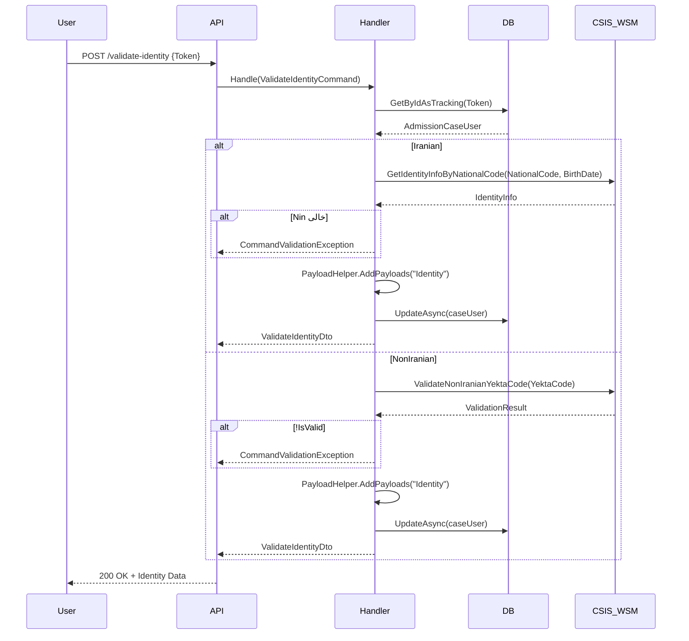

<div dir="rtl">

# CreateAdmissionCaseStep04ValidateIdentityCommand.cs

**مسیر**: `Csis.Admission.Application/Features/CaseFilings/Commands/Student/CreateAdmissionCaseStep04ValidateIdentityCommand.cs`

---

## 1. Purpose (هدف)

این فایل مسئول **احراز هویت دانشجو** از طریق **سرویس ثبت احوال (CSIS WSM)** است. اطلاعات شناسنامه‌ای از سرویس خارجی دریافت شده و در `Payloads` ذخیره می‌شود.

---

## 2. مستندات XML موجود

```csharp
/// <summary>
/// احراز هویت
/// </summary>
```

**کامل**: این Command اطلاعات هویتی دانشجو (نام، نام خانوادگی، نام پدر، جنسیت، تاریخ تولد) را از سرویس ثبت احوال بازیابی می‌کند.

---

## 3. خلاصه اتفاقات (What Happens)

**جریان اصلی**:
1. دریافت `Token` (caseId)
2. بازیابی رکورد `AdmissionCaseUser`
3. فراخوانی سرویس CSIS WSM بر اساس تابعیت:
   - **ایرانی**: `GetIdentityInfoByNationalCode`
   - **غیرایرانی**: `ValidateNonIranianYektaCode`
4. اعتبارسنجی پاسخ سرویس
5. ذخیره اطلاعات هویتی در `Payloads` با کلید `"Identity"`
6. بازگشت `ValidateIdentityDto`

---

## 4. اجزای اصلی

### 4.1. Command

**کلاس**: `ValidateIdentityCommand`
- **نوع**: `sealed record`
- **Interface**: `IRequest<ValidateIdentityDto>`
- **Properties**: `Guid Token`

---

### 4.2. Handler

**کلاس**: `ValidateIdentityCommandHandler`

**Injected Dependencies**:
- `ILogger<ValidateIdentityCommandHandler>`
- `IRepository<AdmissionCaseUser, Guid>`
- `ICsisWsmService` - سرویس ثبت احوال

---

## 5. Flow داخل فایل

```
1. بازیابی AdmissionCaseUser
   └─> GetByIdAsTracking(Token)

2. switch (Citizenship)
   
   case Iranian:
   ├─> csisWsmService.GetIdentityInfoByNationalCode(NationalCode, BirthDate)
   ├─> اگر Nin خالی → CommandValidationException("کد ملی نامعتبر")
   ├─> ساخت ValidateIdentityDto
   ├─> PayloadHelper.AddPayloadsToString(result, "Identity")
   └─> UpdateAsync() + return result
   
   case NonIranian:
   ├─> csisWsmService.ValidateNonIranianYektaCode(YektaCode)
   ├─> اگر !IsValid() → CommandValidationException("یکتا نامعتبر")
   ├─> ساخت ValidateIdentityDto
   ├─> PayloadHelper.AddPayloadsToString(result, "Identity")
   └─> UpdateAsync() + return result
   
   default:
   └─> CommandValidationException("نوع تابعیت نامعتبر")
```

---

## 6. Dependencies

| Dependency | Purpose |
|-----------|---------|
| `ICsisWsmService` | سرویس ثبت احوال |
| `IRepository<AdmissionCaseUser, Guid>` | دسترسی به پرونده |
| `ILogger` | لاگ |
| `PayloadHelper` | مدیریت Payloads |

**لینک**:
- [ICsisWsmService](#) - TODO
- [PayloadHelper](#) - TODO

---

## 7. Business Rules

### BR-1: اعتبارسنجی هویت
- **ایرانی**: کد ملی + تاریخ تولد باید در ثبت احوال معتبر باشد
- **غیرایرانی**: کد یکتا باید معتبر باشد

### BR-2: Payload Storage
- اطلاعات هویتی در فیلد `Payloads` (JSON string) ذخیره می‌شود
- کلید: `"Identity"`
- این برای جلوگیری از فراخوانی‌های تکراری به سرویس خارجی است

### BR-3: Logging
- کد ملی/یکتای نامعتبر لاگ می‌شود (سطح Warning)

---

## 8. Data Access

### EF Core:
```csharp
// Query + Update
var caseUser = await repository.GetByIdAsTrackingAsync(request.Token, ...)
caseUser.Payloads = PayloadHelper.AddPayloadsToString(...)
await repository.UpdateAsync(caseUser, true, cancellationToken)
```

---

## 9. Error Handling

| Exception | شرط | پیام |
|-----------|------|------|
| `CommandValidationException` | Token نامعتبر | "شناسه نامعتبر است." |
| `CommandValidationException` | کد ملی نامعتبر | "کد ملی وارد شده نامعتبر است" |
| `CommandValidationException` | کد یکتا نامعتبر | "شماره یکتا وارد شده نامعتبر است" |
| `CommandValidationException` | تابعیت نامعتبر | "نوع تابعیت نامعتبر است" |

---

## 10. Observability

### Logging:
```csharp
logger.LogWarning("National code {nationalCode} is not valid according to CSIS WSM", ...)
logger.LogWarning("Yekta code {yektaCode} is not valid according to CSIS WSM", ...)
```

---

## 11. Use Case های مرتبط

- **UC-030**: تشکیل پرونده دانشجوی جدید
  - **Sub-Step در مرحله 4**: احراز هویت با ثبت احوال
  - مرحله قبل: [Step03](./CreateAdmissionCaseStep03ValidateForRegistrationCommand.md)
  - مرحله بعد: [ConfirmIdentityInformationCommand](#)

---

## 12. Risks & Notes

### امنیت:
- ✅ استفاده از سرویس رسمی ثبت احوال
- ⚠️ **PII Logging**: کد ملی در لاگ ذخیره می‌شود (ریسک امنیتی)
  - پیشنهاد: Masking یا حذف در Production

### کارایی:
- ⚠️ درخواست به سرویس خارجی کند است
- ✅ نتیجه در `Payloads` کش می‌شود (جلوگیری از فراخوانی تکراری)

### وابستگی خارجی:
- ⚠️ اگر سرویس CSIS WSM Down باشد، فرآیند متوقف می‌شود
- پیشنهاد: Circuit Breaker + Retry Policy

---

## 13. Test Ideas

### Unit Tests:
- Mock `ICsisWsmService` → بررسی ذخیره Payload
- کد ملی نامعتبر → Exception

### Integration Tests:
- فراخوانی واقعی سرویس ثبت احوال (Staging)

---

## 14. نمودار جریان



---

## 15. خلاصه نکات کلیدی

| نکته | توضیح |
|------|-------|
| **نقش** | احراز هویت با ثبت احوال |
| **ورودی** | Token |
| **خروجی** | ValidateIdentityDto (نام، نام خانوادگی، پدر، جنسیت، تاریخ تولد) |
| **سرویس خارجی** | CSIS WSM (ثبت احوال) |
| **Caching** | ذخیره در Payloads |
| **امنیت** | ⚠️ PII در لاگ |
| **کارایی** | ⚠️ وابستگی به سرویس خارجی |
| **Resilience** | نیاز به Circuit Breaker |

</div>
