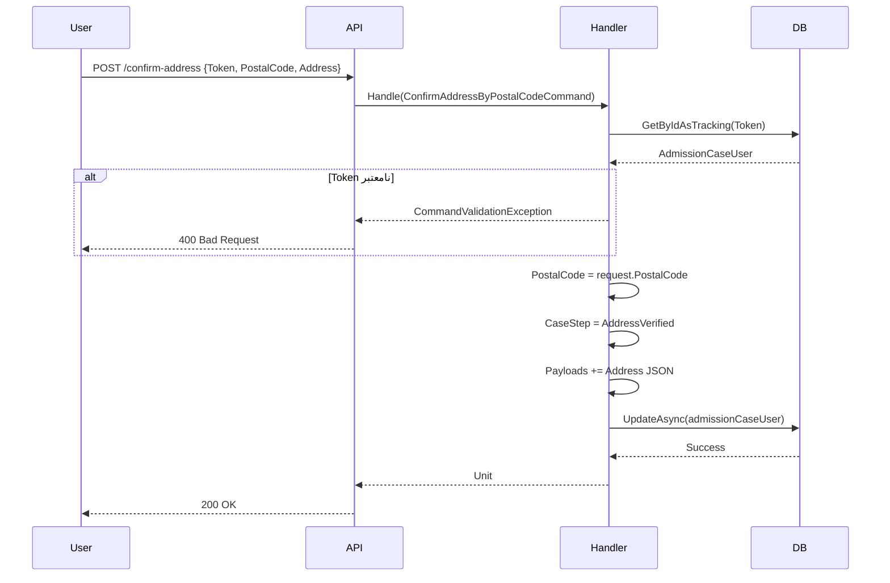

<div dir="rtl">

# CreateAdmissionCaseStep05ConfirmAddressByPostalCodeCommand.cs

**مسیر**: `Csis.Admission.Application/Features/CaseFilings/Commands/Student/CreateAdmissionCaseStep05ConfirmAddressByPostalCodeCommand.cs`

---

## 1. Purpose (هدف)

این Command **گام پنجم Wizard تشکیل پرونده** است. پس از دریافت اطلاعات آدرس از Query، کاربر آدرس را تأیید کرده و این Command آن را در `Payloads` ذخیره می‌کند.

---

## 2. مستندات XML موجود

```csharp
/// <summary>
/// تایید آدرس بر اساس کدپستی
/// </summary>
```

**کامل**: تأیید و ذخیره آدرس کامل دانشجو بر اساس کد پستی.

---

## 3. خلاصه اتفاقات (What Happens)

**جریان اصلی**:
1. دریافت `Token`، `PostalCode`، و `Address` (DTO)
2. بازیابی `AdmissionCaseUser`
3. ذخیره کد پستی در فیلد `PostalCode`
4. ذخیره اطلاعات کامل آدرس در `Payloads` با کلید `"Address"`
5. تغییر `CaseStep` به `AddressVerified`
6. ذخیره تغییرات

---

## 4. اجزای اصلی

### 4.1. Command

**کلاس**: `ConfirmAddressByPostalCodeCommand`
- **نوع**: `sealed record`
- **Interface**: `IRequest`

**Properties**:
```csharp
Guid Token                                  // توکن پرونده
long PostalCode                             // کد پستی 10 رقمی
AddressFromExternalServiceDto Address       // اطلاعات کامل آدرس
```

---

### 4.2. Handler

**کلاس**: `ConfirmAddressByPostalCodeCommandHandler`

**Injected Dependencies**:
- `IRepository<AdmissionCaseUser, Guid>` - دسترسی به پرونده

---

## 5. Flow داخل فایل

```
1. بازیابی AdmissionCaseUser
   └─> GetByIdAsTracking(Token)

2. به‌روزرسانی اطلاعات
   ├─> PostalCode = request.PostalCode
   ├─> CaseStep = AddressVerified
   └─> Payloads = PayloadHelper.AddPayloadsToString(Address, "Address")

3. ذخیره تغییرات
   └─> UpdateAsync()
```

---

## 6. Dependencies

| Dependency | Purpose |
|-----------|---------|
| `IRepository<AdmissionCaseUser, Guid>` | دسترسی به پرونده |
| `PayloadHelper` | مدیریت Payloads (JSON) |

---

## 7. Business Rules

### BR-1: ذخیره کد پستی
- کد پستی در فیلد `PostalCode` ذخیره می‌شود (10 رقمی)

### BR-2: ذخیره اطلاعات کامل در Payloads
- اطلاعات کامل آدرس (استان، شهر، منطقه، خیابان، ...) در `Payloads` ذخیره می‌شود
- کلید: `"Address"`

### BR-3: State Transition
- بعد از تأیید → `CaseStep = AddressVerified`

---

## 8. Data Access

### EF Core:
```csharp
// Query + Update
var admissionCaseUser = await userRepository.GetByIdAsTrackingAsync(Token, ...)
admissionCaseUser.PostalCode = PostalCode
admissionCaseUser.CaseStep = AdmissionCaseStep.AddressVerified
admissionCaseUser.Payloads = PayloadHelper.AddPayloadsToString(Address, "Address")
await userRepository.UpdateAsync(admissionCaseUser, ...)
```

---

## 9. Error Handling

| Exception | شرط | پیام |
|-----------|------|------|
| `CommandValidationException` | Token نامعتبر | "شناسه نامعتبر است." |

---

## 10. Use Case های مرتبط

- **UC-030**: تشکیل پرونده دانشجوی جدید (Wizard)
  - **مرحله 5b**: تأیید آدرس (Command)
  - مرحله قبل: [GetAddressByPostalCodeQuery](../Queries/CreateAdmissionCaseStep05GetAddressByPostalCodeQuery.md)
  - مرحله بعد: [Step06 - تصویر پروفایل](#)

---

## 11. Risks & Notes

### امنیت:
- ✅ اعتبارسنجی Token

### کارایی:
- ✅ عملیات سبک (فقط Update)

### Code Quality:
- ✅ استفاده از `PayloadHelper` برای مدیریت JSON
- ✅ ذخیره کد پستی + اطلاعات کامل

---

## 12. Test Ideas

### Happy Path:
- Token معتبر + Address → ذخیره موفق

### Edge Cases:
- Token نامعتبر → Exception
- `Address` null یا خالی → بررسی Validation

---

## 13. نمودار جریان



---

## 14. خلاصه نکات کلیدی

| نکته | توضیح |
|------|-------|
| **نقش** | گام پنجم Wizard (Command): تأیید آدرس |
| **ورودی** | Token + PostalCode + AddressDto |
| **خروجی** | بدون خروجی (Unit) |
| **ذخیره** | PostalCode (فیلد) + Address (Payloads) |
| **State Transition** | → AddressVerified |
| **پیش‌نیاز** | GetAddressByPostalCodeQuery |

---

**Flow کامل گام پنجم**:
1. کاربر کد پستی را وارد می‌کند
2. Frontend: `GET /address?postalCode=xxx` → [GetAddressByPostalCodeQuery](../Queries/CreateAdmissionCaseStep05GetAddressByPostalCodeQuery.md)
3. نمایش آدرس به کاربر
4. کاربر تأیید می‌کند
5. Frontend: `POST /confirm-address` → [ConfirmAddressByPostalCodeCommand](#) (این فایل)

</div>
