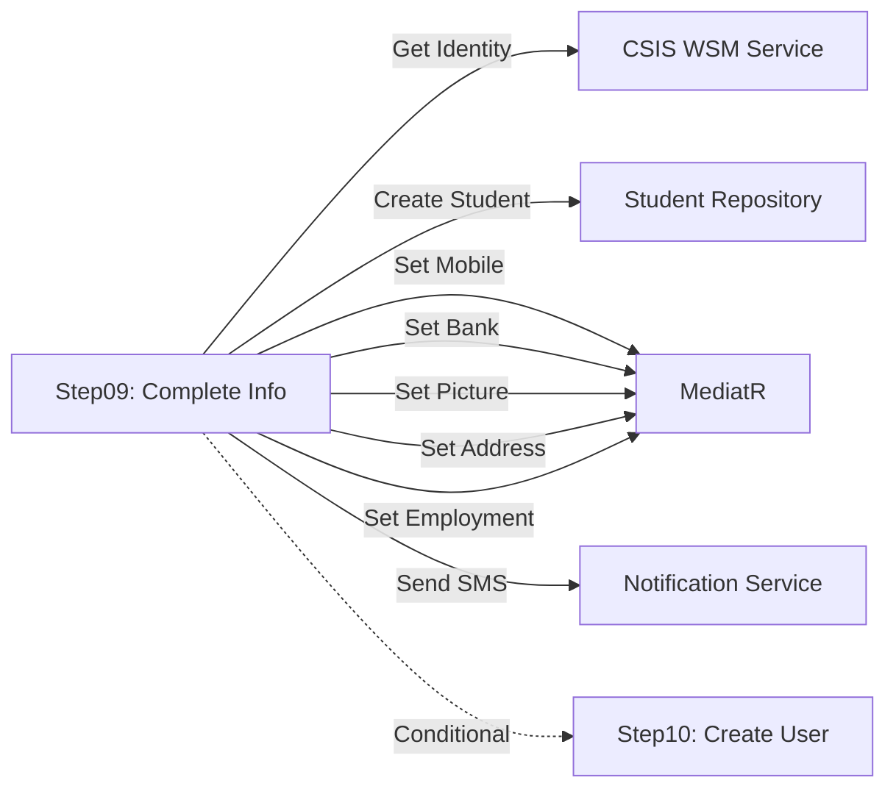

<div dir="rtl">

# CreateAdmissionCaseStep09CompleteInformationCaseFilingCommand.cs

**مسیر**: `Csis.Admission.Application/Features/CaseFilings/Commands/Student/CreateAdmissionCaseStep09CompleteInformationCaseFilingCommand.cs`

---

## 1. Purpose (هدف)

**گام نهم Wizard (بحرانی‌ترین مرحله)**: تکمیل فرآیند تشکیل پرونده و **ثبت نهایی دانشجو در سیستم**. این مرحله:
1. تمام اطلاعات Wizard را جمع‌آوری کرده
2. **رکورد اصلی دانشجو** را در جداول پایگاه داده ایجاد می‌کند
3. **CODM** (شناسه یکتا دانشجو) صادر می‌کند
4. تمام Payloads را به جداول مجزا منتقل می‌کند
5. SMS تأیید ارسال می‌کند

---

## 2. خلاصه اتفاقات

**جریان اصلی (Pipeline)**:
```
1. دریافت اطلاعات هویتی از CSIS WSM (ایرانی/غیرایرانی)
2. ایجاد StudentRegistrationCommand
3. ثبت دانشجو → دریافت CODM
4. به‌روزرسانی CaseFillingRequest با CODM
5. Set StudentMobile (از Payloads)
6. Set BankAccount (از Payloads)
7. Set ProfilePicture (از Payloads + AI Analysis)
8. Set Address (از Payloads)
9. Set Employment (از Payloads)
10. Set CommissionStatus (اگر ApprovalCenter = Commission)
11. ارسال SMS با CODM به دانشجو
12. CaseStep = CodmSendBySms
13. (اختیاری) اگر DirectRegistration یا StudentToEmployee → ایجاد کاربر (Step10)
```

---

## 3. اجزای اصلی

### Command:
```csharp
sealed record CompleteInformationCaseFilingCommand(
    AdmissionCaseUserDto CaseUser,
    RequestFlow Flow        // DirectRegistration | StudentToEmployee | Normal
) : IRequest<long>          // بازگشت CODM
```

### Handler Dependencies (12 وابستگی):
- `ILogger<...>`
- `ICsisAuthenticatedUserService` - کاربر فعلی
- `IEmployeeDataService` - اطلاعات کارمند
- `IOptions<ImageAnalysisOption>`
- `IRepository<AdmissionCaseUser, Guid>`
- `IRepository<CaseFillingRequest, long>`
- `ICsisWsmService` - **دریافت اطلاعات هویتی**
- `IStudentRepository` - **ثبت دانشجو**
- `IMediator` - ارسال Commands فرعی
- `ICsisNotificationAdvancedService` - **ارسال SMS**

---

## 4. Flow تفصیلی

### Phase 1: دریافت اطلاعات هویتی
```
switch (Citizenship)
    case Iranian:
        ├─> csisWsmService.GetIdentityInfoByNationalCode()
        └─> StudentRegistrationCommandPrc {
              Name, Family, FatherName, BirthDate, ShenasnameSerial,
              NationalCode, Gender, IsDead, IsSadat,
              CaseValidityDate: +1 year (دانشجو) یا +3 months (غیردانشجو)
            }
    
    case NonIranian:
        ├─> csisWsmService.ValidateNonIranianYektaCode()
        └─> StudentRegistrationCommandPrc { ... }
```

### Phase 2: ثبت دانشجو
```
studentRepo.CreateStudentRegistrationAsync(command)
├─> اگر موفق:
│   ├─> دریافت CODM
│   ├─> به‌روزرسانی CaseFillingRequest.RecordId = CODM
│   └─> به‌روزرسانی AdmissionCaseUser.RequestId = CODM
└─> اگر ناموفق:
    └─> CommandValidationException
```

### Phase 3: انتقال Payloads به جداول اصلی
```
await SetStudentMobileAsync()
    └─> Send UpdateStudentMobileForCompleteInfoRegistrationCommand

await SetStudentBankAccountAsync()
    └─> Parse Payloads["BankAccount"]
    └─> Send UpdateStudentBankAccountCommand

await SetStudentProfilePictureAsync()
    └─> Parse Payloads["Picture"]
    └─> Send UpdateStudentProfilePictureCommand (+ AI Analysis)

await SetStudentAddressAsync()
    └─> Parse Payloads["Address"]
    └─> Send CreateOrUpdateStudentAddressCommand

await SetStudentEmploymentAsync()
    └─> Parse Payloads["Employment"]
    └─> Send CreateOrUpdateStudentEmploymentCommand

await SetCommissionStatusAsync()
    └─> اگر ApprovalCenter == Commission
        └─> studentRepo.SetCommissionStatus(BranchExpertActionDone)
```

### Phase 4: اطلاع‌رسانی
```
await NotifyUserAsync(CODM)
    └─> SendMessageToStudent("کد مرکز شما: {CODM}")
    └─> DeliveryChannel: SMS

CaseStep = CodmSendBySms
UpdateAsync()
```

### Phase 5: ایجاد کاربر (شرطی)
```
if (RequestFlow == DirectRegistration && Employee.IsSenior)
OR (RequestFlow == StudentToEmployee)
    └─> Send CreateAdmissionCaseStepCreateUserCommand(CODM, randomPassword)
```

---

## 5. Business Rules

### BR-1: CaseValidityDate (تاریخ اعتبار پرونده)
- **دانشجو فعال**: +1 سال
- **غیر دانشجو**: +3 ماه

### BR-2: IsSadat (سادات)
- اگر نام شروع به "سید" یا پایان به "سادات" → `IsSadat = true`

### BR-3: RequestFlow (جریان درخواست)
- **Normal**: فقط ثبت دانشجو
- **DirectRegistration** (توسط کارمند ارشد): ثبت + ایجاد کاربر
- **StudentToEmployee**: ثبت + ایجاد کاربر

### BR-4: Commission Status
- اگر `ApprovalCenter == Commission` → به‌روزرسانی وضعیت کمیسیون

### BR-5: Notification
- SMS حاوی CODM به دانشجو ارسال می‌شود

---

## 6. Error Handling

### Exceptions:
- `CommandValidationException("خطا در به‌روزرسانی موبایل")`
- `CommandValidationException("خطا در ایجاد شماره حساب")`
- `CommandValidationException("خطا در آپلود تصویر پروفایل")`
- `CommandValidationException("خطا در ثبت آدرس")`
- `CommandValidationException("خطا در ثبت اطلاعات شغلی")`

**یادداشت**: خطاها دقیق نیستند - فقط نام عملیات را می‌گویند (Exception اصلی پنهان می‌شود)

---

## 7. Risks & Notes

### امنیت:
- ✅ اعتبارسنجی کامل در مراحل قبل
- ✅ تشخیص سطح کاربر برای ایجاد User

### کارایی:
- ⚠️ **10+ درخواست پشت سر هم** (Sequential)
  - 2x CSIS WSM
  - 1x Student Registration
  - 6x Mediator.Send
  - 1x Notification
- **پیشنهاد**: بخش‌هایی از Pipeline را Async کنید (مثلاً Notification)

### Resilience:
- ⚠️ اگر یکی از SetStudent... ناموفق شود:
  - دانشجو ثبت شده اما اطلاعات ناقص است
  - **Transaction Boundary نامشخص**
- **پیشنهاد**: Saga Pattern یا Rollback

### Code Quality:
- ❌ `//TODO: Refactor All SetStudent... Methods` (خود کد اعتراف کرده)
- ❌ Exception اصلی در catch پنهان می‌شود
- ❌ پارامتر `-1` در همه جا (مشکوک)

---

## 8. Use Case های مرتبط

- **UC-030**: تشکیل پرونده (Wizard)
  - **مرحله 9**: تکمیل و ثبت نهایی ⭐ **بحرانی‌ترین مرحله**
  - این مرحله **نقطه بازگشت ندارد** (Point of No Return)
  - مرحله قبل: [Step08 - اشتغال](./CreateAdmissionCaseStep08ConfirmEmploymentCommand.md)
  - مرحله بعد: [Step10 - ایجاد کاربر](#) (شرطی)

---

## 9. Dependencies Graph



---

## 10. خلاصه نکات کلیدی

| نکته | توضیح |
|------|-------|
| **نقش** | گام نهم Wizard: ثبت نهایی دانشجو ⭐ |
| **ورودی** | AdmissionCaseUserDto + RequestFlow |
| **خروجی** | CODM (long) |
| **عملیات** | 10+ عملیات Sequential |
| **Point of No Return** | ✅ بعد از این مرحله برگشت ندارد |
| **CODM** | شناسه یکتا دانشجو صادر می‌شود |
| **Notification** | SMS با CODM |
| **State Transition** | → CodmSendBySms |
| **کارایی** | ⚠️ کند (Sequential Pipeline) |
| **Resilience** | ⚠️ نیاز به Saga/Rollback |
| **Refactoring** | ❌ TODO در کد |

---

**نکته بحرانی**: این مرحله **هسته اصلی** Wizard است. اگر در مراحل قبل خطایی رخ دهد، قابل اصلاح است. اما بعد از این مرحله، دانشجو در سیستم ثبت شده و فقط می‌توان اطلاعات را ویرایش کرد.

</div>
