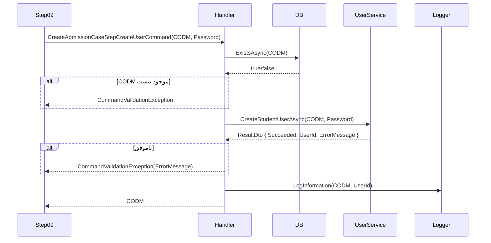

<div dir="rtl">

# CreateAdmissionCaseStep10CreateUserCommand.cs

**مسیر**: `Csis.Admission.Application/Features/CaseFilings/Commands/Student/CreateAdmissionCaseStep10CreateUserCommand.cs`

---

## 1. Purpose (هدف)

**گام دهم Wizard (مرحله نهایی - شرطی)**: ایجاد **کاربر سامانه** برای دانشجو. این مرحله فقط در شرایط خاص اجرا می‌شود:
- **DirectRegistration** توسط کارمند ارشد
- **StudentToEmployee** (دانشجو به کارمند)

---

## 2. خلاصه اتفاقات

**جریان اصلی**:
1. بررسی وجود دانشجو با CODM
2. فراخوانی سرویس User Management
3. ایجاد کاربر با رمز عبور رندوم
4. لاگ کردن UserId جدید
5. بازگشت CODM

---

## 3. اجزای اصلی

### Command:
```csharp
sealed record CreateAdmissionCaseStepCreateUserCommand(
    int Codm,           // شناسه دانشجو
    string Password     // رمز عبور تولید شده (10 کاراکتر Guid)
) : IRequest<int>
```

### Handler Dependencies:
- `ICsisUsersService` - **سرویس مدیریت کاربران**
- `IRepository<StudentSummary>` - بررسی وجود دانشجو
- `ILogger<...>`

---

## 4. Flow

```
1. بررسی وجود دانشجو
   ├─> repository.ExistsAsync(x => x.Codm == Codm)
   └─> اگر وجود نداشت → CommandValidationException

2. ایجاد کاربر
   └─> csisUsersService.CreateStudentUserAsync(Codm, Password)

3. بررسی نتیجه
   ├─> اگر موفق:
   │   ├─> logger.LogInformation(UserId)
   │   └─> return Codm
   └─> اگر ناموفق:
       └─> CommandValidationException(ErrorMessage)
```

---

## 5. Business Rules

### BR-1: شرطی بودن
این Command فقط در موارد زیر فراخوانی می‌شود:
- **DirectRegistration** (ثبت مستقیم توسط کارمند ارشد)
- **StudentToEmployee** (تبدیل دانشجو به کارمند)

### BR-2: Password Generation
- رمز عبور: 10 کاراکتر اول یک Guid
- مثال: `"3f4b9c2d-a"`
- **یادداشت**: رمز باید به دانشجو ارسال شود (احتمالاً در Step09 یا جداگانه)

### BR-3: User Creation
- کاربر در سیستم مدیریت هویت (Identity Server) ایجاد می‌شود
- نقش: Student

---

## 6. Error Handling

| Exception | شرط | پیام |
|-----------|------|------|
| `CommandValidationException` | CODM وجود ندارد | "طلبه ای با این کد مرکز یافت نشد" |
| `CommandValidationException` | ایجاد کاربر ناموفق | `ErrorMessage` از سرویس |

---

## 7. Observability

### Logging:
```csharp
logger.LogInformation($"User created for student with Codm: {Codm}, UserId: {resultIds.ToJson()}")
```
- سطح: Information
- محتوا: CODM + UserId جدید

---

## 8. Risks & Notes

### امنیت:
- ⚠️ **رمز عبور در لاگ؟** - بررسی شود که Password لاگ نشود
- ⚠️ **رمز عبور ضعیف**: 10 کاراکتر اول Guid (بدون الزامات قوی)
- **پیشنهاد**: استفاده از الگوریتم قوی‌تر (مثلاً رمز 12 کاراکتری با حروف + اعداد + نمادها)

### Notification:
- ❓ **رمز عبور به دانشجو ارسال می‌شود؟**
- احتمالاً در Step09 یا یک Command جداگانه
- **ریسک**: اگر رمز ارسال نشود، کاربر نمی‌تواند وارد شود

### Idempotency:
- ⚠️ اگر این Command دوبار فراخوانی شود چه اتفاقی می‌افتد؟
- احتمالاً `CreateStudentUserAsync` خطای "کاربر موجود است" می‌دهد

---

## 9. Use Case های مرتبط

- **UC-030**: تشکیل پرونده (Wizard)
  - **مرحله 10**: ایجاد کاربر (شرطی)
  - این مرحله **نهایی** است
  - مرحله قبل: [Step09 - تکمیل اطلاعات](./CreateAdmissionCaseStep09CompleteInformationCaseFilingCommand.md)

---

## 10. نمودار جریان



---

## 11. خلاصه نکات کلیدی

| نکته | توضیح |
|------|-------|
| **نقش** | گام دهم Wizard: ایجاد کاربر (شرطی) |
| **ورودی** | CODM + Password |
| **خروجی** | CODM |
| **شرط اجرا** | DirectRegistration یا StudentToEmployee |
| **Password** | 10 کاراکتر اول Guid |
| **User Service** | مدیریت هویت (Identity Server) |
| **Logging** | ✅ UserId لاگ می‌شود |
| **امنیت** | ⚠️ رمز ضعیف |
| **Notification** | ❓ رمز باید به دانشجو ارسال شود |

---

**پایان Wizard**: بعد از این مرحله، دانشجو:
1. ✅ در سیستم ثبت شده (CODM دارد)
2. ✅ تمام اطلاعات ذخیره شده
3. ✅ کاربر ایجاد شده (در صورت نیاز)
4. ✅ SMS دریافت کرده
5. ✅ می‌تواند وارد سامانه شود (با Username/Password)

**خروجی نهایی Wizard**: CODM (شناسه یکتا دانشجو)

</div>
