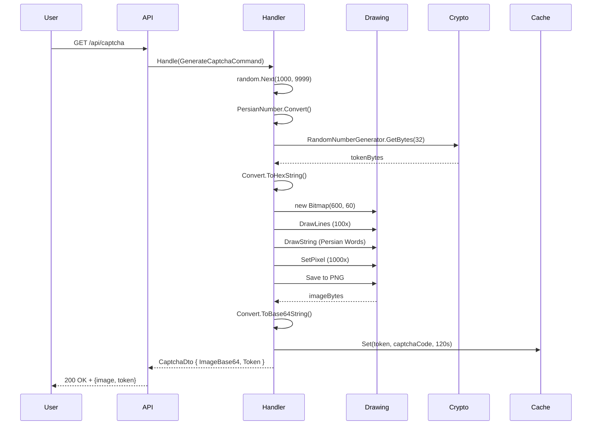

<div dir="rtl">

# GenerateCaptchaCommand.cs

**مسیر**: `Csis.Admission.Application/Features/CaseFilings/Commands/Student/GenerateCaptchaCommand.cs`

---

## 1. Purpose (هدف)

این فایل مسئول **تولید کد کپچا** و **تصویر کپچا** برای استفاده در مرحله اول تشکیل پرونده است. کپچا به صورت تصویری با نویز و اعوجاج تولید می‌شود و در `MemoryCache` ذخیره می‌شود.

---

## 2. مستندات XML موجود

```csharp
/// <summary>
/// تولید و دریافت کد کپچا
/// </summary>
```

**کامل**: این Command یک کد 4 رقمی فارسی تولید کرده، تصویر کپچا با نویز و اعوجاج می‌سازد، و توکن یکتا برای آن برمی‌گرداند.

---

## 3. خلاصه اتفاقات (What Happens)

**جریان اصلی**:
1. تولید یک عدد تصادفی 4 رقمی (1000-9999)
2. تبدیل عدد به رشته فارسی (مثلاً "۱۲۳۴")
3. تولید یک توکن یکتا 32 بایتی (Hex String)
4. ایجاد تصویر Bitmap با ابعاد 600×60
5. رسم کد فارسی روی تصویر با فونت Arial Bold/Italic
6. اضافه کردن نویز:
   - 100 خط تصادفی
   - 1000 نقطه تصادفی
   - جابه‌جایی تصادفی کاراکترها (Distortion)
7. تبدیل تصویر به Base64 String
8. ذخیره کد کپچا در `MemoryCache` با کلید `token` (120 ثانیه)
9. بازگشت `CaptchaDto` شامل تصویر Base64 و توکن

---

## 4. اجزای اصلی

### 4.1. Command (درخواست)

**کلاس**: `GenerateCaptchaCommand`
- **نوع**: `sealed record`
- **Interface**: `IRequest<CaptchaDto>`
- **Properties**: ندارد (پارامترها خالی)

---

### 4.2. Handler (پردازش‌گر)

**کلاس**: `GenerateCaptchaCommandHandler`
- **نوع**: `internal sealed class`
- **Interface**: `IRequestHandler<GenerateCaptchaCommand, CaptchaDto>`

**متد کلیدی**:
```csharp
async Task<CaptchaDto> Handle(
    GenerateCaptchaCommand request,
    CancellationToken cancellationToken)
```

---

## 5. Flow داخل فایل (Step-by-Step)

```
1. تولید کد تصادفی
   └─> random.Next(1000, 9999) → captchaCode (مثلاً "1234")

2. تبدیل به فارسی
   └─> PersianNumber.GET_Number_To_PersianString("1234") → "یک دو سه چهار"

3. تولید توکن امن
   ├─> RandomNumberGenerator.Create()
   ├─> GetBytes(32 bytes)
   └─> Convert.ToHexString() → token (64 کاراکتر Hex)

4. ایجاد تصویر Bitmap
   ├─> new Bitmap(600, 60)
   └─> Graphics.FromImage()

5. رسم پس‌زمینه
   └─> graphics.Clear(Color.White)

6. تنظیم فونت
   └─> Font("Arial", 28, Bold | Italic)

7. اضافه کردن نویز خطی
   └─> for 100 بار: DrawLine با مختصات تصادفی

8. رسم کد فارسی
   ├─> split کلمات ("یک", "دو", "سه", "چهار")
   ├─> xDistortion = 500 (شروع از راست برای RTL)
   ├─> for هر کلمه:
   │   ├─> y تصادفی (10 ± 10 پیکسل)
   │   ├─> DrawString(word, font, brush, x, y)
   │   └─> xDistortion -= 70 (حرکت به چپ)

9. اضافه کردن نویز نقطه‌ای
   └─> for 1000 بار: SetPixel(x, y, Color.Gray)

10. تبدیل به Base64
    ├─> bitmap.Save(memoryStream, ImageFormat.Png)
    ├─> memoryStream.ToArray() → imageBytes
    ├─> Convert.ToBase64String(imageBytes)
    └─> prefix: "data:image/png;base64,"

11. ذخیره در Cache
    └─> memoryCacheService.Set(token, captchaCode, 120s)

12. بازگشت نتیجه
    └─> CaptchaDto { ImageBase64, Token }
```

---

## 6. Dependencies (وابستگی‌ها)

### Injected Dependencies

| Dependency | Type | Purpose |
|-----------|------|---------|
| `memoryCacheService` | `IMemoryCacheService` | ذخیره کد کپچا |

### External Dependencies

| Dependency | Purpose |
|-----------|---------|
| `System.Drawing` | تولید تصویر Bitmap |
| `System.Security.Cryptography` | تولید توکن امن |
| `PersianNumber` | تبدیل اعداد به فارسی |

**⚠️ نکته مهم**: `System.Drawing` در Linux نیاز به `libgdiplus` دارد و در .NET 6+ برای Cross-Platform پیشنهاد نمی‌شود.

---

## 7. Business Rules (قوانین کسب‌وکار)

### BR-1: کد کپچا
- کد 4 رقمی است (1000-9999)
- به صورت کلمات فارسی نمایش داده می‌شود ("یک دو سه چهار")

### BR-2: توکن یکتا
- 32 بایت تصادفی (64 کاراکتر Hex)
- تولید شده با `RandomNumberGenerator` (Cryptographically Secure)

### BR-3: TTL کپچا
- کپچا 120 ثانیه معتبر است
- بعد از انقضا، باید کپچای جدید درخواست شود

### BR-4: نویز و اعوجاج
- 100 خط تصادفی برای جلوگیری از OCR
- 1000 نقطه تصادفی
- جابه‌جایی عمودی ±10 پیکسل

### BR-5: فرمت خروجی
- تصویر PNG
- Base64 Encoded با prefix `data:image/png;base64,`

---

## 8. Data Access

- **EF Core**: استفاده نمی‌شود
- **Dapper**: استفاده نمی‌شود
- **Cache**: 
  ```csharp
  memoryCacheService.Set(token, captchaCode, new CacheOptions {
      AbsoluteExpirationSeconds = 120
  })
  ```

---

## 9. Error Handling (مدیریت خطا)

- **هیچ مدیریت خطای صریحی وجود ندارد**
- احتمال Exception ها:
  - `OutOfMemoryException` (تولید Bitmap)
  - `PlatformNotSupportedException` (System.Drawing در Linux بدون libgdiplus)
  - `ArgumentException` (فونت پیدا نشود)

---

## 10. Observability (قابلیت مشاهده)

- **Logging**: هیچ لاگی وجود ندارد
- **Metrics**: ندارد
- **Audit**: ندارد

**پیشنهاد**: اضافه کردن لاگ برای تعداد کپچاهای تولید شده و Exception ها.

---

## 11. Use Case های مرتبط

- **UC-030**: تشکیل پرونده دانشجوی جدید
  - کپچا در **مرحله قبل از Step01** نمایش داده می‌شود
  - کاربر کد کپچا را در Step01 وارد می‌کند
- **UC-001**: ورود کارمند (احتمالاً)
- **UC-002**: ورود دانشجو (احتمالاً)

**مرتبط با**:
- [CreateAdmissionCaseStep01InitiateCommand.md](./CreateAdmissionCaseStep01InitiateCommand.md) (مصرف‌کننده کپچا)

---

## 12. Risks & Notes (ریسک‌ها و نکات)

### 12.1. Security (امنیت)

✅ **Strong Points**:
1. استفاده از `RandomNumberGenerator` برای توکن (Cryptographically Secure)
2. نویز و اعوجاج برای جلوگیری از OCR

⚠️ **Weak Points**:
1. **کد 4 رقمی**: فقط 9000 حالت ممکن (1000-9999)
   - آسان برای Brute Force اگر Rate Limiting نباشد
2. **بدون Rate Limiting**: هیچ محدودیتی برای تعداد درخواست کپچا وجود ندارد
3. **کپچای فارسی**: ممکن است برای کاربران غیرفارسی‌زبان مشکل‌ساز باشد

### 12.2. Performance (کارایی)

⚠️ **CRITICAL**:
1. **System.Drawing**: کند و حافظه‌بر است
   - برای هر درخواست یک Bitmap 600×60 ایجاد می‌شود
2. **#pragma warning disable CA1416**:
   - `System.Drawing` در Linux/macOS نیاز به `libgdiplus` دارد
   - در .NET 6+، `SkiaSharp` یا `ImageSharp` پیشنهاد می‌شود
3. **Synchronous Operations**: تمام عملیات رسم Synchronous هستند
   - ممکن است Thread Pool را مسدود کند

**بهینه‌سازی پیشنهادی**:
- استفاده از `SixLabors.ImageSharp` به جای `System.Drawing`
- یا استفاده از سرویس خارجی کپچا (Google reCAPTCHA, hCaptcha)

### 12.3. Platform Compatibility (سازگاری پلتفرم)

⚠️ **CRITICAL**:
```csharp
#pragma warning disable CA1416 // Validate platform compatibility
```
- این کد در Linux/macOS بدون `libgdiplus` کار نمی‌کند
- در Docker باید `libgdiplus` نصب شود

### 12.4. Code Quality (کیفیت کد)

- ✅ استفاده از `sealed record`
- ❌ نبود مدیریت خطا
- ❌ نبود Logging
- ❌ استفاده از `System.Drawing` (Deprecated در .NET 6+)

---

## 13. Test Ideas (ایده‌های تست)

### Unit Tests:
- تولید کپچا → بررسی فرمت Base64
- بررسی طول توکن (64 کاراکتر)
- بررسی ذخیره در Cache
- بررسی TTL (120 ثانیه)

### Integration Tests:
- درخواست کپچا → استفاده در Step01 → بررسی اعتبارسنجی

### Performance Tests:
- تولید 1000 کپچا همزمان → بررسی حافظه و CPU

### Security Tests:
- Brute Force کپچا (تست Rate Limiting)
- OCR کپچا (بررسی قدرت نویز)

---

## 14. نمودار جریان (Sequence Diagram)



---

## 15. خلاصه نکات کلیدی

| نکته | توضیح |
|------|-------|
| **نقش** | تولید کپچا برای تشکیل پرونده |
| **ورودی** | هیچ |
| **خروجی** | تصویر Base64 + توکن |
| **کد کپچا** | 4 رقمی فارسی (1000-9999) |
| **توکن** | 64 کاراکتر Hex (Cryptographically Secure) |
| **TTL** | 120 ثانیه |
| **نویز** | 100 خط + 1000 نقطه + اعوجاج |
| **امنیت** | ⚠️ کد 4 رقمی + بدون Rate Limiting |
| **کارایی** | ⚠️ System.Drawing کند است |
| **پلتفرم** | ⚠️ نیاز به libgdiplus در Linux |
| **بهینه‌سازی** | استفاده از ImageSharp یا reCAPTCHA |

---

**بهینه‌سازی‌های پیشنهادی**:
1. جایگزینی `System.Drawing` با `SixLabors.ImageSharp`
2. افزایش طول کد کپچا به 6 رقم
3. اضافه کردن Rate Limiting
4. استفاده از Redis برای Cache در Production
5. اضافه کردن Logging و Metrics

**مرتبط با**:
- [CreateAdmissionCaseStep01InitiateCommand.md](./CreateAdmissionCaseStep01InitiateCommand.md)
- [IMemoryCacheService](#)
- [PersianNumber Helper](#)

</div>
