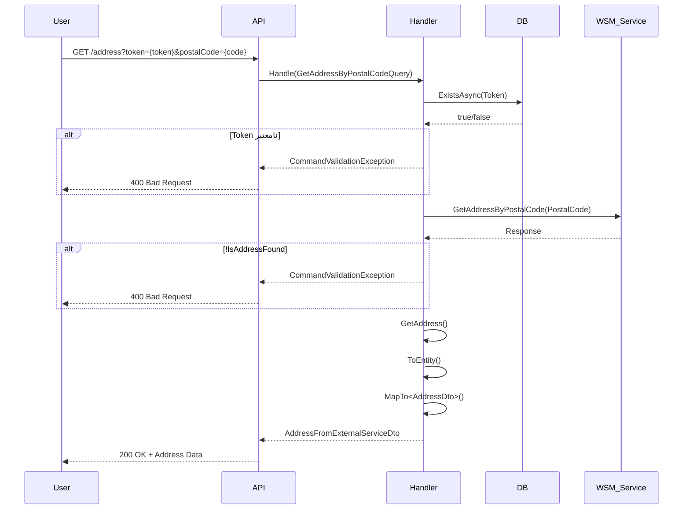

<div dir="rtl">

# CreateAdmissionCaseStep05GetAddressByPostalCodeQuery.cs

**مسیر**: `Csis.Admission.Application/Features/CaseFilings/Queries/CreateAdmissionCaseStep05GetAddressByPostalCodeQuery.cs`

---

## 1. Purpose (هدف)

این Query مسئول **دریافت اطلاعات آدرس از روی کد پستی** از سرویس خارجی است. این بخشی از **گام پنجم Wizard** است که قبل از تأیید نهایی آدرس، اطلاعات آدرس را به کاربر نمایش می‌دهد.

---

## 2. مستندات XML موجود

```xml
/// <summary>
/// </summary>
/// <param name="Token"></param>
/// <param name="PostalCode"></param>
```

**کامل**: این Query با دریافت کد پستی، اطلاعات کامل آدرس (استان، شهر، منطقه، محله، خیابان) را از سرویس خارجی (CSIS WSM) بازیابی می‌کند.

---

## 3. خلاصه اتفاقات (What Happens)

**جریان اصلی**:
1. دریافت `Token` و `PostalCode`
2. بررسی وجود `Token` در دیتابیس
3. فراخوانی `wsmService.GetAddressByPostalCode(PostalCode)`
4. بررسی اینکه آدرس پیدا شده یا نه
5. تبدیل آدرس به مدل Application
6. بازگشت `AddressFromExternalServiceDto`

---

## 4. اجزای اصلی

### 4.1. Query

**کلاس**: `GetAddressByPostalCodeQuery`
- **نوع**: `sealed record`
- **Interface**: `IRequest<AddressFromExternalServiceDto>`

**Parameters (Constructor)**:
```csharp
Guid Token           // توکن پرونده
long PostalCode      // کد پستی 10 رقمی
```

---

### 4.2. Handler

**کلاس**: `GetAddressByPostalCodeQueryHandler`

**Injected Dependencies**:
- `ICsisWsmService` - سرویس خارجی برای دریافت آدرس
- `IRepository<AdmissionCaseUser, Guid>` - بررسی وجود Token

---

## 5. Flow داخل فایل

```
1. بررسی اعتبار Token
   ├─> userRepository.ExistsAsync(x => x.Id == Token)
   └─> اگر وجود نداشت → CommandValidationException

2. دریافت آدرس از سرویس خارجی
   └─> wsmService.GetAddressByPostalCode(-1, PostalCode)

3. بررسی نتیجه
   ├─> اگر !IsAddressFound → CommandValidationException("کد پستی نامعتبر")
   └─> اگر موفق → ادامه

4. تبدیل به مدل داخلی
   ├─> response.GetAddress(-1, PostalCode)
   ├─> ToEntity()
   └─> MapTo<AddressFromExternalServiceDto>()

5. بازگشت نتیجه
   └─> return AddressFromExternalServiceDto
```

---

## 6. Dependencies

| Dependency | Purpose |
|-----------|---------|
| `ICsisWsmService` | دریافت آدرس از سرویس خارجی |
| `IRepository<AdmissionCaseUser, Guid>` | بررسی اعتبار Token |

**لینک**:
- [ICsisWsmService](#) - TODO
- [AddressFromExternalServiceDto](#) - TODO

---

## 7. Business Rules

### BR-1: کد پستی 10 رقمی
- کد پستی باید معتبر باشد
- سرویس خارجی اعتبار کد پستی را بررسی می‌کند

### BR-2: اعتبار Token
- Token باید متعلق به یک پرونده معتبر باشد

### BR-3: Mapping
- آدرس از سرویس خارجی به مدل داخلی تبدیل می‌شود

---

## 8. Data Access

### EF Core:
```csharp
// بررسی وجود
await userRepository.ExistsAsync(x => x.Id == request.Token, ...)
```

**یادداشت**: فقط بررسی وجود، بدون Query کامل (بهینه)

---

## 9. Error Handling

| Exception | شرط | پیام |
|-----------|------|------|
| `CommandValidationException` | Token نامعتبر | "شناسه نامعتبر است." |
| `CommandValidationException` | کد پستی نامعتبر | "کد پستی نامعتبر است." |

---

## 10. Observability

- **Logging**: ندارد
- **Audit**: ندارد

**پیشنهاد**: لاگ کردن کدهای پستی نامعتبر

---

## 11. Use Case های مرتبط

- **UC-030**: تشکیل پرونده دانشجوی جدید (Wizard)
  - **مرحله 5a**: دریافت آدرس بر اساس کد پستی (Query)
  - مرحله بعد: [ConfirmAddressByPostalCodeCommand](./CreateAdmissionCaseStep05ConfirmAddressByPostalCodeCommand.md) (تأیید آدرس)

---

## 12. Risks & Notes

### امنیت:
- ✅ اعتبارسنجی Token

### کارایی:
- ⚠️ درخواست به سرویس خارجی
- **پیشنهاد**: Cache کردن کدهای پستی (TTL: 1 ماه)

### وابستگی خارجی:
- ⚠️ اگر سرویس پست در دسترس نباشد، فرآیند متوقف می‌شود
- **پیشنهاد**: Circuit Breaker + Fallback به دیتابیس محلی

### Code Quality:
- ❌ پارامتر `-1` به `wsmService` ارسال می‌شود (مشکوک - احتمالاً userId یا tenantId)
  - نیاز به بررسی بیشتر

---

## 13. Test Ideas

### Happy Path:
- کد پستی معتبر → بازگشت آدرس کامل

### Edge Cases:
- کد پستی نامعتبر → Exception
- Token نامعتبر → Exception
- سرویس خارجی Timeout → Exception

---

## 14. نمودار جریان



---

## 15. خلاصه نکات کلیدی

| نکته | توضیح |
|------|-------|
| **نقش** | گام پنجم Wizard (Query): دریافت آدرس از کد پستی |
| **ورودی** | Token + PostalCode (10 رقمی) |
| **خروجی** | AddressFromExternalServiceDto |
| **سرویس خارجی** | CSIS WSM (سرویس پست) |
| **Validation** | Token + کد پستی |
| **کارایی** | ⚠️ بدون Cache |
| **Resilience** | نیاز به Circuit Breaker |
| **مشکوک** | پارامتر `-1` به WSM |

</div>
