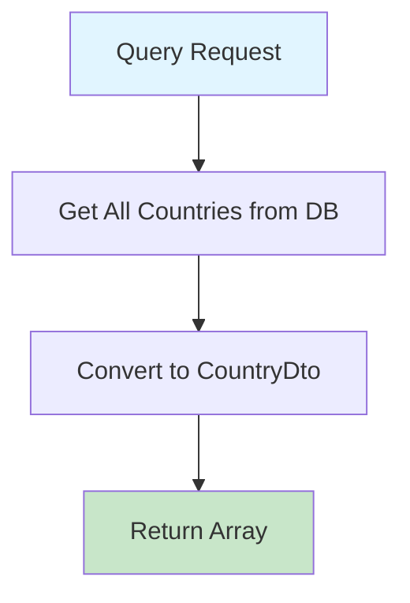

# GetCountriesQuery.cs

**مسیر**: `Csis.Admission.Application/Features/Countries/Queries/GetCountriesQuery.cs`

## 1. هدف (Purpose)

این Query برای **دریافت لیست کامل کشورها** از دیتابیس استفاده می‌شود و یک آرایه از `CountryDto` را برمی‌گرداند.

### کاربرد اصلی:
- Populate کردن Dropdown ها در فرم‌های ثبت آدرس
- انتخاب کشور در Profile Editing
- فیلتر کشور در Search Forms

---

## 2. ورودی (Input)

```csharp
public sealed record GetCountriesQuery() : IRequest<CountryDto[]>;
```

### پارامترها:
این Query **هیچ پارامتر ورودی ندارد** و تمام کشورها را برمی‌گرداند.

---

## 3. خروجی (Output)

```csharp
CountryDto[]
```

### ساختار DTO:
```csharp
public class CountryDto 
{
    public short Id { get; set; }
    public string Name { get; set; }
    // سایر فیلدها...
}
```

### نمونه خروجی:
```json
[
  { "id": 1, "name": "ایران" },
  { "id": 2, "name": "آلمان" },
  { "id": 3, "name": "کانادا" }
  // ...
]
```

---

## 4. وابستگی‌ها (Dependencies)

### Dependencies تزریق شده:
```csharp
private readonly IRepository<Country,short> _repo;
```

**Dependencies:**
1. **IRepository<Country,short>**: برای خواندن از جدول Countries

---

## 5. جریان اجرا (Execution Flow)



### مراحل:
1. **دریافت تمام رکوردها** از جدول `Countries` با AutoMapper projection
2. **تبدیل به آرایه** و Return

---

## 6. قوانین کسب‌وکار (Business Rules)

### BR-1: دریافت همه کشورها
- **قانون**: تمام کشورها بدون محدودیت یا فیلتر برگردانده می‌شوند
- **توضیح**: اگر فیلتری مثل Active/Inactive وجود دارد، در این Query اعمال نمی‌شود

---

## 7. نکات امنیتی (Security Considerations)

### ⚠️ **مشکل 1: فقدان Authorization**
```csharp
// ❌ هیچ Authorization check وجود ندارد
public async Task<CountryDto[]> Handle(...)
```

**ریسک**: هر کسی حتی anonymous user می‌تواند لیست کشورها را دریافت کند.

**راه‌حل پیشنهادی**:
- اگر این endpoint عمومی است، مشکلی نیست
- اگر نیاز به Authentication دارد، باید Attribute اضافه شود

---

## 8. عملکرد و بهینه‌سازی (Performance)

### ✅ **مزایا:**
1. **GetAllAsync** به جای Query همه چیز را می‌خواند
2. **Projection به DTO** در DB انجام می‌شود (AutoMapper.Projection)
3. **Collection expression** (`[.. result]`) استفاده شده

### ⚠️ **مشکلات احتمالی:**
```csharp
// اگر تعداد کشورها زیاد باشد
var result = await _repo.GetAllAsync<CountryDto>(); // همه را می‌خواند
```

### پیشنهاد بهبود:
```csharp
// اضافه کردن Caching
private readonly IMemoryCache _cache;

public async Task<CountryDto[]> Handle(...) 
{
    return await _cache.GetOrCreateAsync("countries", async entry => 
    {
        entry.AbsoluteExpirationRelativeToNow = TimeSpan.FromHours(24);
        var result = await _repo.GetAllAsync<CountryDto>();
        return [.. result];
    });
}
```

---

## 9. خطاها و استثناها (Error Handling)

### خطاهای محتمل:
1. **Database Connection Error**: در صورت قطعی ارتباط با دیتابیس
2. **Mapping Error**: اگر AutoMapper configuration اشتباه باشد

### ⚠️ **فقدان Error Handling**:
```csharp
// ❌ هیچ try-catch یا validation وجود ندارد
public async Task<CountryDto[]> Handle(...)
{
    var result = await _repo.GetAllAsync<CountryDto>();
    return [.. result];
}
```

---

## 10. الگوهای طراحی (Design Patterns)

### الگوهای استفاده شده:
1. **CQRS Pattern**: Query جدا از Command
2. **Repository Pattern**: دسترسی به داده از طریق Repository
3. **DTO Pattern**: استفاده از Data Transfer Object برای خروجی
4. **Primary Constructor** (C# 12): ساختار کوتاه‌تر
5. **Collection Expressions** (C# 12): `[.. result]`

---

## 11. تست‌پذیری (Testability)

### نمونه Unit Test:
```csharp
[Fact]
public async Task Handle_ShouldReturnAllCountries()
{
    // Arrange
    var countries = new List<CountryDto>
    {
        new() { Id = 1, Name = "ایران" },
        new() { Id = 2, Name = "آلمان" }
    };
    
    _repoMock.Setup(x => x.GetAllAsync<CountryDto>())
        .ReturnsAsync(countries);
    
    var query = new GetCountriesQuery();
    
    // Act
    var result = await _handler.Handle(query, CancellationToken.None);
    
    // Assert
    Assert.Equal(2, result.Length);
    Assert.Equal("ایران", result[0].Name);
}
```

---

## 12. ملاحظات Logging و Monitoring

### ⚠️ **فقدان Logging**:
```csharp
// ❌ هیچ logging وجود ندارد
public async Task<CountryDto[]> Handle(...)
```

### پیشنهاد:
```csharp
private readonly ILogger<GetCountriesQueryHandler> _logger;

public async Task<CountryDto[]> Handle(...)
{
    _logger.LogInformation("Fetching all countries");
    var result = await _repo.GetAllAsync<CountryDto>();
    _logger.LogInformation("Retrieved {Count} countries", result.Count);
    return [.. result];
}
```

---

## 13. مثال استفاده (Usage Example)

### از Controller:
```csharp
[HttpGet("countries")]
public async Task<ActionResult<CountryDto[]>> GetCountries()
{
    var query = new GetCountriesQuery();
    var countries = await _mediator.Send(query);
    return Ok(countries);
}
```

### از Frontend:
```javascript
const response = await fetch('/api/countries');
const countries = await response.json();

// Populate dropdown
const select = document.getElementById('countrySelect');
countries.forEach(country => {
    const option = document.createElement('option');
    option.value = country.id;
    option.text = country.name;
    select.add(option);
});
```

---

## 14. Command/Query های مرتبط

### Queries مشابه:
- `GetProvincesQuery`: دریافت لیست استان‌ها
- `GetCitiesQuery`: دریافت لیست شهرها
- `GetBranchesQuery`: دریافت لیست شعب

---

## 15. تاریخچه تغییرات (Change History)

| تاریخ | تغییرات | توسعه‌دهنده |
|-------|---------|-------------|
| - | ایجاد اولیه Query | - |

---

## 16. تغییرات پیشنهادی (Proposed Changes)

### Priority 1: افزودن Caching
```diff
internal sealed class GetCountriesQueryHandler : IRequestHandler<GetCountriesQuery, CountryDto[]>
{
    private readonly IRepository<Country,short> _repo;
+   private readonly IMemoryCache _cache;
    
-   public GetCountriesQueryHandler(IRepository<Country, short> repo) {
+   public GetCountriesQueryHandler(IRepository<Country, short> repo, IMemoryCache cache) {
        _repo = repo;
+       _cache = cache;
    }

    public async Task<CountryDto[]> Handle(GetCountriesQuery request, CancellationToken cancellationToken) {
+       return await _cache.GetOrCreateAsync("countries", async entry => 
+       {
+           entry.AbsoluteExpirationRelativeToNow = TimeSpan.FromHours(24);
            var result = await _repo.GetAllAsync<CountryDto>();
            return [.. result];
+       }) ?? [];
    }
}
```

### Priority 2: افزودن Logging
```diff
internal sealed class GetCountriesQueryHandler : IRequestHandler<GetCountriesQuery, CountryDto[]>
{
    private readonly IRepository<Country,short> _repo;
+   private readonly ILogger<GetCountriesQueryHandler> _logger;
    
-   public GetCountriesQueryHandler(IRepository<Country, short> repo) {
+   public GetCountriesQueryHandler(IRepository<Country, short> repo, ILogger<GetCountriesQueryHandler> logger) {
        _repo = repo;
+       _logger = logger;
    }

    public async Task<CountryDto[]> Handle(GetCountriesQuery request, CancellationToken cancellationToken) {
+       _logger.LogInformation("Fetching all countries from database");
        var result = await _repo.GetAllAsync<CountryDto>();
+       _logger.LogInformation("Retrieved {Count} countries", result.Count);
        return [.. result];
    }
}
```

### Priority 3: افزودن فیلتر برای Active Countries
```diff
- var result = await _repo.GetAllAsync<CountryDto>();
+ var result = await _repo.GetAllAsync<CountryDto>(
+     where: x => x.IsActive,
+     orderBy: x => x.Name
+ );
```

---

## نتیجه‌گیری

این Query بسیار **ساده و کارآمد** است اما می‌تواند با **Caching** و **Logging** بهبود یابد. برای یک سیستم با تعداد کشورهای محدود، این implementation کافی است.

### نقاط قوت:
✅ کد تمیز و ساده  
✅ استفاده از C# 12 features  
✅ Projection در DB  

### نقاط ضعف:
⚠️ فقدان Caching  
⚠️ فقدان Logging  
⚠️ عدم فیلتر Active/Inactive
