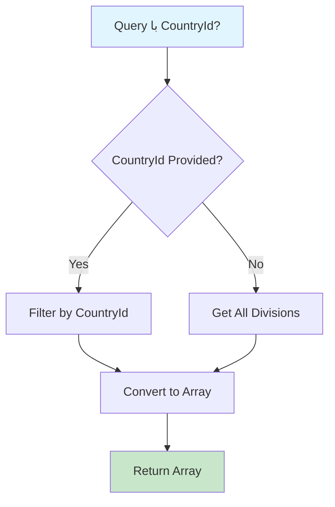

# GetCountryDivisionsQuery.cs

**مسیر**: `Csis.Admission.Application/Features/CountryDivisions/Queries/GetCountryDivisionsQuery.cs`

## 1. هدف (Purpose)

این Query برای **دریافت تقسیمات کشوری (استان‌های سایر کشورها)** استفاده می‌شود.

### کاربرد اصلی:
- تقسیمات کشورهای خارجی
- آدرس‌دهی دانشجویان غیرایرانی
- Populate کردن Dropdown استان‌های سایر کشورها
- Cascade Dropdown: Country → CountryDivision

---

## 2. ورودی (Input)

```csharp
public sealed record GetCountryDivisionsQuery(short? CountryId) : IRequest<CountryDivisionDto[]>;
```

### پارامترها:
| پارامتر | نوع | اجباری | توضیحات |
|---------|-----|--------|---------|
| `CountryId` | `short?` | خیر | فیلتر بر اساس کشور (nullable) |

---

## 3. خروجی (Output)

```csharp
CountryDivisionDto[]
```

---

## 4. وابستگی‌ها (Dependencies)

**Dependencies:**
1. **IRepository<CountryDivision>**: دسترسی به جدول تقسیمات کشوری

---

## 5. جریان اجرا (Execution Flow)



---

## 6. قوانین کسب‌وکار (Business Rules)

### BR-1: فیلتر اختیاری
- اگر CountryId ارسال شود، فقط تقسیمات آن کشور
- اگر null باشد، تمام تقسیمات برگردانده می‌شوند

---

## 7. الگوهای طراحی (Design Patterns)

1. **CQRS Pattern**
2. **Repository Pattern**
3. **Optional Filter Pattern**
4. **DTO Pattern**

---

## 8. عملکرد و بهینه‌سازی (Performance)

### پیشنهاد: Caching
```csharp
// تقسیمات کشوری نادراً تغییر می‌کنند
var cacheKey = countryId.HasValue 
    ? $"country_divisions_{countryId}" 
    : "country_divisions_all";
    
return await _cache.GetOrCreateAsync(cacheKey, async entry => 
{
    entry.AbsoluteExpirationRelativeToNow = TimeSpan.FromHours(24);
    return await _repo.GetFilteredAsync<CountryDivisionDto>(countryId);
});
```

---

## 9. Use Cases مرتبط

- ثبت آدرس دانشجویان غیرایرانی
- مدیریت اطلاعات دانشجویان خارجی
- Cascade Dropdown

---

## نتیجه‌گیری

Query **Master Data** برای تقسیمات کشوری.

### نقاط قوت:
✅ فیلتر اختیاری (Flexible)  
✅ مناسب برای Cascade Dropdown  

### پیشنهاد:
⚠️ افزودن Caching برای بهبود Performance
