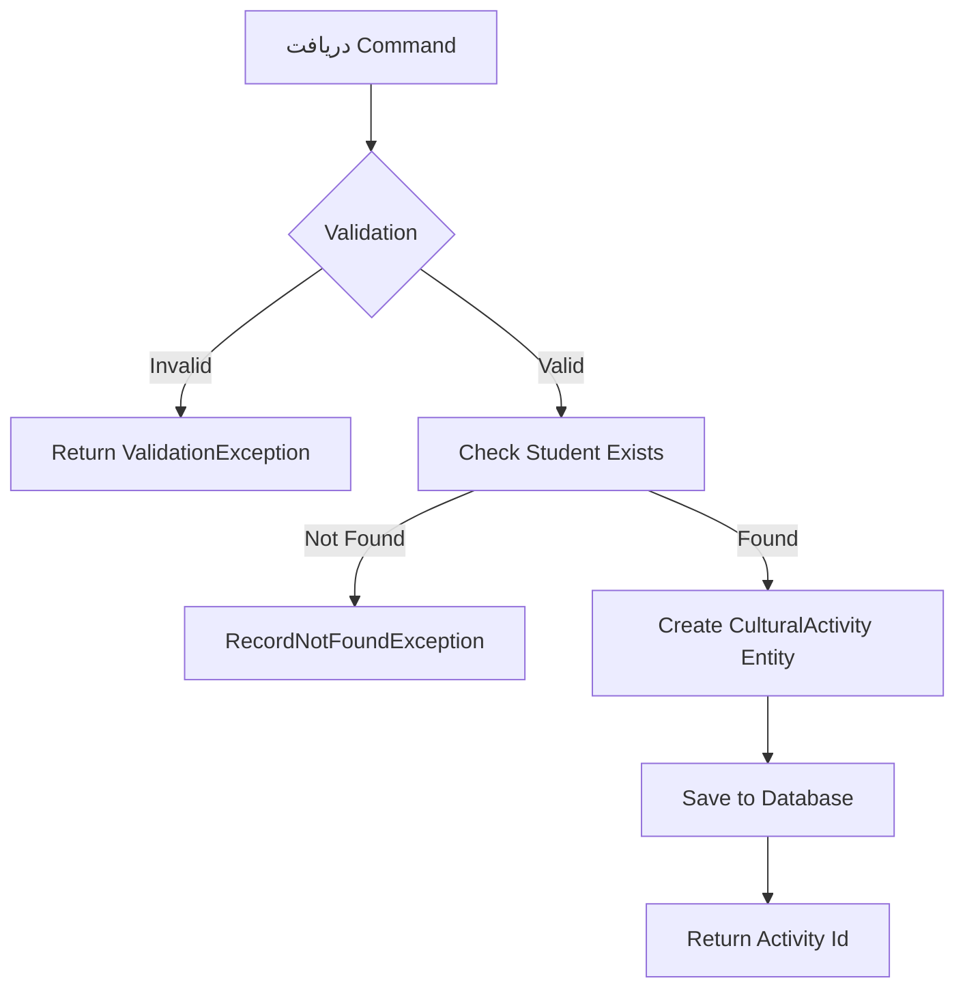

# CreateCulturalActivityCommand.cs

**مسیر**: `Csis.Admission.Application/Features/CulturalActivities/Commands/CreateCulturalActivityCommand.cs`

## 1. هدف (Purpose)

این Command برای **ثبت فعالیت فرهنگی جدید** دانشجو استفاده می‌شود.

### کاربرد اصلی:
- ثبت فعالیت‌های فرهنگی دانشجویان
- مستندسازی فعالیت‌های فرهنگی برای امتیازدهی
- پیگیری سوابق فرهنگی دانشجویان

---

## 2. ورودی (Input)

```csharp
public sealed record CreateCulturalActivityCommand(
    int Codm,
    string ActivityTitle,
    DateTime ActivityDate,
    string Description,
    int? CulturalActivityTypeId
) : IRequest<int>;
```

| پارامتر | نوع | الزامی | توضیحات |
|---------|-----|--------|---------|
| `Codm` | `int` | ✅ | کد ملی دانشجو |
| `ActivityTitle` | `string` | ✅ | عنوان فعالیت فرهنگی |
| `ActivityDate` | `DateTime` | ✅ | تاریخ برگزاری فعالیت |
| `Description` | `string` | ❌ | توضیحات تکمیلی |
| `CulturalActivityTypeId` | `int?` | ❌ | نوع فعالیت (از جدول انواع) |

---

## 3. خروجی (Output)

```csharp
int // شناسه فعالیت فرهنگی ایجاد شده
```

---

## 4. وابستگی‌ها (Dependencies)

```csharp
- IApplicationDbContext (دسترسی به دیتابیس)
- ICurrentUserService (احراز هویت)
- IMapper (AutoMapper)
```

---

## 5. جریان اجرا (Execution Flow)



---

## 6. قوانین کسب‌وکار (Business Rules)

### BR-1: اعتبارسنجی دانشجو
- دانشجو باید در سیستم موجود باشد

### BR-2: اعتبارسنجی تاریخ
- تاریخ فعالیت نباید در آینده باشد
- تاریخ نباید خیلی قدیمی باشد

### BR-3: عنوان فعالیت
- حداقل 3 کاراکتر
- حداکثر 200 کاراکتر

---

## 7. الگوهای طراحی (Design Patterns)

1. **CQRS Pattern** - Command سمت نوشتن
2. **Command Pattern** - Encapsulation عملیات
3. **Repository Pattern** - دسترسی به داده
4. **FluentValidation** - اعتبارسنجی

---

## 8. عملکرد و بهینه‌سازی (Performance)

### بهینه‌سازی‌ها:
- ✅ استفاده از Transaction برای یکپارچگی داده
- ✅ Validation قبل از دسترسی به دیتابیس

### نکات امنیتی:
- ✅ بررسی دسترسی کاربر
- ✅ جلوگیری از SQL Injection با Parameterized Queries

---

## 9. Use Cases مرتبط

- **UC-018**: ثبت فعالیت‌های فرهنگی
- **UC-TargetedScores**: امتیازدهی یارانه

---

## 10. نتیجه‌گیری

Command اصلی برای **مدیریت فعالیت‌های فرهنگی** دانشجویان.

✅ ثبت ساده و سریع  
✅ اعتبارسنجی کامل  
✅ پشتیبانی از انواع فعالیت
