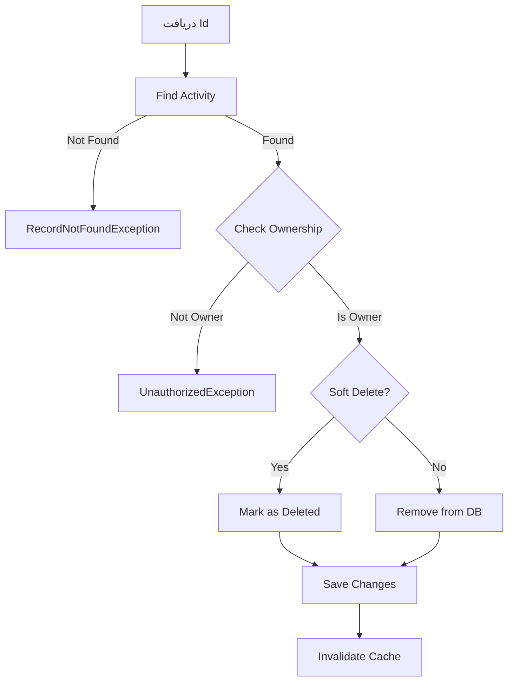

# DeleteCulturalActivityCommand.cs

**مسیر**: `Csis.Admission.Application/Features/CulturalActivities/Commands/DeleteCulturalActivityCommand.cs`

## 1. هدف (Purpose)

این Command برای **حذف فعالیت فرهنگی** استفاده می‌شود.

### کاربرد اصلی:
- حذف فعالیت فرهنگی اشتباه
- مدیریت سوابق فرهنگی
- Soft Delete برای Audit

---

## 2. ورودی (Input)

```csharp
public sealed record DeleteCulturalActivityCommand(int Id) : IRequest;
```

| پارامتر | نوع | توضیحات |
|---------|-----|---------|
| `Id` | `int` | شناسه فعالیت |

---

## 3. خروجی (Output)

```csharp
void // بدون خروجی
```

---

## 4. جریان اجرا (Execution Flow)



---

## 5. قوانین کسب‌وکار (Business Rules)

### BR-1: Soft Delete
- فعالیت‌ها به صورت نرم حذف می‌شوند (IsDeleted = true)

### BR-2: مالکیت
- فقط مالک یا Admin می‌تواند حذف کند

---

## 6. الگوهای طراحی (Design Patterns)

1. **CQRS Pattern**
2. **Soft Delete Pattern**
3. **Audit Pattern**

---

## 7. عملکرد و بهینه‌سازی (Performance)

### Cache Invalidation:
```csharp
InvalidateCache($"cultural-activities:codm:{activity.Codm}")
```

---

## 8. Use Cases مرتبط

- **UC-018**: مدیریت فعالیت‌های فرهنگی

---

## 9. نتیجه‌گیری

Command برای **حذف امن فعالیت‌های فرهنگی**.

✅ Soft Delete  
✅ بررسی مالکیت  
✅ Audit Trail
