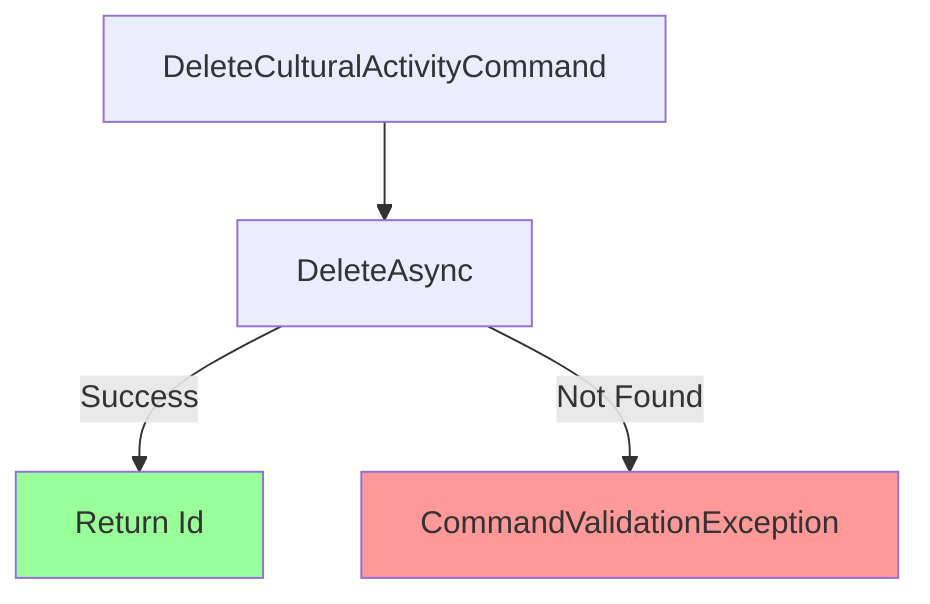

# DeleteCulturalActivityCommand.cs

**مسیر**: `Csis.Admission.Application/Features/CulturalActivities/Commands/DeleteCulturalActivityCommand.cs`

## 1. هدف (Purpose)

این Command برای **حذف یک فعالیت فرهنگی** (Cultural Activity) استفاده می‌شود.

## 2. ساختار کلی (Structure)

### نوع: 
- Command (CQRS Pattern)
- بازگشت: `int` (Id رکورد حذف شده)

### الگوی طراحی:
- **CQRS Pattern**: Command برای تغییر state
- **Repository Pattern**: حذف از طریق Repository
- **Record Type**: Immutable Command
- **Primary Constructor (C# 12)**

## 3. ورودی‌ها (Inputs)

| پارامتر | نوع | الزامی | توضیحات |
|---------|-----|--------|---------|
| `Codm` | int | ✅ | کد مرکز (⚠️ استفاده نمی‌شود) |
| `Id` | int | ✅ | شناسه فعالیت فرهنگی |

### مثال Request:
```json
{
  "codm": 12345,
  "id": 789
}
```

## 4. خروجی (Output)

```csharp
int // شناسه رکورد حذف شده
```

## 5. جریان اجرا (Execution Flow)



## 6. قوانین کسب‌وکار (Business Rules)

### BR-1: Record Must Exist
رکورد باید وجود داشته باشد:
```csharp
if (!await culturalActivityRepo.DeleteAsync(request.Id, ...)) {
    throw new CommandValidationException($"فعالیت فرهنگی مورد نظر با شناسه {request.Id} یافت نشد");
}
```

## 7. وابستگی‌ها (Dependencies)

```csharp
IRepository<CulturalActivity> culturalActivityRepo
```

## 8. ملاحظات امنیتی (Security Considerations)

### ⚠️ مشکلات بحرانی:

#### 1. Codm استفاده نمی‌شود
```csharp
// ❌ مشکل: Codm parameter inject می‌شود اما استفاده نمی‌شود
public sealed record DeleteCulturalActivityCommand(int Codm, int Id)
```

#### 2. فقدان Authorization
هیچ بررسی مالکیت انجام نمی‌شود.

#### 3. فقدان Logging
هیچ لاگی ثبت نمی‌شود.

## 9. تست‌پذیری (Testability)

### Unit Test نمونه:
```csharp
[Fact]
public async Task Handle_ActivityExists_ReturnsId() {
    // Arrange
    _mockRepo.Setup(x => x.DeleteAsync(1, ...)).ReturnsAsync(true);
    var command = new DeleteCulturalActivityCommand(12345, 1);
    
    // Act
    var result = await _handler.Handle(command, CancellationToken.None);
    
    // Assert
    Assert.Equal(1, result);
}

[Fact]
public async Task Handle_ActivityNotFound_ThrowsException() {
    // Arrange
    _mockRepo.Setup(x => x.DeleteAsync(999, ...)).ReturnsAsync(false);
    var command = new DeleteCulturalActivityCommand(12345, 999);
    
    // Act & Assert
    await Assert.ThrowsAsync<CommandValidationException>(
        () => _handler.Handle(command, CancellationToken.None));
}
```

## 10. تغییرات پیشنهادی (Suggested Improvements)

### اضافه کردن Authorization و Logging:
```diff
-internal sealed class DeleteCulturalActivityCommandHandler(IRepository<CulturalActivity> culturalActivityRepo)
+internal sealed class DeleteCulturalActivityCommandHandler(
+    IRepository<CulturalActivity> culturalActivityRepo,
+    IAuthenticatedUser authenticatedUser,
+    ILogger<DeleteCulturalActivityCommandHandler> logger)
    : IRequestHandler<DeleteCulturalActivityCommand, int>
{
    public async Task<int> Handle(DeleteCulturalActivityCommand request, CancellationToken cancellationToken) {
+       if (request.Codm != authenticatedUser.Codm) {
+           throw new UnauthorizedAccessException();
+       }
+
+       var activity = await culturalActivityRepo.GetByIdAsync(request.Id, cancellationToken: cancellationToken);
+       if (activity == null) {
+           throw new CommandValidationException($"فعالیت فرهنگی مورد نظر با شناسه {request.Id} یافت نشد");
+       }
+
+       if (activity.Codm != request.Codm) {
+           throw new UnauthorizedAccessException("شما مجاز به حذف این فعالیت فرهنگی نیستید.");
+       }
+
+       logger.LogWarning("Deleting CulturalActivity {Id} by User {Codm}", request.Id, request.Codm);
+
        if (!await culturalActivityRepo.DeleteAsync(request.Id, cancellationToken: cancellationToken)) {
            throw new CommandValidationException($"فعالیت فرهنگی مورد نظر با شناسه {request.Id} یافت نشد");
        }
+       
+       logger.LogInformation("CulturalActivity {Id} deleted successfully", request.Id);
        return request.Id;
    }
}
```

---

**آخرین بروزرسانی**: 1403/10/04  
**نسخه**: 1.0  
**وضعیت**: ⚠️ Critical Security Issues - الگوی سیستماتیک: Codm و Logger استفاده نمی‌شوند
