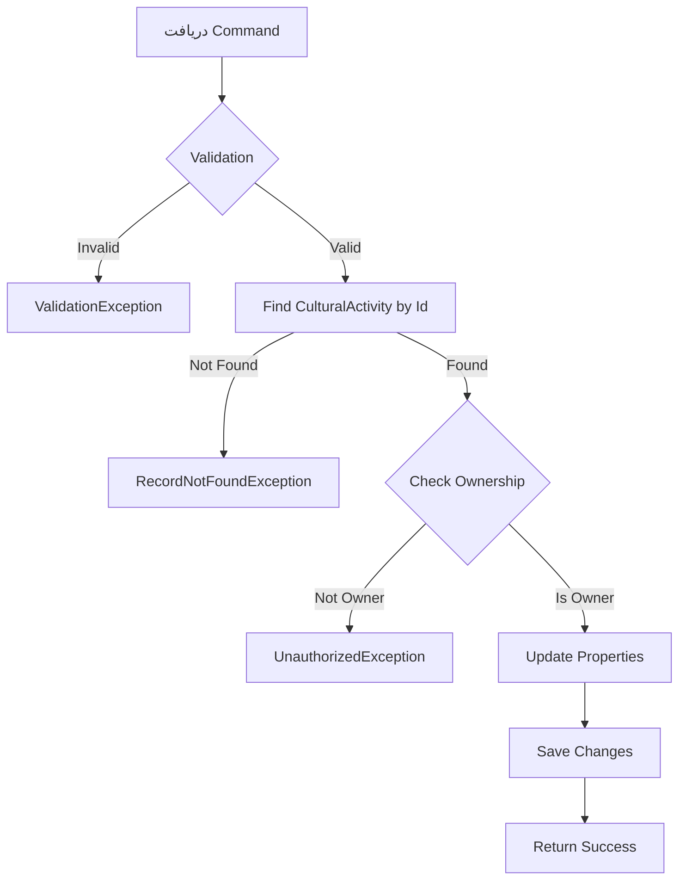

# UpdateCulturalActivityCommand.cs

**مسیر**: `Csis.Admission.Application/Features/CulturalActivities/Commands/UpdateCulturalActivityCommand.cs`

## 1. هدف (Purpose)

این Command برای **بروزرسانی فعالیت فرهنگی موجود** استفاده می‌شود.

### کاربرد اصلی:
- ویرایش اطلاعات فعالیت فرهنگی
- اصلاح خطاهای ثبتی
- به‌روزرسانی جزئیات فعالیت

---

## 2. ورودی (Input)

```csharp
public sealed record UpdateCulturalActivityCommand(
    int Id,
    string ActivityTitle,
    DateTime ActivityDate,
    string Description,
    int? CulturalActivityTypeId
) : IRequest;
```

| پارامتر | نوع | الزامی | توضیحات |
|---------|-----|--------|---------|
| `Id` | `int` | ✅ | شناسه فعالیت |
| `ActivityTitle` | `string` | ✅ | عنوان جدید فعالیت |
| `ActivityDate` | `DateTime` | ✅ | تاریخ جدید |
| `Description` | `string` | ❌ | توضیحات |
| `CulturalActivityTypeId` | `int?` | ❌ | نوع فعالیت |

---

## 3. خروجی (Output)

```csharp
void // بدون خروجی (Unit)
```

---

## 4. وابستگی‌ها (Dependencies)

```csharp
- IApplicationDbContext
- ICurrentUserService
- IMapper
```

---

## 5. جریان اجرا (Execution Flow)



---

## 6. قوانین کسب‌وکار (Business Rules)

### BR-1: مالکیت
- فقط مالک (دانشجو) یا Admin می‌تواند ویرایش کند

### BR-2: اعتبارسنجی
- تاریخ نباید در آینده باشد
- عنوان باید بین 3-200 کاراکتر باشد

### BR-3: Audit Trail
- LastModifiedBy و LastModifiedDate به‌روز می‌شود

---

## 7. الگوهای طراحی (Design Patterns)

1. **CQRS Pattern** - Command Side
2. **Command Pattern**
3. **Repository Pattern**
4. **Audit Pattern** - ثبت تغییرات

---

## 8. عملکرد و بهینه‌سازی (Performance)

### بهینه‌سازی:
- ✅ Optimistic Concurrency Control
- ✅ Transaction برای یکپارچگی

### Cache Invalidation:
```csharp
InvalidateCache($"cultural-activities:codm:{activity.Codm}")
```

---

## 9. Use Cases مرتبط

- **UC-018**: مدیریت فعالیت‌های فرهنگی
- **UC-TargetedScores**: به‌روزرسانی امتیازات

---

## 10. نتیجه‌گیری

Command برای **ویرایش فعالیت‌های فرهنگی**.

✅ بررسی مالکیت  
✅ Audit Trail  
✅ Cache Invalidation
