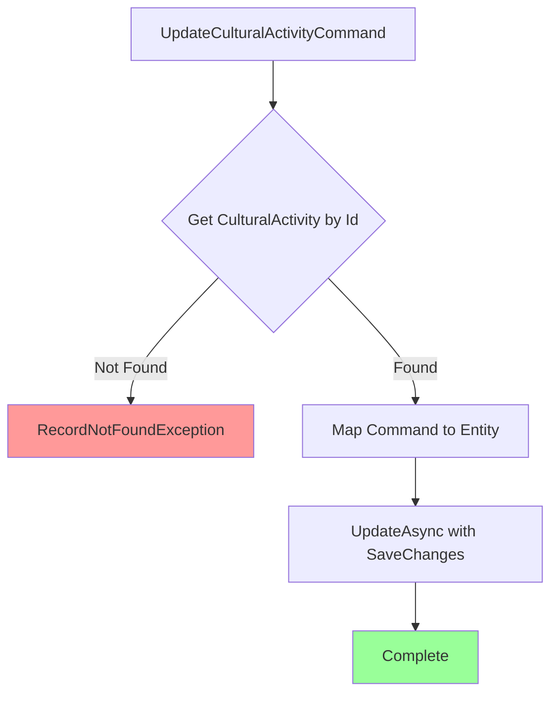

# UpdateCulturalActivityCommand.cs

**مسیر**: `Csis.Admission.Application/Features/CulturalActivities/Commands/UpdateCulturalActivityCommand.cs`

## 1. هدف (Purpose)

این Command برای **بروزرسانی اطلاعات فعالیت‌های فرهنگی** (Cultural Activity) دانشجویان/وابستگان استفاده می‌شود. فعالیت‌های فرهنگی شامل مدیریت‌های فرهنگی، نشریات، سخنرانی و سایر فعالیت‌های فرهنگی است.

## 2. ساختار کلی (Structure)

### نوع: 
- Command (CQRS Pattern)
- بازگشت: `void` (Unit)

### الگوی طراحی:
- **CQRS Pattern**: جداسازی Command از Query
- **Repository Pattern**: دسترسی به داده‌ها
- **BaseCommandDto**: استفاده از DTO پایه برای AutoMapper
- **Validation Pattern**: بررسی وجود رکورد
- **RecordNotFoundException**: استفاده از Generic Exception

## 3. ورودی‌ها (Inputs)

| پارامتر | نوع | الزامی | توضیحات |
|---------|-----|--------|---------|
| `Id` | int | ✅ | شناسه فعالیت فرهنگی |
| `Codm` | int | ✅ | کد مرکز |
| `Kind` | CulturalKind | ✅ | نوع مدیریت فرهنگی (Enum) |
| `OtherKind` | string | ❌ | سایر انواع (در صورت Kind=Other) |
| `Year` | int | ✅ | سال انجام فعالیت |

### مثال Request:
```json
{
  "id": 456,
  "codm": 12345,
  "kind": 2,
  "otherKind": "مربیگری کانون",
  "year": 1403
}
```

## 4. خروجی (Output)

```csharp
void // بدون خروجی
```

## 5. جریان اجرا (Execution Flow)



### شرح مراحل:
1. **دریافت Entity**: دریافت CulturalActivity با Id (با Tracking)
2. **Validation**: اگر یافت نشد، `RecordNotFoundException`
3. **Mapping**: نگاشت Command به Entity با `ToEntity()`
4. **Update**: بروزرسانی با `UpdateAsync(entity, saveChanges: true)`
5. **Complete**: اتمام عملیات

## 6. قوانین کسب‌وکار (Business Rules)

### BR-1: Record Existence
رکورد باید از قبل وجود داشته باشد:
```csharp
var culturalActivity = await _culturalActivityRepo.GetByIdAsTrackingAsync(request.Id, ...)
    ?? throw new RecordNotFoundException<CulturalActivity>(request.Id);
```

### BR-2: Tracking Required
Entity باید با Tracking دریافت شود برای Update:
```csharp
GetByIdAsTrackingAsync(request.Id, ...)
```

### BR-3: Auto Save
تغییرات به صورت خودکار ذخیره می‌شوند:
```csharp
UpdateAsync(culturalActivity, saveChanges: true, cancellationToken)
```

### BR-4: OtherKind Field
فیلد `OtherKind` زمانی پر می‌شود که `Kind = Other` باشد.

## 7. وابستگی‌ها (Dependencies)

```csharp
IRepository<CulturalActivity> _culturalActivityRepo
```

### استفاده‌ها:
- `GetByIdAsTrackingAsync`: دریافت رکورد با Tracking
- `UpdateAsync`: بروزرسانی رکورد

## 8. معماری و الگوها (Architecture & Patterns)

### الگوهای استفاده شده:
1. **CQRS Pattern**: Command برای تغییر state
2. **Repository Pattern**: دسترسی به داده
3. **AutoMapper**: نگاشت خودکار DTO به Entity
4. **Record Type (C# 9+)**: Immutable DTOs
5. **BaseCommandDto Pattern**: استفاده از DTO پایه
6. **Generic Exception**: `RecordNotFoundException<T>`

### لایه‌بندی:
```
Presentation → Application (Command) → Repository → Database
```

## 9. ملاحظات امنیتی (Security Considerations)

### ⚠️ مشکلات امنیتی:

#### 1. فقدان Authorization
```csharp
// ❌ مشکل: هر کسی می‌تواند هر فعالیت فرهنگی را ویرایش کند
public async Task Handle(UpdateCulturalActivityCommand request, CancellationToken cancellationToken)
```

**توصیه**: بررسی Codm با کاربر احراز هویت شده:
```csharp
if (request.Codm != authenticatedUser.Codm) {
    throw new UnauthorizedAccessException();
}
```

#### 2. Codm استفاده نمی‌شود
```csharp
// ❌ مشکل: Codm parameter وجود دارد اما استفاده نمی‌شود
public int Codm { get; set; }
```

**توصیه**: Validation برای مالکیت:
```csharp
var culturalActivity = await _culturalActivityRepo.GetByIdAsTrackingAsync(request.Id, ...)
    ?? throw new RecordNotFoundException<CulturalActivity>(request.Id);

if (culturalActivity.Codm != request.Codm) {
    throw new UnauthorizedAccessException("شما مجاز به ویرایش این فعالیت فرهنگی نیستید.");
}
```

#### 3. فقدان Audit Logging
```csharp
// ❌ مشکل: هیچ لاگی ثبت نمی‌شود
```

**توصیه**: اضافه کردن Logger:
```csharp
_logger.LogInformation("CulturalActivity updated: {@Activity} by User {Codm}", 
    culturalActivity, request.Codm);
```

## 10. کارایی (Performance)

### نقاط قوت:
- ✅ استفاده از Tracking برای Update (بهینه)
- ✅ Auto Save برای کاهش Round-trip

### نقاط ضعف:
- ⚠️ فقدان Batch Update برای چندین رکورد
- ⚠️ فقدان Caching

### پیشنهادات بهبود:
```csharp
// Batch Update برای چندین فعالیت
public async Task HandleBatch(List<UpdateCulturalActivityCommand> requests, CancellationToken cancellationToken) {
    var ids = requests.Select(x => x.Id).ToList();
    var activities = await _culturalActivityRepo.GetByIdsAsTrackingAsync(ids, cancellationToken);
    
    foreach (var request in requests) {
        var activity = activities.FirstOrDefault(x => x.Id == request.Id);
        if (activity != null) {
            request.ToEntity(activity);
        }
    }
    
    await _culturalActivityRepo.UpdateRangeAsync(activities, true, cancellationToken);
}
```

## 11. خطاها و استثناها (Errors & Exceptions)

### استثناهای ممکن:

| استثنا | زمان رخداد | پیام |
|--------|-----------|------|
| `RecordNotFoundException<CulturalActivity>` | فعالیت یافت نشد | CulturalActivity with ID {Id} not found |
| `DbUpdateException` | خطا در ذخیره | Database error |
| `UnauthorizedAccessException` | عدم دسترسی | Unauthorized |
| `ArgumentNullException` | پارامتر null | Parameter cannot be null |

### مثال Error Response:
```json
{
  "error": "CulturalActivity with ID 456 not found",
  "statusCode": 404
}
```

## 12. تست‌پذیری (Testability)

### Unit Test نمونه:
```csharp
[Fact]
public async Task Handle_ActivityExists_UpdatesSuccessfully() {
    // Arrange
    var activity = new CulturalActivity { 
        Id = 1, 
        Codm = 12345, 
        Kind = CulturalKind.Management,
        Year = 1402
    };
    _mockRepo.Setup(x => x.GetByIdAsTrackingAsync(1, ...)).ReturnsAsync(activity);
    
    var command = new UpdateCulturalActivityCommand { 
        Id = 1, 
        Codm = 12345,
        Kind = CulturalKind.Publication,
        Year = 1403
    };
    
    // Act
    await _handler.Handle(command, CancellationToken.None);
    
    // Assert
    Assert.Equal(CulturalKind.Publication, activity.Kind);
    Assert.Equal(1403, activity.Year);
    _mockRepo.Verify(x => x.UpdateAsync(activity, true, ...), Times.Once);
}

[Fact]
public async Task Handle_ActivityNotFound_ThrowsRecordNotFoundException() {
    // Arrange
    _mockRepo.Setup(x => x.GetByIdAsTrackingAsync(999, ...)).ReturnsAsync((CulturalActivity)null);
    
    var command = new UpdateCulturalActivityCommand { Id = 999 };
    
    // Act & Assert
    await Assert.ThrowsAsync<RecordNotFoundException<CulturalActivity>>(
        () => _handler.Handle(command, CancellationToken.None));
}
```

## 13. مثال استفاده (Usage Example)

### از Controller:
```csharp
[HttpPut("{id}")]
public async Task<IActionResult> UpdateCulturalActivity(int id, [FromBody] UpdateCulturalActivityCommand command) {
    if (id != command.Id) {
        return BadRequest("Id mismatch");
    }
    
    await _mediator.Send(command);
    return NoContent();
}
```

### از Service:
```csharp
var command = new UpdateCulturalActivityCommand {
    Id = 456,
    Codm = authenticatedUser.Codm,
    Kind = CulturalKind.Management,
    OtherKind = null,
    Year = 1403
};

await _mediator.Send(command);
Console.WriteLine("CulturalActivity updated successfully");
```

## 14. یادداشت‌های توسعه (Developer Notes)

### ⚠️ نکات مهم:

1. **Codm استفاده نمی‌شود**:
   ```csharp
   public int Codm { get; set; } // ❌ در Handler استفاده نشده
   ```
   باید برای Authorization و Ownership validation استفاده شود.

2. **OtherKind Validation**:
   - بررسی کنید که اگر `Kind = Other`، پس `OtherKind` نباید null باشد
   ```csharp
   if (request.Kind == CulturalKind.Other && string.IsNullOrEmpty(request.OtherKind)) {
       throw new CommandValidationException("در صورت انتخاب 'سایر'، باید توضیحات را وارد کنید.");
   }
   ```

3. **فقدان Logger**:
   ```csharp
   // ❌ Logger inject نشده
   public UpdateCulturalActivityCommandHandler(IRepository<CulturalActivity> culturalActivityRepo)
   ```
   
   **پیشنهاد**:
   ```csharp
   public UpdateCulturalActivityCommandHandler(
       IRepository<CulturalActivity> culturalActivityRepo,
       ILogger<UpdateCulturalActivityCommandHandler> logger)
   ```

4. **Year Validation**:
   - بررسی کنید که Year معتبر است (مثلاً بین 1380-1420)
   ```csharp
   if (request.Year < 1380 || request.Year > 1420) {
       throw new CommandValidationException("سال باید بین 1380 تا 1420 باشد.");
   }
   ```

## 15. Commands/Queries مرتبط (Related Commands/Queries)

### Commands مرتبط:
- `CreateCulturalActivityCommand`: ایجاد فعالیت فرهنگی جدید
- `DeleteCulturalActivityCommand`: حذف فعالیت فرهنگی
- `DeleteCulturalActivityRequestCommand`: حذف درخواست فعالیت فرهنگی

### Queries مرتبط:
- `GetCulturalActivitiesByCodmQuery`: دریافت لیست فعالیت‌های فرهنگی بر اساس Codm
- `GetCulturalActivityByIdQuery`: دریافت جزئیات یک فعالیت فرهنگی

### Entities مرتبط:
- `CulturalActivity`: Entity اصلی
- `CulturalKind`: Enum نوع فعالیت فرهنگی

## 16. تغییرات پیشنهادی (Suggested Improvements)

### 1. اضافه کردن Authorization و Logging
```diff
internal sealed class UpdateCulturalActivityCommandHandler : IRequestHandler<UpdateCulturalActivityCommand>
{
    private readonly IRepository<CulturalActivity> _culturalActivityRepo;
+   private readonly IAuthenticatedUser _authenticatedUser;
+   private readonly ILogger<UpdateCulturalActivityCommandHandler> _logger;
    
    public UpdateCulturalActivityCommandHandler(
-       IRepository<CulturalActivity> culturalActivityRepo) 
+       IRepository<CulturalActivity> culturalActivityRepo,
+       IAuthenticatedUser authenticatedUser,
+       ILogger<UpdateCulturalActivityCommandHandler> logger) 
    {
        _culturalActivityRepo = culturalActivityRepo;
+       _authenticatedUser = authenticatedUser;
+       _logger = logger;
    }

    public async Task Handle(UpdateCulturalActivityCommand request, CancellationToken cancellationToken) {
+       if (request.Codm != _authenticatedUser.Codm) {
+           throw new UnauthorizedAccessException("شما مجاز به ویرایش این فعالیت فرهنگی نیستید.");
+       }
+
        var culturalActivity = await _culturalActivityRepo.GetByIdAsTrackingAsync(request.Id, cancellationToken: cancellationToken)
            ?? throw new RecordNotFoundException<CulturalActivity>(request.Id);
        
+       if (culturalActivity.Codm != request.Codm) {
+           throw new UnauthorizedAccessException("این فعالیت فرهنگی متعلق به شما نیست.");
+       }
+
+       _logger.LogInformation("Updating CulturalActivity {Id} by User {Codm}", request.Id, request.Codm);
+
        request.ToEntity(culturalActivity);
        await _culturalActivityRepo.UpdateAsync(culturalActivity, true, cancellationToken);
+       
+       _logger.LogInformation("CulturalActivity updated: {@Activity}", culturalActivity);
    }
}
```

### 2. اضافه کردن Fluent Validation
```csharp
public class UpdateCulturalActivityCommandValidator : AbstractValidator<UpdateCulturalActivityCommand> {
    public UpdateCulturalActivityCommandValidator() {
        RuleFor(x => x.Id).GreaterThan(0).WithMessage("شناسه باید بزرگتر از صفر باشد.");
        RuleFor(x => x.Codm).GreaterThan(0).WithMessage("کد مرکز باید بزرگتر از صفر باشد.");
        
        RuleFor(x => x.Year)
            .InclusiveBetween(1380, 1420)
            .WithMessage("سال باید بین 1380 تا 1420 باشد.");
        
        RuleFor(x => x.Kind).IsInEnum().WithMessage("نوع فعالیت فرهنگی نامعتبر است.");
        
        RuleFor(x => x.OtherKind)
            .NotEmpty()
            .When(x => x.Kind == CulturalKind.Other)
            .WithMessage("در صورت انتخاب 'سایر'، باید توضیحات را وارد کنید.");
    }
}
```

### 3. بهبود Error Handling
```diff
public async Task Handle(UpdateCulturalActivityCommand request, CancellationToken cancellationToken) {
+   try {
        var culturalActivity = await _culturalActivityRepo.GetByIdAsTrackingAsync(request.Id, cancellationToken: cancellationToken)
            ?? throw new RecordNotFoundException<CulturalActivity>(request.Id);
        
        request.ToEntity(culturalActivity);
        await _culturalActivityRepo.UpdateAsync(culturalActivity, true, cancellationToken);
+   }
+   catch (DbUpdateException ex) {
+       _logger.LogError(ex, "Error updating CulturalActivity {Id}", request.Id);
+       throw new CommandValidationException("خطا در بروزرسانی فعالیت فرهنگی.", ex);
+   }
}
```

### 4. اضافه کردن Audit Trail
```diff
request.ToEntity(culturalActivity);
+culturalActivity.UpdatedAt = DateTime.UtcNow;
+culturalActivity.UpdatedBy = _authenticatedUser.Codm;
await _culturalActivityRepo.UpdateAsync(culturalActivity, true, cancellationToken);
```

---

**آخرین بروزرسانی**: 1403/10/04  
**نسخه**: 1.0  
**وضعیت**: ⚠️ Needs Security Improvements
