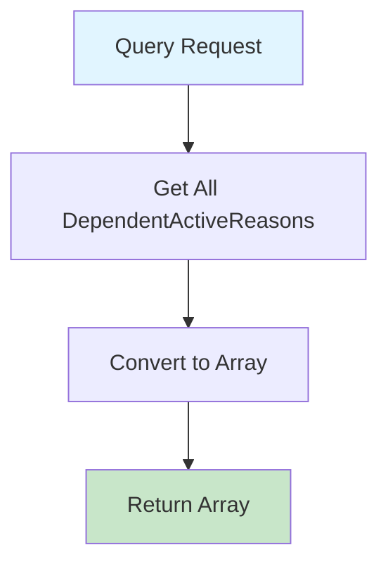

# GetAllDependentActiveReasonsQuery.cs

**مسیر**: `Csis.Admission.Application/Features/DependentActiveReasons/Queries/GetAllDependentActiveReasonsQuery.cs`

## 1. هدف (Purpose)

این Query برای **دریافت لیست دلایل فعال‌سازی افراد تحت تکفل** از دیتابیس استفاده می‌شود.

### کاربرد اصلی:
- Populate کردن Dropdown دلایل فعال‌سازی تکفل
- فرآیند فعال‌سازی پرونده تکفل (ازدواج، تولد فرزند، ...)
- ثبت تغییرات وضعیت تکفل

---

## 2. ورودی (Input)

```csharp
public sealed record GetAllDependentActiveReasonsQuery : IRequest<DependentActiveReasonDto[]>;
```

### پارامترها:
این Query **هیچ پارامتر ورودی ندارد** و تمام دلایل فعال‌سازی را برمی‌گرداند.

---

## 3. خروجی (Output)

```csharp
DependentActiveReasonDto[]
```

### نمونه دلایل:
- ازدواج
- تولد فرزند
- سایر موارد قانونی

---

## 4. وابستگی‌ها (Dependencies)

**Dependencies:**
1. **IRepository<DependentActiveReason>**: دسترسی به جدول دلایل فعال‌سازی

---

## 5. جریان اجرا (Execution Flow)



---

## 6. الگوهای طراحی (Design Patterns)

1. **CQRS Pattern**
2. **Repository Pattern**
3. **DTO Pattern**

---

## 7. عملکرد و بهینه‌سازی (Performance)

### پیشنهاد: Caching
```csharp
// داده‌های Master Data نادراً تغییر می‌کنند
return await _cache.GetOrCreateAsync("dependent_active_reasons", async entry => 
{
    entry.AbsoluteExpirationRelativeToNow = TimeSpan.FromHours(24);
    return await _repo.GetAllAsync<DependentActiveReasonDto>();
});
```

---

## 8. Use Cases مرتبط

- ثبت ازدواج → فعال‌سازی همسر
- ثبت تولد فرزند → فعال‌سازی فرزند
- مدیریت افراد تحت تکفل

---

## نتیجه‌گیری

Query **Master Data** برای مدیریت تکفل.

### نقاط قوت:
✅ داده‌های ثابت و کم‌تغییر  
✅ مناسب برای Caching  

### پیشنهاد:
⚠️ افزودن Caching برای بهبود Performance
