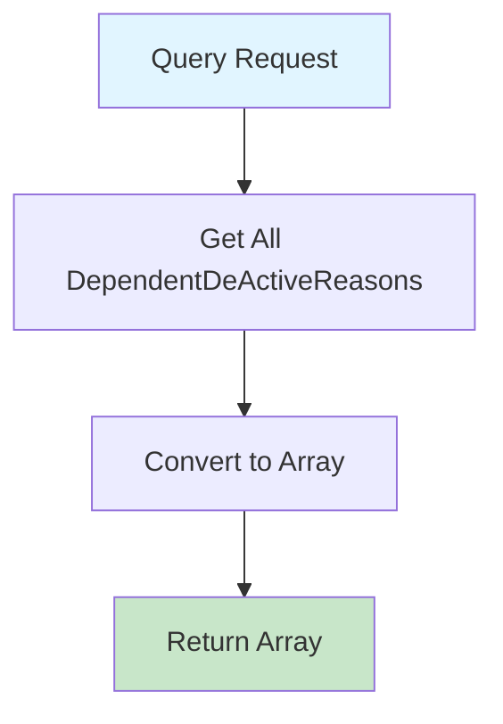

# GetAllDependentDeActiveReasonsQuery.cs

**مسیر**: `Csis.Admission.Application/Features/DependentDeActiveReasons/Queries/GetAllDependentDeActiveReasonsQuery.cs`

## 1. هدف (Purpose)

این Query برای **دریافت لیست دلایل غیرفعال‌سازی افراد تحت تکفل** از دیتابیس استفاده می‌شود.

### کاربرد اصلی:
- Populate کردن Dropdown دلایل غیرفعال‌سازی تکفل
- فرآیند غیرفعال‌سازی پرونده تکفل (طلاق، فوت، اشتغال، ...)
- ثبت تغییرات وضعیت تکفل

---

## 2. ورودی (Input)

```csharp
public sealed record GetAllDependentDeActiveReasonsQuery : IRequest<DependentDeActiveReasonDto[]>;
```

### پارامترها:
این Query **هیچ پارامتر ورودی ندارد** و تمام دلایل غیرفعال‌سازی را برمی‌گرداند.

---

## 3. خروجی (Output)

```csharp
DependentDeActiveReasonDto[]
```

### نمونه دلایل:
- طلاق
- فوت
- اشتغال فرزند
- سایر موارد قانونی

---

## 4. وابستگی‌ها (Dependencies)

**Dependencies:**
1. **IRepository<DependentDeActiveReason>**: دسترسی به جدول دلایل غیرفعال‌سازی

---

## 5. جریان اجرا (Execution Flow)



---

## 6. الگوهای طراحی (Design Patterns)

1. **CQRS Pattern**
2. **Repository Pattern**
3. **DTO Pattern**

---

## 7. عملکرد و بهینه‌سازی (Performance)

### پیشنهاد: Caching
```csharp
// داده‌های Master Data نادراً تغییر می‌کنند
return await _cache.GetOrCreateAsync("dependent_deactive_reasons", async entry => 
{
    entry.AbsoluteExpirationRelativeToNow = TimeSpan.FromHours(24);
    return await _repo.GetAllAsync<DependentDeActiveReasonDto>();
});
```

---

## 8. Use Cases مرتبط

- ثبت طلاق → غیرفعال‌سازی همسر
- ثبت فوت → غیرفعال‌سازی فرد متوفی
- ثبت اشتغال فرزند → غیرفعال‌سازی
- مدیریت افراد تحت تکفل

---

## نتیجه‌گیری

Query **Master Data** برای مدیریت تکفل.

### نقاط قوت:
✅ داده‌های ثابت و کم‌تغییر  
✅ مناسب برای Caching  

### پیشنهاد:
⚠️ افزودن Caching برای بهبود Performance
