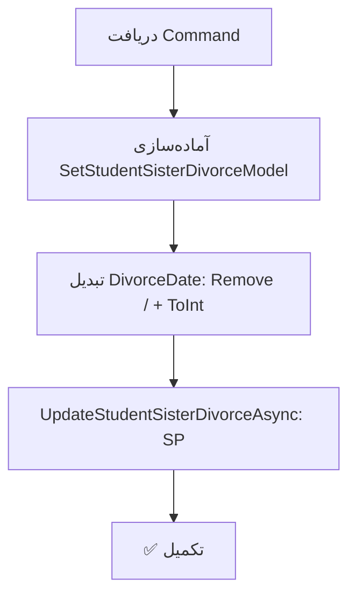

<div dir="rtl">

# UpdateStudentSisterDivorceCommand.cs

**مسیر**: `Csis.Admission.Application/Features/Divorce/Commands/UpdateStudentSisterDivorceCommand.cs`

---

## 1. Purpose (هدف)

Command **ثبت طلاق خواهر طلبه** (دانشجوی مرد) از طریق Stored Procedure. این Command برای ثبت رویداد طلاق خواهر دانشجو استفاده می‌شود.

---

## 2. مستندات XML موجود

```csharp
/// <summary>
/// کد مرکز طلبه ی خواهر
/// </summary>
```

**نسبتاً کامل**: توضیحات برای فیلدها موجود است

---

## 3. خلاصه اتفاقات

**جریان اصلی**:
```
1. دریافت اطلاعات طلاق (Codm, DivorceDate, SpouseNationalCode, SpouseBirthDate)
2. تبدیل DivorceDate: حذف "/" و تبدیل به Int
3. فراخوانی Stored Procedure برای ثبت طلاق خواهر
```

---

## 4. اجزای اصلی

### Command:
```csharp
sealed record UpdateStudentSisterDivorceCommand : IRequest
{
    int Codm                        // کد مرکز طلبه خواهر
    string DivorceDate              // تاریخ طلاق
    string SpouseNationalCode       // کد ملی همسر (برای استعلام)
    string SpouseBirthDate          // تاریخ تولد همسر (برای استعلام)
}
```

### Handler Dependencies:
- **IStudentRepository**: فراخوانی SP
- **ICsisWsmService**: استعلام از ثبت احوال (تزریق شده اما استفاده نشده)
- **IStudentDependentRepository**: (تزریق شده اما استفاده نشده)
- **IRepository<DependentSummary>**: (تزریق شده اما استفاده نشده)
- **IRepository<Student>**: (تزریق شده اما استفاده نشده)

---

## 5. Flow



---

## 6. Business Rules

### BR-1: فقط برای طلبه خواهر
- این Command برای ثبت طلاق **خواهر** دانشجوی **مرد** است
- مشابه `UpdateStudentSisterMarriageCommand`

### BR-2: بدون اعتبارسنجی خارجی
- **برخلاف** نسخه ازدواج، این Command از ثبت احوال استعلام **نمی‌کند**
- `SpouseNationalCode` و `SpouseBirthDate` در Command هستند اما استفاده نمی‌شوند
- احتمالاً باگ یا TODO

### BR-3: Date Format متفاوت
```csharp
DivorceDate = request.DivorceDate.Replace("/", "").ToInt()
```
- بجای استفاده از `StringDateToInt()` extension
- روش دستی و متفاوت

---

## 7. Dependencies

### Internal:
- `IStudentRepository`: فراخوانی SP

### External:
- **Stored Procedure**: `UpdateStudentSisterDivorce`
- ⚠️ **ICsisWsmService**: تزریق شده اما استفاده نشده

---

## 8. Input/Output

### Input:
```csharp
int Codm                        // کد مرکز خدمات
string DivorceDate              // تاریخ طلاق
string SpouseNationalCode       // کد ملی همسر (استفاده نمی‌شود)
string SpouseBirthDate          // تاریخ تولد همسر (استفاده نمی‌شود)
```

### Output:
```csharp
void (Task)
```

### Exceptions:
- Exception ها از SP می‌آیند

---

## 9. Side Effects

1. **ثبت رویداد طلاق**: برای خواهر دانشجو
2. **تأثیر بر تکفل**: ممکن است وضعیت تکفل خواهر تغییر کند

---

## 10. الگوهای استفاده شده

### ✅ Stored Procedure Call
```csharp
await repo.UpdateStudentSisterDivorceAsync(model);
```

### ⚠️ Manual Date Conversion
```csharp
DivorceDate = request.DivorceDate.Replace("/", "").ToInt()
```

---

## 11. Performance

- **Database Operations**: 1 SP Call
- عملیات ساده

---

## 12. Security

- ⚠️ **No External Validation**: برخلاف نسخه ازدواج، از ثبت احوال استعلام نمی‌شود
- ⚠️ **Authorization**: بررسی نمی‌شود که آیا کاربر مجاز است

---

## 13. نکات مهم

### ⚠️ Dependencies استفاده نشده (بحرانی)
```csharp
public UpdateStudentSisterDivorceCommandHandler(
    IStudentRepository studentRepository,
    ICsisWsmService csisWsmService,              // ❌ استفاده نشده
    IStudentDependentRepository studentDependentRepository,  // ❌ استفاده نشده
    IRepository<DependentSummary, long> studentDependentRepo,  // ❌ استفاده نشده
    IRepository<Student> studentRepo)             // ❌ استفاده نشده
```

**تنها** `_studentRepository` و `_csisWsmService` به فیلد تبدیل شدند، اما `_csisWsmService` هم استفاده نمی‌شود!

### ⚠️ SpouseNationalCode و SpouseBirthDate استفاده نمی‌شوند
- این فیلدها در Command تعریف شده‌اند
- احتمالاً برای استعلام از ثبت احوال بودند
- اما هیچگاه استفاده نشدند
- **TODO** یا **باگ**

### 💡 مقایسه با UpdateStudentSisterMarriageCommand
| Feature | Marriage Command | Divorce Command |
|---------|------------------|-----------------|
| استعلام ثبت احوال | ✅ دارد | ❌ ندارد |
| Validation | ✅ کامل | ❌ ناقص |
| Dependencies استفاده نشده | 1 | 4 |
| Date Conversion | Extension | Manual |

### 🎯 احتمالاً Incomplete Implementation
این Command به نظر می‌رسد که **نیمه‌کاره** است:
- Dependencies اضافی تزریق شده
- فیلدهای استعلام موجود اما استفاده نشده
- فقدان Validation

---

## 14. مثال استفاده

```csharp
// ثبت طلاق خواهر طلبه
var cmd = new UpdateStudentSisterDivorceCommand {
    Codm = 12345,
    DivorceDate = "1402/10/15",
    SpouseNationalCode = "1234567890",  // استفاده نمی‌شود
    SpouseBirthDate = "1375/05/10"      // استفاده نمی‌شود
};
await mediator.Send(cmd);

// نتیجه: طلاق خواهر ثبت می‌شود (بدون اعتبارسنجی خارجی)
```

---

## 15. Related Commands

- **UpdateStudentSisterMarriageCommand**: ازدواج خواهر (با استعلام ثبت احوال)
- **UpdateWifeDivorceCommand**: طلاق همسر
- **UpdateDependentDivorceCommand**: طلاق عمومی Dependent

---

## 16. تغییرات پیشنهادی

### 1. پاک‌سازی Dependencies
```csharp
internal sealed class UpdateStudentSisterDivorceCommandHandler(
    IStudentRepository studentRepository
    // حذف Dependencies استفاده نشده
) : IRequestHandler<UpdateStudentSisterDivorceCommand>
```

### 2. افزودن استعلام ثبت احوال (مشابه Marriage)
```csharp
public async Task Handle(UpdateStudentSisterDivorceCommand request, ...) {
    // استعلام از ثبت احوال
    var validationRequest = new ValidateSpousalRelationshipRequest(
        request.Codm,
        ...,
        request.SpouseNationalCode,
        request.SpouseBirthDate,
        request.DivorceDate,
        RelationTypeEnum.Divorce  // نوع: طلاق
    );
    
    var response = await csisWsmService.ValidateSpousalRelationship(validationRequest);
    if (response is not Result.ValidRelation)
        throw new CommandValidationException("اطلاعات طلاق در ثبت احوال ثبت نشده است");
    
    // ادامه...
}
```

### 3. یکسان‌سازی Date Conversion
```csharp
// بجای روش دستی
DivorceDate = request.DivorceDate.Replace("/", "").ToInt()

// استفاده از Extension
DivorceDate = request.DivorceDate.StringDateToInt().Value
```

### 4. حذف فیلدهای استفاده نشده (اگر واقعاً نیاز نیست)
```csharp
public sealed record UpdateStudentSisterDivorceCommand : IRequest
{
    public int Codm { get; set; }
    public string DivorceDate { get; init; }
    // حذف SpouseNationalCode و SpouseBirthDate (اگر استعلام نمی‌شود)
}
```

---

</div>
