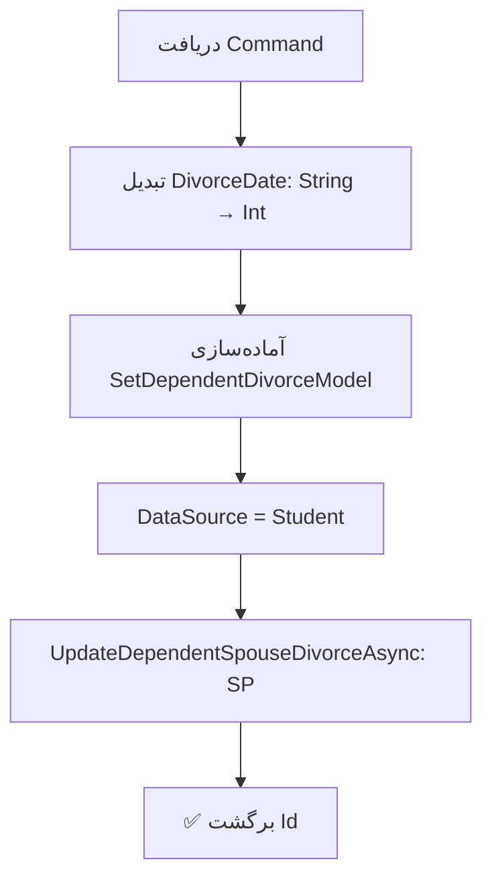

<div dir="rtl">

# UpdateWifeDivorceCommand.cs

**مسیر**: `Csis.Admission.Application/Features/Divorce/Commands/UpdateWifeDivorceCommand.cs`

---

## 1. Purpose (هدف)

Command **ثبت طلاق همسر** دانشجو از طریق Stored Procedure. این Command برای ثبت رویداد طلاق همسر دانشجو استفاده می‌شود که می‌تواند تأثیری بر وضعیت تکفل و خدمات داشته باشد.

---

## 2. مستندات XML موجود

```xml
/// <inheritdoc/>
```

**ناقص**: فاقد مستندات - فقط inheritdoc

**پیشنهاد**:
```csharp
/// <summary>ثبت طلاق همسر دانشجو</summary>
```

---

## 3. خلاصه اتفاقات

**جریان اصلی**:
```
1. دریافت اطلاعات طلاق (Codm, DependentId, DivorceDate)
2. تبدیل DivorceDate از String به Int
3. تنظیم DataSource = Student
4. فراخوانی Stored Procedure برای ثبت طلاق
5. برگشت Id
```

---

## 4. اجزای اصلی

### Command:
```csharp
sealed record UpdateWifeDivorceCommand : IRequest<long>
{
    int Codm                // کد مرکز خدمات
    string DivorceDate      // تاریخ طلاق (فرمت String)
    long? DependentId       // شناسه همسر (فرد تحت تکفل)
}
```

### Handler Dependencies:
- **IStudentDependentRepository**: دسترسی به Stored Procedure

---

## 5. Flow



---

## 6. Business Rules

### BR-1: ثبت از طریق Stored Procedure
- منطق کامل ثبت طلاق در **SP** پیاده‌سازی شده
- Command فقط wrapper است

### BR-2: DataSource
- `DataSource.Student`: این Command توسط دانشجو فراخوانی می‌شود
- برای Audit و تشخیص منبع تغییر

### BR-3: فقط برای همسر
- این Command برای ثبت طلاق **همسر** (Spouse) است
- `DependentId` باید شناسه همسر باشد

---

## 7. Dependencies

### Internal:
- `IStudentDependentRepository`: فراخوانی SP

### External:
- **Stored Procedure**: `UpdateDependentSpouseDivorce`

---

## 8. Input/Output

### Input:
```csharp
int Codm                // کد مرکز خدمات
string DivorceDate      // تاریخ طلاق (مثلاً "1402/10/15")
long? DependentId       // شناسه همسر
```

### Output:
```csharp
long Id     // شناسه رکورد طلاق ثبت شده
```

### Exceptions:
- **NullReferenceException**: اگر `DependentId` null باشد
- Exception ها از SP می‌آیند

---

## 9. Side Effects

1. **ثبت رویداد طلاق**: در جدول مربوطه
2. **تغییر وضعیت تکفل**: ممکن است همسر دیگر تحت تکفل نباشد
3. **تأثیر بر خدمات**: احتمال تغییر خدمات قابل دریافت

---

## 10. الگوهای استفاده شده

### ✅ Stored Procedure Pattern
```csharp
var model = new SetDependentDivorceModel { ... };
var result = await repo.UpdateDependentSpouseDivorceAsync(model);
```

### ✅ DataSource Tracking
- ثبت اینکه تغییر توسط دانشجو انجام شده

---

## 11. Performance

- **Database Operations**: 1 SP Call
- SP احتمالاً شامل چندین Query/Update است

---

## 12. Security

- ⚠️ **Authorization**: بررسی نمی‌شود که آیا Dependent متعلق به Codm است
- ⚠️ **Validation**: فقدان Validation برای DependentId
- ⚠️ **Null Check**: `DependentId.Value` بدون بررسی null

---

## 13. نکات مهم

### ⚠️ Null Reference خطر
```csharp
DependentId = request.DependentId.Value  // اگر null باشد، خطا می‌دهد
```

**بهتر است**:
```csharp
if (!request.DependentId.HasValue)
    throw new CommandValidationException("شناسه همسر الزامی است");

DependentId = request.DependentId.Value
```

### 💡 Stored Procedure محوری
- تمام منطق کسب‌وکار در SP است
- این Command فقط یک wrapper ساده است

### 🎯 Use Case
- دانشجو طلاق گرفته
- اطلاعات طلاق را ثبت می‌کند
- سیستم ممکن است:
  - همسر را از لیست تکفل خارج کند
  - خدمات مربوط به همسر را قطع کند
  - اعلان ارسال کند

### 💡 مشابهت با UpdateChildMarriageCommand
- منطق مشابه با ثبت ازدواج
- تفاوت اصلی: نوع رویداد (طلاق vs ازدواج)

---

## 14. مثال استفاده

```csharp
// ثبت طلاق همسر دانشجو
var cmd = new UpdateWifeDivorceCommand {
    Codm = 12345,
    DependentId = 888,  // شناسه همسر
    DivorceDate = "1402/10/15"
};
var divorceId = await mediator.Send(cmd);

// نتیجه: رویداد طلاق برای همسر 888 ثبت می‌شود
```

---

## 15. Related Commands

- **UpdateDependentDivorceCommand**: طلاق عمومی Dependent
- **UpdateStudentSisterDivorceCommand**: طلاق خواهر طلبه
- **UpdateChildMarriageCommand**: ازدواج فرزند (الگوی مشابه)

---

## 16. تغییرات پیشنهادی

### 1. افزودن Null Check
```csharp
public async Task<long> Handle(UpdateWifeDivorceCommand request, ...) {
    if (!request.DependentId.HasValue)
        throw new CommandValidationException("شناسه همسر الزامی است");
    
    var dependentDivorce = new SetDependentDivorceModel {
        Codm = request.Codm,
        DependentId = request.DependentId.Value,
        DivorceDate = request.DivorceDate.StringDateToInt().Value,
        DataSource = DataSource.Student
    };
    
    var result = await studentDependentRepository.UpdateDependentSpouseDivorceAsync(dependentDivorce);
    return result.Id;
}
```

### 2. افزودن Validation
```csharp
// بررسی معتبر بودن DependentId و Codm
var dependent = await dependentRepo.GetByIdAsync(request.DependentId.Value)
    ?? throw new CommandValidationException("همسر یافت نشد");

if (dependent.Codm != request.Codm)
    throw new UnauthorizedException();

if (dependent.Relation != DependentRelation.Spouse)
    throw new CommandValidationException("فقط برای همسر قابل ثبت است");
```

### 3. بهبود Date Handling
```csharp
// بجای string
public DateOnly DivorceDate { get; init; }
```

### 4. بهبود مستندات
```csharp
/// <summary>ثبت طلاق همسر دانشجو</summary>
/// <param name="Codm">کد مرکز خدمات</param>
/// <param name="DivorceDate">تاریخ طلاق</param>
/// <param name="DependentId">شناسه همسر</param>
public sealed record UpdateWifeDivorceCommand : IRequest<long> { ... }
```

---

</div>
