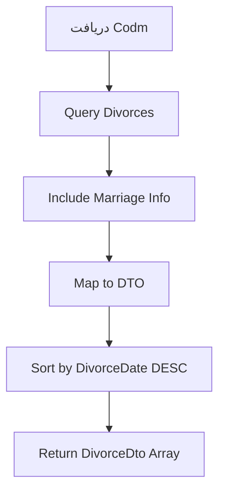

# GetDivorcesByCodmQuery.cs

**مسیر**: `Csis.Admission.Application/Features/Divorce/Queries/GetDivorcesByCodmQuery.cs`

## 1. هدف (Purpose)

این Query برای **دریافت لیست سوابق طلاق دانشجو** استفاده می‌شود.

### کاربرد اصلی:
- نمایش تاریخچه طلاق
- مدیریت وضعیت تأهل
- به‌روزرسانی افراد تحت تکفل

---

## 2. ورودی (Input)

```csharp
public sealed record GetDivorcesByCodmQuery(int Codm) : IRequest<DivorceDto[]>;
```

| پارامتر | نوع | توضیحات |
|---------|-----|---------|
| `Codm` | `int` | کد ملی دانشجو |

---

## 3. خروجی (Output)

```csharp
DivorceDto[] // آرایه سوابق طلاق
```

### DivorceDto:
```csharp
{
    Id: int,
    MarriageId: int,
    DivorceDate: DateTime,
    DivorceType: string, // "رجعی" یا "بائن"
    CourtCaseNumber: string,
    Notes: string
}
```

---

## 4. جریان اجرا (Execution Flow)



---

## 5. قوانین کسب‌وکار (Business Rules)

### BR-1: ارتباط با ازدواج
- هر طلاق باید به یک ازدواج مرتبط باشد

### BR-2: تاریخ طلاق
- نباید قبل از تاریخ ازدواج باشد

---

## 6. الگوهای طراحی (Design Patterns)

1. **CQRS Pattern**
2. **Repository Pattern**
3. **DTO Pattern**

---

## 7. عملکرد و بهینه‌سازی (Performance)

### Caching:
```csharp
CacheKey: $"divorces:codm:{Codm}"
Duration: 15 minutes
```

---

## 8. Use Cases مرتبط

- **UC-014**: ثبت طلاق
- **UC-Dependents**: غیرفعال‌سازی همسر

---

## 9. نتیجه‌گیری

Query برای **مدیریت سوابق طلاق** دانشجو.

✅ ارتباط با ازدواج  
✅ ثبت نوع طلاق  
✅ مستندسازی قانونی
