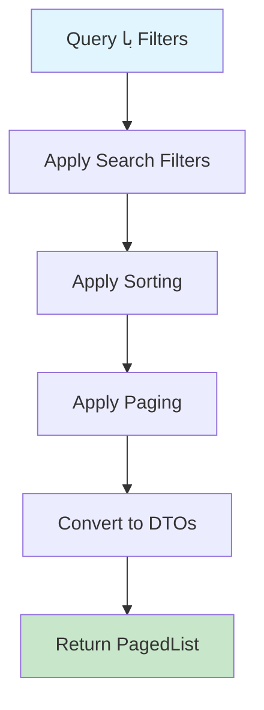

# SearchDocumentsQuery.cs

**مسیر**: `Csis.Admission.Application/Features/Documents/Queries/SearchDocumentsQuery.cs`

## 1. هدف (Purpose)

این Query برای **جستجو و دریافت لیست اسناد و مدارک** با قابلیت Paging و Filtering استفاده می‌شود.

### کاربرد اصلی:
- مدیریت اسناد و مدارک دانشجویان
- جستجوی پیشرفته در اسناد
- آرشیو و دسترسی به مدارک
- فیلتر و مرتب‌سازی اسناد

---

## 2. ورودی (Input)

```csharp
public sealed record SearchDocumentsQuery : BaseSearchQuery, IRequest<IPagedList<DocumentDto>>;
```

### پارامترهای BaseSearchQuery:
| پارامتر | نوع | اجباری | توضیحات |
|---------|-----|--------|---------|
| `SearchFilters` | `Dictionary` | خیر | فیلترهای جستجو |
| `PageIndex` | `int` | بله | شماره صفحه (از 0 شروع) |
| `PageSize` | `int` | بله | تعداد رکورد در هر صفحه |
| `SortBy` | `string` | خیر | فیلد مرتب‌سازی |

---

## 3. خروجی (Output)

```csharp
IPagedList<DocumentDto>
```

### ساختار PagedList:
```json
{
  "items": [...],
  "totalCount": 100,
  "pageIndex": 0,
  "pageSize": 20,
  "totalPages": 5
}
```

---

## 4. وابستگی‌ها (Dependencies)

**Dependencies:**
1. **IRepository<Document>**: دسترسی به جدول اسناد
2. **IMapper**: تبدیل به DTO

---

## 5. جریان اجرا (Execution Flow)



---

## 6. قوانین کسب‌وکار (Business Rules)

### BR-1: Pagination
- حداقل PageSize: 1
- حداکثر PageSize: 100 (جلوگیری از بار زیاد)

### BR-2: Filtering
- فیلترها به صورت Dynamic اعمال می‌شوند
- پشتیبانی از Multiple Filters

---

## 7. الگوهای طراحی (Design Patterns)

1. **CQRS Pattern**
2. **Repository Pattern**
3. **DTO Pattern**
4. **Pagination Pattern**

---

## 8. عملکرد و بهینه‌سازی (Performance)

### پیشنهادات:
```csharp
// استفاده از Index بر روی فیلدهای جستجو
// Projection به DTO برای کاهش حجم داده
```

---

## 9. Use Cases مرتبط

- مدیریت مدارک دانشجویی
- آرشیو اسناد
- گزارش‌گیری از اسناد

---

## نتیجه‌گیری

Query جستجوی اسناد با **قابلیت‌های پیشرفته**.

### نقاط قوت:
✅ Pagination  
✅ Dynamic Filtering  
✅ Sorting  

### توجه:
⚠️ محدودیت PageSize برای Performance
