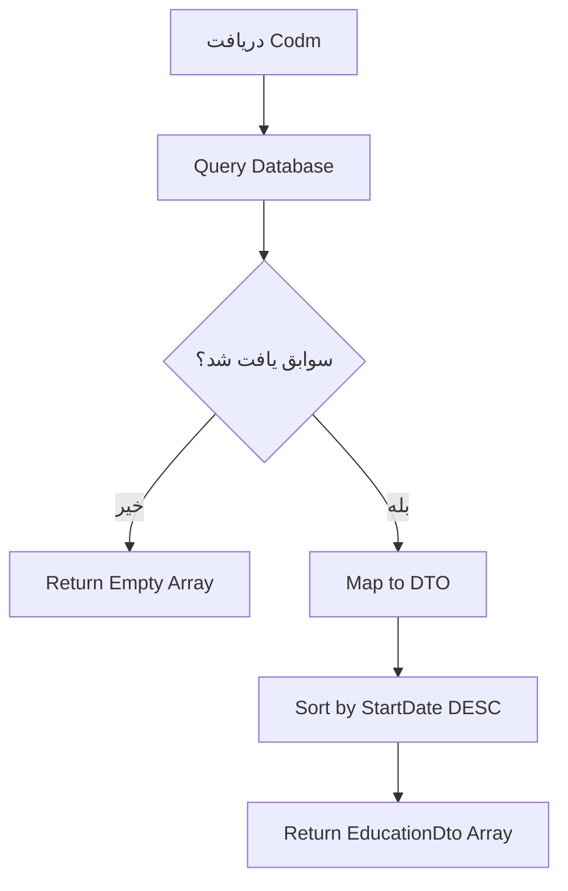

# GetEducationsByCodmQuery.cs

**مسیر**: `Csis.Admission.Application/Features/Educations/Queries/GetEducationsByCodmQuery.cs`

## 1. هدف (Purpose)

این Query برای **دریافت لیست سوابق تحصیلی دانشجو** استفاده می‌شود.

### کاربرد اصلی:
- نمایش تاریخچه تحصیلات دانشجو
- بررسی سوابق تحصیلی حوزوی
- محاسبه امتیازات تحصیلی

---

## 2. ورودی (Input)

```csharp
public sealed record GetEducationsByCodmQuery(int Codm) : IRequest<EducationDto[]>;
```

| پارامتر | نوع | توضیحات |
|---------|-----|---------|
| `Codm` | `int` | کد ملی دانشجو |

---

## 3. خروجی (Output)

```csharp
EducationDto[] // آرایه سوابق تحصیلی
```

### EducationDto:
```csharp
{
    Id: int,
    EducationLevelId: int,
    EducationLevelTitle: string,
    SchoolId: int?,
    SchoolName: string,
    StartDate: DateTime,
    EndDate: DateTime?,
    GradePointAverage: decimal?,
    IsCurrent: bool
}
```

---

## 4. وابستگی‌ها (Dependencies)

```csharp
- IApplicationDbContext
- IMapper (AutoMapper)
- ICurrentUserService
```

---

## 5. جریان اجرا (Execution Flow)



---

## 6. قوانین کسب‌وکار (Business Rules)

### BR-1: مرتب‌سازی
- سوابق از جدیدترین به قدیمی‌ترین مرتب می‌شوند

### BR-2: دسترسی
- کاربر فقط به سوابق خودش دسترسی دارد (مگر Admin)

---

## 7. الگوهای طراحی (Design Patterns)

1. **CQRS Pattern** - Query Side
2. **Repository Pattern**
3. **DTO Pattern**
4. **Specification Pattern**

---

## 8. عملکرد و بهینه‌سازی (Performance)

### Caching:
```csharp
CacheKey: $"educations:codm:{Codm}"
Duration: 5 minutes
```

### Query Optimization:
- ✅ Include related entities (School, EducationLevel)
- ✅ پیشنهاد Index بر روی (Codm, StartDate)

---

## 9. Use Cases مرتبط

- **UC-005**: مشاهده اطلاعات تحصیلی
- **UC-TargetedScores**: محاسبه امتیاز تحصیلی

---

## 10. نتیجه‌گیری

Query اصلی برای **مدیریت سوابق تحصیلی** دانشجو.

✅ دریافت لیست کامل  
✅ مرتب‌سازی استاندارد  
✅ Cache-able برای عملکرد بهتر
