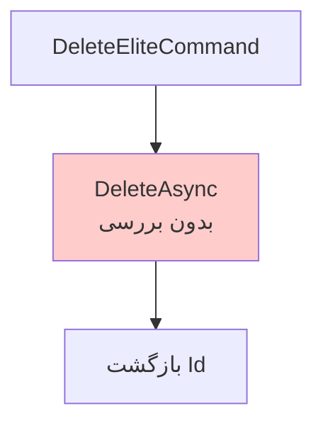

# DeleteEliteCommand.cs

**مسیر**: `csis.admission.backend-salehi/Csis.Admission.Application/Features/Elites/Commands/DeleteEliteCommand.cs`

## 1. هدف (Purpose)

این Command برای **حذف رکورد نخبگی** دانشجو از سیستم استفاده می‌شود. نخبگان دانشجویانی هستند که در سطوح مختلف (محلی، استانی، ملی، بین‌المللی) رتبه و افتخار کسب کرده‌اند.

## 2. ساختار کلی (Structure)

### الگوی طراحی
- **CQRS Pattern**: استفاده از MediatR
- **Record Type**: استفاده از C# Record
- **Primary Constructor**: الگوی مدرن C# 12

### ورودی (Input)
```csharp
public sealed record DeleteEliteCommand(int Codm, int Id) : IRequest<int>;
```

**پارامترها**:
- `Codm`: کد مرکز (⚠️ استفاده نمی‌شود)
- `Id`: شناسه نخبگی برای حذف

### خروجی (Output)
- **نوع**: `int` (شناسه نخبگی حذف شده)

## 3. قوانین کسب‌وکار (Business Rules)

### BR-1: حذف بدون بررسی
حذف بدون چک کردن وجود انجام می‌شود (⚠️ خطرناک!)

**کد مرتبط**:
```csharp
await eliteRepository.DeleteAsync(request.Id, cancellationToken: cancellationToken);
return request.Id;
```

## 4. فرآیند اجرا (Execution Flow)



## 5. جزئیات پیاده‌سازی (Implementation Details)

### Handler
```csharp
internal sealed class DeleteEliteCommandHandler(
    IRepository<Elite> eliteRepository,
    ILogger<DeleteEliteCommandHandler> logger)  // ⚠️ استفاده نمی‌شود
    : IRequestHandler<DeleteEliteCommand, int>
{
    public async Task<int> Handle(DeleteEliteCommand request, CancellationToken cancellationToken)
    {
        await eliteRepository.DeleteAsync(request.Id, cancellationToken: cancellationToken);
        return request.Id;
    }
}
```

### نکات کلیدی
1. **No Validation**: هیچ بررسی وجود انجام نمی‌شود
2. **Logger Not Used**: Logger inject شده اما استفاده نمی‌شود
3. **Codm Not Used**: Codm وجود دارد اما استفاده نمی‌شود

## 6. وابستگی‌ها (Dependencies)

| وابستگی | نوع | استفاده | وضعیت |
|---------|-----|----------|--------|
| `IRepository<Elite>` | Repository | حذف نخبگی | ✅ استفاده می‌شود |
| `ILogger<DeleteEliteCommandHandler>` | Logging | لاگ‌گذاری | ❌ استفاده نمی‌شود |

## 7. نکات امنیتی (Security Considerations)

### ⚠️ مشکلات امنیتی بحرانی شناسایی شده

#### 1. فقدان کامل Authorization
```csharp
// ❌ مشکل بحرانی: هر کسی می‌تواند نخبگی دیگران را حذف کند!
await eliteRepository.DeleteAsync(request.Id, cancellationToken: cancellationToken);

// ✅ پیشنهاد: بررسی Ownership قبل از حذف
var elite = await eliteRepository.GetByIdAsync(request.Id, cancellationToken);
if (elite == null) {
    throw new RecordNotFoundException<Elite>(request.Id);
}

if (elite.Codm != request.Codm) {
    throw new UnauthorizedException("شما مجاز به حذف این نخبگی نیستید.");
}

await eliteRepository.DeleteAsync(request.Id, cancellationToken);
```

#### 2. فقدان بررسی وجود رکورد
```csharp
// ❌ مشکل: اگر رکورد وجود نداشته باشد هیچ خطایی رخ نمی‌دهد
await eliteRepository.DeleteAsync(999999, cancellationToken);  
// Returns: 999999 (موفق؟!)

// ✅ پیشنهاد: بررسی وجود
var exists = await eliteRepository.AnyAsync(x => x.Id == request.Id, cancellationToken);
if (!exists) {
    throw new RecordNotFoundException<Elite>(request.Id);
}
```

#### 3. Codm استفاده نمی‌شود (الگوی سیستماتیک)
```csharp
// ⚠️ Codm در Command وجود دارد اما استفاده نمی‌شود
public sealed record DeleteEliteCommand(int Codm, int Id)
                                        ↑
                                   NOT USED!
```

#### 4. Logger استفاده نمی‌شود
```csharp
// ⚠️ Logger inject شده اما استفاده نمی‌شود
internal sealed class DeleteEliteCommandHandler(
    IRepository<Elite> eliteRepository,
    ILogger<DeleteEliteCommandHandler> logger)  // NOT USED!
```

## 8. کارایی (Performance)

### نکات منفی ❌
- عملیات Delete بدون Validation - اگر رکورد وجود نداشته باشد هم عملیات "موفق" است

### پیشنهادات بهبود 🔧
```csharp
// استفاده از Projection برای Check سریع
var elite = await eliteRepository.FirstOrDefaultAsync(
    x => x.Id == request.Id,
    selector: x => new { x.Id, x.Codm },
    cancellationToken: cancellationToken);

if (elite == null) {
    throw new RecordNotFoundException<Elite>(request.Id);
}

if (elite.Codm != request.Codm) {
    throw new UnauthorizedException();
}

await eliteRepository.DeleteAsync(request.Id, cancellationToken);
```

## 9. مدیریت خطا (Error Handling)

### خطاهای ممکن

| خطا | علت | وضعیت فعلی |
|-----|------|-------------|
| `RecordNotFoundException` | نخبگی یافت نشد | ❌ Handle نمی‌شود |
| `UnauthorizedException` | عدم مجوز حذف | ❌ بررسی نمی‌شود |
| `DbUpdateException` | خطای پایگاه داده | ❌ Handle نمی‌شود |
| `ForeignKeyException` | رکوردهای وابسته | ❌ Handle نمی‌شود |

### پیشنهاد بهبود
```csharp
try {
    var elite = await eliteRepository.GetByIdAsync(request.Id, cancellationToken);
    if (elite == null) {
        throw new RecordNotFoundException<Elite>(request.Id);
    }

    if (elite.Codm != request.Codm) {
        throw new UnauthorizedException("شما مجاز به حذف این نخبگی نیستید.");
    }

    await eliteRepository.DeleteAsync(request.Id, cancellationToken);
    
} catch (DbUpdateException ex) when (ex.InnerException is SqlException sqlEx && sqlEx.Number == 547) {
    throw new CommandValidationException("نمی‌توان نخبگی را حذف کرد چون رکوردهای وابسته به آن وجود دارند.");
}
```

## 10. الگوهای طراحی (Design Patterns)

### 1. Unsafe Delete Pattern (Anti-Pattern)
حذف بدون هیچ‌گونه Validation - این یک Anti-Pattern است.

### 2. Record با Primary Constructor
```csharp
public sealed record DeleteEliteCommand(int Codm, int Id) : IRequest<int>;
```

### 3. Unused Dependencies (Anti-Pattern)
Logger inject شده اما استفاده نمی‌شود.

## 11. تست‌پذیری (Testability)

### Unit Test مثال
```csharp
[Fact]
public async Task Handle_ValidCommand_DeletesEliteWithoutValidation()
{
    // Arrange
    var repo = Substitute.For<IRepository<Elite>>();
    var logger = Substitute.For<ILogger<DeleteEliteCommandHandler>>();
    
    repo.DeleteAsync(1, cancellationToken: Arg.Any<CancellationToken>())
        .Returns(Task.CompletedTask);
    
    var handler = new DeleteEliteCommandHandler(repo, logger);
    var command = new DeleteEliteCommand(Codm: 100, Id: 1);

    // Act
    var result = await handler.Handle(command, CancellationToken.None);

    // Assert
    Assert.Equal(1, result);
    await repo.Received(1).DeleteAsync(1, cancellationToken: Arg.Any<CancellationToken>());
    // ⚠️ هیچ Log call نمی‌شود
}

[Fact]
public async Task Handle_NonExistentElite_StillReturnsId()
{
    // Arrange
    var repo = Substitute.For<IRepository<Elite>>();
    var logger = Substitute.For<ILogger<DeleteEliteCommandHandler>>();
    
    repo.DeleteAsync(999, cancellationToken: Arg.Any<CancellationToken>())
        .Returns(Task.CompletedTask);  // موفق!
    
    var handler = new DeleteEliteCommandHandler(repo, logger);
    var command = new DeleteEliteCommand(Codm: 100, Id: 999);

    // Act
    var result = await handler.Handle(command, CancellationToken.None);

    // Assert
    Assert.Equal(999, result);  // ⚠️ برمی‌گرداند حتی اگر وجود نداشته باشد!
}
```

## 12. نمونه استفاده (Usage Example)

```csharp
// در Controller
[HttpDelete("{id}")]
public async Task<ActionResult<int>> DeleteElite(int id)
{
    var authenticatedCodm = User.GetCodm();
    var command = new DeleteEliteCommand(Codm: authenticatedCodm, Id: id);
    var result = await _mediator.Send(command);
    return Ok(result);
}

// نمونه Request
var command = new DeleteEliteCommand(
    Codm: 1001,  // ⚠️ استفاده نمی‌شود
    Id: 123
);

var deletedId = await _mediator.Send(command);
// Returns: 123 (حتی اگر وجود نداشته باشد!)
```

## 13. ملاحظات اضافی (Additional Considerations)

### انواع نخبگی (Elite Levels)
- محلی (Local)
- استانی (Provincial)
- ملی (National)  
- بین‌المللی (International)

### اهمیت Audit در نخبگان
حذف رکوردهای نخبگی باید با دقت بیشتری ثبت شود چون:
- تأثیرگذار در ارزیابی دانشجو
- امکان سوء استفاده
- نیاز به بازرسی و Audit

## 14. Commands/Queries مرتبط

| Command/Query | ارتباط |
|--------------|--------|
| `UpdateEliteCommand` | به‌روزرسانی نخبگی |
| `CreateEliteCommand` | ایجاد نخبگی جدید |
| `DeleteEliteRequestCommand` | درخواست حذف نخبگی |

## 15. تاریخچه تغییرات (Change History)

| تاریخ | تغییرات | توسعه‌دهنده |
|-------|---------|-------------|
| - | ایجاد اولیه | - |
| - | اضافه کردن Logger (اما استفاده نشده) | - |

## 16. تغییرات پیشنهادی (Proposed Changes)

### 1. افزودن Validation و Authorization (بحرانی)
```diff
internal sealed class DeleteEliteCommandHandler(
    IRepository<Elite> eliteRepository,
    ILogger<DeleteEliteCommandHandler> logger)
    : IRequestHandler<DeleteEliteCommand, int>
{
    public async Task<int> Handle(DeleteEliteCommand request, CancellationToken cancellationToken)
    {
+       // بررسی وجود و Ownership
+       var elite = await eliteRepository.GetByIdAsync(request.Id, cancellationToken);
+       if (elite == null) {
+           logger.LogWarning("⚠️ تلاش برای حذف نخبگی {EliteId} که وجود ندارد", request.Id);
+           throw new RecordNotFoundException<Elite>(request.Id);
+       }
+
+       if (elite.Codm != request.Codm) {
+           logger.LogWarning("⚠️ تلاش ناموفق برای حذف نخبگی {EliteId} توسط کد مرکز {Codm}", request.Id, request.Codm);
+           throw new UnauthorizedException("شما مجاز به حذف این نخبگی نیستید.");
+       }
+
+       logger.LogInformation("🗑️ حذف نخبگی {EliteId} توسط کد مرکز {Codm}. سطح: {Level}", 
+           request.Id, request.Codm, elite.Level);

        await eliteRepository.DeleteAsync(request.Id, cancellationToken: cancellationToken);
        
+       logger.LogInformation("✅ نخبگی {EliteId} با موفقیت حذف شد", request.Id);
        return request.Id;
    }
}
```

### 2. استفاده از Logger موجود
```diff
internal sealed class DeleteEliteCommandHandler(
    IRepository<Elite> eliteRepository,
-   ILogger<DeleteEliteCommandHandler> logger)  // NOT USED
+   ILogger<DeleteEliteCommandHandler> logger)  // NOW USED
    : IRequestHandler<DeleteEliteCommand, int>
{
    public async Task<int> Handle(DeleteEliteCommand request, CancellationToken cancellationToken)
    {
+       logger.LogInformation("🗑️ درخواست حذف نخبگی {EliteId} توسط کد مرکز {Codm}", request.Id, request.Codm);
        
        await eliteRepository.DeleteAsync(request.Id, cancellationToken: cancellationToken);
        
+       logger.LogInformation("✅ نخبگی {EliteId} حذف شد", request.Id);
        return request.Id;
    }
}
```

### 3. تغییر به Soft Delete
```diff
+   var elite = await eliteRepository.GetByIdAsTrackingAsync(request.Id, cancellationToken);
+   if (elite == null) {
+       throw new RecordNotFoundException<Elite>(request.Id);
+   }
+
+   if (elite.Codm != request.Codm) {
+       throw new UnauthorizedException();
+   }

-   await eliteRepository.DeleteAsync(request.Id, cancellationToken: cancellationToken);
+   elite.IsDeleted = true;
+   elite.DeletedAt = DateTime.UtcNow;
+   elite.DeletedBy = request.Codm;
+   await eliteRepository.UpdateAsync(elite, autoSave: true, cancellationToken);

    logger.LogInformation("✅ نخبگی {EliteId} به حالت حذف شده تغییر یافت", request.Id);
    return request.Id;
```

---

**نتیجه‌گیری**: این Command یکی از ضعیف‌ترین Delete Commands در پروژه است:
1. ❌ **فقدان هرگونه Validation** - حتی چک نمی‌کند رکورد وجود دارد یا نه
2. ❌ **فقدان Authorization** - هر کسی می‌تواند نخبگی دیگران را حذف کند
3. ❌ **Logger تزریق شده اما استفاده نمی‌شود** - Dependency بی‌فایده
4. ❌ **Codm استفاده نمی‌شود** - الگوی سیستماتیک

این Command نیازمند Refactoring فوری است قبل از استفاده در Production.
