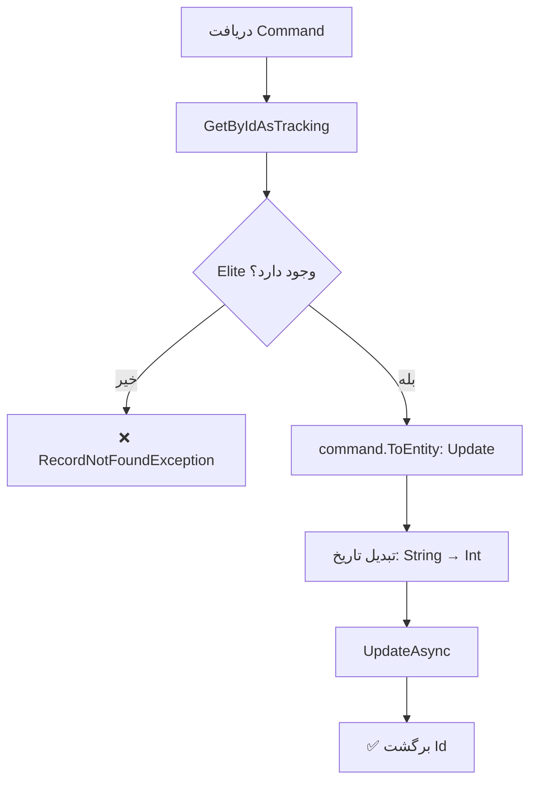

<div dir="rtl">

# UpdateEliteCommand.cs

**مسیر**: `Csis.Admission.Application/Features/Elites/Commands/UpdateEliteCommand.cs`

---

## 1. Purpose (هدف)

Command **ویرایش** اطلاعات طلبه ممتاز (Elite). این Command برای بروزرسانی اطلاعات طلاب ممتاز، سطح و نوع ممتازی آن‌ها استفاده می‌شود.

---

## 2. مستندات XML موجود

```csharp
/// <summary>
/// ویرایش ممتاز
/// </summary>
```

**کامل**: توضیح واضح

---

## 3. خلاصه اتفاقات

**جریان اصلی**:
```
1. دریافت رکورد Elite بر اساس Id
2. اگر وجود نداشت → خطا
3. بروزرسانی با اطلاعات جدید
4. تبدیل تاریخ‌ها از String به Int
5. ذخیره در دیتابیس
6. برگشت Id
```

---

## 4. اجزای اصلی

### Command:
```csharp
sealed record UpdateEliteCommand : IRequest<int>
{
    int Id                              // شناسه
    int Codm                            // کد مرکز خدمات
    short? EliteTypeId                  // نوع ممتازی
    short? EliteLevelId                 // سطح ممتازی
    string? StartDate                   // تاریخ شروع (String)
    string? EndDate                     // تاریخ پایان (String)
    string ApprovalCenterTitle          // عنوان مرکز تأیید
    long? RequestId                     // شناسه درخواست
}
```

### Handler Dependencies:
- **IRepository<Elite>**: دسترسی به داده‌های ممتازان

---

## 5. Flow



---

## 6. Business Rules

### BR-1: نوع و سطح ممتازی
- **EliteType**: نوع ممتازی (علمی، فرهنگی، ورزشی، ...)
- **EliteLevel**: سطح (محلی، استانی، ملی، بین‌المللی، ...)

### BR-2: بازه زمانی
- `StartDate`: شروع دوره ممتازی
- `EndDate`: پایان دوره ممتازی
- تبدیل خودکار از String به Int در Mapping

### BR-3: مرکز تأیید
- `ApprovalCenterTitle`: مرکزی که ممتازی را تأیید کرده
- مثلاً: "معاونت پژوهشی حوزه"، "وزارت علوم"، ...

---

## 7. Dependencies

### Internal:
- `IRepository<Elite>`: CRUD operations

---

## 8. Input/Output

### Input:
```csharp
int Id
int Codm
short? EliteTypeId              // نوع: علمی، فرهنگی، ...
short? EliteLevelId             // سطح: محلی، ملی، ...
string? StartDate               // "1402/01/01"
string? EndDate                 // "1403/01/01"
string ApprovalCenterTitle      // مرکز تأیید‌کننده
long? RequestId                 // لینک به درخواست
```

### Output:
```csharp
int Id      // شناسه رکورد بروزرسانی شده
```

### Exceptions:
- **RecordNotFoundException<Elite>**: رکورد با Id یافت نشد

---

## 9. Side Effects

1. **Update Elite**: بروزرسانی اطلاعات ممتازی
2. **Date Conversion**: تبدیل تاریخ‌ها

---

## 10. الگوهای استفاده شده

### ✅ Custom Mapping for Dates
```csharp
public override void ReverseCustomMappings(...) {
    mapping.ForMember(dest => dest.StartDate, 
        opt => opt.MapFrom(src => src.StartDate.StringDateToInt()));
    mapping.ForMember(dest => dest.EndDate, 
        opt => opt.MapFrom(src => src.EndDate.StringDateToInt()));
}
```

### ✅ Get-Update Pattern
```csharp
var entity = await repo.GetByIdAsTrackingAsync(id) ?? throw new Exception();
entity = command.ToEntity(entity);
await repo.UpdateAsync(entity);
```

---

## 11. Performance

- **Database Queries**: 1 SELECT + 1 UPDATE
- عملیات ساده

---

## 12. Security

- ⚠️ **Codm Validation**: `Codm` در Command هست اما بررسی نمی‌شود
- ✅ **RecordNotFoundException**: استفاده از Generic Exception
- ⚠️ **فقدان Logging**: برخلاف UpdateResearchCommand، Logging ندارد

---

## 13. نکات مهم

### 💡 Custom Date Mapping
این Command نمونه خوبی از Custom Mapping است:
```csharp
mapping.ForMember(dest => dest.StartDate, 
    opt => opt.MapFrom(src => src.StartDate.StringDateToInt()));
```
- تبدیل خودکار String به Int
- بدون نیاز به کد اضافی در Handler

### ⚠️ فقدان Logging
برخلاف UpdateResearchCommand و UpdateFamousCommand، این Command Logging ندارد:
- نه قبل از تغییر
- نه بعد از تغییر
- برای Audit ضعیف است

### ⚠️ Codm بررسی نمی‌شود
```csharp
// مشکل:
var elite = await repo.GetByIdAsTrackingAsync(command.Id);
// بررسی نمی‌شود: elite.Codm == command.Codm
```

### 🎯 Elite Feature
- برای مدیریت طلاب ممتاز
- انواع: علمی، فرهنگی، ورزشی، قرآنی، ...
- سطوح: محلی، استانی، ملی، بین‌المللی

---

## 14. مثال استفاده

```csharp
var cmd = new UpdateEliteCommand {
    Id = 123,
    Codm = 12345,
    EliteTypeId = 1,                    // علمی
    EliteLevelId = 3,                   // ملی
    StartDate = "1402/01/01",
    EndDate = "1403/01/01",
    ApprovalCenterTitle = "معاونت پژوهشی حوزه"
};

var id = await mediator.Send(cmd);
// Output: 123
```

---

## 15. Related Commands

- **CreateEliteCommand**: ایجاد Elite
- **DeleteEliteCommand**: حذف Elite
- **UpdateEliteRequestCommand**: بروزرسانی از طریق Request System

---

## 16. تغییرات پیشنهادی

### 1. افزودن Codm Validation
```csharp
public async Task<int> Handle(UpdateEliteCommand command, CancellationToken cancellationToken)
{
    var elite = await repo.GetByIdAsTrackingAsync(command.Id, cancellationToken)
        ?? throw new RecordNotFoundException<Elite>(command.Id);
    
    // بررسی Ownership
    if (elite.Codm != command.Codm)
        throw new UnauthorizedException("شما مجاز به ویرایش این رکورد نیستید");
    
    var updatedElite = command.ToEntity(elite);
    await repo.UpdateAsync(updatedElite, cancellationToken);
    
    return updatedElite.Id;
}
```

### 2. افزودن Audit Logging
```csharp
// مشابه UpdateResearchCommand
private readonly ILogger<UpdateEliteCommandHandler> _logger;

public async Task<int> Handle(...)
{
    var elite = await repo.GetByIdAsTrackingAsync(...) ?? throw ...;
    
    _logger.LogDebug("Elite with id {id} before update: {@before}", command.Id, elite);
    
    var updatedElite = command.ToEntity(elite);
    
    _logger.LogDebug("Elite with id {id} after update: {@after}", command.Id, updatedElite);
    
    await repo.UpdateAsync(updatedElite, cancellationToken);
    
    return updatedElite.Id;
}
```

### 3. افزودن Validation
```csharp
if (command.StartDate != null && command.EndDate != null)
{
    var start = command.StartDate.StringDateToInt();
    var end = command.EndDate.StringDateToInt();
    
    if (end < start)
        throw new CommandValidationException("تاریخ پایان نمی‌تواند قبل از تاریخ شروع باشد");
}
```

### 4. بهبود Date Handling
```csharp
// بجای string، استفاده از DateOnly
public DateOnly? StartDate { get; set; }
public DateOnly? EndDate { get; set; }
```

---

</div>
