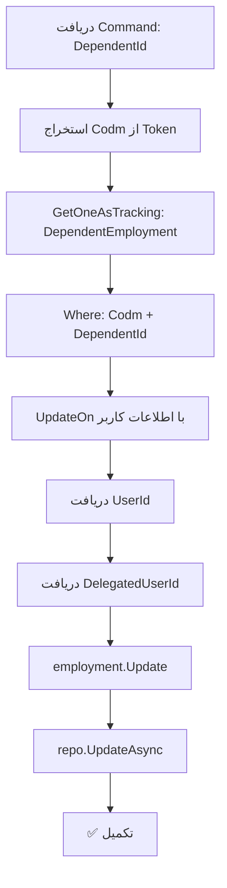

<div dir="rtl">

# ConfirmDependentEmploymentCommand.cs

**مسیر**: `Csis.Admission.Application/Features/Employments/Commands/ConfirmDependentEmploymentCommand.cs`

---

## 1. Purpose (هدف)

Command **تایید وضعیت اشتغال** فرد تحت تکفل توسط دانشجو. این Command برای تایید صحت اطلاعات اشتغال یک فرد تحت تکفل استفاده می‌شود.

---

## 2. مستندات XML موجود

```csharp
/// <summary>تایید وضعیت اشتغال</summary>
```

**کامل**: Command تایید اطلاعات اشتغال فرد تحت تکفل با بروزرسانی زمان تایید.

---

## 3. خلاصه اتفاقات

**جریان اصلی**:
```
1. دریافت Codm از توکن احراز هویت
2. بارگذاری DependentEmployment بر اساس Codm و DependentId
3. بروزرسانی فیلدهای Audit:
   - UpdatedOn = DateTime.Now
   - UpdatedBy = UserId
   - DelegatedUpdatedBy = DelegatedUserId (در صورت وجود)
4. ذخیره تغییرات
```

---

## 4. اجزای اصلی

### Command:
```csharp
record ConfirmDependentEmploymentCommand(long DependentId) : IRequest
{
    long DependentId    // شناسه فرد تحت تکفل
}
```

### Handler Dependencies:
- **IRepository<DependentEmployment>**: دسترسی به داده‌های اشتغال
- **ICsisAuthenticatedUserService**: سرویس احراز هویت

---

## 5. Flow



---

## 6. Business Rules

### BR-1: فقط دانشجو
- این Command **فقط** توسط دانشجو قابل اجرا است
- Codm از توکن احراز هویت استخراج می‌شود

### BR-2: فیلتر دوگانه
- بررسی هم **Codm** و هم **DependentId**
- اطمینان از اینکه Dependent متعلق به دانشجو است

### BR-3: ثبت Audit Trail
- زمان تایید: `UpdatedOn`
- تاییدکننده: `UpdatedBy`
- نماینده (در صورت وجود): `DelegatedUpdatedBy`

---

## 7. Dependencies

### Internal:
- `IRepository<DependentEmployment>`: دسترسی به داده‌های اشتغال
- `ICsisAuthenticatedUserService`: احراز هویت و اطلاعات کاربر

---

## 8. Input/Output

### Input:
```csharp
long DependentId    // شناسه فرد تحت تکفل
```

### Output:
```csharp
void (Task)
```

### Exceptions:
- **NullReferenceException**: اگر DependentEmployment برای Dependent وجود نداشته باشد

---

## 9. Side Effects

1. **Update Employment**: بروزرسانی فیلدهای Audit
2. **Audit Log**: ثبت زمان و کاربر تایید

---

## 10. الگوهای استفاده شده

### ✅ Audit Pattern
```csharp
employment.Update(
    userId: currentUserId,
    delegatedUserId: delegatedUserId,
    dateTime: DateTime.Now
);
```

### ✅ Token-Based Authorization
- Codm از توکن دریافت می‌شود (امنیت بالا)

### ✅ Composite Filter
```csharp
x => x.Codm == codm && x.DependentId == command.DependentId
```

---

## 11. Performance

- **Database Queries**: 1 SELECT با Tracking
- **Database Updates**: 1 UPDATE
- عملیات ساده و سریع

---

## 12. Security

- ✅ **Authentication**: نیاز به توکن معتبر دانشجو
- ✅ **Authorization**: دانشجو فقط اطلاعات Dependent های خودش را تایید می‌کند
- ✅ **Audit Trail**: ثبت کامل اطلاعات تایید

---

## 13. نکات مهم

### 💡 مشابهت با ConfirmStudentEmploymentCommand
- منطق مشابه با نسخه Student
- تفاوت اصلی: فیلتر بر اساس `DependentId`

### ⚠️ فقدان Exception Handling
```csharp
var employment = await repo.GetOneAsTrackingAsync(...);
// اگر null باشد، در UpdateOn خطا می‌دهد
```

**بهتر است**:
```csharp
var employment = await repo.GetOneAsTrackingAsync(...)
    ?? throw new RecordNotFoundException("اطلاعات اشتغال فرد تحت تکفل یافت نشد");
```

### 🎯 Use Case
- دانشجو اطلاعات اشتغال فرد تحت تکفل خود را مشاهده می‌کند
- دکمه "تایید صحت اطلاعات" را می‌زند
- زمان تایید ثبت می‌شود

---

## 14. مثال استفاده

```csharp
// دانشجو با Codm=12345 وارد شده
var cmd = new ConfirmDependentEmploymentCommand(
    DependentId: 999
);
await mediator.Send(cmd);

// نتیجه:
// - DependentEmployment.UpdatedOn = DateTime.Now
// - DependentEmployment.UpdatedBy = UserId از Token
// - DependentEmployment.DelegatedUpdatedBy = (در صورت وجود)
```

---

## 15. Related Commands

- **ConfirmStudentEmploymentCommand**: نسخه Student (مشابه)
- **CreateOrUpdateDependentEmploymentCommand**: ایجاد/بروزرسانی اشتغال

---

## 16. تغییرات پیشنهادی

### 1. افزودن Exception Handling
```csharp
public async Task Handle(ConfirmDependentEmploymentCommand command, ...) {
    var codm = int.Parse(await authenticatedUser.GetStudentCodmAsync());
    
    var employment = await repo.GetOneAsTrackingAsync(
        x => x.Codm == codm && x.DependentId == command.DependentId, 
        cancellationToken: cancellationToken
    ) ?? throw new RecordNotFoundException("اطلاعات اشتغال فرد تحت تکفل یافت نشد");
    
    await UpdateOn(employment, authenticatedUser);
    await repo.UpdateAsync(employment, cancellationToken: cancellationToken);
}
```

### 2. افزودن Response
```csharp
// بجای void
public record ConfirmDependentEmploymentCommand(long DependentId) : IRequest<bool>;

// در Handler
return true;  // برای نمایش موفقیت به کاربر
```

### 3. Refactor کردن با ConfirmStudentEmploymentCommand
- منطق مشترک می‌تواند به یک متد کمکی منتقل شود
- کاهش تکرار کد

```csharp
// Shared Helper
private static async Task ConfirmEmployment<T>(
    T employment,
    ICsisAuthenticatedUserService authenticatedUser,
    IRepository<T> repo
) where T : class, IEmployment {
    var userId = await authenticatedUser.GetUserIdAsync();
    var delegatedUserId = await authenticatedUser.GetDelegatedUserIdAsync();
    employment.Update(userId, delegatedUserId, DateTime.Now);
    await repo.UpdateAsync(employment);
}
```

---

</div>
