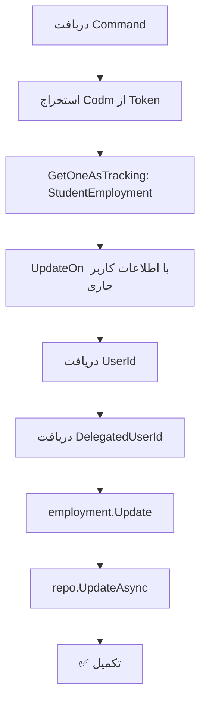

<div dir="rtl">

# ConfirmStudentEmploymentCommand.cs

**مسیر**: `Csis.Admission.Application/Features/Employments/Commands/ConfirmStudentEmploymentCommand.cs`

---

## 1. Purpose (هدف)

Command تایید و بروزرسانی زمان آخرین تایید اطلاعات اشتغال توسط دانشجو. این Command توسط دانشجو برای تایید صحت اطلاعات اشتغال خود استفاده می‌شود.

---

## 2. مستندات XML موجود

```csharp
/// <summary>تایید وضعیت اشتغال</summary>
```

**کامل**: Command تایید اطلاعات اشتغال دانشجو با بروزرسانی زمان و کاربر تاییدکننده.

---

## 3. خلاصه اتفاقات

**جریان اصلی**:
```
1. دریافت Codm از توکن احراز هویت
2. بارگذاری Employment فعلی
3. بروزرسانی فیلدهای Audit:
   - UpdatedOn = DateTime.Now
   - UpdatedBy = UserId
   - DelegatedUpdatedBy = DelegatedUserId (در صورت وجود)
4. ذخیره تغییرات
```

---

## 4. اجزای اصلی

### Command:
```csharp
record ConfirmStudentEmploymentCommand : IRequest
{
    // هیچ پارامتری ندارد - Codm از توکن گرفته می‌شود
}
```

### Handler Dependencies:
- **IRepository<StudentEmployment>**: دسترسی به داده‌های اشتغال
- **ICsisAuthenticatedUserService**: سرویس احراز هویت

---

## 5. Flow



---

## 6. Business Rules

### BR-1: فقط دانشجو
- این Command **فقط** توسط دانشجو قابل اجرا است
- Codm از توکن احراز هویت استخراج می‌شود

### BR-2: ثبت Audit Trail
- زمان تایید: `UpdatedOn`
- تاییدکننده: `UpdatedBy`
- نماینده (در صورت وجود): `DelegatedUpdatedBy`

### BR-3: تایید صحت
- دانشجو با فراخوانی این Command تایید می‌کند که اطلاعات اشتغال فعلی صحیح است

---

## 7. Dependencies

### Internal:
- `IRepository<StudentEmployment>`: دسترسی به داده‌های اشتغال
- `ICsisAuthenticatedUserService`: احراز هویت و اطلاعات کاربر

---

## 8. Input/Output

### Input:
- هیچ (Codm از Token)

### Output:
```csharp
void (Task)
```

### Exceptions:
- **RecordNotFoundException**: اگر Employment برای دانشجو وجود نداشته باشد

---

## 9. Side Effects

1. **Update Employment**: بروزرسانی فیلدهای Audit
2. **Audit Log**: ثبت زمان و کاربر تایید

---

## 10. الگوهای استفاده شده

### ✅ Audit Pattern
```csharp
employment.Update(
    userId: currentUserId,
    delegatedUserId: delegatedUserId,
    dateTime: DateTime.Now
);
```

### ✅ Token-Based Authorization
- Codm از توکن دریافت می‌شود (امنیت بالا)

---

## 11. Performance

- **Database Queries**: 1 SELECT با Tracking
- **Database Updates**: 1 UPDATE
- عملیات ساده و سریع

---

## 12. Security

- ✅ **Authentication**: نیاز به توکن معتبر دانشجو
- ✅ **Authorization**: دانشجو فقط اطلاعات خودش را تایید می‌کند
- ✅ **Audit Trail**: ثبت کامل اطلاعات تایید

---

## 13. نکات مهم

### 💡 سادگی Command
- این Command بسیار ساده است
- فقط برای ثبت زمان تایید استفاده می‌شود
- تغییری در منطق اشتغال ایجاد نمی‌کند

### ⚠️ Tracking Mode
- استفاده از `GetOneAsTrackingAsync` برای امکان Update

### 🎯 Use Case
- زمانی که دانشجو اطلاعات اشتغال خود را مشاهده می‌کند
- دکمه "تایید صحت اطلاعات" را می‌زند

---

## 14. مثال استفاده

```csharp
// دانشجو با Codm=12345 وارد شده
var cmd = new ConfirmStudentEmploymentCommand();
await mediator.Send(cmd);

// نتیجه:
// - Employment.UpdatedOn = DateTime.Now
// - Employment.UpdatedBy = UserId از Token
// - Employment.DelegatedUpdatedBy = (در صورت وجود)
```

---

## 15. Related Commands

- **CreateOrUpdateStudentEmploymentRequestCommand**: درخواست تغییر اطلاعات
- **CreateOrUpdateStudentEmploymentCommand**: بروزرسانی مستقیم

---

## 16. تغییرات احتمالی آینده

1. ✅ افزودن Response برای نمایش موفقیت به کاربر
2. ✅ افزودن Validation برای بررسی وجود Employment
3. ⚠️ بررسی نیاز به این Command - آیا می‌توان بدون آن کار کرد؟

---

</div>
