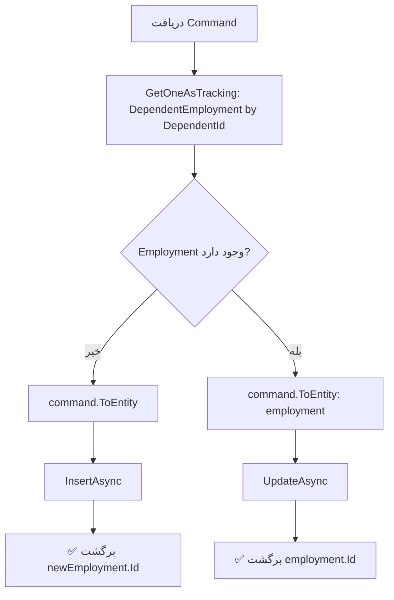

<div dir="rtl">

# CreateOrUpdateDependentEmploymentCommand.cs

**مسیر**: `Csis.Admission.Application/Features/Employments/Commands/CreateOrUpdateDependentEmploymentCommand.cs`

---

## 1. Purpose (هدف)

Command ثبت یا بروزرسانی اطلاعات اشتغال افراد تحت تکفل دانشجو. این Command برای مدیریت وضعیت شغلی افراد تحت تکفل (همسر، فرزندان و ...) استفاده می‌شود.

---

## 2. مستندات XML موجود

```xml
/// <inheritdoc/>
```

**ناقص**: فاقد مستندات مناسب - فقط inheritdoc

**پیشنهاد**:
```csharp
/// <summary>ثبت یا بروزرسانی اطلاعات اشتغال فرد تحت تکفل</summary>
```

---

## 3. خلاصه اتفاقات

**جریان اصلی**:
```
1. جستجوی Employment فعلی بر اساس DependentId
2. اگر وجود نداشت:
   └─> ایجاد Employment جدید
3. اگر وجود داشت:
   └─> بروزرسانی Employment موجود
4. برگشت Id
```

---

## 4. اجزای اصلی

### Command:
```csharp
record CreateOrUpdateDependentEmploymentCommand : IRequest<int>
{
    int Codm                    // کد مرکز خدمات
    long DependentId            // شناسه فرد تحت تکفل
    bool? IsEmployee            // آیا شاغل است؟
    string EmployeeName         // نام محل کار
    string EmployeeAddress      // آدرس محل کار
    long? RequestId             // شناسه درخواست (اختیاری)
}
```

### Handler Dependencies:
- **IRepository<DependentEmployment>**: دسترسی به داده‌های اشتغال افراد تحت تکفل

---

## 5. Flow



---

## 6. Business Rules

### BR-1: یک Employment به ازای هر Dependent
- هر فرد تحت تکفل می‌تواند **فقط یک** رکورد اشتغال داشته باشد
- بر اساس `DependentId` جستجو می‌شود

### BR-2: Upsert Pattern
- اگر رکورد وجود نداشته باشد → **Insert**
- اگر رکورد وجود داشته باشد → **Update**

### BR-3: ارتباط با Request System
- `RequestId` اختیاری است
- در صورت وجود، به Request مربوطه لینک می‌شود

---

## 7. Dependencies

### Internal:
- `IRepository<DependentEmployment>`: CRUD operations

---

## 8. Input/Output

### Input:
```csharp
int Codm                // کد مرکز خدمات
long DependentId        // شناسه فرد تحت تکفل
bool? IsEmployee        // آیا شاغل است؟
string EmployeeName     // نام محل کار
string EmployeeAddress  // آدرس محل کار
long? RequestId         // شناسه درخواست
```

### Output:
```csharp
int Id      // شناسه رکورد (جدید یا بروزرسانی شده)
```

### Exceptions:
- هیچ Exception خاصی پرتاب نمی‌شود

---

## 9. Side Effects

1. **Insert یا Update**: رکورد DependentEmployment
2. **Link به Request**: اگر RequestId داده شود

---

## 10. الگوهای استفاده شده

### ✅ Upsert Pattern
```csharp
var existing = await repo.GetOneAsync(x => x.DependentId == dependentId);
if (existing == null) {
    await repo.InsertAsync(new);
} else {
    await repo.UpdateAsync(existing);
}
```

### ✅ Entity Mapping
- استفاده از `ToEntity()` برای تبدیل Command به Entity

---

## 11. Performance

- **Database Queries**: 1 SELECT
- **Database Writes**: 1 INSERT یا 1 UPDATE
- عملیات ساده و بهینه

---

## 12. Security

- ⚠️ **Authorization**: نیاز به بررسی اینکه آیا Dependent متعلق به Codm است
- ⚠️ **Validation**: نیاز به بررسی صحت DependentId

---

## 13. نکات مهم

### ⚠️ فقدان Validation
- بررسی نمی‌شود که آیا `DependentId` معتبر است
- بررسی نمی‌شود که آیا `Dependent.Codm == Command.Codm`

**پیشنهاد**:
```csharp
var dependent = await dependentRepo.GetByIdAsync(command.DependentId);
if (dependent.Codm != command.Codm)
    throw new UnauthorizedException();
```

### 💡 Tracking Mode
- استفاده از `GetOneAsTrackingAsync` برای امکان Update

### 🎯 Simple Upsert
- این Command یک الگوی ساده Upsert است
- بدون منطق پیچیده

---

## 14. مثال استفاده

### سناریو 1: ایجاد اولین Employment
```csharp
var cmd = new CreateOrUpdateDependentEmploymentCommand {
    Codm = 12345,
    DependentId = 999,
    IsEmployee = true,
    EmployeeName = "شرکت...",
    EmployeeAddress = "تهران..."
};
var id = await mediator.Send(cmd);  // Insert
```

### سناریو 2: بروزرسانی Employment موجود
```csharp
var cmd = new CreateOrUpdateDependentEmploymentCommand {
    Codm = 12345,
    DependentId = 999,      // قبلاً وجود دارد
    IsEmployee = false,     // تغییر وضعیت
    EmployeeName = null
};
var id = await mediator.Send(cmd);  // Update (همان Id قبلی)
```

---

## 15. Related Commands

- **CreateOrUpdateStudentEmploymentCommand**: نسخه دانشجو
- **DeleteDependentEmploymentCommand**: حذف اشتغال فرد تحت تکفل
- **ConfirmDependentEmploymentCommand**: تایید اشتغال

---

## 16. تغییرات پیشنهادی

### 1. افزودن Validation
```csharp
public async Task<int> Handle(CreateOrUpdateDependentEmploymentCommand command, ...)
{
    // بررسی معتبر بودن DependentId
    var dependent = await dependentRepo.GetByIdAsync(command.DependentId);
    if (dependent == null)
        throw new RecordNotFoundException("Dependent");
    
    // بررسی Ownership
    if (dependent.Codm != command.Codm)
        throw new UnauthorizedException();
    
    // ادامه Upsert
    ...
}
```

### 2. بهبود مستندات
- جایگزینی `/// <inheritdoc/>` با توضیحات واضح

### 3. استفاده از نام بهتر
- نام Handler: `UpdateDependentEmploymentCommandHandler` باید `CreateOrUpdateDependentEmploymentCommandHandler` باشد

---

</div>
