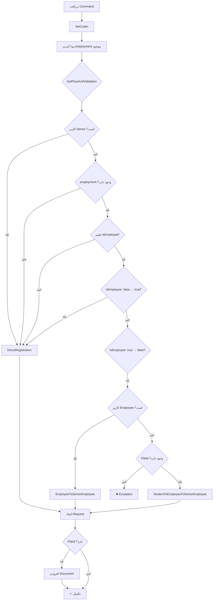

<div dir="rtl">

# CreateOrUpdateDependentEmploymentRequestCommand.cs

**مسیر**: `Csis.Admission.Application/Features/Employments/Commands/CreateOrUpdateDependentEmploymentRequestCommand.cs`

---

## 1. Purpose (هدف)

Command **ثبت یا بروزرسانی درخواست اشتغال تحت‌تکفل**. این Command برای ثبت درخواست تغییر وضعیت اشتغال تحت‌تکفل طلاب از طریق سیستم درخواست استفاده می‌شود.

---

## 2. مستندات XML موجود

```csharp
/// <summary>ثبت و بروزرسانی درخواست اشتغال تکفل</summary>
```

**کامل**: توضیح مختصر و واضح

---

## 3. خلاصه اتفاقات

**جریان اصلی**:
```
1. دریافت Command
2. تشخیص Flow (Direct/Employee/Student)
3. ایجاد Request در سیستم
4. افزودن Document (اختیاری)
5. تکمیل
```

---

## 4. اجزای اصلی

### Command:
```csharp
record CreateOrUpdateDependentEmploymentRequestCommand : IRequest
{
    int Codm                    // کد ملی مرکز
    long DependentId            // شناسه تکفل
    bool IsEmployee             // آیا شاغل است
    string EmployeeName         // نام محل کار
    string EmployeeAddress      // آدرس محل کار
    Guid? FileId                // شناسه فایل ضمیمه
}
```

### Handler Dependencies:
- **IRequestService**: مدیریت سیستم درخواست
- **IRepository<DependentEmployment>**: دسترسی به داده‌های اشتغال
- **ICurrentUserService**: اطلاعات کاربر فعلی

---

## 5. Flow



---

## 6. Business Rules

### BR-1: تعیین Flow (منطق پیچیده)

#### Case 1: Direct Registration
مستقیم ثبت می‌شود اگر:
1. کاربر **Senior** باشد
2. employment موجود **نباشد** (اولین بار)
3. IsEmployee **تغییر نکرده** باشد
4. IsEmployee از `false` به `true` تغییر کند
5. تغییر به شاغل اما FileId نداشته باشد

#### Case 2: EmployeeToSeniorEmployee
اگر:
- کاربر **Employee** باشد
- تغییر IsEmployee از true به false

#### Case 3: StudentToEmployeeToSeniorEmployee
اگر:
- کاربر **طلبه** باشد
- تغییر IsEmployee
- FileId **حتماً** باشد

### BR-2: File Requirement
```csharp
if (command.FileId == null)
    throw new CommandValidationException(
        "درخواست‌های ثبت شغل متکفل که توسط شما ایجاد می‌گردد نیازمند ضمیمه می‌باشد.");
```
- برای طلاب: مدرک الزامی است

### BR-3: Complex Condition
```csharp
if (await currentUser.IsSenior() || 
    employment == null || 
    command.IsEmployee == employment.IsEmployee || 
    (command.IsEmployee == true && employment.IsEmployee == false) || 
    (command.IsEmployee && !command.FileId.HasValue))
{
    return RequestFlow.DirectRegistration;
}
```
این شرط **بسیار پیچیده** است!

---

## 7. Dependencies

### Internal:
- `IRequestService`: ایجاد Request
- `IRepository<DependentEmployment>`: کوئری employment
- `ICurrentUserService`: تشخیص نقش
- `Common.Utilities.SetCodm()`: تنظیم Codm

### External:
- ✅ Request System Integration

---

## 8. Input/Output

### Input:
```csharp
int Codm
long DependentId
bool IsEmployee                 // true = شاغل، false = غیرشاغل
string EmployeeName
string EmployeeAddress
Guid? FileId                    // مدرک (برای طلاب الزامی)
```

### Output:
```csharp
void (Task)                     // Request ایجاد می‌شود
```

### Exceptions:
- **CommandValidationException**: فقدان مدرک برای طلبه

---

## 9. Side Effects

1. **ایجاد Request**: در سیستم Request
2. **افزودن Document**: اگر FileId داشته باشد
3. **تعیین Flow**: بسته به نقش و تغییرات

---

## 10. الگوهای استفاده شده

### ✅ Request System Pattern
```csharp
var requestCommand = new CreateRequestCommand(command, flow);
if (command.FileId.HasValue) {
    requestCommand.AddDocument(command.FileId.Value);
}
await requestService.Create(requestCommand, cancellationToken);
```

### ✅ Complex Flow Determination
منطق پیچیده تعیین Flow بر اساس:
- نقش کاربر
- وضعیت فعلی
- نوع تغییر
- وجود مدرک

### ⚠️ Anti-Pattern: Complex Boolean Logic
```csharp
if (await currentUser.IsSenior() || employment == null || 
    command.IsEmployee == employment.IsEmployee || 
    (command.IsEmployee == true && employment.IsEmployee == false) || 
    (command.IsEmployee && !command.FileId.HasValue))
```
شرط بسیار پیچیده و خوانایی پایین

---

## 11. Performance

- **Database Operations**: 1 SELECT
- **Request Service**: 1 INSERT
- منطق پیچیده اما سریع

---

## 12. Security

- ✅ **SetCodm**: Codm به کاربر فعلی محدود می‌شود
- ✅ **Role-Based Flow**: بر اساس نقش
- ✅ **File Validation**: برای طلاب الزامی

---

## 13. نکات مهم

### 💡 Request vs Direct
- **Request System** برای طلاب و کارمندان
- **Direct Registration** برای Senior یا موارد خاص

### 🎯 IsEmployee Changes
```
false → true:  Direct (آسان‌تر)
true → false:  Request (نیاز به تأیید)
```

### ⚠️ مشکل: منطق پیچیده
شرط `GetFlowAndValidation` بسیار پیچیده است:
```csharp
if (condition1 || condition2 || condition3 || condition4 || condition5)
```
- خوانایی پایین
- Testing سخت
- Debugging دشوار

### 💡 FileId Optional but Required
- در DTO: `Guid?` (optional)
- در منطق: برای طلاب الزامی
- Validation در Runtime

---

## 14. مثال استفاده

```csharp
// طلبه می‌خواهد اعلام کند تکفل شاغل شده
var cmd = new CreateOrUpdateDependentEmploymentRequestCommand {
    Codm = 12345,
    DependentId = 67890,
    IsEmployee = true,              // تغییر false → true
    EmployeeName = "شرکت XYZ",
    EmployeeAddress = "تهران، ...",
    FileId = Guid.NewGuid()         // حکم کارگزینی
};

await mediator.Send(cmd);
// → StudentToEmployeeToSeniorEmployee flow
// → ایجاد Request + Document
```

---

## 15. Related Commands

- **CreateOrUpdateDependentEmploymentCommand**: ثبت مستقیم
- **ConfirmDependentEmploymentCommand**: تأیید Request
- **DeleteDependentEmploymentCommand**: حذف اشتغال
- **CreateOrUpdateStudentEmploymentRequestCommand**: نسخه طلبه

---

## 16. تغییرات پیشنهادی

### 1. Refactor منطق پیچیده
```csharp
private async Task<RequestFlow> GetFlowAndValidation(...)
{
    // بهتر: تفکیک به Methods کوچک‌تر
    if (await ShouldUseDirectRegistration(command, employment))
        return RequestFlow.DirectRegistration;
    
    if (await currentUser.IsEmployee())
        return RequestFlow.EmployeeToSeniorEmployee;
    
    ValidateStudentRequest(command);
    return RequestFlow.StudentToEmployeeToSeniorEmployee;
}

private async Task<bool> ShouldUseDirectRegistration(...)
{
    if (await currentUser.IsSenior()) return true;
    if (employment == null) return true;
    if (!HasIsEmployeeChanged(command, employment)) return true;
    if (IsBecomingEmployee(command, employment)) return true;
    if (command.IsEmployee && !command.FileId.HasValue) return true;
    return false;
}

private bool HasIsEmployeeChanged(...)
{
    return command.IsEmployee == employment.IsEmployee;
}

private bool IsBecomingEmployee(...)
{
    return command.IsEmployee == true && employment.IsEmployee == false;
}

private void ValidateStudentRequest(...)
{
    if (command.FileId == null)
        throw new CommandValidationException("...");
}
```

### 2. افزودن Comments
```csharp
// Case 1: Senior همیشه مستقیم ثبت می‌کند
if (await currentUser.IsSenior())
    return RequestFlow.DirectRegistration;

// Case 2: اولین بار (employment موجود نیست)
if (employment == null)
    return RequestFlow.DirectRegistration;
```

### 3. Unit Tests برای Flows
```csharp
[Fact]
public async Task Senior_ShouldUseDirectRegistration() { ... }

[Fact]
public async Task Employee_ChangingToUnemployed_ShouldUseEmployeeFlow() { ... }

[Fact]
public async Task Student_WithoutFile_ShouldThrowException() { ... }
```

### 4. افزودن Logging
```csharp
_logger.LogInformation(
    "Creating employment request for Dependent {DependentId} with flow {Flow}",
    command.DependentId, flow);
```

---

</div>
