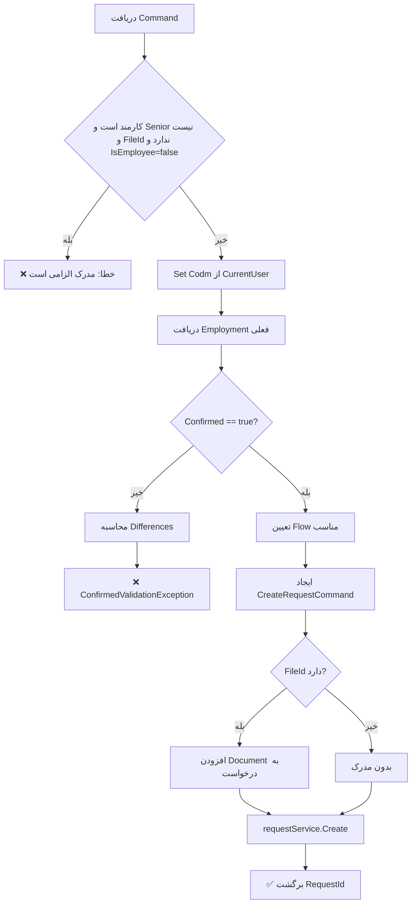

<div dir="rtl">

# CreateOrUpdateStudentEmploymentRequestCommand.cs

**مسیر**: `Csis.Admission.Application/Features/Employments/Commands/CreateOrUpdateStudentEmploymentRequestCommand.cs`

---

## 1. Purpose (هدف)

Command ثبت **درخواست** تغییر اطلاعات اشتغال دانشجو که از طریق سیستم درخواست‌ها (Request System) پردازش می‌شود. این Command برای مدیریت درخواست‌های تغییر وضعیت اشتغال دانشجویان استفاده می‌شود و بسته به شرایط، می‌تواند مستقیم یا از طریق جریان تایید چند مرحله‌ای پردازش شود.

---

## 2. مستندات XML موجود

```csharp
/// <summary>ثبت درخواست اشتغال طلبه</summary>
```

**کامل**: Command ثبت درخواست تغییر اطلاعات اشتغال دانشجو با پشتیبانی از جریان‌های تایید مختلف.

---

## 3. خلاصه اتفاقات

**جریان اصلی**:
```
1. اعتبارسنجی: بررسی الزام مدرک برای پایان اشتغال
2. دریافت اطلاعات اشتغال فعلی
3. اگر Confirmed != true
   └─> نمایش تفاوت‌ها و درخواست تایید کاربر
4. اگر Confirmed == true
   └─> تعیین جریان درخواست (Direct یا Multi-Step)
   └─> ایجاد درخواست با مدارک پیوست
```

---

## 4. اجزای اصلی

### Command:
```csharp
sealed record CreateOrUpdateStudentEmploymentRequestCommand : IRequest<long>
{
    int Codm                              // کد مرکز خدمات
    bool HasIncome                        // آیا درآمد دارد؟
    bool IsEmployee                       // آیا کارمند است؟
    string EmployeeName                   // نام محل کار
    string EmployeeAddress                // آدرس محل کار
    bool HasSufficientIncome              // آیا درآمد کافی دارد؟
    bool HasAnotherBaseInsurance          // بیمه پایه دیگر
    string InsurancePlaceName             // نام محل بیمه
    string InsurancePlaceAddress          // آدرس محل بیمه
    bool HasAnotherSupInsurance           // بیمه تکمیلی دیگر
    bool IsEmployeeInHowze                // اشتغال در حوزه
    EmploymentHowzeType? HowzeTypeId      // نوع اشتغال در حوزه
    bool IsRetried                        // بازنشسته
    EmploymentInsuranceType? InsuranceTypeId  // نوع بیمه
    EmploymentReference? Reference        // مرجع اشتغال
    short? Decile                         // دهک درآمدی
    Guid? FileId                          // شناسه فایل پیوست
    bool? Confirmed                       // تایید کاربر
}
```

### Handler Dependencies:
- **IRequestService**: سرویس مدیریت درخواست‌ها
- **IRepository<StudentEmployment>**: دسترسی به داده‌های اشتغال
- **ICurrentUserService**: اطلاعات کاربر جاری

---

## 5. Flow



---

## 6. Business Rules

### BR-1: الزام مدرک برای پایان اشتغال
- کارمندان **غیر Senior** برای تغییر وضعیت اشتغال از کارمند (`IsEmployee=true`) به غیرکارمند (`IsEmployee=false`) **باید** مدرک پایان اشتغال ارائه دهند
```csharp
if (IsEmployee && !IsSenior() && !FileId.HasValue && !command.IsEmployee)
    throw "مدرک پایان اشتغال الزامی است"
```

### BR-2: الگوی Two-Step Confirmation
- قبل از ثبت نهایی، تفاوت‌های بین داده قدیم و جدید به کاربر نمایش داده می‌شود
- کاربر باید صریحاً با `Confirmed=true` تایید کند

### BR-3: جریان‌های مختلف درخواست
جریان درخواست بر اساس شرایط زیر تعیین می‌شود:

#### Direct Registration (ثبت مستقیم):
```csharp
if (IsSenior() ||                              // کاربر Senior است
    employment == null ||                       // اولین بار ثبت
    IsEmployee == employment.IsEmployee ||      // بدون تغییر وضعیت
    (IsEmployee && !employment.IsEmployee) ||   // تبدیل به کارمند
    (IsEmployee() && FileId.HasValue))          // کارمند با مدرک
    => DirectRegistration
```

#### Multi-Step Approval:
```csharp
else
    => StudentToEmployeeToSeniorEmployee
```

### BR-4: مدارک پیوست
- اگر `FileId` وجود داشته باشد، به درخواست پیوست می‌شود
- مدرک برای برخی سناریوها الزامی است

---

## 7. Dependencies

### Internal:
- `IRepository<StudentEmployment>`: دسترسی به داده‌های اشتغال
- `IRequestService`: مدیریت درخواست‌ها
- `ICurrentUserService`: اطلاعات کاربر

### External:
- **Request System**: سیستم مدیریت درخواست‌ها

---

## 8. Input/Output

### Input:
- اطلاعات کامل اشتغال دانشجو
- وضعیت تایید کاربر (`Confirmed`)
- فایل پیوست (اختیاری)

### Output:
```csharp
long RequestId   // شناسه درخواست ایجاد شده
```

### Exceptions:
- `CommandValidationException`: مدرک الزامی است
- `ConfirmedValidationException`: کاربر باید تفاوت‌ها را تایید کند

---

## 9. Side Effects

1. **ایجاد درخواست جدید**: یک رکورد در جدول Requests
2. **پیوست مدرک**: اگر FileId داشته باشد
3. **تغییر State**: بسته به جریان انتخابی

---

## 10. الگوهای استفاده شده

### ✅ Two-Step Confirmation Pattern
```csharp
if (Confirmed != true) {
    var differences = GetDifferences(old, new);
    throw new ConfirmedValidationException(differences);
}
```

### ✅ Request Flow Pattern
- تعیین خودکار جریان بر اساس نقش کاربر و شرایط

### ✅ Document Attachment Pattern
```csharp
if (FileId.HasValue) {
    requestCommand.AddDocument(FileId.Value);
}
```

---

## 11. Performance

- **Database Queries**: 1 SELECT برای دریافت employment فعلی
- **Insert**: 1 INSERT در جدول Requests
- بهینه برای عملیات معمول

---

## 12. Security

- ✅ **Authorization**: بررسی نقش کاربر (Senior, Employee, Student)
- ✅ **CODM Validation**: استفاده از `SetCodm` از CurrentUser
- ⚠️ **File Validation**: نیاز به بررسی اعتبار FileId قبل از پیوست

---

## 13. نکات مهم

### ⚠️ توجه به جریان‌های مختلف:
1. **Senior**: همیشه Direct Registration
2. **Employee با مدرک**: Direct Registration
3. **Employee بدون مدرک**: Multi-Step
4. **Student**: بسته به شرایط

### 💡 Two-Step UX:
- کاربر ابتدا با `Confirmed=null/false` فراخوانی می‌کند
- سیستم تفاوت‌ها را برمی‌گرداند
- کاربر با مشاهده تفاوت‌ها، با `Confirmed=true` مجدداً ارسال می‌کند

---

## 14. مثال استفاده

### سناریو 1: تبدیل به غیرکارمند (نیاز به مدرک)
```csharp
// Step 1: دریافت تفاوت‌ها
var cmd = new CreateOrUpdateStudentEmploymentRequestCommand {
    Codm = 12345,
    IsEmployee = false,     // قبلاً true بود
    HasIncome = false,
    Confirmed = null        // یا false
};
// Exception: ConfirmedValidationException با لیست تفاوت‌ها

// Step 2: تایید با مدرک
cmd.Confirmed = true;
cmd.FileId = uploadedFileId;
var requestId = await mediator.Send(cmd);
```

### سناریو 2: Senior تغییر مستقیم
```csharp
var cmd = new CreateOrUpdateStudentEmploymentRequestCommand {
    Codm = 12345,
    IsEmployee = true,
    EmployeeName = "دانشگاه...",
    Confirmed = true
};
var requestId = await mediator.Send(cmd);  // Direct Registration
```

---

## 15. Related Commands

- **ConfirmStudentEmploymentCommand**: تایید نهایی اشتغال
- **DeleteStudentEmploymentRequestCommand**: حذف درخواست
- **CreateOrUpdateStudentEmploymentCommand**: ثبت مستقیم (بدون Request System)

---

## 16. تغییرات احتمالی آینده

1. ✅ افزودن Validation بیشتر برای FileId
2. ✅ Refactor کردن منطق `GetFlowAndValidation` به سرویس مجزا
3. ✅ Cache کردن employment برای کاهش Query

---

</div>
