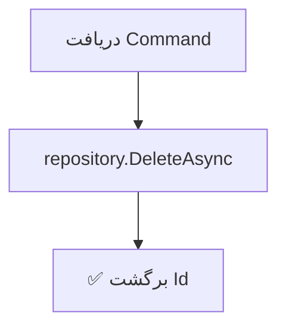

<div dir="rtl">

# DeleteDependentEmploymentCommand.cs

**مسیر**: `Csis.Admission.Application/Features/Employments/Commands/DeleteDependentEmploymentCommand.cs`

---

## 1. Purpose (هدف)

Command **حذف اشتغال تحت‌تکفل**. این Command برای حذف اطلاعات اشتغال تحت‌تکفل از سیستم استفاده می‌شود.

---

## 2. مستندات XML موجود

```csharp
/// <summary>حذف اشتغال تکفل</summary>
/// <param name="Codm">کد ملی مرکز</param>
/// <param name="Id">شناسه اشتغال</param>
/// <param name="DependentId">شناسه تکفل</param>
```

**کامل**: تمام پارامترها مستند شده‌اند

---

## 3. خلاصه اتفاقات

**جریان اصلی**:
```
1. دریافت Command (Codm, Id, DependentId)
2. حذف رکورد از Repository
3. برگشت Id حذف شده
```

---

## 4. اجزای اصلی

### Command:
```csharp
sealed record DeleteDependentEmploymentCommand(
    int Codm,           // کد ملی مرکز
    int Id,             // شناسه اشتغال
    long DependentId    // شناسه تکفل
) : IRequest<int>
```

### Handler Dependencies:
- **IRepository<DependentEmployment>**: دسترسی به داده‌های اشتغال
- **ILogger**: لاگ (inject شده اما استفاده نشده ⚠️)

---

## 5. Flow



---

## 6. Business Rules

### BR-1: حذف فیزیکی
- رکورد **کاملاً** از دیتابیس حذف می‌شود
- نه Soft Delete

### BR-2: بدون Validation
- بررسی نمی‌شود رکورد وجود دارد
- بررسی نمی‌شود Codm متعلق به کاربر است

---

## 7. Dependencies

### Internal:
- `IRepository<DependentEmployment>`: عملیات Delete
- `ILogger<DeleteDependentEmploymentCommandHandler>`: لاگ (استفاده نشده)

---

## 8. Input/Output

### Input:
```csharp
int Codm            // کد ملی مرکز
int Id              // شناسه اشتغال
long DependentId    // شناسه تکفل
```

### Output:
```csharp
int Id              // شناسه حذف شده
```

---

## 9. Side Effects

1. **حذف کامل**: رکورد DependentEmployment از دیتابیس حذف می‌شود

---

## 10. الگوهای استفاده شده

### ⚠️ Delete Without Validation
```csharp
await repository.DeleteAsync(request.Id, cancellationToken);
return request.Id;
```
- بدون بررسی موفقیت
- بدون بررسی Ownership
- بدون Logging

### ✅ Record-based Command
```csharp
public sealed record DeleteDependentEmploymentCommand(
    int Codm, int Id, long DependentId) : IRequest<int>;
```
- استفاده از Primary Constructor

---

## 11. Performance

- **Database Operations**: 1 DELETE
- عملیات بسیار ساده

---

## 12. Security

- ⚠️ **فقدان Authorization**: هیچ بررسی Codm نمی‌شود
- ⚠️ **فقدان Ownership**: کسی می‌تواند هر رکوردی را حذف کند
- ⚠️ **فقدان Validation**: رکورد بررسی نمی‌شود

---

## 13. نکات مهم

### ⚠️ مشکل بحرانی: Codm استفاده نمی‌شود
```csharp
// مشکل: Codm پارامتر است اما استفاده نمی‌شود!
public sealed record DeleteDependentEmploymentCommand(
    int Codm,       // ❌ استفاده نمی‌شود
    int Id,
    long DependentId // ❌ استفاده نمی‌شود
)

// Handler فقط از Id استفاده می‌کند
await repository.DeleteAsync(request.Id, cancellationToken);
```

### ⚠️ Logger استفاده نمی‌شود
```csharp
internal sealed class Handler(
    IRepository<DependentEmployment> repo,
    ILogger<Handler> logger)  // ❌ inject شده اما استفاده نمی‌شود
```

### ⚠️ فقدان Validation
- بررسی نمی‌شود رکورد وجود دارد
- Exception نمی‌دهد اگر رکورد نباشد

### 💡 مقایسه با DeleteHouseCommand
این Command ضعیف‌تر از `DeleteHouseCommand` است:
- اینجا: بدون Validation
- House: حداقل Exception می‌دهد

---

## 14. مثال استفاده

```csharp
var cmd = new DeleteDependentEmploymentCommand(
    Codm: 12345,            // ⚠️ استفاده نمی‌شود
    Id: 789,
    DependentId: 67890      // ⚠️ استفاده نمی‌شود
);

var id = await mediator.Send(cmd);
// Output: 789
// حتی اگر رکورد وجود نداشته باشد!
```

---

## 15. Related Commands

- **CreateOrUpdateDependentEmploymentCommand**: ایجاد/بروزرسانی اشتغال
- **DeleteDependentEmploymentRequestCommand**: حذف از طریق Request
- **ConfirmDependentEmploymentCommand**: تأیید اشتغال
- **DeleteStudentEmploymentCommand**: حذف اشتغال طلبه (مشابه)

---

## 16. تغییرات پیشنهادی

### 1. افزودن Validation و Authorization
```csharp
public async Task<int> Handle(
    DeleteDependentEmploymentCommand request, 
    CancellationToken cancellationToken)
{
    var employment = await dependentEmploymentRepository
        .GetByIdAsync(request.Id, cancellationToken);
    
    if (employment == null)
        throw new RecordNotFoundException<DependentEmployment>(request.Id);
    
    // بررسی Ownership
    if (employment.Codm != request.Codm)
        throw new UnauthorizedException(
            "شما مجاز به حذف این رکورد نیستید");
    
    // بررسی Dependent
    if (employment.DependentId != request.DependentId)
        throw new CommandValidationException(
            "شناسه تکفل مطابقت ندارد");
    
    await dependentEmploymentRepository.DeleteAsync(
        request.Id, cancellationToken);
    
    logger.LogInformation(
        "DependentEmployment {Id} deleted for Codm {Codm}",
        request.Id, request.Codm);
    
    return request.Id;
}
```

### 2. استفاده از Logger
```csharp
logger.LogInformation(
    "Deleting DependentEmployment {Id} for Codm {Codm}, Dependent {DependentId}",
    request.Id, request.Codm, request.DependentId);

await repository.DeleteAsync(request.Id, cancellationToken);

logger.LogInformation("DependentEmployment {Id} deleted successfully", request.Id);
```

### 3. حذف پارامترهای استفاده نشده
اگر واقعاً نیازی نیست:
```csharp
// ساده‌تر
public sealed record DeleteDependentEmploymentCommand(int Id) : IRequest<int>;
```

یا اگر می‌خواهیم Validation داشته باشیم، همه را استفاده کنیم:
```csharp
// کامل
public sealed record DeleteDependentEmploymentCommand(
    int Codm, 
    int Id, 
    long DependentId
) : IRequest<int>;

// و در Handler همه را بررسی کنیم
```

### 4. افزودن Soft Delete
```csharp
public async Task<int> Handle(...)
{
    var employment = await repository.GetByIdAsync(request.Id, ...);
    
    if (employment == null)
        throw new RecordNotFoundException<DependentEmployment>(request.Id);
    
    // Soft Delete
    employment.IsDeleted = true;
    employment.DeletedAt = DateTime.UtcNow;
    employment.DeletedBy = currentUserId;
    
    await repository.UpdateAsync(employment, cancellationToken);
    
    return request.Id;
}
```

---

</div>
