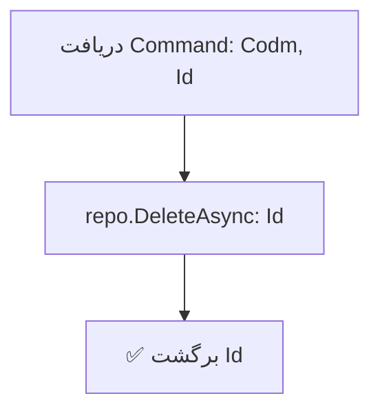

<div dir="rtl">

# DeleteStudentEmploymentCommand.cs

**مسیر**: `Csis.Admission.Application/Features/Employments/Commands/DeleteStudentEmploymentCommand.cs`

---

## 1. Purpose (هدف)

Command حذف اطلاعات اشتغال دانشجو. این Command برای حذف کامل یک رکورد اشتغال از سیستم استفاده می‌شود.

---

## 2. مستندات XML موجود

```csharp
/// <summary>حذف اطلاعات اشتغال</summary>
/// <param name="Codm">کد مرکز خدمات</param>
/// <param name="Id">شناسه اشتغال</param>
```

**کامل**: Command حذف اطلاعات اشتغال دانشجو بر اساس شناسه.

---

## 3. خلاصه اتفاقات

**جریان اصلی**:
```
1. دریافت Codm و Id
2. حذف رکورد از Repository
3. برگشت Id حذف شده
```

---

## 4. اجزای اصلی

### Command:
```csharp
sealed record DeleteStudentEmploymentCommand(int Codm, int Id) : IRequest<int>
{
    int Codm    // کد مرکز خدمات
    int Id      // شناسه اشتغال
}
```

### Handler Dependencies:
- **IRepository<StudentEmployment>**: دسترسی به داده‌های اشتغال
- **ILogger**: ثبت لاگ

---

## 5. Flow



---

## 6. Business Rules

### BR-1: حذف فیزیکی
- رکورد به طور **کامل** از دیتابیس حذف می‌شود
- **نه** Soft Delete

### BR-2: شناسه محوری
- حذف بر اساس `Id` انجام می‌شود
- `Codm` در Command وجود دارد اما در حذف استفاده نمی‌شود ⚠️

---

## 7. Dependencies

### Internal:
- `IRepository<StudentEmployment>`: عملیات حذف
- `ILogger<DeleteStudentEmploymentCommandHandler>`: لاگ

---

## 8. Input/Output

### Input:
```csharp
int Codm    // کد مرکز خدمات (استفاده نمی‌شود)
int Id      // شناسه اشتغال
```

### Output:
```csharp
int Id      // شناسه رکورد حذف شده
```

### Exceptions:
- **RecordNotFoundException**: اگر Id وجود نداشته باشد (از Repository)

---

## 9. Side Effects

1. **حذف کامل**: رکورد StudentEmployment حذف می‌شود
2. **Cascade**: اگر FK Constraints داشته باشد، ممکن است خطا دهد

---

## 10. الگوهای استفاده شده

### ✅ Simple Delete Pattern
```csharp
await repo.DeleteAsync(id, cancellationToken);
```

---

## 11. Performance

- **Database Operations**: 1 DELETE
- عملیات بسیار ساده و سریع

---

## 12. Security

- ⚠️ **Authorization**: نیاز به بررسی اینکه آیا کاربر مجاز به حذف این رکورد است
- ⚠️ **Codm Validation**: `Codm` در Command وجود دارد اما استفاده نمی‌شود
  - بهتر است قبل از حذف، بررسی شود که `Employment.Codm == request.Codm`

---

## 13. نکات مهم

### ⚠️ مشکل امنیتی بالقوه
```csharp
// کد فعلی:
await repo.DeleteAsync(request.Id, ...)

// پیشنهاد:
var employment = await repo.GetByIdAsync(request.Id);
if (employment.Codm != request.Codm)
    throw new UnauthorizedException();
await repo.DeleteAsync(request.Id);
```

### 💡 Codm استفاده نمی‌شود
- `Codm` در Command تعریف شده اما در Handler استفاده نشده
- احتمالاً برای Authorization در Controller استفاده می‌شود

### 🎯 Hard Delete
- این Command حذف فیزیکی انجام می‌دهد
- اگر نیاز به Audit Trail است، باید Soft Delete پیاده شود

---

## 14. مثال استفاده

```csharp
var cmd = new DeleteStudentEmploymentCommand(
    Codm: 12345,
    Id: 678
);
var deletedId = await mediator.Send(cmd);
// Output: 678
```

---

## 15. Related Commands

- **CreateOrUpdateStudentEmploymentCommand**: ایجاد/بروزرسانی
- **DeleteStudentEmploymentRequestCommand**: حذف درخواست (نه خود رکورد)

---

## 16. تغییرات پیشنهادی

### ⚠️ بحرانی: افزودن Validation
```csharp
public async Task<int> Handle(DeleteStudentEmploymentCommand request, ...)
{
    var employment = await repo.GetByIdAsync(request.Id, cancellationToken);
    
    // بررسی تطابق Codm
    if (employment.Codm != request.Codm)
        throw new UnauthorizedException("شما مجاز به حذف این رکورد نیستید");
    
    await repo.DeleteAsync(request.Id, cancellationToken);
    
    logger.LogInformation("Employment {Id} deleted for Codm {Codm}", 
        request.Id, request.Codm);
    
    return request.Id;
}
```

### 💡 استفاده از Logger
- Logger تزریق شده اما استفاده نمی‌شود
- بهتر است حذف لاگ شود

### 🎯 Soft Delete
- برای حفظ Audit Trail، می‌توان Soft Delete پیاده کرد:
```csharp
employment.IsDeleted = true;
employment.DeletedOn = DateTime.Now;
employment.DeletedBy = currentUserId;
await repo.UpdateAsync(employment);
```

---

</div>
