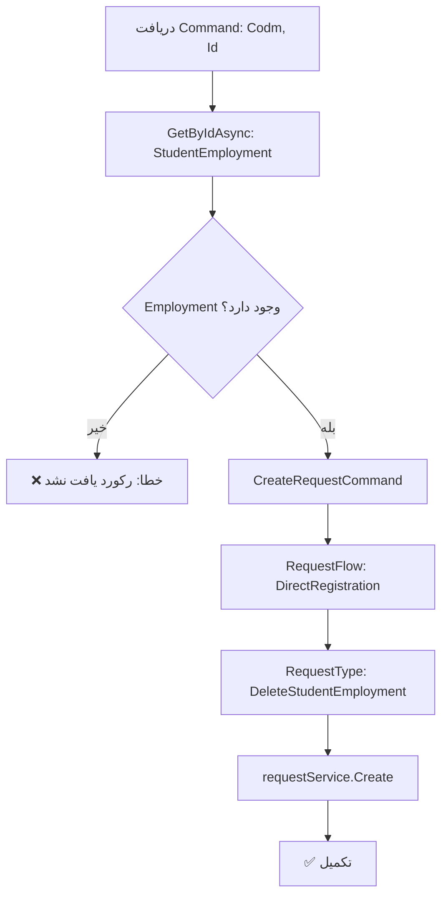

<div dir="rtl">

# DeleteStudentEmploymentRequestCommand.cs

**مسیر**: `Csis.Admission.Application/Features/Employments/Commands/DeleteStudentEmploymentRequestCommand.cs`

---

## 1. Purpose (هدف)

Command **ثبت درخواست حذف** اطلاعات اشتغال دانشجو از طریق سیستم درخواست‌ها (Request System). این Command برای حذف اطلاعات اشتغال با گذراندن فرآیند تایید استفاده می‌شود.

---

## 2. مستندات XML موجود

```csharp
/// <summary>
/// حذف درخواست اشتغال
/// </summary>
/// <param name="Codm">کد مرکز خدمات</param>
/// <param name="Id">شناسه درخواست</param>
```

**کامل**: Command حذف درخواست اشتغال از طریق Request System.

---

## 3. خلاصه اتفاقات

**جریان اصلی**:
```
1. اعتبارسنجی: بررسی وجود Employment با Id
2. اگر وجود نداشت → خطا
3. ایجاد CreateRequestCommand با:
   - RequestFlow: DirectRegistration
   - RequestType: DeleteStudentEmployment
4. ثبت درخواست در Request System
```

---

## 4. اجزای اصلی

### Command:
```csharp
sealed record DeleteStudentEmploymentRequestCommand(int Codm, int Id) : IRequest
{
    int Codm    // کد مرکز خدمات
    int Id      // شناسه Employment
}
```

### Handler Dependencies:
- **IRequestService**: سرویس مدیریت درخواست‌ها
- **IRepository<StudentEmployment>**: اعتبارسنجی وجود Employment
- **ILogger**: ثبت لاگ

---

## 5. Flow



---

## 6. Business Rules

### BR-1: استفاده از Request System
- حذف از طریق **Request System** انجام می‌شود
- **نه** حذف مستقیم از دیتابیس
- امکان پیگیری و Audit

### BR-2: Direct Registration
- جریان تایید: `DirectRegistration`
- احتمالاً نیازی به تایید چند مرحله‌ای ندارد
- حذف بلافاصله انجام می‌شود

### BR-3: Validation
- بررسی وجود Employment قبل از ایجاد درخواست
- جلوگیری از ایجاد درخواست برای رکورد ناموجود

---

## 7. Dependencies

### Internal:
- `IRequestService`: مدیریت درخواست‌ها
- `IRepository<StudentEmployment>`: اعتبارسنجی
- `ILogger`: لاگ

---

## 8. Input/Output

### Input:
```csharp
int Codm    // کد مرکز خدمات
int Id      // شناسه Employment
```

### Output:
```csharp
void (Task)
```

### Exceptions:
- **CommandValidationException**: "رکورد یافت نشد"

---

## 9. Side Effects

1. **ایجاد درخواست**: در جدول Requests
2. **حذف Employment**: پس از تایید درخواست (نه در این Command)
3. **Audit Trail**: ثبت کامل اطلاعات درخواست

---

## 10. الگوهای استفاده شده

### ✅ Request System Pattern
```csharp
var requestCommand = new CreateRequestCommand(
    request, 
    RequestFlow.DirectRegistration, 
    RequestType.DeleteStudentEmployment
);
await requestService.Create(requestCommand);
```

### ✅ Validation Before Request
- بررسی وجود Employment قبل از ایجاد درخواست

---

## 11. Performance

- **Database Queries**: 1 SELECT (validation)
- **Request Creation**: 1 INSERT در جدول Requests
- عملیات سریع

---

## 12. Security

- ⚠️ **Authorization**: نیاز به بررسی مالکیت
  - آیا Employment متعلق به Codm است؟
- ✅ **Audit Trail**: Request System ثبت کامل دارد
- ⚠️ **Validation**: `Codm` در Command هست اما استفاده نمی‌شود

---

## 13. نکات مهم

### ⚠️ مشکل مشابه DeleteStudentEmploymentCommand
```csharp
// Codm در Command وجود دارد اما برای Validation استفاده نمی‌شود
var employment = await repo.GetByIdAsync(request.Id);
// باید بررسی شود: employment.Codm == request.Codm
```

### 💡 تفاوت با DeleteStudentEmploymentCommand
- `DeleteStudentEmploymentCommand`: حذف **مستقیم**
- `DeleteStudentEmploymentRequestCommand`: حذف از طریق **Request System**

### 🎯 Use Case
- دانشجو یا کارمند می‌خواهد اشتغال را حذف کند
- درخواست ثبت می‌شود
- پس از تایید (اگر نیاز باشد)، Employment حذف می‌شود

---

## 14. مثال استفاده

```csharp
// ثبت درخواست حذف اشتغال
var cmd = new DeleteStudentEmploymentRequestCommand(
    Codm: 12345,
    Id: 678
);
await mediator.Send(cmd);

// نتیجه:
// - درخواست با RequestType.DeleteStudentEmployment ثبت می‌شود
// - RequestFlow: DirectRegistration
// - پس از تایید، Employment حذف می‌شود
```

---

## 15. Related Commands

- **DeleteStudentEmploymentCommand**: حذف مستقیم (بدون Request System)
- **CreateOrUpdateStudentEmploymentRequestCommand**: درخواست ایجاد/بروزرسانی

---

## 16. تغییرات پیشنهادی

### 1. افزودن Validation برای Codm
```csharp
public async Task Handle(DeleteStudentEmploymentRequestCommand request, ...) {
    var employment = await repo.GetByIdAsync(request.Id, cancellationToken);
    
    if (employment == null)
        throw new CommandValidationException("رکورد یافت نشد");
    
    // بررسی مالکیت
    if (employment.Codm != request.Codm)
        throw new UnauthorizedException("شما مجاز به حذف این رکورد نیستید");
    
    var requestCommand = new CreateRequestCommand(
        request, 
        RequestFlow.DirectRegistration, 
        RequestType.DeleteStudentEmployment
    );
    await requestService.Create(requestCommand, cancellationToken);
}
```

### 2. استفاده از Logger
```csharp
logger.LogInformation(
    "Delete employment request created for Codm {Codm}, Id {Id}", 
    request.Codm, request.Id);
```

### 3. بررسی نیاز به Direct Registration
- آیا همیشه باید `DirectRegistration` باشد؟
- شاید بسته به شرایط نیاز به جریان تایید چند مرحله‌ای باشد؟

```csharp
var flow = await DetermineFlow(employment, currentUser);
var requestCommand = new CreateRequestCommand(request, flow, ...);
```

---

</div>
